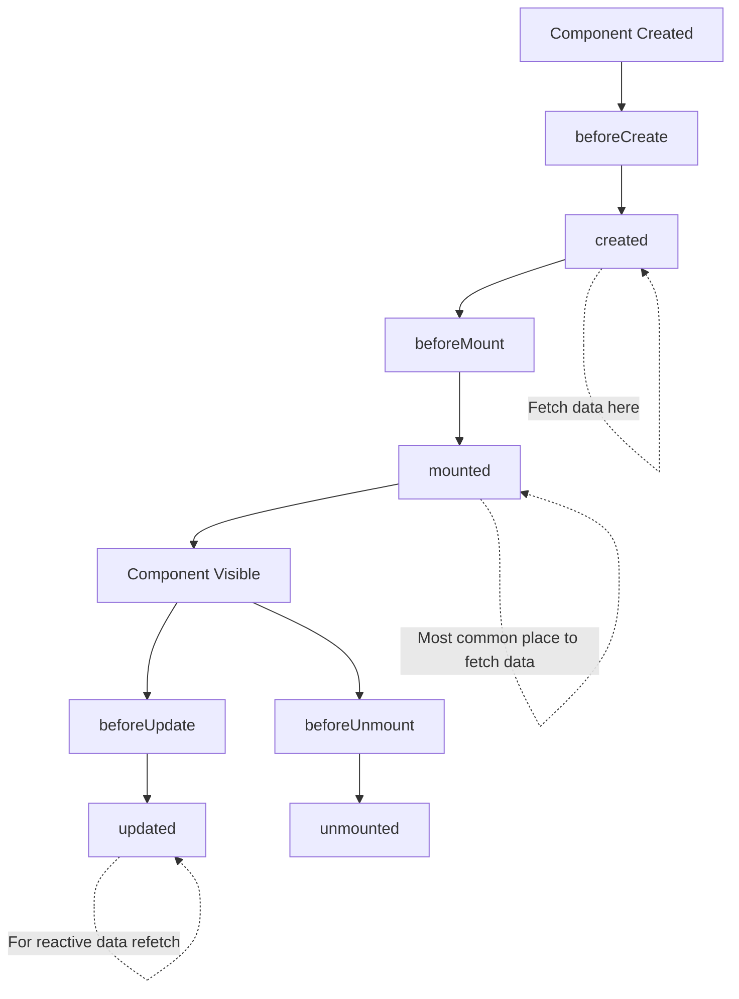

# Vue.js Data Fetching

## Introduction

In modern web applications, fetching data from external APIs and services is a fundamental operation. Vue.js provides several approaches to efficiently retrieve and display data from servers. This guide will walk you through various methods of data fetching in Vue.js applications, from built-in browser APIs to specialized libraries.

Data fetching is essential for dynamic applications that need to:
- Display content from databases
- Integrate with third-party services
- Update information without page reloads
- Create real-time experiences

By the end of this guide, you'll be comfortable implementing various data fetching techniques in your Vue.js applications.

## Prerequisites

Before we begin, you should have:
- Basic knowledge of Vue.js components
- Understanding of JavaScript Promises
- Familiarity with HTTP request methods (GET, POST, etc.)
- A Vue.js development environment set up

## Methods for Data Fetching in Vue.js

There are several approaches to fetch data in Vue.js:

1. Native Fetch API
2. Axios library
3. Vue Resource (legacy)
4. Custom HTTP services

Let's explore each approach with practical examples.

## Using the Fetch API

The Fetch API is built into modern browsers and provides a powerful way to make HTTP requests.

### Basic Fetch Example

```js
export default {
  data() {
    return {
      posts: [],
      loading: true,
      error: null
    }
  },
  mounted() {
    this.fetchPosts()
  },
  methods: {
    fetchPosts() {
      fetch('https://jsonplaceholder.typicode.com/posts')
        .then(response => {
          if (!response.ok) {
            throw new Error('Network response was not ok')
          }
          return response.json()
        })
        .then(data => {
          this.posts = data
          this.loading = false
        })
        .catch(error => {
          this.error = error.message
          this.loading = false
        })
    }
  }
}
```

### Display the Data in Template

```html
<template>
  <div>
    <h2>Blog Posts</h2>
    <div v-if="loading">Loading posts...</div>
    <div v-else-if="error">Error: {{ error }}</div>
    <div v-else>
      <div v-for="post in posts" :key="post.id" class="post">
        <h3>{{ post.title }}</h3>
        <p>{{ post.body }}</p>
      </div>
    </div>
  </div>
</template>
```

### Using Async/Await with Fetch

For more readable asynchronous code, you can use async/await:

```js
export default {
  data() {
    return {
      posts: [],
      loading: true,
      error: null
    }
  },
  mounted() {
    this.fetchPosts()
  },
  methods: {
    async fetchPosts() {
      try {
        const response = await fetch('https://jsonplaceholder.typicode.com/posts')
        
        if (!response.ok) {
          throw new Error('Network response was not ok')
        }
        
        this.posts = await response.json()
      } catch (error) {
        this.error = error.message
      } finally {
        this.loading = false
      }
    }
  }
}
```

## Using Axios

Axios is a popular HTTP client library that simplifies making requests and handling responses. It provides features like request and response interception, automatic JSON parsing, and more robust error handling.

### Installing Axios

First, install Axios:

```bash
npm install axios
```

### Basic Axios Example

```js
import axios from 'axios'

export default {
  data() {
    return {
      users: [],
      loading: true,
      error: null
    }
  },
  mounted() {
    this.fetchUsers()
  },
  methods: {
    fetchUsers() {
      axios.get('https://jsonplaceholder.typicode.com/users')
        .then(response => {
          this.users = response.data
          this.loading = false
        })
        .catch(error => {
          this.error = error.message
          this.loading = false
        })
    }
  }
}
```

### With Async/Await

```js
import axios from 'axios'

export default {
  data() {
    return {
      users: [],
      loading: true,
      error: null
    }
  },
  mounted() {
    this.fetchUsers()
  },
  methods: {
    async fetchUsers() {
      try {
        const response = await axios.get('https://jsonplaceholder.typicode.com/users')
        this.users = response.data
      } catch (error) {
        this.error = error.message
      } finally {
        this.loading = false
      }
    }
  }
}
```

### Displaying User Data

```html
<template>
  <div>
    <h2>Users</h2>
    <div v-if="loading">Loading users...</div>
    <div v-else-if="error">Error: {{ error }}</div>
    <div v-else>
      <div v-for="user in users" :key="user.id" class="user-card">
        <h3>{{ user.name }}</h3>
        <p><strong>Email:</strong> {{ user.email }}</p>
        <p><strong>Phone:</strong> {{ user.phone }}</p>
        <p><strong>Website:</strong> {{ user.website }}</p>
      </div>
    </div>
  </div>
</template>
```

## Creating a Custom HTTP Service

For larger applications, creating a dedicated service for API communication is a good practice:

```js
// src/services/api.js
import axios from 'axios'

// Create a new axios instance
const api = axios.create({
  baseURL: 'https://jsonplaceholder.typicode.com',
  timeout: 10000,
  headers: {
    'Content-Type': 'application/json',
    'Accept': 'application/json'
  }
})

// Request interceptor
api.interceptors.request.use(
  config => {
    // You can add authentication tokens here
    // config.headers.Authorization = `Bearer ${token}`
    return config
  },
  error => Promise.reject(error)
)

// Response interceptor
api.interceptors.response.use(
  response => response,
  error => {
    // Handle common errors
    if (error.response) {
      // Server responded with error status
      console.error('API Error:', error.response.status, error.response.data)
    } else if (error.request) {
      // Request was made but no response
      console.error('Network Error:', error.request)
    } else {
      // Error during request setup
      console.error('Request Error:', error.message)
    }
    return Promise.reject(error)
  }
)

export default {
  // Users
  getUsers() {
    return api.get('/users')
  },
  getUser(id) {
    return api.get(`/users/${id}`)
  },
  
  // Posts
  getPosts() {
    return api.get('/posts')
  },
  getPost(id) {
    return api.get(`/posts/${id}`)
  },
  createPost(data) {
    return api.post('/posts', data)
  },
  updatePost(id, data) {
    return api.put(`/posts/${id}`, data)
  },
  deletePost(id) {
    return api.delete(`/posts/${id}`)
  }
}
```

### Using the API Service in Components

```js
import api from '@/services/api'

export default {
  data() {
    return {
      post: null,
      loading: true,
      error: null
    }
  },
  props: {
    postId: {
      type: Number,
      required: true
    }
  },
  mounted() {
    this.loadPost()
  },
  methods: {
    async loadPost() {
      try {
        this.loading = true
        const response = await api.getPost(this.postId)
        this.post = response.data
      } catch (error) {
        this.error = error.message
      } finally {
        this.loading = false
      }
    },
    async updatePost(updatedData) {
      try {
        const response = await api.updatePost(this.postId, updatedData)
        this.post = response.data
        return true
      } catch (error) {
        this.error = error.message
        return false
      }
    }
  }
}
```

## Data Fetching in the Composition API

If you're using Vue 3 with the Composition API, here's how to fetch data:

```js
<script setup>
import { ref, onMounted } from 'vue'
import axios from 'axios'

const posts = ref([])
const loading = ref(true)
const error = ref(null)

const fetchPosts = async () => {
  try {
    const response = await axios.get('https://jsonplaceholder.typicode.com/posts')
    posts.value = response.data
  } catch (err) {
    error.value = err.message
  } finally {
    loading.value = false
  }
}

onMounted(() => {
  fetchPosts()
})
</script>

<template>
  <div>
    <h2>Blog Posts</h2>
    <div v-if="loading">Loading posts...</div>
    <div v-else-if="error">Error: {{ error }}</div>
    <div v-else>
      <div v-for="post in posts" :key="post.id" class="post">
        <h3>{{ post.title }}</h3>
        <p>{{ post.body }}</p>
      </div>
    </div>
  </div>
</template>
```

## Data Fetching Lifecycle Hooks

Understanding when to fetch data in Vue's lifecycle is important:



### When to Fetch Data:

1. **created**: Good for server-side rendering as the component exists but hasn't been rendered
2. **mounted**: Most common place to fetch data once the component is ready in the DOM
3. **updated**: For refetching when reactive properties change
4. **watchers**: To fetch data when specific props or data change

## Best Practices for Data Fetching

1. **Loading States**: Always manage loading states to give users feedback

2. **Error Handling**: Implement comprehensive error handling to gracefully manage failures

3. **Cancellation**: Cancel requests when components are unmounted or when new requests supersede old ones

```js
import axios from 'axios'

export default {
  data() {
    return {
      posts: [],
      loading: true,
      error: null
    }
  },
  mounted() {
    // Create a cancellation token
    this.cancelToken = axios.CancelToken.source()
    this.fetchPosts()
  },
  beforeUnmount() {
    // Cancel pending requests when component is unmounted
    this.cancelToken.cancel('Component unmounted')
  },
  methods: {
    async fetchPosts() {
      try {
        const response = await axios.get('https://jsonplaceholder.typicode.com/posts', {
          cancelToken: this.cancelToken.token
        })
        this.posts = response.data
      } catch (error) {
        if (!axios.isCancel(error)) {
          this.error = error.message
        }
      } finally {
        this.loading = false
      }
    }
  }
}
```

4. **Caching**: Implement basic caching to avoid unnecessary requests

```js
export default {
  data() {
    return {
      posts: [],
      loading: true,
      error: null,
      cachedData: {},
      lastFetched: null
    }
  },
  mounted() {
    this.fetchPosts()
  },
  methods: {
    async fetchPosts() {
      const url = 'https://jsonplaceholder.typicode.com/posts'
      const now = new Date().getTime()
      
      // Check if we have cached data less than 5 minutes old
      if (this.cachedData[url] && this.lastFetched && now - this.lastFetched < 300000) {
        this.posts = this.cachedData[url]
        this.loading = false
        return
      }
      
      try {
        const response = await axios.get(url)
        this.posts = response.data
        
        // Update cache
        this.cachedData[url] = response.data
        this.lastFetched = now
      } catch (error) {
        this.error = error.message
      } finally {
        this.loading = false
      }
    }
  }
}
```

5. **Pagination**: Implement pagination for large datasets

```js
export default {
  data() {
    return {
      posts: [],
      loading: false,
      error: null,
      currentPage: 1,
      postsPerPage: 10,
      totalPosts: 0
    }
  },
  mounted() {
    this.fetchPosts()
  },
  methods: {
    async fetchPosts() {
      this.loading = true
      
      try {
        const response = await axios.get('https://jsonplaceholder.typicode.com/posts', {
          params: {
            _page: this.currentPage,
            _limit: this.postsPerPage
          }
        })
        
        this.posts = response.data
        
        // Get total count from headers
        this.totalPosts = parseInt(response.headers['x-total-count'] || 0)
      } catch (error) {
        this.error = error.message
      } finally {
        this.loading = false
      }
    },
    changePage(newPage) {
      this.currentPage = newPage
      this.fetchPosts()
    }
  },
  computed: {
    totalPages() {
      return Math.ceil(this.totalPosts / this.postsPerPage)
    }
  }
}
```

## Real-world Example: Building a Weather Dashboard

Let's create a simple weather dashboard that fetches data from a weather API:

```js
<script>
import axios from 'axios'

export default {
  data() {
    return {
      city: 'London',
      weatherData: null,
      loading: false,
      error: null,
      searchHistory: []
    }
  },
  mounted() {
    // Load search history from localStorage
    const savedHistory = localStorage.getItem('weatherSearchHistory')
    if (savedHistory) {
      this.searchHistory = JSON.parse(savedHistory)
    }
    
    this.fetchWeatherData()
  },
  methods: {
    async fetchWeatherData() {
      if (!this.city.trim()) {
        this.error = 'Please enter a city name'
        return
      }
      
      this.loading = true
      this.error = null
      
      try {
        // Note: In a real app, you would use your own API key and proper API endpoint
        const response = await axios.get(`https://api.example.com/weather`, {
          params: {
            city: this.city,
            units: 'metric'
          }
        })
        
        this.weatherData = response.data
        
        // Add to search history if not already there
        if (!this.searchHistory.includes(this.city)) {
          this.searchHistory.unshift(this.city)
          // Keep only last 5 searches
          this.searchHistory = this.searchHistory.slice(0, 5)
          // Save to localStorage
          localStorage.setItem('weatherSearchHistory', JSON.stringify(this.searchHistory))
        }
      } catch (error) {
        this.error = 'Failed to fetch weather data. Please check the city name and try again.'
        console.error('Weather API error:', error)
      } finally {
        this.loading = false
      }
    },
    searchCity(cityName) {
      this.city = cityName
      this.fetchWeatherData()
    }
  }
}
</script>

<template>
  <div class="weather-dashboard">
    <h1>Weather Dashboard</h1>
    
    <div class="search-form">
      <input 
        v-model="city" 
        type="text" 
        placeholder="Enter city name"
        @keyup.enter="fetchWeatherData"
      />
      <button @click="fetchWeatherData" :disabled="loading">
        Search
      </button>
    </div>
    
    <div v-if="searchHistory.length" class="search-history">
      <h3>Recent searches:</h3>
      <ul>
        <li v-for="(cityName, index) in searchHistory" :key="index">
          <a href="#" @click.prevent="searchCity(cityName)">{{ cityName }}</a>
        </li>
      </ul>
    </div>
    
    <div v-if="loading" class="loading">
      Loading weather data...
    </div>
    
    <div v-else-if="error" class="error">
      {{ error }}
    </div>
    
    <div v-else-if="weatherData" class="weather-info">
      <h2>{{ weatherData.name }}, {{ weatherData.sys.country }}</h2>
      
      <div class="weather-main">
        <div class="temperature">
          {{ Math.round(weatherData.main.temp) }}°C
        </div>
        <div class="description">
          {{ weatherData.weather[0].description }}
        </div>
      </div>
      
      <div class="weather-details">
        <div class="detail">
          <span class="label">Feels like:</span> 
          {{ Math.round(weatherData.main.feels_like) }}°C
        </div>
        <div class="detail">
          <span class="label">Humidity:</span> 
          {{ weatherData.main.humidity }}%
        </div>
        <div class="detail">
          <span class="label">Wind:</span> 
          {{ weatherData.wind.speed }} m/s
        </div>
      </div>
    </div>
  </div>
</template>
```

This example showcases:
- Form input for user interaction
- Local storage for persisting search history
- Loading and error states
- Displaying structured API data
- Event handling for searches

## Summary

In this guide, we've covered several approaches to data fetching in Vue.js:

1. **Native Fetch API** - Built-in browser method for making HTTP requests
2. **Axios** - Popular external library with enhanced features
3. **Custom API Services** - Creating reusable services for better organization
4. **Composition API** - Data fetching with Vue 3's newer API

We've also explored best practices:
- Managing loading and error states
- Request cancellation
- Basic caching strategies
- Pagination for large datasets

Data fetching is a crucial part of modern web applications, and Vue.js provides flexible tools to handle various scenarios. By following the patterns outlined in this guide, you can build robust applications that efficiently communicate with backend services.

## Additional Resources

- [Axios Documentation](https://axios-http.com/docs/intro)
- [Vue.js Documentation](https://vuejs.org/guide/extras/ways-of-using-vue.html)
- [MDN Fetch API](https://developer.mozilla.org/en-US/docs/Web/API/Fetch_API)

## Exercises

1. Create a simple blog application that fetches posts from the JSONPlaceholder API and displays them with pagination.
2. Enhance the weather dashboard example to include a 5-day forecast.
3. Build a user management system with CRUD operations using Axios and a mock API.
4. Implement infinite scrolling for a list of images fetched from an API.
5. Create a custom Vue plugin that adds global methods for data fetching.

By practicing these exercises, you'll gain hands-on experience with various data fetching scenarios in Vue.js applications.