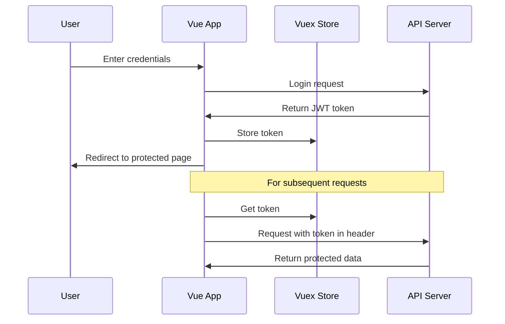

# Vue.js Authentication

## Introduction

Authentication is a critical aspect of most web applications. It verifies the identity of users and determines what resources they can access. In Vue.js applications, implementing authentication involves several components working together: handling login forms, sending authentication requests, storing tokens, protecting routes, and managing user sessions.

This guide will walk you through implementing authentication in Vue.js applications from the ground up. We'll cover practical patterns that you can apply to your own projects, focusing on JSON Web Token (JWT) authentication, which is widely used in modern web applications.

## Authentication Flow in Vue.js Applications

Before diving into code, let's understand the typical authentication flow:



## Setting Up Authentication in Vue.js

### 1. Creating the Authentication Service

First, let's create a service to handle API authentication requests:

```js
// src/services/authService.js
import axios from 'axios';

const API_URL = 'https://api.example.com/';

export default {
  login(credentials) {
    return axios
      .post(API_URL + 'login', credentials)
      .then(response => {
        if (response.data.token) {
          localStorage.setItem('user', JSON.stringify(response.data));
        }
        return response.data;
      });
  },
  
  logout() {
    localStorage.removeItem('user');
  },
  
  register(user) {
    return axios.post(API_URL + 'register', user);
  },
  
  getCurrentUser() {
    return JSON.parse(localStorage.getItem('user'));
  }
};
```

### 2. Setting Up Vuex Store for Authentication

Vuex helps manage the authentication state across your application:

```js
// src/store/auth.module.js
import AuthService from '../services/authService';

const user = JSON.parse(localStorage.getItem('user'));
const initialState = user
  ? { status: { loggedIn: true }, user }
  : { status: { loggedIn: false }, user: null };

export const auth = {
  namespaced: true,
  state: initialState,
  actions: {
    login({ commit }, credentials) {
      return AuthService.login(credentials).then(
        user => {
          commit('loginSuccess', user);
          return Promise.resolve(user);
        },
        error => {
          commit('loginFailure');
          return Promise.reject(error);
        }
      );
    },
    logout({ commit }) {
      AuthService.logout();
      commit('logout');
    },
    register({ commit }, user) {
      return AuthService.register(user).then(
        response => {
          commit('registerSuccess');
          return Promise.resolve(response.data);
        },
        error => {
          commit('registerFailure');
          return Promise.reject(error);
        }
      );
    }
  },
  mutations: {
    loginSuccess(state, user) {
      state.status.loggedIn = true;
      state.user = user;
    },
    loginFailure(state) {
      state.status.loggedIn = false;
      state.user = null;
    },
    logout(state) {
      state.status.loggedIn = false;
      state.user = null;
    },
    registerSuccess(state) {
      state.status.loggedIn = false;
    },
    registerFailure(state) {
      state.status.loggedIn = false;
    }
  }
};
```

Then add this module to your main Vuex store:

```js
// src/store/index.js
import { createStore } from 'vuex';
import { auth } from './auth.module';

export default createStore({
  modules: {
    auth
  }
});
```

### 3. Setting Up Axios Interceptors

To automatically include the JWT token in all API requests:

```js
// src/services/setupInterceptors.js
import axios from 'axios';

export default function setupInterceptors(store) {
  axios.interceptors.request.use(
    config => {
      const user = store.state.auth.user;
      if (user && user.token) {
        config.headers.Authorization = `Bearer ${user.token}`;
      }
      return config;
    },
    error => {
      return Promise.reject(error);
    }
  );

  axios.interceptors.response.use(
    res => {
      return res;
    },
    async error => {
      if (error.response.status === 401) {
        // Auto logout if 401 response returned from api
        store.dispatch('auth/logout');
        router.push('/login');
      }
      return Promise.reject(error);
    }
  );
}
```

Initialize the interceptors in your main.js:

```js
// src/main.js
import { createApp } from 'vue';
import App from './App.vue';
import router from './router';
import store from './store';
import setupInterceptors from './services/setupInterceptors';

setupInterceptors(store);

createApp(App)
  .use(router)
  .use(store)
  .mount('#app');
```

## Creating Authentication Components

### 1. Login Component

```html
<!-- src/components/Login.vue -->
<template>
  <div class="col-md-12">
    <div class="card card-container">
      
      <form name="form" @submit.prevent="handleLogin">
        <div class="form-group">
          <label for="username">Username</label>
          <input
            v-model="user.username"
            type="text"
            class="form-control"
            name="username"
            required
          />
        </div>
        <div class="form-group">
          <label for="password">Password</label>
          <input
            v-model="user.password"
            type="password"
            class="form-control"
            name="password"
            required
          />
        </div>
        <div class="form-group">
          <button class="btn btn-primary btn-block" :disabled="loading">
            <span v-show="loading" class="spinner-border spinner-border-sm"></span>
            <span>Login</span>
          </button>
        </div>
        <div class="form-group">
          <div v-if="message" class="alert alert-danger" role="alert">
            {{ message }}
          </div>
        </div>
      </form>
    </div>
  </div>
</template>

<script>
export default {
  name: 'Login',
  data() {
    return {
      user: {
        username: '',
        password: ''
      },
      loading: false,
      message: ''
    };
  },
  computed: {
    loggedIn() {
      return this.$store.state.auth.status.loggedIn;
    }
  },
  created() {
    if (this.loggedIn) {
      this.$router.push('/profile');
    }
  },
  methods: {
    handleLogin() {
      this.loading = true;
      this.message = '';
      
      this.$store.dispatch('auth/login', this.user)
        .then(() => {
          this.$router.push('/profile');
        })
        .catch(error => {
          this.loading = false;
          this.message = 
            (error.response && error.response.data && error.response.data.message) ||
            error.message ||
            error.toString();
        });
    }
  }
};
</script>

<style scoped>
/* Add your styling here */
</style>
```

### 2. Register Component

```html
<!-- src/components/Register.vue -->
<template>
  <div class="col-md-12">
    <div class="card card-container">
      
      <form name="form" @submit.prevent="handleRegister">
        <div v-if="!successful">
          <div class="form-group">
            <label for="username">Username</label>
            <input
              v-model="user.username"
              type="text"
              class="form-control"
              name="username"
              required
              minlength="3"
              maxlength="20"
            />
          </div>
          <div class="form-group">
            <label for="email">Email</label>
            <input
              v-model="user.email"
              type="email"
              class="form-control"
              name="email"
              required
            />
          </div>
          <div class="form-group">
            <label for="password">Password</label>
            <input
              v-model="user.password"
              type="password"
              class="form-control"
              name="password"
              required
              minlength="6"
            />
          </div>
          <div class="form-group">
            <button class="btn btn-primary btn-block" :disabled="loading">
              <span v-show="loading" class="spinner-border spinner-border-sm"></span>
              Sign Up
            </button>
          </div>
        </div>
      </form>

      <div v-if="message" class="alert" :class="successful ? 'alert-success' : 'alert-danger'">
        {{ message }}
      </div>
    </div>
  </div>
</template>

<script>
export default {
  name: 'Register',
  data() {
    return {
      user: {
        username: '',
        email: '',
        password: ''
      },
      successful: false,
      loading: false,
      message: ''
    };
  },
  methods: {
    handleRegister() {
      this.message = '';
      this.successful = false;
      this.loading = true;
      
      this.$store.dispatch('auth/register', this.user)
        .then(data => {
          this.message = data.message || 'Registration successful!';
          this.successful = true;
          this.loading = false;
        })
        .catch(error => {
          this.message =
            (error.response && error.response.data && error.response.data.message) ||
            error.message ||
            error.toString();
          this.successful = false;
          this.loading = false;
        });
    }
  }
};
</script>

<style scoped>
/* Add your styling here */
</style>
```

## Route Protection with Vue Router

To protect routes from unauthorized access, you can use Vue Router's navigation guards:

```js
// src/router/index.js
import { createRouter, createWebHistory } from 'vue-router';
import Home from '../views/Home.vue';
import Login from '../components/Login.vue';
import Register from '../components/Register.vue';
import Profile from '../views/Profile.vue';

const routes = [
  {
    path: '/',
    name: 'Home',
    component: Home
  },
  {
    path: '/login',
    name: 'Login',
    component: Login
  },
  {
    path: '/register',
    name: 'Register',
    component: Register
  },
  {
    path: '/profile',
    name: 'Profile',
    component: Profile,
    meta: {
      requiresAuth: true
    }
  }
];

const router = createRouter({
  history: createWebHistory(),
  routes
});

router.beforeEach((to, from, next) => {
  const publicPages = ['/login', '/register', '/'];
  const authRequired = !publicPages.includes(to.path);
  const loggedIn = localStorage.getItem('user');

  // Redirect to login page if not logged in and trying to access a restricted page
  if (authRequired && !loggedIn) {
    return next('/login');
  }

  next();
});

export default router;
```

## Practical Example: Creating a Profile Page

A practical example of using authentication is displaying user-specific data on a profile page:

```html
<!-- src/views/Profile.vue -->
<template>
  <div class="container">
    <header class="jumbotron">
      <h3>
        <strong>{{currentUser.username}}</strong> Profile
      </h3>
    </header>
    <p>
      <strong>Token:</strong>
      {{currentUser.token.substring(0, 20)}} ... {{currentUser.token.substr(currentUser.token.length - 20)}}
    </p>
    <p>
      <strong>Id:</strong>
      {{currentUser.id}}
    </p>
    <p>
      <strong>Email:</strong>
      {{currentUser.email}}
    </p>
    <strong>Authorities:</strong>
    <ul>
      <li v-for="(role,index) in currentUser.roles" :key="index">{{role}}</li>
    </ul>
  </div>
</template>

<script>
export default {
  name: 'Profile',
  computed: {
    currentUser() {
      return this.$store.state.auth.user;
    }
  },
  mounted() {
    if (!this.currentUser) {
      this.$router.push('/login');
    }
  }
};
</script>
```

## Advanced Authentication Topics

### 1. Handling Token Expiration

JWT tokens typically have an expiration time. You can implement token refresh logic:

```js
// src/services/authService.js (add this method)
refreshToken() {
  const user = this.getCurrentUser();
  if (user && user.refreshToken) {
    return axios.post(API_URL + 'refresh-token', { refreshToken: user.refreshToken })
      .then(response => {
        if (response.data.token) {
          // Update stored user with new tokens
          const updatedUser = { ...user, token: response.data.token };
          localStorage.setItem('user', JSON.stringify(updatedUser));
        }
        return response.data;
      });
  }
  return Promise.reject('No refresh token available');
}
```

### 2. Implementing Role-Based Authorization

You can extend route protection to check for specific user roles:

```js
// src/router/index.js (modify the beforeEach guard)
router.beforeEach((to, from, next) => {
  const publicPages = ['/login', '/register', '/'];
  const authRequired = !publicPages.includes(to.path);
  const loggedIn = localStorage.getItem('user');
  
  // Check for required roles
  if (to.meta.requiredRoles && loggedIn) {
    const user = JSON.parse(localStorage.getItem('user'));
    const hasRequiredRole = to.meta.requiredRoles.some(role => user.roles.includes(role));
    
    if (!hasRequiredRole) {
      return next('/unauthorized');
    }
  }

  if (authRequired && !loggedIn) {
    return next('/login');
  }

  next();
});
```

You can then specify required roles in your routes:

```js
{
  path: '/admin',
  name: 'Admin',
  component: Admin,
  meta: {
    requiresAuth: true,
    requiredRoles: ['ROLE_ADMIN']
  }
}
```

## Best Practices for Vue.js Authentication

1. **Always use HTTPS** to encrypt data transmission, particularly for login requests.

2. **Store sensitive tokens securely** - localStorage is convenient but vulnerable to XSS attacks. For higher security, consider using HttpOnly cookies.

3. **Implement proper error handling** for failed authentication attempts.

4. **Include token expiration checks** to ensure users with expired tokens are properly redirected.

5. **Use guards consistently** across your application for route protection.

6. **Sanitize user inputs** to prevent injection attacks.

7. **Implement logout functionality** that clears all user data and tokens.

8. **Consider two-factor authentication** for sensitive applications.

## Common Authentication Errors and Solutions

| Error | Possible Cause | Solution |
|-------|---------------|----------|
| 401 Unauthorized | Invalid or expired token | Implement token refresh or redirect to login |
| Cannot read properties of null | Accessing user object before it's loaded | Add conditionals or use Vue's v-if directive |
| CORS errors | API server blocking cross-origin requests | Configure proper CORS headers on your server |
| Infinite redirects | Incorrect route guard logic | Double-check your navigation guard conditions |

## Summary

In this guide, we've covered the essential aspects of implementing authentication in Vue.js applications:

1. Setting up an authentication service to handle API requests
2. Using Vuex to manage authentication state
3. Creating login and registration components
4. Protecting routes with Vue Router navigation guards
5. Handling token expiration and refresh
6. Implementing role-based authorization

Authentication is a critical component of web applications, and Vue.js provides a robust ecosystem of tools to implement secure authentication flows. By following the patterns outlined in this guide, you can build secure, user-friendly authentication systems for your Vue.js applications.

## Additional Resources

- [Vue.js Official Documentation](https://vuejs.org/guide/introduction.html)
- [Vue Router Documentation](https://router.vuejs.org/)
- [Vuex Documentation](https://vuex.vuejs.org/)
- [JWT.io](https://jwt.io/) - Learn more about JSON Web Tokens
- [OWASP Authentication Cheatsheet](https://cheatsheetseries.owasp.org/cheatsheets/Authentication_Cheat_Sheet.html)

## Practice Exercises

1. Create a "forgot password" component that allows users to reset their passwords.
2. Implement remember-me functionality using a checkbox on the login form.
3. Add validation to the registration form using Vuelidate or another validation library.
4. Create a user settings page that allows authenticated users to update their profile information.
5. Implement social login (Google, Facebook, etc.) using OAuth in your Vue.js application.