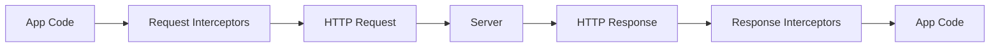

# Vue.js Interceptors

## Introduction

When building web applications with Vue.js, communicating with APIs and external services is a common requirement. As your application grows, you'll often need consistent ways to handle HTTP requests and responses. This is where **interceptors** come into play.

Interceptors are powerful middleware functions that allow you to intercept and modify HTTP requests before they are sent to the server or responses before they reach your application code. They provide a centralized way to handle cross-cutting concerns such as:

- Authentication (adding tokens to requests)
- Error handling
- Loading indicators
- Request/response logging
- Data transformation

In Vue.js applications, interceptors are typically implemented using HTTP client libraries like Axios, which is the most popular choice in the Vue ecosystem.

## Understanding Axios Interceptors

Axios provides two types of interceptors:

1. **Request interceptors**: Execute before a request is sent
2. **Response interceptors**: Execute before the response reaches the calling function

Let's visualize the flow of a request through interceptors:



## Setting Up Axios in a Vue.js Project

Before diving into interceptors, let's set up Axios in a Vue.js project:

1. First, install Axios:

```bash
npm install axios
```

2. Create an API service file (e.g., `src/services/api.js`):

```javascript
import axios from 'axios';

// Create a custom Axios instance
const apiClient = axios.create({
  baseURL: 'https://api.example.com',
  headers: {
    'Content-Type': 'application/json',
  },
  timeout: 10000, // 10 seconds
});

export default apiClient;
```

## Implementing Request Interceptors

Request interceptors are helpful for tasks that need to be performed before every request, like adding authentication tokens.

```javascript
import apiClient from '@/services/api';

// Add a request interceptor
apiClient.interceptors.request.use(
  config => {
    // Get token from localStorage
    const token = localStorage.getItem('user-token');
    
    // If token exists, add it to request headers
    if (token) {
      config.headers.Authorization = `Bearer ${token}`;
    }
    
    // You can also modify other request properties
    // For example, add a timestamp to prevent caching
    config.params = {
      ...config.params,
      _t: Date.now()
    };
    
    return config;
  },
  error => {
    // Handle request errors here
    console.error('Request error:', error);
    return Promise.reject(error);
  }
);
```

In this example, our request interceptor:

1. Retrieves the authentication token from localStorage
2. Adds the token to the request headers if it exists
3. Adds a timestamp parameter to prevent caching
4. Returns the modified config

## Implementing Response Interceptors

Response interceptors help you process data before it reaches your components or handle errors globally:

```javascript
import apiClient from '@/services/api';
import router from '@/router'; // Import your Vue Router instance

// Add a response interceptor
apiClient.interceptors.response.use(
  response => {
    // Any status code within the range of 2xx will trigger this function
    // You can modify the response data here
    return response;
  },
  error => {
    // Any status codes outside the range of 2xx will trigger this function
    const { status } = error.response || {};
    
    if (status === 401) {
      // Unauthorized error - redirect to login
      localStorage.removeItem('user-token');
      router.push('/login');
    } else if (status === 403) {
      // Forbidden error - user doesn't have permission
      router.push('/forbidden');
    } else if (status === 404) {
      // Not found error
      router.push('/not-found');
    } else if (status >= 500) {
      // Server errors - display a generic error message
      console.error('Server error occurred');
    }
    
    // Pass the error to the calling function
    return Promise.reject(error);
  }
);
```

This response interceptor:

1. Passes successful responses through without modification
2. Handles different types of errors based on HTTP status codes
3. Redirects users to appropriate pages when authentication issues occur
4. Provides consistent error handling for server errors

## Creating a Loading Indicator with Interceptors

One practical application of interceptors is creating a global loading indicator:

```javascript
import apiClient from '@/services/api';
import store from '@/store'; // Import your Vuex store

// Request counter to track active requests
let requestsCounter = 0;

// Add loading indicator interceptors
apiClient.interceptors.request.use(
  config => {
    // Increment counter when request is made
    requestsCounter++;
    
    // Show loading indicator
    store.commit('SET_LOADING', true);
    
    return config;
  },
  error => {
    requestsCounter--;
    if (requestsCounter === 0) {
      // Hide loading indicator when all requests are done
      store.commit('SET_LOADING', false);
    }
    return Promise.reject(error);
  }
);

apiClient.interceptors.response.use(
  response => {
    requestsCounter--;
    if (requestsCounter === 0) {
      // Hide loading indicator when all requests are done
      store.commit('SET_LOADING', false);
    }
    return response;
  },
  error => {
    requestsCounter--;
    if (requestsCounter === 0) {
      // Hide loading indicator when all requests are done
      store.commit('SET_LOADING', false);
    }
    return Promise.reject(error);
  }
);
```

To use this in a Vue component with a Vuex store:

```javascript
// In your Vuex store
export default {
  state: {
    isLoading: false
  },
  mutations: {
    SET_LOADING(state, status) {
      state.isLoading = status;
    }
  }
}
```

```html
<!-- In your App.vue or layout component -->
<template>
  <div>
    <div v-if="isLoading" class="loading-overlay">
      <div class="loading-spinner"></div>
    </div>
    
    <router-view />
  </div>
</template>

<script>
import { mapState } from 'vuex';

export default {
  computed: {
    ...mapState(['isLoading'])
  }
}
</script>

<style>
.loading-overlay {
  position: fixed;
  top: 0;
  left: 0;
  right: 0;
  bottom: 0;
  background: rgba(255, 255, 255, 0.7);
  display: flex;
  justify-content: center;
  align-items: center;
  z-index: 9999;
}

.loading-spinner {
  width: 50px;
  height: 50px;
  border: 5px solid #f3f3f3;
  border-top: 5px solid #3498db;
  border-radius: 50%;
  animation: spin 1s linear infinite;
}

@keyframes spin {
  0% { transform: rotate(0deg); }
  100% { transform: rotate(360deg); }
}
</style>
```

## Organizing Interceptors in a Larger Application

As your application grows, it's a good practice to organize your interceptors into separate files:

```javascript
// src/services/interceptors/auth.interceptor.js
export function setupAuthInterceptors(apiClient) {
  apiClient.interceptors.request.use(
    config => {
      const token = localStorage.getItem('user-token');
      if (token) {
        config.headers.Authorization = `Bearer ${token}`;
      }
      return config;
    },
    error => Promise.reject(error)
  );
  
  return apiClient;
}

// src/services/interceptors/error.interceptor.js
export function setupErrorInterceptors(apiClient, router) {
  apiClient.interceptors.response.use(
    response => response,
    error => {
      // Error handling logic here
      return Promise.reject(error);
    }
  );
  
  return apiClient;
}

// src/services/api.js
import axios from 'axios';
import router from '@/router';
import { setupAuthInterceptors } from './interceptors/auth.interceptor';
import { setupErrorInterceptors } from './interceptors/error.interceptor';

const apiClient = axios.create({
  baseURL: 'https://api.example.com',
  headers: {
    'Content-Type': 'application/json',
  }
});

// Apply interceptors
setupAuthInterceptors(apiClient);
setupErrorInterceptors(apiClient, router);

export default apiClient;
```

## Real-World Example: API Caching with Interceptors

Let's implement a simple caching system for GET requests using interceptors:

```javascript
import apiClient from '@/services/api';

// Simple in-memory cache
const cache = new Map();

// Cache expiration time in milliseconds (5 minutes)
const CACHE_EXPIRATION = 5 * 60 * 1000;

// Add request caching interceptor for GET requests
apiClient.interceptors.request.use(
  config => {
    // Only cache GET requests
    if (config.method.toLowerCase() === 'get') {
      const url = `${config.url}?${new URLSearchParams(config.params).toString()}`;
      
      // Check if we have a cached response that's not expired
      const cachedItem = cache.get(url);
      if (cachedItem) {
        const { timestamp, data } = cachedItem;
        
        if (Date.now() - timestamp < CACHE_EXPIRATION) {
          // Return cached response
          config.adapter = () => {
            return Promise.resolve({
              data,
              status: 200,
              statusText: 'OK',
              headers: {},
              config,
              request: {}
            });
          };
        } else {
          // Cache expired, remove it
          cache.delete(url);
        }
      }
    }
    
    return config;
  },
  error => Promise.reject(error)
);

// Add response caching interceptor
apiClient.interceptors.response.use(
  response => {
    // Only cache GET responses
    if (response.config.method.toLowerCase() === 'get') {
      const url = `${response.config.url}?${new URLSearchParams(response.config.params).toString()}`;
      
      // Store response in cache with current timestamp
      cache.set(url, {
        timestamp: Date.now(),
        data: response.data
      });
    }
    
    return response;
  },
  error => Promise.reject(error)
);
```

This caching system:

1. Checks if a GET request is already cached and not expired
2. Returns cached data if available, avoiding a new server request
3. Caches new responses for future use
4. Automatically expires cache entries after 5 minutes

## Removing Interceptors

Sometimes you might need to remove interceptors, which you can do by saving the interceptor reference:

```javascript
// Add interceptor and store its ID
const requestInterceptorId = apiClient.interceptors.request.use(
  config => {
    // Interceptor logic
    return config;
  },
  error => Promise.reject(error)
);

// Later, when you want to remove it:
apiClient.interceptors.request.eject(requestInterceptorId);
```

## Summary

Interceptors are powerful tools in Vue.js applications for centralizing HTTP request and response processing. Key benefits include:

- Consistent handling of cross-cutting concerns like authentication
- Global error handling
- UI state management (loading indicators)
- Data transformation and preprocessing
- Request logging and monitoring

By using interceptors effectively, you can keep your components cleaner and more focused on their primary responsibilities, while handling common HTTP concerns in a centralized, maintainable way.

## Exercises

1. Implement a request interceptor that adds a custom header with the current language preference from your Vue app.
2. Create a response interceptor that formats dates in all API responses to a user-friendly format.
3. Build a retry mechanism using interceptors that automatically retries failed requests up to 3 times with an exponential backoff delay.
4. Implement a comprehensive logging interceptor that tracks request/response times and logs them to the console or a monitoring service.

## Additional Resources

- [Axios Documentation on Interceptors](https://axios-http.com/docs/interceptors)
- [Vue.js HTTP Client Plugins](https://vuejs.org/v2/cookbook/using-axios-to-consume-apis.html)
- [Best Practices for API Error Handling in Vue.js](https://vuejs.org/guide/best-practices/security.html)

Happy coding with Vue.js interceptors!