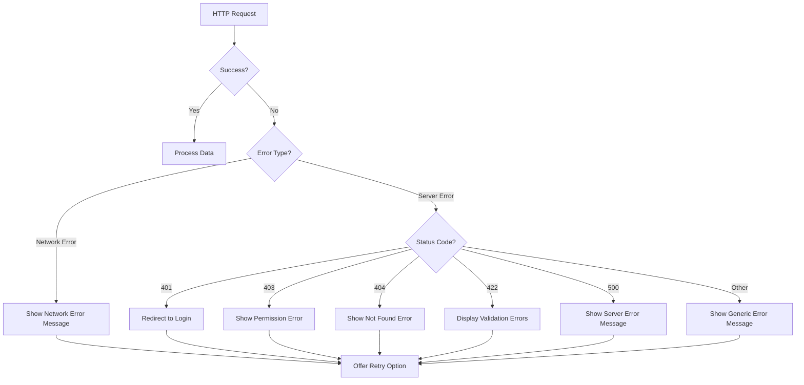

# Vue.js Error Handling

When building Vue.js applications that communicate with servers, handling errors properly is crucial for creating a robust user experience. In this section, we'll explore different strategies for managing errors that occur during HTTP requests.

## Introduction to Error Handling

HTTP requests can fail for various reasons:
- Server is down or unreachable
- Network connectivity issues
- Authentication failures
- Invalid data submissions
- Server-side errors

Proper error handling helps:
- Prevent application crashes
- Provide feedback to users
- Log issues for debugging
- Implement recovery strategies

## Basic Error Handling with Axios

### Using try/catch with async/await

The most straightforward approach is using JavaScript's `try/catch` with `async/await`:

```javascript
async fetchData() {
  try {
    const response = await axios.get('https://api.example.com/data');
    this.data = response.data;
  } catch (error) {
    console.error('Error fetching data:', error);
    this.errorMessage = 'Failed to load data. Please try again later.';
  }
}
```

This pattern is clean and easy to understand, making it ideal for Vue methods.

### Using Promise Chains

If you prefer promise chains, you can handle errors with `.catch()`:

```javascript
fetchData() {
  axios.get('https://api.example.com/data')
    .then(response => {
      this.data = response.data;
    })
    .catch(error => {
      console.error('Error fetching data:', error);
      this.errorMessage = 'Failed to load data. Please try again later.';
    });
}
```

## Understanding Axios Error Objects

Axios provides rich error objects that contain helpful information:

```javascript
catch (error) {
  if (error.response) {
    // The server responded with a status code outside the 2xx range
    console.log(error.response.data);    // Response data from server
    console.log(error.response.status);  // HTTP status code
    console.log(error.response.headers); // HTTP headers
  } else if (error.request) {
    // The request was made but no response was received
    console.log(error.request);
  } else {
    // Something happened while setting up the request
    console.log('Error', error.message);
  }
}
```

## Creating a Global Error Handler

For consistency, you can create a centralized error handler:

```javascript
// In a separate file, e.g., errorHandler.js
export default {
  handle(error, vm) {
    if (error.response) {
      switch (error.response.status) {
        case 401:
          vm.$store.dispatch('auth/logout');
          vm.$router.push('/login');
          return 'Your session has expired. Please log in again.';
        
        case 403:
          return 'You do not have permission to perform this action.';
          
        case 404:
          return 'The requested resource was not found.';
          
        case 500:
          return 'Server error. Please try again later.';
          
        default:
          return 'An error occurred. Please try again.';
      }
    } else if (error.request) {
      return 'Network error. Please check your connection.';
    } else {
      return error.message;
    }
  }
}
```

Then use it in your components:

```javascript
import ErrorHandler from '@/utils/errorHandler';

export default {
  methods: {
    async fetchData() {
      try {
        const response = await axios.get('/api/data');
        this.data = response.data;
      } catch (error) {
        this.errorMessage = ErrorHandler.handle(error, this);
      }
    }
  }
}
```

## Axios Interceptors for Global Error Handling

Axios interceptors allow you to globally handle request or response errors:

```javascript
// In your main.js or a dedicated axios config file
import axios from 'axios';
import store from './store';
import router from './router';

// Create axios instance
const api = axios.create({
  baseURL: 'https://api.example.com'
});

// Add a response interceptor
api.interceptors.response.use(
  response => response, // Simply return the response for successful requests
  error => {
    // Handle 401 Unauthorized globally
    if (error.response && error.response.status === 401) {
      store.dispatch('auth/logout');
      router.push('/login');
    }
    
    // Add global error logging
    console.error('API Error:', error);
    
    // Pass the error to the calling function
    return Promise.reject(error);
  }
);

export default api;
```

## User-Friendly Error Messages

Use Vue's reactivity to display error messages to users:

```html
<template>
  <div>
    <div v-if="loading">Loading...</div>
    
    <div v-if="error" class="error-message">
      {{ error }}
    </div>
    
    <div v-if="!loading && !error">
      <!-- Content here -->
      <ul>
        <li v-for="item in data" :key="item.id">{{ item.name }}</li>
      </ul>
    </div>
    
    <button @click="retry" v-if="error">Retry</button>
  </div>
</template>

<script>
export default {
  data() {
    return {
      data: [],
      loading: false,
      error: null
    }
  },
  methods: {
    async fetchData() {
      this.loading = true;
      this.error = null;
      
      try {
        const response = await this.$axios.get('/api/items');
        this.data = response.data;
      } catch (error) {
        if (error.response && error.response.status === 404) {
          this.error = 'We couldn\'t find what you were looking for.';
        } else {
          this.error = 'Something went wrong. Please try again later.';
        }
      } finally {
        this.loading = false;
      }
    },
    retry() {
      this.fetchData();
    }
  },
  mounted() {
    this.fetchData();
  }
}
</script>
```

## Form Submission Error Handling

When submitting forms, handle validation errors from the server:

```html
<template>
  <form @submit.prevent="submitForm">
    <div class="form-group">
      <label for="username">Username</label>
      <input
        type="text"
        id="username"
        v-model="form.username"
        class="form-control"
      />
      <div v-if="errors.username" class="error">{{ errors.username }}</div>
    </div>
    
    <div class="form-group">
      <label for="email">Email</label>
      <input
        type="email"
        id="email"
        v-model="form.email"
        class="form-control"
      />
      <div v-if="errors.email" class="error">{{ errors.email }}</div>
    </div>
    
    <div v-if="generalError" class="general-error">{{ generalError }}</div>
    
    <button type="submit" :disabled="submitting">
      {{ submitting ? 'Submitting...' : 'Submit' }}
    </button>
  </form>
</template>

<script>
export default {
  data() {
    return {
      form: {
        username: '',
        email: ''
      },
      errors: {},
      generalError: null,
      submitting: false
    }
  },
  methods: {
    async submitForm() {
      this.submitting = true;
      this.errors = {};
      this.generalError = null;
      
      try {
        await this.$axios.post('/api/register', this.form);
        // Success! Redirect or show success message
        this.$router.push('/success');
      } catch (error) {
        if (error.response) {
          if (error.response.status === 422) {
            // Validation errors
            this.errors = error.response.data.errors || {};
          } else {
            // General error
            this.generalError = 'An error occurred during submission. Please try again.';
          }
        } else {
          this.generalError = 'Network error. Please check your connection.';
        }
      } finally {
        this.submitting = false;
      }
    }
  }
}
</script>

<style scoped>
.error, .general-error {
  color: red;
  font-size: 0.9em;
  margin-top: 5px;
}
.general-error {
  margin-bottom: 15px;
}
</style>
```

## Error Handling Flowchart



## Advanced Error Handling Techniques

### Retry Logic

Implement retry logic for transient errors:

```javascript
async fetchWithRetry(url, maxRetries = 3) {
  let retries = 0;
  
  while (retries < maxRetries) {
    try {
      return await this.$axios.get(url);
    } catch (error) {
      // Only retry for certain errors like network issues or 5xx errors
      if (error.request || (error.response && error.response.status >= 500)) {
        retries++;
        // Exponential backoff
        const delay = Math.pow(2, retries) * 1000;
        await new Promise(resolve => setTimeout(resolve, delay));
        console.log(`Retrying request (${retries}/${maxRetries})...`);
      } else {
        // Don't retry for 4xx errors, etc.
        throw error;
      }
    }
  }
  
  throw new Error(`Failed after ${maxRetries} retries`);
}
```

### Error Boundaries in Vue 3

For Vue 3 applications, you can create error boundaries to catch errors in component trees:

```html
<!-- ErrorBoundary.vue -->
<template>
  <slot v-if="!error"></slot>
  <div v-else class="error-boundary">
    <h2>Something went wrong</h2>
    <p>{{ error.message }}</p>
    <button @click="resetError">Try again</button>
  </div>
</template>

<script>
export default {
  data() {
    return {
      error: null
    }
  },
  errorCaptured(err) {
    this.error = err;
    return false; // Stop error propagation
  },
  methods: {
    resetError() {
      this.error = null;
    }
  }
}
</script>
```

Using the error boundary:

```html
<template>
  <div>
    <h1>My Data Page</h1>
    <ErrorBoundary>
      <DataComponent />
    </ErrorBoundary>
  </div>
</template>
```

## Real-World Example: Dashboard with Error Handling

Let's build a simple dashboard that handles various error scenarios:

```html
<template>
  <div class="dashboard">
    <h1>Dashboard</h1>
    
    <!-- Global alert for critical errors -->
    <div v-if="criticalError" class="alert alert-danger">
      {{ criticalError }}
      <button @click="reloadPage" class="btn btn-sm btn-outline-light ml-2">
        Reload Page
      </button>
    </div>
    
    <div class="dashboard-grid">
      <!-- User Stats Widget -->
      <div class="dashboard-widget">
        <h3>User Statistics</h3>
        <div v-if="userStats.loading" class="spinner"></div>
        <div v-else-if="userStats.error" class="widget-error">
          <p>{{ userStats.error }}</p>
          <button @click="loadUserStats" class="btn btn-sm btn-primary">
            Retry
          </button>
        </div>
        <div v-else class="stats-display">
          <div class="stat">
            <div class="stat-value">{{ userStats.data.totalUsers || 0 }}</div>
            <div class="stat-label">Total Users</div>
          </div>
          <div class="stat">
            <div class="stat-value">{{ userStats.data.activeUsers || 0 }}</div>
            <div class="stat-label">Active Users</div>
          </div>
        </div>
      </div>
      
      <!-- Recent Activity Widget -->
      <div class="dashboard-widget">
        <h3>Recent Activity</h3>
        <div v-if="activity.loading" class="spinner"></div>
        <div v-else-if="activity.error" class="widget-error">
          <p>{{ activity.error }}</p>
          <button @click="loadActivity" class="btn btn-sm btn-primary">
            Retry
          </button>
        </div>
        <ul v-else class="activity-list">
          <li v-for="item in activity.data" :key="item.id" class="activity-item">
            {{ item.description }}
            <span class="activity-time">{{ formatTime(item.timestamp) }}</span>
          </li>
          <li v-if="activity.data.length === 0" class="no-data">
            No recent activity
          </li>
        </ul>
      </div>
    </div>
  </div>
</template>

<script>
export default {
  data() {
    return {
      criticalError: null,
      userStats: {
        data: {},
        loading: true,
        error: null
      },
      activity: {
        data: [],
        loading: true,
        error: null
      }
    }
  },
  methods: {
    async loadUserStats() {
      this.userStats.loading = true;
      this.userStats.error = null;
      
      try {
        const response = await this.$axios.get('/api/dashboard/user-stats');
        this.userStats.data = response.data;
      } catch (error) {
        console.error('User stats error:', error);
        this.userStats.error = 'Could not load user statistics';
        
        // Check for authentication issues
        if (error.response && error.response.status === 401) {
          this.criticalError = 'Your session has expired. Please log in again.';
          setTimeout(() => this.$router.push('/login'), 3000);
        }
      } finally {
        this.userStats.loading = false;
      }
    },
    
    async loadActivity() {
      this.activity.loading = true;
      this.activity.error = null;
      
      try {
        const response = await this.$axios.get('/api/dashboard/recent-activity');
        this.activity.data = response.data;
      } catch (error) {
        console.error('Activity error:', error);
        this.activity.error = 'Could not load recent activity';
      } finally {
        this.activity.loading = false;
      }
    },
    
    formatTime(timestamp) {
      return new Date(timestamp).toLocaleTimeString();
    },
    
    reloadPage() {
      window.location.reload();
    },
    
    async loadDashboard() {
      try {
        await Promise.all([
          this.loadUserStats(),
          this.loadActivity()
        ]);
      } catch (error) {
        this.criticalError = 'Dashboard failed to load. Please try again later.';
      }
    }
  },
  mounted() {
    this.loadDashboard();
  }
}
</script>

<style scoped>
/* Styling would go here */
</style>
```

This example demonstrates several error handling approaches:
1. Component-level errors for individual widgets
2. Critical errors that affect the entire page
3. Retry mechanisms for individual components
4. Session handling with authentication errors

## Summary

Effective error handling is essential for building robust Vue.js applications. In this section, we've covered:

- Basic error handling with try/catch and promises
- Understanding Axios error objects
- Creating centralized error handlers
- Using Axios interceptors for global error handling
- Displaying user-friendly error messages
- Handling form validation errors
- Implementing retry logic
- Creating error boundaries in Vue 3
- Building a real-world example with comprehensive error handling

By implementing these strategies, you'll create more resilient applications that gracefully handle errors and provide a better user experience.

## Additional Resources

- [Axios Documentation](https://axios-http.com/docs/handling_errors)
- [Vue.js Error Handling Guide](https://vuejs.org/v2/cookbook/using-axios-to-consume-apis.html)
- [HTTP Status Codes Reference](https://developer.mozilla.org/en-US/docs/Web/HTTP/Status)

## Exercises

1. Create a simple Vue component that fetches data from the JSONPlaceholder API and handles possible errors.
2. Implement an Axios interceptor that shows a notification for different types of errors.
3. Build a form with client-side and server-side validation error handling.
4. Create a retry mechanism with exponential backoff for API requests.
5. Implement an error boundary component for your Vue application.