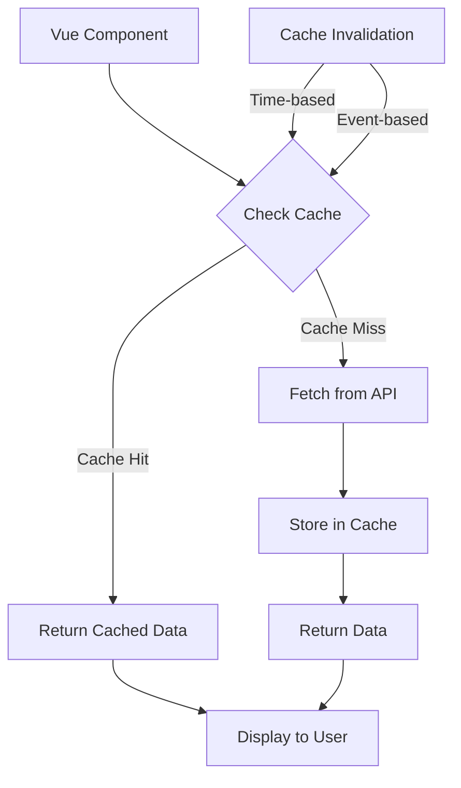

# Vue.js Caching

In modern web development, optimizing HTTP requests is crucial for delivering a fast and responsive user experience. One powerful technique for improving performance is caching - storing data locally to avoid unnecessary network requests. In this tutorial, we'll explore various caching strategies for Vue.js applications and learn how to implement them effectively.

## Introduction to Caching in Vue.js

Caching is the process of storing previously fetched data locally so that future requests for the same data can be served faster without making redundant network calls. This not only improves application performance but also reduces server load and bandwidth usage.

Vue.js applications typically fetch data via HTTP requests to APIs. Without proper caching, your app may:
- Make redundant API calls for the same data
- Experience slower page loads
- Create a poor user experience during network hiccups

## Basic Caching with Local Variables

The simplest form of caching in Vue.js is using component-level or module-level variables to store API responses.

### Example: Simple In-Memory Cache

```js
// store.js
export const cache = {
  data: {},
  set(key, value, ttl = 300000) { // Default TTL: 5 minutes
    this.data[key] = {
      value,
      expiry: ttl ? Date.now() + ttl : null
    };
  },
  get(key) {
    const item = this.data[key];
    
    // Return null if item doesn't exist
    if (!item) return null;
    
    // Check if the item has expired
    if (item.expiry && item.expiry < Date.now()) {
      delete this.data[key];
      return null;
    }
    
    return item.value;
  }
};
```

Now you can use this simple cache in your Vue components:

```html
<template>
  <div>
    <h2>User Profile</h2>
    <div v-if="loading">Loading...</div>
    <div v-else-if="user">
      <h3>{{ user.name }}</h3>
      <p>{{ user.email }}</p>
    </div>
    <button @click="refreshData">Refresh Data</button>
  </div>
</template>

<script>
import axios from 'axios';
import { cache } from './store';

export default {
  data() {
    return {
      user: null,
      loading: true
    };
  },
  methods: {
    async fetchUserData(id) {
      this.loading = true;
      
      // Check cache first
      const cacheKey = `user-${id}`;
      const cachedData = cache.get(cacheKey);
      
      if (cachedData) {
        this.user = cachedData;
        this.loading = false;
        console.log('Data loaded from cache');
        return;
      }
      
      // If not in cache, fetch from API
      try {
        const response = await axios.get(`https://api.example.com/users/${id}`);
        this.user = response.data;
        
        // Store in cache for 5 minutes
        cache.set(cacheKey, response.data, 5 * 60 * 1000);
        console.log('Data loaded from API and cached');
      } catch (error) {
        console.error('Error fetching user data:', error);
      } finally {
        this.loading = false;
      }
    },
    refreshData() {
      // Force refresh from API by skipping cache
      this.fetchUserData(1);
    }
  },
  mounted() {
    this.fetchUserData(1);
  }
};
</script>
```

## Advanced Caching with Vuex

For more complex applications, integrating caching with Vuex provides a centralized and reactive data store.

### Example: Caching in Vuex Store

```js
// store/modules/users.js
import axios from 'axios';

export default {
  namespaced: true,
  state: {
    users: {},
    cacheTimestamps: {},
    cacheTTL: 5 * 60 * 1000 // 5 minutes in milliseconds
  },
  getters: {
    getUserById: (state) => (id) => state.users[id],
    isCacheValid: (state) => (id) => {
      const timestamp = state.cacheTimestamps[id];
      if (!timestamp) return false;
      return Date.now() - timestamp < state.cacheTTL;
    }
  },
  mutations: {
    SET_USER(state, { id, user }) {
      // Use Vue.set to ensure reactivity
      Vue.set(state.users, id, user);
      Vue.set(state.cacheTimestamps, id, Date.now());
    },
    CLEAR_CACHE(state) {
      state.users = {};
      state.cacheTimestamps = {};
    }
  },
  actions: {
    async fetchUser({ commit, state, getters }, { id, force = false }) {
      // Return cached data if valid and not forced to refresh
      if (!force && getters.isCacheValid(id) && state.users[id]) {
        console.log(`Using cached data for user ID: ${id}`);
        return state.users[id];
      }
      
      // Otherwise fetch from API
      try {
        console.log(`Fetching user ID: ${id} from API`);
        const response = await axios.get(`https://api.example.com/users/${id}`);
        commit('SET_USER', { id, user: response.data });
        return response.data;
      } catch (error) {
        console.error(`Error fetching user ID: ${id}`, error);
        throw error;
      }
    }
  }
};
```

Then use it in your components:

```html
<template>
  <div>
    <h2>User Details</h2>
    <div v-if="loading">Loading user data...</div>
    <div v-else-if="user">
      <h3>{{ user.name }}</h3>
      <p>{{ user.email }}</p>
    </div>
    <button @click="refreshUser">Refresh</button>
  </div>
</template>

<script>
import { mapGetters } from 'vuex';

export default {
  props: {
    userId: {
      type: [String, Number],
      required: true
    }
  },
  data() {
    return {
      loading: true
    };
  },
  computed: {
    ...mapGetters('users', ['getUserById']),
    user() {
      return this.getUserById(this.userId);
    }
  },
  methods: {
    async loadUser(force = false) {
      this.loading = true;
      try {
        await this.$store.dispatch('users/fetchUser', { 
          id: this.userId,
          force
        });
      } catch (error) {
        console.error('Failed to load user', error);
      } finally {
        this.loading = false;
      }
    },
    refreshUser() {
      this.loadUser(true); // Force refresh from API
    }
  },
  created() {
    this.loadUser();
  },
  watch: {
    userId(newId) {
      // Reload when userId changes
      this.loadUser();
    }
  }
};
</script>
```

## Implementing Cache Invalidation

Cache invalidation is determining when cached data is stale and should be refreshed. Here are some strategies:

### 1. Time-Based Invalidation (TTL)

This is the most common approach, where cached items expire after a set time.

```js
function isExpired(timestamp, ttl) {
  return Date.now() - timestamp > ttl;
}
```

### 2. Event-Based Invalidation

Invalidate cache based on specific events like user actions:

```js
// In a component
methods: {
  async updateUserProfile(userData) {
    try {
      await axios.put(`https://api.example.com/users/${userData.id}`, userData);
      
      // Clear the cache for this user after update
      this.$store.commit('users/INVALIDATE_USER', userData.id);
      
      // Refresh the data
      this.$store.dispatch('users/fetchUser', {
        id: userData.id,
        force: true
      });
    } catch (error) {
      console.error('Failed to update profile', error);
    }
  }
}
```

## Caching HTTP Requests with Axios

You can create a caching layer at the HTTP client level using Axios interceptors:

```js
// axiosCache.js
import axios from 'axios';

const cache = new Map();
const cacheTTL = 5 * 60 * 1000; // 5 minutes

// Create a custom axios instance
const http = axios.create();

// Request interceptor
http.interceptors.request.use(config => {
  // Skip cache for non-GET requests or if cache is disabled for this request
  if (config.method !== 'get' || config.noCache) {
    return config;
  }
  
  const cacheKey = `${config.url}${JSON.stringify(config.params || {})}`;
  const cachedResponse = cache.get(cacheKey);
  
  if (cachedResponse) {
    const { timestamp, data } = cachedResponse;
    
    // Check if cache is still valid
    if (Date.now() - timestamp < cacheTTL) {
      // Return cached response as a resolved Promise
      return {
        ...config,
        adapter: () => Promise.resolve({
          data: data,
          status: 200,
          statusText: 'OK',
          headers: {},
          config,
          request: {},
          cached: true
        })
      };
    }
  }
  
  return config;
}, error => {
  return Promise.reject(error);
});

// Response interceptor
http.interceptors.response.use(response => {
  // Don't cache if this response was already from cache
  if (response.cached) {
    return response;
  }
  
  // Only cache GET requests
  if (response.config.method === 'get' && !response.config.noCache) {
    const cacheKey = `${response.config.url}${JSON.stringify(response.config.params || {})}`;
    
    // Store response in cache
    cache.set(cacheKey, {
      timestamp: Date.now(),
      data: response.data
    });
  }
  
  return response;
});

// Utility methods for cache management
export const clearCache = () => cache.clear();

export const removeFromCache = (url, params = {}) => {
  const cacheKey = `${url}${JSON.stringify(params)}`;
  cache.delete(cacheKey);
};

export default http;
```

Using this custom axios instance in components:

```html
<template>
  <div>
    <h2>Posts</h2>
    <button @click="loadPosts(true)">Refresh</button>
    <div v-if="loading">Loading...</div>
    <div v-else>
      <div v-for="post in posts" :key="post.id" class="post">
        <h3>{{ post.title }}</h3>
        <p>{{ post.body }}</p>
      </div>
    </div>
  </div>
</template>

<script>
import http, { clearCache } from './axiosCache';

export default {
  data() {
    return {
      posts: [],
      loading: true
    };
  },
  methods: {
    async loadPosts(forceRefresh = false) {
      this.loading = true;
      try {
        const response = await http.get('https://api.example.com/posts', {
          noCache: forceRefresh // Set to true to bypass cache
        });
        
        this.posts = response.data;
        if (response.cached) {
          console.log('Posts loaded from cache');
        } else {
          console.log('Posts loaded from API');
        }
      } catch (error) {
        console.error('Error loading posts', error);
      } finally {
        this.loading = false;
      }
    },
    clearAllCache() {
      clearCache();
      console.log('Cache cleared');
    }
  },
  mounted() {
    this.loadPosts();
  }
};
</script>
```

## Local Storage and IndexedDB Caching

For persistent caching across page reloads, you can use browser storage:

### Example: LocalStorage Cache Implementation

```js
// localStorageCache.js
const storageCache = {
  set(key, value, ttl = 300000) {
    const item = {
      value,
      expiry: ttl ? Date.now() + ttl : null
    };
    localStorage.setItem(key, JSON.stringify(item));
  },
  
  get(key) {
    const itemStr = localStorage.getItem(key);
    if (!itemStr) return null;
    
    try {
      const item = JSON.parse(itemStr);
      
      // Check if the item has expired
      if (item.expiry && item.expiry < Date.now()) {
        localStorage.removeItem(key);
        return null;
      }
      
      return item.value;
    } catch (error) {
      console.error('Error parsing cached item', error);
      localStorage.removeItem(key);
      return null;
    }
  },
  
  remove(key) {
    localStorage.removeItem(key);
  },
  
  clear() {
    localStorage.clear();
  }
};

export default storageCache;
```

## Service Worker Caching

For advanced applications, you can use Service Workers to cache assets and API responses:

```js
// In your Vue.js application's main.js or registerServiceWorker.js
if ('serviceWorker' in navigator) {
  window.addEventListener('load', () => {
    navigator.serviceWorker.register('/sw.js').then(registration => {
      console.log('ServiceWorker registered:', registration);
    }).catch(error => {
      console.error('ServiceWorker registration failed:', error);
    });
  });
}
```

```js
// sw.js (in public folder)
const CACHE_NAME = 'vue-app-cache-v1';
const API_CACHE_NAME = 'vue-api-cache-v1';

// Assets to cache immediately when service worker is installed
const urlsToCache = [
  '/',
  '/index.html',
  '/js/app.js',
  '/css/app.css',
  // Add other assets here
];

// Install event listener
self.addEventListener('install', event => {
  event.waitUntil(
    caches.open(CACHE_NAME)
      .then(cache => {
        return cache.addAll(urlsToCache);
      })
  );
});

// Fetch event listener
self.addEventListener('fetch', event => {
  const url = new URL(event.request.url);
  
  // Handle API requests
  if (url.pathname.startsWith('/api/')) {
    event.respondWith(handleApiRequest(event.request));
  } else {
    // Handle static assets with a cache-first strategy
    event.respondWith(
      caches.match(event.request)
        .then(response => {
          return response || fetch(event.request).then(fetchResponse => {
            return caches.open(CACHE_NAME).then(cache => {
              cache.put(event.request, fetchResponse.clone());
              return fetchResponse;
            });
          });
        })
    );
  }
});

// API request handler with cache strategy
async function handleApiRequest(request) {
  // For API requests, try network first, then cache
  try {
    const fetchResponse = await fetch(request);
    // Clone the response to store in cache and return the other
    const responseToCache = fetchResponse.clone();
    
    if (fetchResponse.ok) {
      const cache = await caches.open(API_CACHE_NAME);
      cache.put(request, responseToCache);
    }
    
    return fetchResponse;
  } catch (error) {
    // If network request fails, try to get from cache
    const cachedResponse = await caches.match(request);
    if (cachedResponse) {
      return cachedResponse;
    }
    
    // If not in cache either, return an error response
    return new Response(JSON.stringify({ 
      error: 'Network request failed and no cached version available' 
    }), {
      status: 503,
      headers: { 'Content-Type': 'application/json' }
    });
  }
}
```

## Cache Visualization

Let's use Mermaid to visualize the caching workflow:



## Best Practices for Caching in Vue.js

1. **Choose the right cache level**:
   - Component-level for isolated data
   - Vuex for shared data
   - Service Workers for offline capability
   
2. **Set appropriate TTL values**:
   - Short-lived for frequently changing data
   - Longer TTL for static content
   
3. **Implement proper cache invalidation**:
   - Clear cache on user actions that modify data
   - Provide manual refresh options
   
4. **Handle cache errors gracefully**:
   - Always provide a fallback to fetch from the API
   - Consider using stale-while-revalidate pattern

5. **Respect Cache-Control headers**:
   - Use HTTP headers from your API to determine cacheability
   - Consider implementing conditional requests with ETags

6. **Optimize cache size**:
   - Limit the size of cached data
   - Implement a cache eviction policy (LRU)

## Summary

We've explored multiple caching strategies for Vue.js applications, from simple in-memory caches to more sophisticated solutions using Vuex, local storage, and service workers. Choosing the right caching strategy depends on your application's specific requirements for data freshness, offline capability, and performance.

Implementing caching effectively can significantly improve your Vue.js application's performance and user experience by reducing network requests and providing faster data access. However, cache invalidation remains a challenge—you must carefully balance data freshness against performance benefits.

## Exercises and Further Learning

1. **Exercise**: Implement a simple in-memory cache for a Vue component that fetches a list of products.

2. **Exercise**: Extend the Vuex store example to include cache size limits and an LRU (Least Recently Used) eviction policy.

3. **Exercise**: Create a Vue.js application that caches API responses in IndexedDB for offline use.

4. **Further Learning**:
   - Explore the [Workbox library](https://developers.google.com/web/tools/workbox) for more advanced service worker caching
   - Study HTTP caching headers and their implementation in Vue applications
   - Learn about cache strategies like stale-while-revalidate and cache-then-network

Remember that caching is a trade-off between performance and data freshness. Always provide mechanisms for users to get the most up-to-date information when needed.