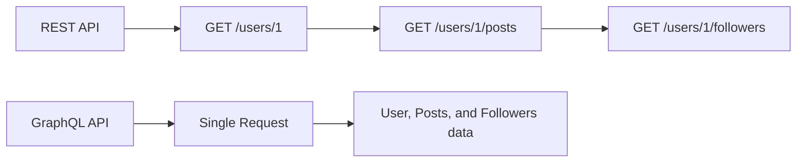

# Vue.js GraphQL Integration

## Introduction

GraphQL has revolutionized the way frontend applications communicate with APIs. Unlike traditional REST APIs where you might need to make multiple requests to different endpoints or receive more data than you need, GraphQL allows you to specify exactly what data you want in a single request. This makes it an excellent companion for Vue.js applications.

In this guide, we'll explore how to integrate GraphQL with Vue.js applications using Apollo Client, a popular GraphQL client that provides an excellent developer experience and powerful features.

## What is GraphQL?

GraphQL is a query language for APIs and a runtime for executing those queries. It allows clients to request exactly the data they need, making it more efficient than traditional REST APIs.

Here's a simple comparison:



With REST, you often need multiple requests to different endpoints, while GraphQL allows you to fetch all required data in a single request.

## Setting Up GraphQL in a Vue.js Project

### Installing Dependencies

Let's start by adding the necessary packages to your Vue.js project:

```bash
# For Vue 3
npm install @apollo/client graphql

# If you're using Vue 2
npm install vue-apollo graphql apollo-client apollo-link apollo-link-http apollo-cache-inmemory
```

### Configuring Apollo Client

For Vue 3, create an `apollo.js` file in your project:

```javascript
import { ApolloClient, createHttpLink, InMemoryCache } from '@apollo/client/core'

// HTTP connection to the API
const httpLink = createHttpLink({
  // You should use an absolute URL here
  uri: 'https://your-graphql-api.com/graphql',
})

// Cache implementation
const cache = new InMemoryCache()

// Create the apollo client
export const apolloClient = new ApolloClient({
  link: httpLink,
  cache,
})
```

### Integrating with Vue

Now let's integrate Apollo with our Vue app in the `main.js` file:

```javascript
import { createApp, provide, h } from 'vue'
import { DefaultApolloClient } from '@vue/apollo-composable'
import { apolloClient } from './apollo'
import App from './App.vue'

const app = createApp({
  setup() {
    provide(DefaultApolloClient, apolloClient)
  },
  render: () => h(App),
})

app.mount('#app')
```

## Making GraphQL Queries

Now let's see how to make queries to fetch data from a GraphQL API.

### Basic Query Example

Here's a simple component that fetches a list of books:

```html
<template>
  <div>
    <h2>Books List</h2>
    <div v-if="loading">Loading...</div>
    <div v-else-if="error">Error: {{ error.message }}</div>
    <ul v-else>
      <li v-for="book in books" :key="book.id">
        {{ book.title }} by {{ book.author.name }}
      </li>
    </ul>
  </div>
</template>

<script>
import { useQuery } from '@vue/apollo-composable'
import gql from 'graphql-tag'

export default {
  setup() {
    const { result, loading, error } = useQuery(gql`
      query GetBooks {
        books {
          id
          title
          author {
            name
          }
        }
      }
    `)

    return {
      books: () => result.value?.books || [],
      loading,
      error
    }
  }
}
</script>
```

The above component will:
1. Define a GraphQL query using the `gql` tag
2. Execute the query when the component is created
3. Track loading and error states
4. Display the retrieved books when loaded

## Variables in GraphQL Queries

Often, you'll need to pass variables to your queries. Here's how:

```html
<template>
  <div>
    <h2>Book Details</h2>
    <div v-if="loading">Loading...</div>
    <div v-else-if="error">Error: {{ error.message }}</div>
    <div v-else-if="book">
      <h3>{{ book.title }}</h3>
      <p>By {{ book.author.name }}</p>
      <p>{{ book.description }}</p>
    </div>
  </div>
</template>

<script>
import { useQuery } from '@vue/apollo-composable'
import gql from 'graphql-tag'
import { ref } from 'vue'

export default {
  props: {
    id: {
      type: String,
      required: true
    }
  },
  setup(props) {
    const { result, loading, error } = useQuery(
      gql`
        query GetBook($id: ID!) {
          book(id: $id) {
            id
            title
            description
            author {
              name
            }
          }
        }
      `,
      () => ({
        id: props.id
      })
    )

    return {
      book: () => result.value?.book,
      loading,
      error
    }
  }
}
</script>
```

In this example, we're passing the `id` prop as a variable to our GraphQL query.

## Making Mutations

Mutations are used to modify data on the server. Here's an example of adding a new book:

```html
<template>
  <div>
    <h2>Add New Book</h2>
    <form @submit.prevent="addBook">
      <div>
        <label for="title">Title:</label>
        <input id="title" v-model="title" required />
      </div>
      <div>
        <label for="authorName">Author Name:</label>
        <input id="authorName" v-model="authorName" required />
      </div>
      <div>
        <label for="description">Description:</label>
        <textarea id="description" v-model="description"></textarea>
      </div>
      <button type="submit" :disabled="loading">
        {{ loading ? 'Adding...' : 'Add Book' }}
      </button>
      <p v-if="error" class="error">{{ error.message }}</p>
      <p v-if="bookAdded" class="success">Book added successfully!</p>
    </form>
  </div>
</template>

<script>
import { ref } from 'vue'
import { useMutation } from '@vue/apollo-composable'
import gql from 'graphql-tag'

export default {
  setup() {
    const title = ref('')
    const authorName = ref('')
    const description = ref('')
    const bookAdded = ref(false)

    const { mutate: addBookMutation, loading, error } = useMutation(gql`
      mutation AddBook($title: String!, $authorName: String!, $description: String) {
        addBook(title: $title, authorName: $authorName, description: $description) {
          id
          title
          author {
            name
          }
        }
      }
    `)

    const addBook = async () => {
      try {
        const result = await addBookMutation({
          title: title.value,
          authorName: authorName.value,
          description: description.value
        })
        
        if (result.data) {
          bookAdded.value = true
          title.value = ''
          authorName.value = ''
          description.value = ''
          
          // Reset success message after 3 seconds
          setTimeout(() => {
            bookAdded.value = false
          }, 3000)
        }
      } catch (err) {
        console.error('Error adding book:', err)
      }
    }

    return {
      title,
      authorName,
      description,
      addBook,
      loading,
      error,
      bookAdded
    }
  }
}
</script>
```

## Cache Management

One of the powerful features of Apollo Client is its caching capability. By default, Apollo Client caches all query results.

### Updating the Cache After a Mutation

When you add a new item via mutation, you might want to update the cache to reflect the new item without refetching the entire list:

```javascript
const { mutate: addBookMutation } = useMutation(
  ADD_BOOK_MUTATION,
  {
    update: (cache, { data: { addBook } }) => {
      // Read the data from the cache for this query
      const data = cache.readQuery({ query: GET_BOOKS_QUERY })
      
      // Add the new book to the cache data
      cache.writeQuery({
        query: GET_BOOKS_QUERY,
        data: {
          books: [...data.books, addBook]
        }
      })
    }
  }
)
```

## Real-World Example: A Books Management App

Let's build a more complete example: a page that displays a list of books and allows adding new ones.

```html
<template>
  <div class="books-app">
    <h1>GraphQL Books Library</h1>
    
    <!-- Books List -->
    <div class="books-list">
      <h2>Books List</h2>
      <div v-if="booksLoading">Loading books...</div>
      <div v-else-if="booksError">Error loading books: {{ booksError.message }}</div>
      <ul v-else>
        <li v-for="book in books" :key="book.id" class="book-item">
          <h3>{{ book.title }}</h3>
          <p>By {{ book.author.name }}</p>
          <button @click="selectBook(book)">View Details</button>
        </li>
      </ul>
    </div>
    
    <!-- Book Details -->
    <div v-if="selectedBook" class="book-details">
      <h2>Book Details</h2>
      <button class="close-btn" @click="selectedBook = null">Close</button>
      <h3>{{ selectedBook.title }}</h3>
      <p><strong>Author:</strong> {{ selectedBook.author.name }}</p>
      <p><strong>Description:</strong> {{ selectedBook.description || 'No description available' }}</p>
    </div>
    
    <!-- Add Book Form -->
    <div class="add-book">
      <h2>Add New Book</h2>
      <form @submit.prevent="addBook">
        <div class="form-group">
          <label for="title">Title:</label>
          <input id="title" v-model="newBook.title" required />
        </div>
        <div class="form-group">
          <label for="authorName">Author Name:</label>
          <input id="authorName" v-model="newBook.authorName" required />
        </div>
        <div class="form-group">
          <label for="description">Description:</label>
          <textarea id="description" v-model="newBook.description"></textarea>
        </div>
        <button type="submit" :disabled="addBookLoading">
          {{ addBookLoading ? 'Adding...' : 'Add Book' }}
        </button>
        <p v-if="addBookError" class="error">{{ addBookError.message }}</p>
        <p v-if="bookAdded" class="success">Book added successfully!</p>
      </form>
    </div>
  </div>
</template>

<script>
import { ref, reactive } from 'vue'
import { useQuery, useMutation } from '@vue/apollo-composable'
import gql from 'graphql-tag'

// GraphQL Queries and Mutations
const GET_BOOKS_QUERY = gql`
  query GetBooks {
    books {
      id
      title
      author {
        id
        name
      }
      description
    }
  }
`

const ADD_BOOK_MUTATION = gql`
  mutation AddBook($title: String!, $authorName: String!, $description: String) {
    addBook(title: $title, authorName: $authorName, description: $description) {
      id
      title
      description
      author {
        id
        name
      }
    }
  }
`

export default {
  setup() {
    // Books list query
    const { result: booksResult, loading: booksLoading, error: booksError, refetch } = useQuery(GET_BOOKS_QUERY)
    
    const books = () => booksResult.value?.books || []
    const selectedBook = ref(null)
    
    // New book form data
    const newBook = reactive({
      title: '',
      authorName: '',
      description: ''
    })
    
    const bookAdded = ref(false)
    
    // Add book mutation
    const { mutate: addBookMutation, loading: addBookLoading, error: addBookError } = useMutation(ADD_BOOK_MUTATION)
    
    const addBook = async () => {
      try {
        await addBookMutation({
          title: newBook.title,
          authorName: newBook.authorName,
          description: newBook.description
        })
        
        // Reset form fields
        newBook.title = ''
        newBook.authorName = ''
        newBook.description = ''
        
        // Show success message
        bookAdded.value = true
        setTimeout(() => {
          bookAdded.value = false
        }, 3000)
        
        // Refetch books list to update with the new book
        refetch()
      } catch (err) {
        console.error('Error adding book:', err)
      }
    }
    
    const selectBook = (book) => {
      selectedBook.value = book
    }
    
    return {
      books,
      booksLoading,
      booksError,
      selectedBook,
      newBook,
      addBook,
      addBookLoading,
      addBookError,
      bookAdded,
      selectBook
    }
  }
}
</script>

<style scoped>
.books-app {
  max-width: 1200px;
  margin: 0 auto;
  padding: 20px;
}

.books-list, .book-details, .add-book {
  margin-bottom: 30px;
  padding: 20px;
  border: 1px solid #ddd;
  border-radius: 8px;
}

.book-item {
  margin-bottom: 15px;
  padding: 10px;
  border: 1px solid #eee;
  border-radius: 4px;
}

.form-group {
  margin-bottom: 15px;
}

label {
  display: block;
  margin-bottom: 5px;
  font-weight: bold;
}

input, textarea {
  width: 100%;
  padding: 8px;
  border: 1px solid #ddd;
  border-radius: 4px;
}

button {
  padding: 8px 16px;
  background-color: #4caf50;
  color: white;
  border: none;
  border-radius: 4px;
  cursor: pointer;
}

button:disabled {
  background-color: #cccccc;
}

.close-btn {
  background-color: #f44336;
  margin-bottom: 10px;
}

.error {
  color: #f44336;
}

.success {
  color: #4caf50;
}
</style>
```

## GraphQL Subscriptions

GraphQL also supports real-time updates through subscriptions. This is especially useful for chat applications, notifications, or any feature that requires real-time updates.

To use subscriptions, you'll need to add a few more dependencies:

```bash
npm install @apollo/client subscriptions-transport-ws
```

Then update your Apollo client configuration:

```javascript
import { ApolloClient, createHttpLink, InMemoryCache, split } from '@apollo/client/core'
import { WebSocketLink } from '@apollo/client/link/ws'
import { getMainDefinition } from '@apollo/client/utilities'

// HTTP connection to the API
const httpLink = createHttpLink({
  uri: 'https://your-graphql-api.com/graphql',
})

// WebSocket link for subscriptions
const wsLink = new WebSocketLink({
  uri: 'wss://your-graphql-api.com/graphql',
  options: {
    reconnect: true,
  },
})

// Using the ability to split links, you can send data to each link
// depending on what kind of operation is being sent
const link = split(
  // split based on operation type
  ({ query }) => {
    const definition = getMainDefinition(query)
    return (
      definition.kind === 'OperationDefinition' &&
      definition.operation === 'subscription'
    )
  },
  wsLink,
  httpLink
)

// Create the apollo client
export const apolloClient = new ApolloClient({
  link,
  cache: new InMemoryCache(),
})
```

Now you can use subscriptions in your components:

```html
<template>
  <div>
    <h2>Chat Room</h2>
    <div class="messages">
      <div v-for="message in messages" :key="message.id" class="message">
        <strong>{{ message.user }}:</strong> {{ message.content }}
      </div>
    </div>
  </div>
</template>

<script>
import { useSubscription } from '@vue/apollo-composable'
import gql from 'graphql-tag'
import { ref } from 'vue'

export default {
  props: {
    roomId: {
      type: String,
      required: true
    }
  },
  setup(props) {
    const messages = ref([])
    
    // Subscribe to new messages
    const { result } = useSubscription(
      gql`
        subscription OnNewMessage($roomId: ID!) {
          messageAdded(roomId: $roomId) {
            id
            content
            user
          }
        }
      `,
      () => ({
        roomId: props.roomId
      })
    )
    
    // Update messages when a new message is received
    if (result.value) {
      messages.value.push(result.value.messageAdded)
    }
    
    return {
      messages
    }
  }
}
</script>
```

## Best Practices for GraphQL in Vue.js

1. **Separate GraphQL Operations**: Keep your queries, mutations, and subscriptions in separate files for better organization.

2. **Use Fragments**: For reusable parts of your queries.

```javascript
const BOOK_FRAGMENT = gql`
  fragment BookFields on Book {
    id
    title
    description
    author {
      id
      name
    }
  }
`

const GET_BOOKS_QUERY = gql`
  query GetBooks {
    books {
      ...BookFields
    }
  }
  ${BOOK_FRAGMENT}
`
```

3. **Error Handling**: Always handle potential errors in your GraphQL operations.

4. **Optimistic UI Updates**: For better user experience, update the UI optimistically before the server confirms the change.

5. **Use Loading States**: Always show loading states to provide feedback to users.

## Summary

In this tutorial, we've explored how to integrate GraphQL with Vue.js applications:

1. We set up Apollo Client for Vue.js
2. Made basic GraphQL queries and handled loading/error states
3. Passed variables to GraphQL queries
4. Performed mutations to modify data
5. Managed Apollo's cache for efficient data access
6. Built a real-world example of a books management app
7. Added GraphQL subscriptions for real-time updates

GraphQL provides a powerful alternative to traditional REST APIs, allowing for more efficient data fetching and a better developer experience. When combined with Vue.js, it creates a robust foundation for building modern web applications.

## Additional Resources

To continue learning about GraphQL with Vue.js:

- [Vue Apollo Documentation](https://v4.apollo.vuejs.org/)
- [Apollo Client Documentation](https://www.apollographql.com/docs/react/)
- [GraphQL Official Documentation](https://graphql.org/learn/)
- [How to GraphQL](https://www.howtographql.com/)

## Exercises

1. Create a simple todo list application using Vue.js and GraphQL that allows users to:
   - View all todos
   - Add new todos
   - Mark todos as completed
   - Delete todos

2. Extend the books application to include:
   - Categories/genres for books
   - User reviews and ratings
   - Filtering books by author or genre

3. Build a real-time chat application using GraphQL subscriptions:
   - Multiple chat rooms
   - User presence indicators
   - Message read receipts

These exercises will help reinforce your understanding of GraphQL and Apollo Client in Vue.js applications.