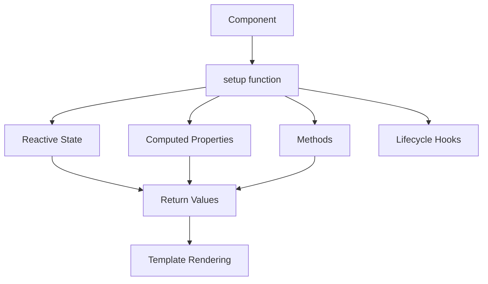

# Vue.js Composition Introduction

## What is the Composition API?

The Vue.js Composition API is an alternative syntax for building Vue components introduced in Vue 3. It provides a more flexible way to organize component logic compared to the traditional Options API (`data`, `methods`, `computed`, etc.).

While the Options API organizes code by option types, the Composition API allows developers to organize code based on logical concerns or features. This makes your code more reusable, maintainable, and easier to understand as applications grow in complexity.

## Why Use the Composition API?

The Composition API addresses several limitations of the Options API:

1. **Better Logic Organization**: Group related code together instead of splitting it across different options
2. **Improved TypeScript Support**: More natural type inference compared to the Options API
3. **Code Reusability**: Extract and reuse logic across components with composition functions
4. **Better Performance**: More efficient compilation and better minification in production builds
5. **Better IDE Support**: Improved autocompletion and type checking

## Composition API vs Options API

Let's compare how we might implement a simple counter using both APIs:

### Options API Approach

```js
export default {
  data() {
    return {
      count: 0
    }
  },
  methods: {
    increment() {
      this.count++
    }
  }
}
```

### Composition API Approach

```js
import { ref } from 'vue'

export default {
  setup() {
    const count = ref(0)
    
    function increment() {
      count.value++
    }
    
    return {
      count,
      increment
    }
  }
}
```

Notice how in the Composition API, related functionality (the counter state and its increment method) are grouped together in the same scope within the `setup()` function.

## Core Composition API Concepts

### The `setup()` Function

The `setup()` function is the entry point for using the Composition API within a component. It runs before any other component options are processed, which means you don't have access to `this` inside the setup function.

```js
export default {
  setup(props, context) {
    // Component logic here
    
    // Return anything you want exposed to the template
    return {
      // properties and methods
    }
  }
}
```

The `setup()` function receives two arguments:
- `props`: The component's props
- `context`: An object containing specific properties (`attrs`, `slots`, `emit`, `expose`)

### Reactivity Fundamentals

The Composition API provides several reactivity APIs for creating and manipulating reactive state:

#### `ref()` - For primitive values

```js
import { ref } from 'vue'

const count = ref(0)  // Creates a reactive reference
console.log(count.value)  // Access the value with .value
count.value++  // Update the value
```

#### `reactive()` - For objects

```js
import { reactive } from 'vue'

const state = reactive({
  user: {
    name: 'John',
    age: 30
  },
  isLoggedIn: true
})

console.log(state.user.name)  // Access directly without .value
state.user.age = 31  // Update directly
```

## Practical Example: User Profile Component

Let's create a component to display and edit a user profile using the Composition API:

```html
<template>
  <div class="user-profile">
    <h2>User Profile</h2>
    
    <div v-if="isEditing">
      <input v-model="user.name" placeholder="Name" />
      <input v-model="user.email" placeholder="Email" />
      <button @click="saveChanges">Save</button>
    </div>
    
    <div v-else>
      <p><strong>Name:</strong> {{ user.name }}</p>
      <p><strong>Email:</strong> {{ user.email }}</p>
      <button @click="isEditing = true">Edit</button>
    </div>
    
    <div class="status">
      <p>Last updated: {{ formattedLastUpdated }}</p>
    </div>
  </div>
</template>

<script>
import { reactive, ref, computed } from 'vue'

export default {
  setup() {
    // Reactive state
    const user = reactive({
      name: 'John Doe',
      email: 'john@example.com'
    })
    
    const isEditing = ref(false)
    const lastUpdated = ref(new Date())
    
    // Computed property
    const formattedLastUpdated = computed(() => {
      return new Intl.DateTimeFormat('en-US', {
        dateStyle: 'medium',
        timeStyle: 'short'
      }).format(lastUpdated.value)
    })
    
    // Methods
    function saveChanges() {
      isEditing.value = false
      lastUpdated.value = new Date()
      
      // Here you might call an API to save the changes
      console.log('Saving user data:', user)
    }
    
    // Expose to template
    return {
      user,
      isEditing,
      formattedLastUpdated,
      saveChanges
    }
  }
}
</script>
```

In this example, we:
1. Create reactive state with `reactive` and `ref`
2. Define a computed property using `computed`
3. Create a method for saving changes
4. Return everything needed by the template

## Lifecycle Hooks in Composition API

Lifecycle hooks in the Composition API are imported functions that can be called inside `setup()`:

```js
import { onMounted, onUpdated, onUnmounted } from 'vue'

export default {
  setup() {
    // Component logic here
    
    onMounted(() => {
      console.log('Component mounted!')
    })
    
    onUpdated(() => {
      console.log('Component updated!')
    })
    
    onUnmounted(() => {
      console.log('Component unmounted!')
    })
  }
}
```

Here's a comparison of lifecycle hook names between the Options API and Composition API:

| Options API       | Composition API  |
|-------------------|------------------|
| beforeCreate      | setup()          |
| created           | setup()          |
| beforeMount       | onBeforeMount    |
| mounted           | onMounted        |
| beforeUpdate      | onBeforeUpdate   |
| updated           | onUpdated        |
| beforeUnmount     | onBeforeUnmount  |
| unmounted         | onUnmounted      |
| errorCaptured     | onErrorCaptured  |

## Extracting Reusable Logic with Composition Functions

One of the most powerful features of the Composition API is the ability to extract and reuse logic across components using composition functions (sometimes called "composables").

For example, let's create a reusable function for handling a counter:

```js
// useCounter.js
import { ref } from 'vue'

export function useCounter(initialValue = 0) {
  const count = ref(initialValue)
  
  function increment() {
    count.value++
  }
  
  function decrement() {
    count.value--
  }
  
  function reset() {
    count.value = initialValue
  }
  
  return {
    count,
    increment,
    decrement,
    reset
  }
}
```

Now we can use this counter logic in any component:

```html
<template>
  <div>
    <p>Count: {{ count }}</p>
    <button @click="increment">Increment</button>
    <button @click="decrement">Decrement</button>
    <button @click="reset">Reset</button>
  </div>
</template>

<script>
import { useCounter } from './useCounter'

export default {
  setup() {
    const { count, increment, decrement, reset } = useCounter(10)
    
    return {
      count,
      increment,
      decrement,
      reset
    }
  }
}
</script>
```

## Working with Props and Emitting Events

Props and events can be accessed and emitted within the `setup` function:

```html
<script>
import { ref } from 'vue'

export default {
  props: {
    initialValue: {
      type: Number,
      default: 0
    }
  },
  
  setup(props, { emit }) {
    const count = ref(props.initialValue)
    
    function increment() {
      count.value++
      emit('update', count.value)
    }
    
    return {
      count,
      increment
    }
  }
}
</script>
```

## Composition API Flow Diagram



## Summary

The Vue.js Composition API offers a more flexible and powerful way to organize component logic compared to the Options API. Key benefits include:

- Better organization of code by logical concerns
- Improved code reuse through composition functions
- Better TypeScript integration
- More maintainable code for complex components

While the Composition API might seem more verbose for simple components, its benefits become clear as your application grows in complexity. Both the Options API and Composition API are supported in Vue 3, so you can choose the approach that works best for your use case or even mix them within the same project.

## Additional Resources

- [Vue.js Official Documentation on Composition API](https://vuejs.org/guide/extras/composition-api-faq.html)
- [Composition API RFC](https://github.com/vuejs/rfcs/blob/master/active-rfcs/0013-composition-api.md)
- Practice exercises:
  1. Convert an existing Options API component to the Composition API
  2. Create a reusable composition function for form validation
  3. Build a todo list application using only the Composition API

Getting comfortable with the Composition API takes practice, but the flexibility and reusability it provides make it worth learning, especially for larger applications or when working with TypeScript.