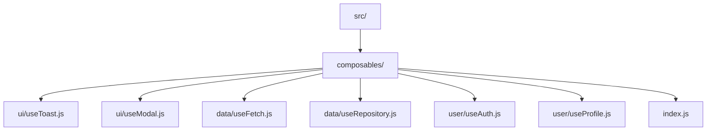

# Vue.js Composables

## Introduction

Composables represent one of the most powerful features of Vue's Composition API. In essence, **composables** are reusable JavaScript functions that encapsulate and reuse stateful logic between Vue components. 

Unlike mixins or higher-order components from Vue 2, composables offer a more transparent way to share code with better TypeScript support and fewer naming collisions. They form the foundation of how code organization and reuse works in the Vue 3 ecosystem.

In this guide, you'll learn:
- What composables are and why they're valuable
- How to create your own composables
- Best practices for writing effective composables
- How to use built-in composables from the Vue ecosystem

## Understanding Composables

### What Are Composables?

A composable is a function that leverages Vue's Composition API to encapsulate and reuse stateful logic. The name comes from their ability to be composed together like building blocks to create complex reactive behavior.

Composables typically:
- Start with "use" (by convention)
- Use reactive Vue features like `ref`, `computed`, `watch`
- Return an object containing reactive state and functions

### Why Use Composables?

Composables solve several problems:

1. **Code Reuse**: Extract common logic that can be shared across components
2. **Better Organization**: Group related code together functionally rather than by lifecycle
3. **Type Safety**: Offer better TypeScript integration than options API alternatives
4. **Testing**: Isolated functions are easier to test than component options
5. **Readability**: Make the source of reactive variables more transparent

## Creating Your First Composable

Let's start with a simple example: a counter composable.

```js
// useCounter.js
import { ref } from 'vue'

export function useCounter(initialValue = 0) {
  const count = ref(initialValue)
  
  function increment() {
    count.value++
  }
  
  function decrement() {
    count.value--
  }
  
  function reset() {
    count.value = initialValue
  }
  
  return {
    count,
    increment,
    decrement,
    reset
  }
}
```

Using the composable in a component:

```html
<template>
  <div>
    <p>Count: {{ count }}</p>
    <button @click="increment">Increment</button>
    <button @click="decrement">Decrement</button>
    <button @click="reset">Reset</button>
  </div>
</template>

<script setup>
import { useCounter } from './useCounter'

const { count, increment, decrement, reset } = useCounter(10)
</script>
```

### What's Happening Here?

1. We create a function called `useCounter` that accepts an optional initial value
2. Inside, we define a reactive `count` state using `ref`
3. We define methods that manipulate that state
4. We return an object containing both the reactive state and the methods
5. In our component, we destructure the returned values and use them directly

This pattern creates a clean separation between the component's UI concerns and the logic for managing the counter.

## Creating More Complex Composables

Let's look at a more practical example: a composable for handling asynchronous data fetching.

```js
// useFetch.js
import { ref, computed, watchEffect } from 'vue'

export function useFetch(getUrl) {
  const data = ref(null)
  const error = ref(null)
  const isLoading = ref(false)

  const fetchData = async () => {
    isLoading.value = true
    error.value = null
    
    try {
      const url = typeof getUrl === 'function' ? getUrl() : getUrl
      const response = await fetch(url)
      
      if (!response.ok) {
        throw new Error(`Network error: ${response.status}`)
      }
      
      data.value = await response.json()
    } catch (err) {
      error.value = err.message || 'An error occurred'
    } finally {
      isLoading.value = false
    }
  }
  
  const hasData = computed(() => !!data.value)

  // If getUrl is reactive, re-run the effect when it changes
  watchEffect(() => {
    if (getUrl) fetchData()
  })
  
  return {
    data,
    error,
    isLoading,
    hasData,
    fetchData
  }
}
```

Using our fetch composable:

```html
<template>
  <div>
    <h1>User Profile</h1>
    <div v-if="isLoading">Loading...</div>
    <div v-else-if="error">Error: {{ error }}</div>
    <div v-else-if="hasData">
      <h2>{{ data.name }}</h2>
      <p>Email: {{ data.email }}</p>
      <button @click="fetchData">Refresh</button>
    </div>
  </div>
</template>

<script setup>
import { ref, computed } from 'vue'
import { useFetch } from './useFetch'

const userId = ref(1)

const url = computed(() => `https://jsonplaceholder.typicode.com/users/${userId.value}`)
const { data, error, isLoading, hasData, fetchData } = useFetch(url)
</script>
```

This composable abstracts away all the complexity of handling loading states, errors, and data fetching. The component simply receives the current state and can focus on rendering.

## Composing Composables Together

One of the most powerful aspects of composables is that they can use other composables. Let's see how we can combine multiple composables:

```js
// useUserProfile.js
import { ref, computed } from 'vue'
import { useFetch } from './useFetch'
import { useLocalStorage } from './useLocalStorage'

export function useUserProfile(userId) {
  // Use the storage composable to remember the last viewed profile
  const { value: lastViewedId, setValue: setLastViewedId } = useLocalStorage(
    'last-viewed-user-id',
    userId
  )
  
  // Create a URL based on the user ID
  const profileUrl = computed(() => 
    `https://api.example.com/users/${userId.value}`
  )
  
  // Use our fetch composable to load the data
  const { data: user, isLoading, error, fetchData } = useFetch(profileUrl)
  
  // Save the last viewed ID when data is loaded
  const loadUser = async (id) => {
    userId.value = id
    await fetchData()
    setLastViewedId(id)
  }
  
  // Computed properties from user data
  const fullName = computed(() => {
    if (!user.value) return ''
    return `${user.value.firstName} ${user.value.lastName}`
  })
  
  return {
    user,
    isLoading,
    error,
    loadUser,
    fullName,
    lastViewedId
  }
}
```

In this example, `useUserProfile` combines two other composables - `useFetch` and `useLocalStorage` - creating higher-level functionality from these building blocks.

## Common Built-in Vue Composables

Vue itself provides several built-in composables you can use:

### `useAttrs`

Gives access to all attributes passed to a component that aren't declared as props.

```js
import { useAttrs } from 'vue'

const attrs = useAttrs()
console.log(attrs.class) // Access non-prop attributes
```

### `useSlots`

Provides access to the slots passed to the component.

```js
import { useSlots } from 'vue'

const slots = useSlots()
const hasDefaultSlot = !!slots.default
```

### `useVModel`

Creates a two-way binding for props (new in Vue 3.4).

```js
import { useVModel } from 'vue'

const props = defineProps(['modelValue'])
const emit = defineEmits(['update:modelValue'])
const value = useVModel(props, 'modelValue', emit)
```

## Best Practices for Creating Composables

To make the most of composables, follow these best practices:

### 1. Name Composables with "use" Prefix

This helps distinguish composable functions from regular utility functions:

```js
// Good
export function useWindowSize() { /* ... */ }

// Avoid
export function windowSize() { /* ... */ }
```

### 2. Return Plain Objects

Always return a plain object with named values instead of arrays:

```js
// Good - destructuring is clear
const { count, increment } = useCounter()

// Avoid - order dependency is fragile
const [count, increment] = useCounter()
```

### 3. Accept Configuration Options

Make composables flexible by accepting configuration:

```js
export function useFetch(url, options = {}) {
  const { immediate = true, headers = {} } = options
  // ...
}
```

### 4. Document Return Values

Use JSDoc comments to document what your composable returns:

```js
/**
 * Manages pagination state
 * @returns {{
 *   currentPage: Ref<number>,
 *   pageSize: Ref<number>,
 *   totalItems: Ref<number>,
 *   totalPages: ComputedRef<number>,
 *   nextPage: () => void,
 *   prevPage: () => void,
 *   goToPage: (page: number) => void
 * }}
 */
export function usePagination(initialPage = 1, initialPageSize = 10) {
  // Implementation...
}
```

### 5. Clean Up Resources

If your composable creates side effects (like event listeners), clean them up:

```js
import { onUnmounted } from 'vue'

export function useEventListener(target, event, handler) {
  target.addEventListener(event, handler)
  
  onUnmounted(() => {
    target.removeEventListener(event, handler)
  })
}
```

## Practical Examples

Let's look at some real-world examples of useful composables:

### Mouse Position Tracker

```js
// useMousePosition.js
import { ref, onMounted, onUnmounted } from 'vue'

export function useMousePosition() {
  const x = ref(0)
  const y = ref(0)

  function update(e) {
    x.value = e.pageX
    y.value = e.pageY
  }

  onMounted(() => {
    window.addEventListener('mousemove', update)
  })
  
  onUnmounted(() => {
    window.removeEventListener('mousemove', update)
  })

  return { x, y }
}
```

### Form Validation

```js
// useFormValidation.js
import { reactive, computed } from 'vue'

export function useFormValidation(initialState, rules) {
  const formData = reactive(initialState)
  const errors = reactive({})
  
  const validate = () => {
    Object.keys(rules).forEach(field => {
      const fieldRules = rules[field]
      errors[field] = null
      
      for (const rule of fieldRules) {
        const isValid = rule.validator(formData[field])
        if (!isValid) {
          errors[field] = rule.message
          break
        }
      }
    })
  }
  
  const isValid = computed(() => {
    return Object.values(errors).every(error => error === null)
  })
  
  return {
    formData,
    errors,
    validate,
    isValid
  }
}
```

Usage:

```html
<template>
  <form @submit.prevent="submitForm">
    <div>
      <label>Email</label>
      <input v-model="formData.email" type="email">
      <span v-if="errors.email" class="error">{{ errors.email }}</span>
    </div>
    <div>
      <label>Password</label>
      <input v-model="formData.password" type="password">
      <span v-if="errors.password" class="error">{{ errors.password }}</span>
    </div>
    <button type="submit" :disabled="!isValid">Submit</button>
  </form>
</template>

<script setup>
import { useFormValidation } from './useFormValidation'

const initialState = { email: '', password: '' }
const rules = {
  email: [
    { 
      validator: (value) => /^[^\s@]+@[^\s@]+\.[^\s@]+$/.test(value), 
      message: 'Invalid email format' 
    }
  ],
  password: [
    { 
      validator: (value) => value.length >= 8, 
      message: 'Password must be at least 8 characters' 
    }
  ]
}

const { formData, errors, validate, isValid } = useFormValidation(initialState, rules)

const submitForm = () => {
  validate()
  if (isValid.value) {
    console.log('Form submitted!', formData)
  }
}
</script>
```

### Infinite Scrolling

```js
// useInfiniteScroll.js
import { ref, onMounted, onUnmounted } from 'vue'

export function useInfiniteScroll(loadMore, options = {}) {
  const { threshold = 100, immediate = true } = options
  const isLoading = ref(false)
  const isComplete = ref(false)
  
  async function checkScroll() {
    if (isLoading.value || isComplete.value) return
    
    const scrollHeight = document.documentElement.scrollHeight
    const scrollTop = document.documentElement.scrollTop
    const clientHeight = document.documentElement.clientHeight
    
    // If we're near the bottom of the page
    if (scrollHeight - scrollTop - clientHeight < threshold) {
      isLoading.value = true
      
      try {
        const hasMoreData = await loadMore()
        isComplete.value = !hasMoreData
      } finally {
        isLoading.value = false
      }
    }
  }
  
  onMounted(() => {
    window.addEventListener('scroll', checkScroll)
    if (immediate) checkScroll()
  })
  
  onUnmounted(() => {
    window.removeEventListener('scroll', checkScroll)
  })
  
  return {
    isLoading,
    isComplete
  }
}
```

## Organizing Composables

As your application grows, you'll need a strategy to organize composables:



The `index.js` file can re-export all composables for easy imports:

```js
// composables/index.js
export * from './ui/useToast'
export * from './ui/useModal'
export * from './data/useFetch'
// etc.
```

Then you can import them all from a single location:

```js
import { useToast, useModal, useFetch } from '@/composables'
```

## Summary

Composables are a powerful feature of Vue's Composition API that allow you to:

- Extract and reuse stateful logic between components
- Create clean, modular code with clear separation of concerns
- Combine multiple composables to build higher-level functionality
- Organize code by feature rather than by component lifecycle

By embracing composables, you can make your Vue applications more maintainable, testable, and easier to reason about.

## Additional Resources

- [Vue.js Official Documentation on Composables](https://vuejs.org/guide/reusability/composables.html)
- [VueUse](https://vueuse.org/) - A collection of useful Vue composables
- [Pinia](https://pinia.vuejs.org/) - Modern state management for Vue, built with composables

## Exercises

1. Create a `useLocalStorage` composable that syncs a ref with localStorage
2. Build a `useDebounce` composable that debounces a value change
3. Create a `useBreakpoint` composable that tracks the current viewport size
4. Combine `useFetch` and `useDebounce` to create a search feature with debounced API calls
5. Create a `useTheme` composable that manages dark/light mode for your application