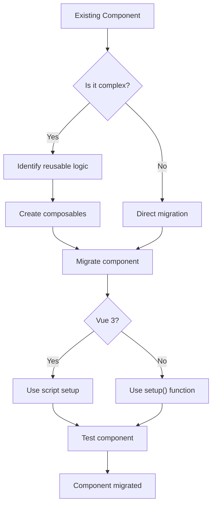

# Vue.js Component Migration

## Introduction

When working with Vue.js applications, you might find yourself with existing code written using the Options API pattern that you want to upgrade to the more flexible Composition API. This migration process allows you to take advantage of better code organization, improved type inference, and more reusable logic.

In this guide, we'll walk through the process of migrating Vue components from Options API to Composition API. You'll learn about the key differences between these patterns, how to refactor your components step by step, and best practices to follow during the migration process.

## Understanding the Two API Styles

Before diving into migration strategies, let's clarify what we're migrating from and to:

### Options API

The Options API organizes code by option types (`data`, `methods`, `computed`, etc.). This is Vue's traditional approach.

```js
export default {
  data() {
    return {
      count: 0,
      name: 'Vue'
    }
  },
  computed: {
    doubleCount() {
      return this.count * 2
    }
  },
  methods: {
    increment() {
      this.count++
    }
  },
  mounted() {
    console.log('Component mounted')
  }
}
```

### Composition API

The Composition API organizes code by logical concerns or features. It uses imported functions and the `setup()` function (or the `<script setup>` syntax in Vue 3).

```js
import { ref, computed, onMounted } from 'vue'

export default {
  setup() {
    const count = ref(0)
    const name = ref('Vue')
    
    const doubleCount = computed(() => count.value * 2)
    
    function increment() {
      count.value++
    }
    
    onMounted(() => {
      console.log('Component mounted')
    })
    
    return {
      count,
      name,
      doubleCount,
      increment
    }
  }
}
```

## Migration Strategies

### Approach 1: Migration with `setup()` Function

Let's start by migrating a simple component that displays a counter.

#### Before: Options API

```html
<template>
  <div>
    <h2>{{ title }}</h2>
    <p>Count: {{ count }}</p>
    <p>Double count: {{ doubleCount }}</p>
    <button @click="increment">Increment</button>
  </div>
</template>

<script>
export default {
  name: 'CounterComponent',
  props: {
    title: {
      type: String,
      default: 'Counter'
    }
  },
  data() {
    return {
      count: 0
    }
  },
  computed: {
    doubleCount() {
      return this.count * 2
    }
  },
  methods: {
    increment() {
      this.count++
    }
  },
  mounted() {
    console.log('Counter component mounted')
  }
}
</script>
```

#### After: Composition API with `setup()`

```html
<template>
  <div>
    <h2>{{ title }}</h2>
    <p>Count: {{ count }}</p>
    <p>Double count: {{ doubleCount }}</p>
    <button @click="increment">Increment</button>
  </div>
</template>

<script>
import { ref, computed, onMounted } from 'vue'

export default {
  name: 'CounterComponent',
  props: {
    title: {
      type: String,
      default: 'Counter'
    }
  },
  setup(props) {
    // data properties as refs
    const count = ref(0)
    
    // computed properties
    const doubleCount = computed(() => count.value * 2)
    
    // methods
    function increment() {
      count.value++
    }
    
    // lifecycle hooks
    onMounted(() => {
      console.log('Counter component mounted')
    })
    
    // return everything that will be used in template
    return {
      count,
      doubleCount,
      increment
    }
  }
}
</script>
```

### Approach 2: Migration with `<script setup>`

For Vue 3, the `<script setup>` syntax provides an even cleaner way to use the Composition API.

```html
<template>
  <div>
    <h2>{{ title }}</h2>
    <p>Count: {{ count }}</p>
    <p>Double count: {{ doubleCount }}</p>
    <button @click="increment">Increment</button>
  </div>
</template>

<script setup>
import { ref, computed, onMounted } from 'vue'

// props must be defined with defineProps
const props = defineProps({
  title: {
    type: String,
    default: 'Counter'
  }
})

// data properties as refs
const count = ref(0)

// computed properties
const doubleCount = computed(() => count.value * 2)

// methods
function increment() {
  count.value++
}

// lifecycle hooks
onMounted(() => {
  console.log('Counter component mounted')
})
</script>
```

## Step-by-Step Migration Process

Let's break down the migration process into manageable steps:

### 1. Identify Component Dependencies

First, identify what your component uses:

- Props and emits
- Data properties 
- Computed properties
- Methods
- Lifecycle hooks
- Watchers
- Dependencies (imports, other components)

### 2. Create Reactive Variables

Convert `data` properties to `ref` or `reactive`:

```js
// Options API
data() {
  return {
    user: { name: 'John', age: 30 },
    count: 0,
    items: []
  }
}

// Composition API
import { ref, reactive } from 'vue'

// For primitive values, use ref
const count = ref(0)
const items = ref([])

// For objects, you can use reactive
const user = reactive({ name: 'John', age: 30 })
// OR use ref for consistency
const user = ref({ name: 'John', age: 30 })
```

### 3. Transform Computed Properties

```js
// Options API
computed: {
  fullName() {
    return `${this.firstName} ${this.lastName}`
  }
}

// Composition API
import { computed } from 'vue'

const fullName = computed(() => `${firstName.value} ${lastName.value}`)
```

### 4. Convert Methods

```js
// Options API
methods: {
  saveUser() {
    // implementation
  }
}

// Composition API
function saveUser() {
  // implementation
}
```

### 5. Handle Lifecycle Hooks

```js
// Options API
mounted() {
  this.fetchData()
},
beforeUnmount() {
  this.cleanup()
}

// Composition API
import { onMounted, onBeforeUnmount } from 'vue'

onMounted(() => {
  fetchData()
})

onBeforeUnmount(() => {
  cleanup()
})
```

### 6. Work with Props and Emits

```js
// Options API
props: {
  userId: Number
},
methods: {
  updateUser() {
    this.$emit('user-updated', this.userId)
  }
}

// Composition API with setup()
export default {
  props: {
    userId: Number
  },
  setup(props, context) {
    function updateUser() {
      context.emit('user-updated', props.userId)
    }
    
    return {
      updateUser
    }
  }
}

// OR with <script setup>
const props = defineProps({
  userId: Number
})

const emit = defineEmits(['user-updated'])

function updateUser() {
  emit('user-updated', props.userId)
}
```

## Real-World Migration Example

Let's migrate a more complex component that fetches and displays user data:

### Options API User Component

```html
<template>
  <div class="user-profile">
    <div v-if="loading">Loading...</div>
    <div v-else-if="error">{{ error }}</div>
    <div v-else class="user-details">
      <h2>{{ user.name }}</h2>
      <p>Email: {{ user.email }}</p>
      <p>Member since: {{ formattedDate }}</p>
      
      <button @click="toggleActivation">
        {{ user.active ? 'Deactivate' : 'Activate' }} User
      </button>
    </div>
  </div>
</template>

<script>
import userService from '@/services/user'
import { format } from 'date-fns'

export default {
  name: 'UserProfile',
  props: {
    userId: {
      type: Number,
      required: true
    }
  },
  data() {
    return {
      user: null,
      loading: true,
      error: null
    }
  },
  computed: {
    formattedDate() {
      if (!this.user || !this.user.createdAt) return ''
      return format(new Date(this.user.createdAt), 'MMMM d, yyyy')
    }
  },
  watch: {
    userId: {
      immediate: true,
      handler(newId) {
        this.fetchUserData(newId)
      }
    }
  },
  methods: {
    async fetchUserData(id) {
      this.loading = true
      this.error = null
      
      try {
        this.user = await userService.getById(id)
      } catch (err) {
        this.error = 'Failed to load user data.'
        console.error(err)
      } finally {
        this.loading = false
      }
    },
    async toggleActivation() {
      try {
        const updatedStatus = !this.user.active
        await userService.updateStatus(this.user.id, updatedStatus)
        this.user.active = updatedStatus
        this.$emit('status-changed', updatedStatus)
      } catch (err) {
        this.error = 'Failed to update user status.'
        console.error(err)
      }
    }
  }
}
</script>
```

### Migrated Composition API Component

```html
<template>
  <div class="user-profile">
    <div v-if="loading">Loading...</div>
    <div v-else-if="error">{{ error }}</div>
    <div v-else class="user-details">
      <h2>{{ user?.name }}</h2>
      <p>Email: {{ user?.email }}</p>
      <p>Member since: {{ formattedDate }}</p>
      
      <button @click="toggleActivation">
        {{ user?.active ? 'Deactivate' : 'Activate' }} User
      </button>
    </div>
  </div>
</template>

<script setup>
import { ref, computed, watch, onMounted } from 'vue'
import userService from '@/services/user'
import { format } from 'date-fns'

// Props
const props = defineProps({
  userId: {
    type: Number,
    required: true
  }
})

// Emits
const emit = defineEmits(['status-changed'])

// Reactive state
const user = ref(null)
const loading = ref(true)
const error = ref(null)

// Computed properties
const formattedDate = computed(() => {
  if (!user.value || !user.value.createdAt) return ''
  return format(new Date(user.value.createdAt), 'MMMM d, yyyy')
})

// Methods
async function fetchUserData(id) {
  loading.value = true
  error.value = null
  
  try {
    user.value = await userService.getById(id)
  } catch (err) {
    error.value = 'Failed to load user data.'
    console.error(err)
  } finally {
    loading.value = false
  }
}

async function toggleActivation() {
  try {
    const updatedStatus = !user.value.active
    await userService.updateStatus(user.value.id, updatedStatus)
    user.value.active = updatedStatus
    emit('status-changed', updatedStatus)
  } catch (err) {
    error.value = 'Failed to update user status.'
    console.error(err)
  }
}

// Watchers
watch(() => props.userId, (newId) => {
  fetchUserData(newId)
}, { immediate: true })
</script>
```

## Migrating Common Vue Patterns

### Mixins to Composables

In Options API, we often use mixins to reuse logic. With Composition API, we use composable functions:

#### Before: Mixin

```js
// pagination-mixin.js
export default {
  data() {
    return {
      currentPage: 1,
      itemsPerPage: 10,
      totalItems: 0
    }
  },
  computed: {
    totalPages() {
      return Math.ceil(this.totalItems / this.itemsPerPage)
    }
  },
  methods: {
    goToPage(page) {
      this.currentPage = page
    },
    nextPage() {
      if (this.currentPage < this.totalPages) {
        this.currentPage++
      }
    },
    prevPage() {
      if (this.currentPage > 1) {
        this.currentPage--
      }
    }
  }
}
```

#### After: Composable Function

```js
// usePagination.js
import { ref, computed } from 'vue'

export function usePagination(initialItemsPerPage = 10) {
  const currentPage = ref(1)
  const itemsPerPage = ref(initialItemsPerPage)
  const totalItems = ref(0)
  
  const totalPages = computed(() => {
    return Math.ceil(totalItems.value / itemsPerPage.value)
  })
  
  function goToPage(page) {
    currentPage.value = page
  }
  
  function nextPage() {
    if (currentPage.value < totalPages.value) {
      currentPage.value++
    }
  }
  
  function prevPage() {
    if (currentPage.value > 1) {
      currentPage.value--
    }
  }
  
  return {
    currentPage,
    itemsPerPage,
    totalItems,
    totalPages,
    goToPage,
    nextPage,
    prevPage
  }
}
```

### Using the Composable

```html
<script setup>
import { usePagination } from '@/composables/usePagination'
import { ref, watch } from 'vue'

const { 
  currentPage, 
  itemsPerPage, 
  totalItems, 
  totalPages, 
  nextPage, 
  prevPage 
} = usePagination(20)

const items = ref([])

// Update total items when data changes
watch([items], ([newItems]) => {
  totalItems.value = newItems.length
})

// Load data when page changes
watch(currentPage, async (newPage) => {
  await loadPageData(newPage)
})

async function loadPageData(page) {
  // Implementation to fetch data for current page
}
</script>
```

## Benefits of Migration

1. **Better Code Organization**: Group code by logical concern rather than option type
2. **Improved Type Inference**: TypeScript works better with Composition API
3. **More Reusable Logic**: Extract and share code with composable functions
4. **Reduced Bundle Size**: Tree-shaking works better with imported functions
5. **Cleaner Component Code**: Especially with `<script setup>` syntax

## Migration Challenges and Solutions

### Challenge 1: Understanding Reactivity System

In Options API, properties defined in `data()` are automatically reactive. With Composition API, you need to explicitly create reactive references.

#### Solution:
Use `ref()` for primitive values and `reactive()` for objects. Remember to use `.value` when accessing or modifying ref values.

### Challenge 2: Accessing Props

In Options API, props are accessed via `this.propName`. In Composition API, they're passed to the `setup()` function.

#### Solution:
With `setup()`, use the first parameter. With `<script setup>`, use `defineProps()`.

### Challenge 3: Handling Templates

Templates might need adjustments for optional chaining when using refs.

#### Solution:
Use the optional chaining operator `?.` or the nullish coalescing operator `??` to handle potential null values.

```html
<!-- Before -->
<div>{{ user.name }}</div>

<!-- After -->
<div>{{ user?.name }}</div>
```

## Best Practices for Migration

1. **Start with Simpler Components**: Begin migration with small, less complex components
2. **Use Composition API Alongside Options API**: Vue 3 supports both, so migrate gradually
3. **Extract to Composables Early**: Identify reusable logic and create composables
4. **Write Tests Before Migration**: Ensure behavior doesn't change during migration
5. **Consider Using `<script setup>`**: For cleaner, more concise components
6. **Keep Props and Emits Declarations**: Makes component interfaces clear

## Migration Decision Flow



## Summary

Migrating from Options API to Composition API is a transformative process that improves code organization, reusability, and maintainability. The steps include:

1. Identifying component dependencies (props, data, methods, etc.)
2. Converting data properties to refs or reactive objects
3. Transforming computed properties, methods, and lifecycle hooks
4. Handling props and emits properly
5. Extracting reusable logic into composables

By following the patterns and examples in this guide, you can systematically migrate your Vue.js components and start benefiting from the Composition API's advantages.

## Additional Resources

- [Vue.js Composition API Documentation](https://vuejs.org/guide/extras/composition-api-faq.html)
- [Migration from Vue 2](https://v3-migration.vuejs.org/)
- [Composition API RFC](https://github.com/vuejs/rfcs/blob/master/active-rfcs/0013-composition-api.md)

## Exercises

1. Take a simple Options API component with data, computed properties, and methods, and migrate it to Composition API.
2. Convert a mixin you use in your project to a composable function.
3. Identify a component with multiple responsibilities and refactor it using composables.
4. Create a TypeScript interface for a component's props and implement it using Composition API.
5. Migrate a component that uses Vuex to Composition API using the `useStore` composable.