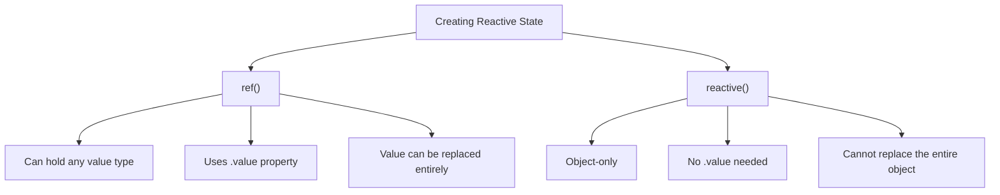

# Vue.js Reactive References

## Introduction

In Vue.js 3's Composition API, reactive references (or "refs") are one of the fundamental building blocks for creating reactive state. Unlike the Options API where you define reactive data in the `data()` option, the Composition API gives you more fine-grained control over reactivity using functions like `ref()` and `reactive()`.

In this guide, we'll focus on `ref()`, which allows you to make individual values reactive, regardless of their type. Understanding refs is essential for building applications with the Vue.js Composition API.

## What are Reactive References?

A reactive reference (created with the `ref()` function) is a wrapper object that makes its internal value reactive. When the value changes, any component or computed property that depends on it will update automatically.

The key characteristics of refs include:

- They wrap a value in a reactive object with a `.value` property
- They can hold any data type (primitives like strings and numbers, as well as objects and arrays)
- When used in templates, the `.value` property is automatically unwrapped

## Basic Usage of `ref()`

Let's start with a simple example of creating and using a ref:

```html
<script setup>
import { ref } from 'vue'

// Create a ref with an initial value of 0
const count = ref(0)

// To access or modify the value, use the .value property
function increment() {
  count.value++
}

function decrement() {
  count.value--
}
</script>

<template>
  <!-- In templates, .value is automatically unwrapped -->
  <p>Current count: {{ count }}</p>
  
  <button @click="increment">Increment</button>
  <button @click="decrement">Decrement</button>
</template>
```

In this example:
1. We import the `ref` function from Vue
2. We create a reactive reference `count` with an initial value of `0`
3. We define methods that modify `count.value`
4. In the template, we can use `count` directly (without `.value`)

## The `.value` Property

One of the most important things to remember when working with refs is the `.value` property:

- In JavaScript code, you must use `.value` to access or modify the ref's value
- In templates, Vue automatically unwraps the `.value` property for you

This behavior is demonstrated in the following example:

```html
<script setup>
import { ref, watchEffect } from 'vue'

const message = ref('Hello Vue!')

// Using .value in JavaScript code
watchEffect(() => {
  console.log(message.value) // Logs "Hello Vue!"
})

function updateMessage() {
  message.value = 'Updated message' // Must use .value to modify
}
</script>

<template>
  <!-- No .value needed in templates -->
  <p>{{ message }}</p>
  <button @click="updateMessage">Update Message</button>
</template>
```

## Working with Different Data Types

### Primitive Values

Primitive values (strings, numbers, booleans) are straightforward to use with refs:

```html
<script setup>
import { ref } from 'vue'

const username = ref('guest')
const isLoggedIn = ref(false)
const age = ref(25)

function login() {
  username.value = 'user123'
  isLoggedIn.value = true
}
</script>

<template>
  <p>User: {{ username }}</p>
  <p>Login status: {{ isLoggedIn ? 'Logged in' : 'Not logged in' }}</p>
  <p>Age: {{ age }}</p>
  <button @click="login">Login</button>
</template>
```

### Objects and Arrays

Refs can also contain objects and arrays. The entire object becomes reactive:

```html
<script setup>
import { ref } from 'vue'

const user = ref({
  name: 'Alice',
  email: 'alice@example.com',
  preferences: {
    theme: 'dark',
    notifications: true
  }
})

const fruits = ref(['Apple', 'Orange', 'Banana'])

function updateUserTheme() {
  // Accessing nested properties requires .value
  user.value.preferences.theme = 'light'
}

function addFruit() {
  // Modifying array methods also requires .value
  fruits.value.push('Mango')
}
</script>

<template>
  <div>
    <h3>User Info:</h3>
    <p>Name: {{ user.name }}</p>
    <p>Email: {{ user.email }}</p>
    <p>Theme: {{ user.preferences.theme }}</p>
    <button @click="updateUserTheme">Switch Theme</button>
  </div>

  <div>
    <h3>Fruits:</h3>
    <ul>
      <li v-for="(fruit, index) in fruits" :key="index">{{ fruit }}</li>
    </ul>
    <button @click="addFruit">Add Mango</button>
  </div>
</template>
```

## Refs vs Reactive

Vue's Composition API provides two main ways to create reactive state: `ref()` and `reactive()`. Here's how they compare:



When should you use `ref` versus `reactive`?

- Use `ref` when:
  - Working with primitive values (strings, numbers, booleans)
  - You want to be able to replace the entire value later
  - You want a consistent API across different value types

- Use `reactive` when:
  - Working exclusively with objects or arrays
  - You don't need to replace the entire object, only its properties

## Practical Use Cases

### Form Handling

Refs are great for managing form inputs:

```html
<script setup>
import { ref } from 'vue'

const firstName = ref('')
const lastName = ref('')
const email = ref('')
const formSubmitted = ref(false)
const formError = ref(null)

function submitForm() {
  if (!firstName.value || !lastName.value || !email.value) {
    formError.value = 'All fields are required'
    return
  }
  
  // Form processing logic would go here
  console.log('Form submitted:', {
    firstName: firstName.value,
    lastName: lastName.value,
    email: email.value
  })
  
  formError.value = null
  formSubmitted.value = true
}
</script>

<template>
  <form @submit.prevent="submitForm">
    <div v-if="formError" class="error">
      {{ formError }}
    </div>
    
    <div v-if="formSubmitted" class="success">
      Form submitted successfully!
    </div>
    
    <div>
      <label for="firstName">First Name:</label>
      <input id="firstName" v-model="firstName" type="text" />
    </div>
    
    <div>
      <label for="lastName">Last Name:</label>
      <input id="lastName" v-model="lastName" type="text" />
    </div>
    
    <div>
      <label for="email">Email:</label>
      <input id="email" v-model="email" type="email" />
    </div>
    
    <button type="submit">Submit</button>
  </form>
</template>
```

### Toggle States

Refs are perfect for toggle states:

```html
<script setup>
import { ref } from 'vue'

const isMenuOpen = ref(false)
const isDarkMode = ref(false)
const selectedTab = ref('home')

function toggleMenu() {
  isMenuOpen.value = !isMenuOpen.value
}

function toggleDarkMode() {
  isDarkMode.value = !isDarkMode.value
  // In a real app, you might apply some CSS classes here
}

function selectTab(tab) {
  selectedTab.value = tab
}
</script>

<template>
  <div :class="{ 'dark-mode': isDarkMode }">
    <button @click="toggleMenu">
      {{ isMenuOpen ? 'Close Menu' : 'Open Menu' }}
    </button>
    
    <nav v-if="isMenuOpen">
      <!-- Menu content -->
    </nav>
    
    <div class="tabs">
      <button 
        @click="selectTab('home')"
        :class="{ active: selectedTab === 'home' }"
      >
        Home
      </button>
      <button 
        @click="selectTab('about')"
        :class="{ active: selectedTab === 'about' }"
      >
        About
      </button>
      <button 
        @click="selectTab('contact')"
        :class="{ active: selectedTab === 'contact' }"
      >
        Contact
      </button>
    </div>
    
    <button @click="toggleDarkMode">
      Switch to {{ isDarkMode ? 'Light' : 'Dark' }} Mode
    </button>
  </div>
</template>
```

### Working with APIs

Refs are commonly used when fetching data from APIs:

```html
<script setup>
import { ref, onMounted } from 'vue'

const posts = ref([])
const isLoading = ref(false)
const error = ref(null)

async function fetchPosts() {
  isLoading.value = true
  error.value = null
  
  try {
    const response = await fetch('https://jsonplaceholder.typicode.com/posts?_limit=5')
    
    if (!response.ok) {
      throw new Error('Failed to fetch posts')
    }
    
    posts.value = await response.json()
  } catch (e) {
    error.value = e.message
    console.error('Error fetching posts:', e)
  } finally {
    isLoading.value = false
  }
}

onMounted(() => {
  fetchPosts()
})
</script>

<template>
  <div>
    <h2>Blog Posts</h2>
    
    <div v-if="isLoading">Loading posts...</div>
    
    <div v-else-if="error" class="error">
      Error: {{ error }}
    </div>
    
    <div v-else-if="posts.length === 0">
      No posts found.
    </div>
    
    <ul v-else>
      <li v-for="post in posts" :key="post.id">
        <h3>{{ post.title }}</h3>
        <p>{{ post.body }}</p>
      </li>
    </ul>
    
    <button @click="fetchPosts" :disabled="isLoading">
      Reload Posts
    </button>
  </div>
</template>
```

## Common Patterns and Best Practices

### Destructuring Refs

Be careful when destructuring refs. The reactivity will be lost if you don't maintain the `.value` reference:

```js
import { ref } from 'vue'

const user = ref({
  name: 'Alice',
  age: 25
})

// ❌ Destructuring breaks reactivity
const { name, age } = user.value
console.log(name) // "Alice" (but no longer reactive)

// ✅ Keep the ref intact
console.log(user.value.name) // "Alice" (reactive)

// ✅ Alternative: use toRefs if you really need to destructure
import { toRefs } from 'vue'
const { name, age } = toRefs(user.value)
console.log(name.value) // "Alice" (reactive)
```

### Refs in Computed Properties

When using refs with computed properties, remember to use `.value` in the computed function:

```html
<script setup>
import { ref, computed } from 'vue'

const firstName = ref('John')
const lastName = ref('Doe')

// Use .value inside computed functions
const fullName = computed(() => {
  return `${firstName.value} ${lastName.value}`
})

// If you need to create a writeable computed property
const displayName = computed({
  get() {
    return `${firstName.value} ${lastName.value}`
  },
  set(newValue) {
    [firstName.value, lastName.value] = newValue.split(' ')
  }
})
</script>

<template>
  <div>
    <p>Full name: {{ fullName }}</p>
    <input v-model="firstName" placeholder="First name" />
    <input v-model="lastName" placeholder="Last name" />
    
    <p>Display name: {{ displayName }}</p>
    <input v-model="displayName" placeholder="Full name" />
  </div>
</template>
```

### Watching Refs

You can watch for changes to refs using the `watch` function:

```html
<script setup>
import { ref, watch } from 'vue'

const searchQuery = ref('')
const searchResults = ref([])
const isSearching = ref(false)

// Watch a single ref
watch(searchQuery, async (newQuery, oldQuery) => {
  if (newQuery.trim() === '') {
    searchResults.value = []
    return
  }
  
  isSearching.value = true
  try {
    // Simulated API call
    const results = await fetchSearchResults(newQuery)
    searchResults.value = results
  } catch (error) {
    console.error('Search failed:', error)
  } finally {
    isSearching.value = false
  }
}, { debounce: 300 }) // Add debounce for better UX

// Example function (in real code, this would call an actual API)
async function fetchSearchResults(query) {
  return new Promise((resolve) => {
    setTimeout(() => {
      resolve([
        `Result 1 for "${query}"`,
        `Result 2 for "${query}"`,
        `Result 3 for "${query}"`
      ])
    }, 500)
  })
}
</script>

<template>
  <div>
    <input 
      v-model="searchQuery" 
      placeholder="Search..." 
      type="search"
    />
    
    <div v-if="isSearching">Searching...</div>
    
    <ul v-else-if="searchResults.length > 0">
      <li v-for="(result, index) in searchResults" :key="index">
        {{ result }}
      </li>
    </ul>
    
    <div v-else-if="searchQuery && !isSearching">
      No results found for "{{ searchQuery }}"
    </div>
  </div>
</template>
```

## Summary

Reactive references (`ref()`) are a cornerstone of Vue.js 3's Composition API, providing a way to make any value reactive, regardless of its type. Here's a recap of what we've learned:

- A ref is a wrapper object that makes its internal value reactive via the `.value` property
- Use `.value` in JavaScript code, but not in templates (Vue unwraps it automatically)
- Refs can hold primitives, objects, or arrays
- Be careful when destructuring refs, as this can break reactivity
- Use `watch` to react to changes in a ref's value
- Consider `ref` for primitive values and when you need to replace the entire value; consider `reactive` for objects when you only need to modify properties

By mastering refs, you'll be able to build more flexible and maintainable Vue applications using the Composition API.

## Practice Exercises

1. **Counter App**: Create a counter app with increment, decrement, and reset buttons using refs.
2. **Todo List**: Build a todo list that allows adding, removing, and toggling todos, using refs for the todo items and app state.
3. **API Integration**: Create a component that fetches and displays data from a public API using refs for loading states, data, and errors.
4. **Form Validation**: Implement a form with validation logic using refs to track input values and validation states.

## Additional Resources

- [Vue.js Official Documentation on Refs](https://vuejs.org/guide/essentials/reactivity-fundamentals.html)
- [Vue.js Composition API Guide](https://vuejs.org/guide/introduction.html)
- [Vue 3 Reactivity System in Depth](https://vuejs.org/guide/extras/reactivity-in-depth.html)
- [Vue School's Composition API Course](https://vueschool.io/)

Understanding refs is just the beginning of working with Vue 3's Composition API. As you continue your journey, you'll discover how refs work alongside other reactive concepts like `reactive()`, `computed()`, and more.