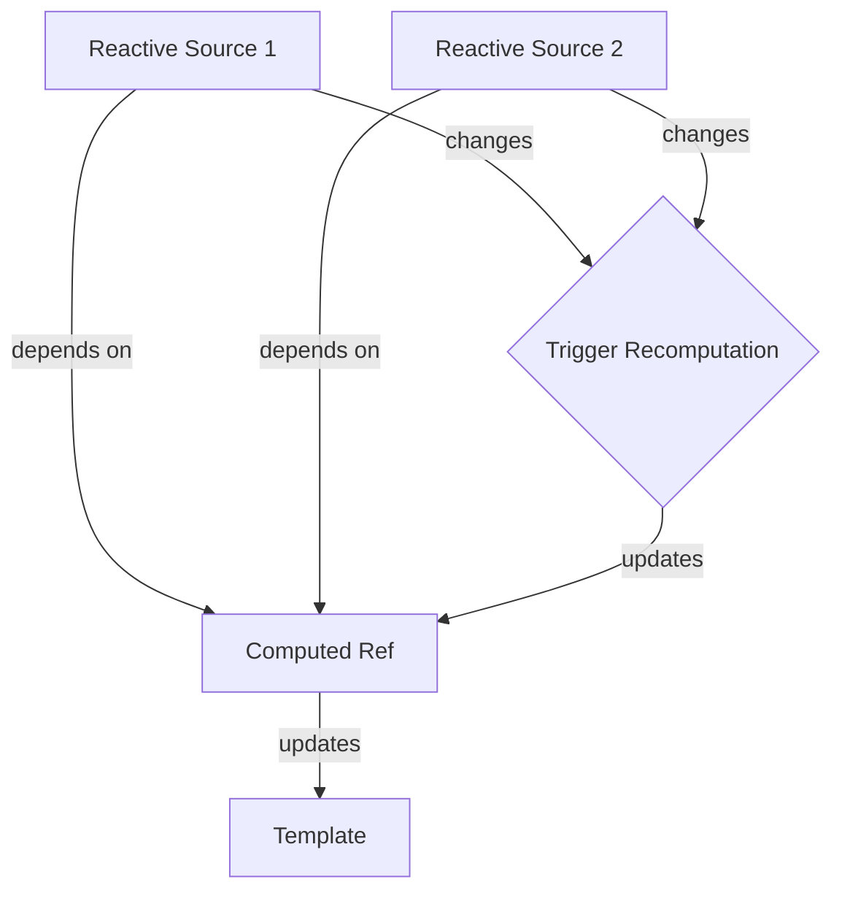

# Vue.js Computed Refs

## Introduction

In Vue.js, the Composition API offers a powerful way to organize and reuse code in your components. One of the most useful features is the `computed` function, which allows you to create reactive values based on other reactive data sources. These "computed refs" automatically update whenever their dependencies change, helping you maintain clean, efficient, and reactive code.

In this tutorial, we'll explore how computed refs work in the Composition API, how they differ from regular refs, and how to use them effectively in your Vue applications.

## What are Computed Refs?

A computed ref is a special type of ref that calculates its value based on other reactive data sources. Unlike regular refs which you need to update manually, computed refs update automatically whenever their dependencies change.

Think of a computed ref as a formula in a spreadsheet that recalculates whenever the cells it references change.

## Basic Syntax

To create a computed ref, import the `computed` function from Vue and pass it a getter function:

```html
<script setup>
import { ref, computed } from 'vue'

const count = ref(0)
const doubledCount = computed(() => count.value * 2)
</script>
```

## Computed Refs vs. Regular Refs

Let's understand the difference between regular refs and computed refs:

```html
<script setup>
import { ref, computed } from 'vue'

// Regular ref - updated manually
const count = ref(0)

// Computed ref - updates automatically when count changes
const doubledCount = computed(() => count.value * 2)

function increment() {
  count.value++
  // No need to update doubledCount - it updates automatically!
}
</script>

<template>
  <div>
    <p>Count: {{ count }}</p>
    <p>Doubled Count: {{ doubledCount }}</p>
    <button @click="increment">Increment</button>
  </div>
</template>
```

When you click the "Increment" button, `count` increases and `doubledCount` automatically updates to reflect twice the value of `count`.

## Read-only vs. Writable Computed Refs

By default, computed refs are read-only. To create a writable computed ref, you need to pass an object with both `get` and `set` functions:

```html
<script setup>
import { ref, computed } from 'vue'

const firstName = ref('John')
const lastName = ref('Doe')

// Read-only computed ref
const fullName = computed(() => `${firstName.value} ${lastName.value}`)

// Writable computed ref
const fullNameWritable = computed({
  get() {
    return `${firstName.value} ${lastName.value}`
  },
  set(newValue) {
    [firstName.value, lastName.value] = newValue.split(' ')
  }
})

function updateName() {
  fullNameWritable.value = 'Jane Smith'
  // This will update both firstName and lastName
}
</script>

<template>
  <div>
    <p>First name: {{ firstName }}</p>
    <p>Last name: {{ lastName }}</p>
    <p>Full name (read-only): {{ fullName }}</p>
    <p>Full name (writable): {{ fullNameWritable }}</p>
    <button @click="updateName">Update Name</button>
  </div>
</template>
```

## Caching and Performance

One of the key benefits of computed refs is that they cache their results and only recalculate when their dependencies change. This improves performance by avoiding unnecessary computations.

```html
<script setup>
import { ref, computed } from 'vue'

const numbers = ref([1, 2, 3, 4, 5])

// This will only recalculate when the numbers array changes
const sum = computed(() => {
  console.log('Calculating sum...')
  return numbers.value.reduce((total, num) => total + num, 0)
})

function addNumber() {
  numbers.value.push(Math.floor(Math.random() * 10) + 1)
}

function doSomethingElse() {
  console.log('Doing something else...')
  // sum won't recalculate here since numbers didn't change
}
</script>

<template>
  <div>
    <p>Numbers: {{ numbers.join(', ') }}</p>
    <p>Sum: {{ sum }}</p>
    <button @click="addNumber">Add Random Number</button>
    <button @click="doSomethingElse">Do Something Else</button>
  </div>
</template>
```

If you open the browser console, you'll notice that "Calculating sum..." only prints when the numbers array changes, not on every render or when unrelated functions are called.

## Best Practices for Computed Refs

### 1. Keep Computed Functions Pure

Computed functions should be pure and have no side effects. They should only calculate and return a value based on their dependencies:

```html
<script setup>
import { ref, computed } from 'vue'

const price = ref(100)
const taxRate = ref(0.1)

// Good - pure computation with no side effects
const totalPrice = computed(() => price.value * (1 + taxRate.value))

// Bad - has side effects
const badComputed = computed(() => {
  console.log('This is a side effect')
  localStorage.setItem('price', price.value)
  return price.value * (1 + taxRate.value)
})
</script>
```

### 2. Avoid Async Operations in Computed

Computed properties should be synchronous. Don't use async/await or Promises inside them:

```html
<script setup>
import { ref, computed } from 'vue'

const userId = ref(1)

// Bad - async computed
const badUserData = computed(async () => {
  const response = await fetch(`https://api.example.com/users/${userId.value}`)
  return response.json()
})

// Better approach: use watchEffect instead
// (We'll cover this in a different tutorial)
</script>
```

### 3. Keep Computations Simple and Focused

Each computed ref should have a single, clear responsibility:

```html
<script setup>
import { ref, computed } from 'vue'

const items = ref([
  { id: 1, name: 'Apple', price: 1.2, quantity: 3 },
  { id: 2, name: 'Banana', price: 0.8, quantity: 5 },
  { id: 3, name: 'Orange', price: 1.5, quantity: 2 },
])

// Good - each computed has a single responsibility
const totalItems = computed(() => items.value.reduce((sum, item) => sum + item.quantity, 0))
const subtotal = computed(() => items.value.reduce((sum, item) => sum + item.price * item.quantity, 0))
const tax = computed(() => subtotal.value * 0.1)
const grandTotal = computed(() => subtotal.value + tax.value)

// Bad - doing too much in one computed
const badCartSummary = computed(() => {
  const totalItems = items.value.reduce((sum, item) => sum + item.quantity, 0)
  const subtotal = items.value.reduce((sum, item) => sum + item.price * item.quantity, 0)
  const tax = subtotal * 0.1
  const grandTotal = subtotal + tax
  
  return { totalItems, subtotal, tax, grandTotal }
})
</script>
```

## Real-World Examples

### Example 1: Filtering a List

Here's how you might use computed refs to filter a list of users:

```html
<script setup>
import { ref, computed } from 'vue'

const users = ref([
  { id: 1, name: 'Alice', role: 'admin' },
  { id: 2, name: 'Bob', role: 'user' },
  { id: 3, name: 'Charlie', role: 'admin' },
  { id: 4, name: 'David', role: 'user' },
])

const searchQuery = ref('')
const selectedRole = ref('all')

const filteredUsers = computed(() => {
  return users.value.filter(user => {
    const matchesSearch = user.name.toLowerCase().includes(searchQuery.value.toLowerCase())
    const matchesRole = selectedRole.value === 'all' || user.role === selectedRole.value
    return matchesSearch && matchesRole
  })
})
</script>

<template>
  <div>
    <input v-model="searchQuery" placeholder="Search users..." />
    
    <select v-model="selectedRole">
      <option value="all">All Roles</option>
      <option value="admin">Admin</option>
      <option value="user">User</option>
    </select>
    
    <ul>
      <li v-for="user in filteredUsers" :key="user.id">
        {{ user.name }} ({{ user.role }})
      </li>
    </ul>
  </div>
</template>
```

### Example 2: Form Validation

Computed refs are excellent for form validation:

```html
<script setup>
import { ref, computed } from 'vue'

const username = ref('')
const email = ref('')
const password = ref('')

const usernameError = computed(() => {
  if (username.value === '') return 'Username is required'
  if (username.value.length < 3) return 'Username must be at least 3 characters'
  return ''
})

const emailError = computed(() => {
  if (email.value === '') return 'Email is required'
  const emailRegex = /^[^\s@]+@[^\s@]+\.[^\s@]+$/
  if (!emailRegex.test(email.value)) return 'Invalid email format'
  return ''
})

const passwordError = computed(() => {
  if (password.value === '') return 'Password is required'
  if (password.value.length < 8) return 'Password must be at least 8 characters'
  return ''
})

const isFormValid = computed(() => {
  return !usernameError.value && !emailError.value && !passwordError.value
})

function submitForm() {
  if (isFormValid.value) {
    alert('Form submitted successfully!')
  }
}
</script>

<template>
  <form @submit.prevent="submitForm">
    <div>
      <label for="username">Username:</label>
      <input id="username" v-model="username" />
      <p v-if="usernameError" class="error">{{ usernameError }}</p>
    </div>
    
    <div>
      <label for="email">Email:</label>
      <input id="email" type="email" v-model="email" />
      <p v-if="emailError" class="error">{{ emailError }}</p>
    </div>
    
    <div>
      <label for="password">Password:</label>
      <input id="password" type="password" v-model="password" />
      <p v-if="passwordError" class="error">{{ passwordError }}</p>
    </div>
    
    <button type="submit" :disabled="!isFormValid">Submit</button>
  </form>
</template>

<style scoped>
.error {
  color: red;
  font-size: 0.8rem;
}
</style>
```

## How Computed Refs Work Behind the Scenes

Here's a simplified visualization of how computed refs track their dependencies:



When Vue renders a component that uses computed refs:

1. The computed getter function runs and Vue tracks any reactive dependencies accessed
2. When any of these dependencies change, Vue marks the computed ref as "dirty"
3. The next time the computed ref value is accessed, Vue reruns the getter function
4. If the computed ref isn't accessed, the getter function isn't rerun (lazy evaluation)

## Summary

Computed refs are a powerful feature of Vue's Composition API that allows you to create reactive, derived state that automatically updates when its dependencies change. Key benefits include:

- **Automatic updates**: No need to manually update derived values
- **Performance optimization**: Results are cached until dependencies change
- **Code organization**: Keep derived calculations separate and reusable
- **Reactivity**: Computed refs are reactive and can be used in templates and other computed properties

By following best practices like keeping computed functions pure, simple, and focused, you can build more maintainable and efficient Vue applications.

## Exercises

1. Create a shopping cart component with computed refs for subtotal, tax, and total
2. Build a search and filter system for a list of products
3. Create a form with validation using computed refs
4. Implement a pagination system using computed refs to show only a subset of items

## Additional Resources

- [Vue.js Computed Properties Documentation](https://vuejs.org/guide/essentials/computed.html)
- [Vue.js Composition API Documentation](https://vuejs.org/api/composition-api-core.html#computed)
- [Understanding Vue.js Reactivity in Depth](https://vuejs.org/guide/extras/reactivity-in-depth.html)

Remember that computed refs are one of the core building blocks of reactive Vue applications. Mastering them will significantly improve your Vue development skills and help you build more efficient and maintainable applications.