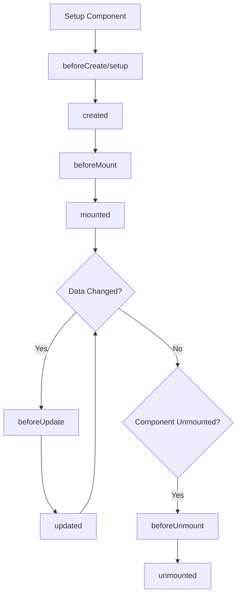

# Vue.js Lifecycle Hooks

## Introduction

Lifecycle hooks are special methods that allow you to execute code at specific stages of a component's existence. In Vue.js, a component goes through a series of initialization steps when it's created - setting up data observation, compiling templates, mounting the instance to the DOM, and updating when data changes. Along the way, it also runs functions called "lifecycle hooks", giving developers the opportunity to add their own code at specific stages.

With the introduction of Vue 3's Composition API, the way we work with lifecycle hooks has changed significantly compared to the Options API in Vue 2. This guide will help you understand how lifecycle hooks work in the Composition API and how to use them effectively.

## Understanding the Component Lifecycle

Before we dive into the specific hooks, let's understand the overall lifecycle of a Vue component:



## Lifecycle Hooks in the Composition API

In the Composition API, lifecycle hooks are imported as standalone functions from Vue, rather than being defined as methods in the component options. Here's how the Vue 2 Options API hooks map to the Composition API:

| Options API | Composition API |
|------------|-----------------|
| beforeCreate | setup() |
| created | setup() |
| beforeMount | onBeforeMount |
| mounted | onMounted |
| beforeUpdate | onBeforeUpdate |
| updated | onUpdated |
| beforeDestroy | onBeforeUnmount |
| destroyed | onUnmounted |
| errorCaptured | onErrorCaptured |
| renderTracked | onRenderTracked |
| renderTriggered | onRenderTriggered |

## Using Lifecycle Hooks

To use lifecycle hooks in the Composition API, you need to:

1. Import them from Vue
2. Call them inside the `setup()` function
3. Pass a callback function that will be executed when the hook is triggered

Let's look at some examples:

```javascript
import { ref, onMounted, onBeforeUnmount } from 'vue';

export default {
  setup() {
    const count = ref(0);
    
    onMounted(() => {
      console.log('Component is mounted!');
      // You can access DOM elements here
      document.title = 'Vue Lifecycle Hooks';
    });
    
    onBeforeUnmount(() => {
      console.log('Component is about to be unmounted!');
      // Clean up any side effects here
    });
    
    return {
      count
    };
  }
};
```

## Common Lifecycle Hooks and Their Use Cases

### setup

The `setup()` function itself replaces `beforeCreate` and `created` hooks from the Options API. It's called right after the initial props resolution and before anything else.

```javascript
import { ref } from 'vue';

export default {
  props: {
    initialCount: Number
  },
  setup(props) {
    // This runs before the component is created
    console.log('Setup function running...');
    
    const count = ref(props.initialCount || 0);
    
    // No need for beforeCreate or created hooks
    
    // Returned object will be accessible in the template
    return {
      count
    };
  }
};
```

### onMounted

The `onMounted` hook is called after the component has been mounted to the DOM. This is the perfect place to access the DOM or perform API calls that depend on the DOM being ready.

```javascript
import { ref, onMounted } from 'vue';
import axios from 'axios';

export default {
  setup() {
    const users = ref([]);
    const isLoading = ref(true);
    
    onMounted(async () => {
      try {
        const response = await axios.get('https://api.example.com/users');
        users.value = response.data;
      } catch (error) {
        console.error('Failed to fetch users:', error);
      } finally {
        isLoading.value = false;
      }
    });
    
    return {
      users,
      isLoading
    };
  }
};
```

### onBeforeMount

This hook is called right before the component is about to mount. At this stage, the render function has been compiled, but no DOM nodes have been created yet.

```javascript
import { ref, onBeforeMount } from 'vue';

export default {
  setup() {
    const isReady = ref(false);
    
    onBeforeMount(() => {
      console.log('Component is about to mount!');
      isReady.value = true;
    });
    
    return {
      isReady
    };
  }
};
```

### onBeforeUpdate and onUpdated

These hooks are called when a reactive dependency changes, triggering a component re-render.

- `onBeforeUpdate`: Called before the component's DOM is about to update
- `onUpdated`: Called after the component's DOM has been updated

```javascript
import { ref, onBeforeUpdate, onUpdated } from 'vue';

export default {
  setup() {
    const count = ref(0);
    
    onBeforeUpdate(() => {
      console.log('Component is about to update!');
      console.log('Current count value:', count.value);
    });
    
    onUpdated(() => {
      console.log('Component has updated!');
      console.log('Updated count value:', count.value);
    });
    
    const increment = () => {
      count.value++;
    };
    
    return {
      count,
      increment
    };
  }
};
```

### onBeforeUnmount and onUnmounted

These hooks are useful for cleanup operations:

- `onBeforeUnmount`: Called right before a component is unmounted
- `onUnmounted`: Called after a component has been unmounted

```javascript
import { onBeforeUnmount, onUnmounted, ref } from 'vue';

export default {
  setup() {
    const timer = ref(null);
    
    // Setup an interval when mounted
    timer.value = setInterval(() => {
      console.log('Tick');
    }, 1000);
    
    // Clean up the interval before unmounting
    onBeforeUnmount(() => {
      console.log('Cleaning up resources...');
      clearInterval(timer.value);
    });
    
    onUnmounted(() => {
      console.log('Component has been unmounted!');
      // The DOM for this component no longer exists
    });
    
    return {};
  }
};
```

### Special Hooks: onErrorCaptured, onRenderTracked, and onRenderTriggered

#### onErrorCaptured

This hook captures errors from descendant components. It's great for creating error boundaries.

```javascript
import { onErrorCaptured, ref } from 'vue';

export default {
  setup() {
    const error = ref(null);
    
    onErrorCaptured((err, instance, info) => {
      error.value = {
        message: err.message,
        component: instance,
        info
      };
      
      // Return false to prevent the error from propagating further
      return false;
    });
    
    return {
      error
    };
  }
};
```

#### onRenderTracked and onRenderTriggered

These hooks are useful for debugging:

- `onRenderTracked`: Called when a reactive dependency is tracked by the renderer
- `onRenderTriggered`: Called when a reactive dependency triggers a re-render

```javascript
import { ref, onRenderTracked, onRenderTriggered } from 'vue';

export default {
  setup() {
    const count = ref(0);
    
    onRenderTracked((event) => {
      console.log('Dependency tracked:', event);
    });
    
    onRenderTriggered((event) => {
      console.log('Render triggered by:', event);
    });
    
    return {
      count
    };
  }
};
```

## Practical Example: Building a Timer Component

Let's build a simple timer component that demonstrates several lifecycle hooks in action:

```html
<template>
  <div class="timer">
    <h2>Timer: {{ formattedTime }}</h2>
    <div class="controls">
      <button @click="startTimer" :disabled="isRunning">Start</button>
      <button @click="pauseTimer" :disabled="!isRunning">Pause</button>
      <button @click="resetTimer">Reset</button>
    </div>
  </div>
</template>

<script>
import { ref, computed, onMounted, onBeforeUnmount } from 'vue';

export default {
  name: 'TimerComponent',
  
  setup() {
    const seconds = ref(0);
    const isRunning = ref(false);
    const intervalId = ref(null);
    
    // Format seconds into MM:SS
    const formattedTime = computed(() => {
      const mins = Math.floor(seconds.value / 60).toString().padStart(2, '0');
      const secs = (seconds.value % 60).toString().padStart(2, '0');
      return `${mins}:${secs}`;
    });
    
    const startTimer = () => {
      if (!isRunning.value) {
        isRunning.value = true;
        intervalId.value = setInterval(() => {
          seconds.value++;
        }, 1000);
      }
    };
    
    const pauseTimer = () => {
      isRunning.value = false;
      clearInterval(intervalId.value);
    };
    
    const resetTimer = () => {
      pauseTimer();
      seconds.value = 0;
    };
    
    // Start timer automatically when component mounts
    onMounted(() => {
      console.log('Timer component mounted');
      startTimer();
    });
    
    // Clean up interval when component is unmounted
    onBeforeUnmount(() => {
      console.log('Timer component will unmount, cleaning up...');
      clearInterval(intervalId.value);
    });
    
    return {
      seconds,
      isRunning,
      formattedTime,
      startTimer,
      pauseTimer,
      resetTimer
    };
  }
};
</script>
```

## Common Use Cases for Lifecycle Hooks

1. **API Calls**: Use `onMounted` to fetch data when the component is ready
2. **Third-Party Library Integration**: Initialize libraries in `onMounted` and clean them up in `onBeforeUnmount`
3. **DOM Manipulation**: Safely interact with the DOM in `onMounted`
4. **Resource Cleanup**: Use `onBeforeUnmount` to remove event listeners, timers, or connections
5. **Performance Tracking**: Use `onMounted` and `onUnmounted` to measure component lifecycle durations

## Best Practices

1. **Keep Hook Logic Focused**: Each hook should have a clear, specific purpose
2. **Clean Up Resources**: Always clean up resources (event listeners, timers) in `onBeforeUnmount`
3. **Don't Rely on DOM in setup()**: The DOM isn't ready in the setup function; wait until `onMounted`
4. **Avoid Side Effects in onUpdated**: Be careful about changing state in `onUpdated` as it can cause infinite update loops
5. **Extract Reusable Logic**: Consider extracting complex lifecycle logic into composables

## Summary

Lifecycle hooks in Vue.js Composition API provide a powerful way to execute code at specific points during a component's existence. By using these hooks appropriately, you can create more responsive, efficient applications and manage resources properly.

Key points to remember:
- `setup()` replaces `beforeCreate` and `created`
- Use `onMounted` for DOM-related operations and API calls
- Always clean up resources in `onBeforeUnmount` 
- Special hooks like `onErrorCaptured` can be used for error handling
- Debugging hooks like `onRenderTracked` and `onRenderTriggered` are available

## Additional Resources

- [Vue.js Official Documentation on Lifecycle Hooks](https://v3.vuejs.org/guide/composition-api-lifecycle-hooks.html)
- [Vue.js Composition API RFC](https://v3.vuejs.org/guide/composition-api-introduction.html)

## Exercises

1. Create a component that uses `onMounted` to fetch data from an API and display it
2. Build a component that uses a third-party library (like Chart.js) and properly initializes it in `onMounted` and cleans it up in `onBeforeUnmount`
3. Create a component that tracks how many times it renders using `onRenderTriggered`
4. Build an error boundary component using `onErrorCaptured` that displays a fallback UI when a child component throws an error
5. Create a component that needs to clean up multiple resources (event listeners, timers) when unmounted