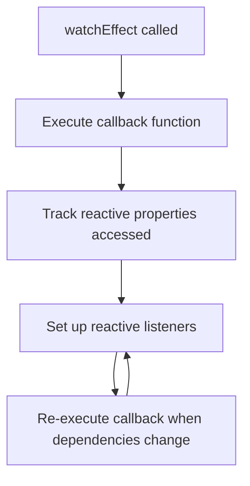

# Vue.js Watch Effect

## Introduction

The Composition API in Vue 3 introduces a powerful reactive system that allows developers to create more maintainable and flexible components. Among these reactive capabilities is `watchEffect`, a function that automatically tracks reactive dependencies and runs a specified function whenever these dependencies change.

Unlike traditional methods where you need to explicitly declare what to watch, `watchEffect` automatically detects reactive properties used within its function and responds to their changes. This makes it an elegant solution for scenarios where you need to perform side effects in response to state changes.

## Understanding watchEffect Basics

### What is watchEffect?

`watchEffect` is a function that:

1. Takes a callback function as its parameter
2. Immediately executes this callback function
3. Automatically tracks any reactive properties accessed during the function's execution
4. Re-runs the callback whenever any of those tracked dependencies change

### Basic Syntax

```javascript
import { ref, watchEffect } from 'vue'

const count = ref(0)

watchEffect(() => {
  console.log(`Count value is: ${count.value}`)
})
```

In this example, `watchEffect` will:
- Execute immediately and log "Count value is: 0"
- Re-run the callback whenever `count.value` changes

## How watchEffect Works

When you call `watchEffect`, Vue analyzes the callback function during its initial execution to determine which reactive properties it depends on. It does this through Vue's reactivity system by tracking property access.



### Comparing watch and watchEffect

While both `watch` and `watchEffect` are used for similar purposes, they have distinct differences:

| `watch` | `watchEffect` |
|---------|---------------|
| Explicitly specifies dependencies | Automatically tracks dependencies |
| Doesn't run immediately by default | Always runs immediately upon creation |
| Provides access to previous values | Doesn't provide access to previous values |
| More control over when to trigger | Simpler syntax for many use cases |

## Working with watchEffect

### Basic Example

Let's create a simple component that displays a message based on a user's score:

```html
<template>
  <div>
    <p>Score: {{ score }}</p>
    <p>{{ message }}</p>
    <button @click="increaseScore">Increase Score</button>
  </div>
</template>

<script setup>
import { ref, watchEffect } from 'vue'

const score = ref(0)
const message = ref('')

watchEffect(() => {
  if (score.value < 10) {
    message.value = 'Keep going!'
  } else if (score.value < 20) {
    message.value = 'Getting better!'
  } else {
    message.value = 'Great job!'
  }
})

function increaseScore() {
  score.value += 5
}
</script>
```

In this example, every time `score` changes, the `watchEffect` callback runs and updates the `message` based on the new score value.

### Stopping a watchEffect

The `watchEffect` function returns a stop function that you can call to stop the watcher:

```javascript
const stopWatching = watchEffect(() => {
  console.log(`Count is: ${count.value}`)
})

// Later, when you want to stop watching:
stopWatching()
```

This is particularly useful for effects that should only run during a component's lifecycle or under certain conditions.

### Using the onInvalidate Function

`watchEffect` provides a way to clean up side effects before the next execution or when the watcher is stopped. This is done through the `onInvalidate` function that's passed to the callback:

```javascript
watchEffect((onInvalidate) => {
  // Set up some side effect (e.g., API call, subscription)
  const token = performSomeAsyncOperation()
  
  onInvalidate(() => {
    // This runs before the effect runs again or when stopped
    cancelOperation(token)
  })
})
```

This is particularly useful for canceling API requests or removing event listeners.

## Advanced Usage

### Controlling Execution Timing

By default, `watchEffect` runs before Vue renders the component. However, you can control when it runs using the `flush` option:

```javascript
// Runs after component updates
watchEffect(() => {
  // access updated DOM
  console.log(document.getElementById('my-element').textContent)
}, {
  flush: 'post' // Run after DOM updates
})
```

Options for `flush`:
- `pre`: Default, runs before component updates
- `post`: Runs after component updates
- `sync`: Runs synchronously when dependencies change

### Handling Errors

You can handle errors in `watchEffect` by using the `onError` option:

```javascript
watchEffect(() => {
  // Some code that might throw an error
  validateUserInput(userInput.value)
}, {
  onError(error) {
    console.error('An error occurred in watchEffect:', error)
  }
})
```

## Practical Examples

### Form Validation

```html
<template>
  <form @submit.prevent="submitForm">
    <div>
      <label>Email:</label>
      <input v-model="email" type="email" />
      <p v-if="emailError" class="error">{{ emailError }}</p>
    </div>
    <div>
      <label>Password:</label>
      <input v-model="password" type="password" />
      <p v-if="passwordError" class="error">{{ passwordError }}</p>
    </div>
    <button :disabled="!isValid">Submit</button>
  </form>
</template>

<script setup>
import { ref, watchEffect } from 'vue'

const email = ref('')
const password = ref('')
const emailError = ref('')
const passwordError = ref('')
const isValid = ref(false)

watchEffect(() => {
  // Validate email
  if (!email.value) {
    emailError.value = 'Email is required'
  } else if (!/^\S+@\S+\.\S+$/.test(email.value)) {
    emailError.value = 'Email format is invalid'
  } else {
    emailError.value = ''
  }
  
  // Validate password
  if (!password.value) {
    passwordError.value = 'Password is required'
  } else if (password.value.length < 6) {
    passwordError.value = 'Password must be at least 6 characters'
  } else {
    passwordError.value = ''
  }
  
  // Form is valid if there are no errors
  isValid.value = !emailError.value && !passwordError.value
})

function submitForm() {
  // Form submission logic
  console.log('Form submitted successfully')
}
</script>
```

In this example, `watchEffect` automatically validates the form fields as the user types, providing immediate feedback.

### Data Fetching with Automatic Cleanup

```html
<template>
  <div>
    <input v-model="searchQuery" placeholder="Search users..." />
    <div v-if="loading">Loading...</div>
    <ul v-else>
      <li v-for="user in users" :key="user.id">{{ user.name }}</li>
    </ul>
  </div>
</template>

<script setup>
import { ref, watchEffect } from 'vue'

const searchQuery = ref('')
const users = ref([])
const loading = ref(false)

watchEffect((onInvalidate) => {
  // Skip API call if search query is too short
  if (searchQuery.value.length < 3) {
    users.value = []
    return
  }
  
  // Set loading state
  loading.value = true
  
  // Create an AbortController to cancel the fetch if needed
  const controller = new AbortController()
  const signal = controller.signal
  
  // Fetch users based on search query
  fetch(`https://api.example.com/users?q=${searchQuery.value}`, { signal })
    .then(response => response.json())
    .then(data => {
      users.value = data
      loading.value = false
    })
    .catch(error => {
      if (error.name !== 'AbortError') {
        console.error('Fetch error:', error)
        loading.value = false
      }
    })
  
  // If the effect runs again or stops, cancel the ongoing request
  onInvalidate(() => {
    controller.abort()
  })
})
</script>
```

This example demonstrates how to use `watchEffect` with `onInvalidate` to automatically fetch data when a search query changes, while properly cleaning up previous requests.

### Synchronized Local Storage

```html
<template>
  <div>
    <h2>User Preferences</h2>
    <div>
      <label>Theme:</label>
      <select v-model="userPreferences.theme">
        <option value="light">Light</option>
        <option value="dark">Dark</option>
        <option value="system">System</option>
      </select>
    </div>
    <div>
      <label>Font Size:</label>
      <input 
        type="range" 
        v-model.number="userPreferences.fontSize" 
        min="12" 
        max="24" 
      />
      <span>{{ userPreferences.fontSize }}px</span>
    </div>
  </div>
</template>

<script setup>
import { reactive, watchEffect } from 'vue'

// Load saved preferences or use defaults
const savedPreferences = localStorage.getItem('userPreferences')
const defaultPreferences = {
  theme: 'light',
  fontSize: 16
}

const userPreferences = reactive(
  savedPreferences ? JSON.parse(savedPreferences) : defaultPreferences
)

// Automatically save preferences to localStorage when they change
watchEffect(() => {
  localStorage.setItem('userPreferences', JSON.stringify({
    theme: userPreferences.theme,
    fontSize: userPreferences.fontSize
  }))
  
  // Apply theme to document
  document.documentElement.setAttribute('data-theme', userPreferences.theme)
  
  // Apply font size to body
  document.body.style.fontSize = `${userPreferences.fontSize}px`
})
</script>
```

This example shows how `watchEffect` can be used to automatically synchronize user preferences with localStorage and apply them to the document.

## Common Pitfalls and Best Practices

### Infinite Loops

Be careful not to modify reactive properties that trigger the `watchEffect` within the effect itself, as this can create infinite loops:

```javascript
// ❌ BAD: This creates an infinite loop
watchEffect(() => {
  count.value++ // This changes count, which triggers the effect again
})

// ✅ GOOD: Use this pattern instead
watchEffect(() => {
  console.log(`Count is: ${count.value}`)
})

function incrementCount() {
  count.value++
}
```

### Unnecessary Computations

When the callback function performs expensive operations, consider using `computed` or regular `watch` with explicit dependencies instead:

```javascript
// ❌ POTENTIALLY INEFFICIENT: Runs complex calculation on any dependency change
watchEffect(() => {
  result.value = performExpensiveCalculation(a.value, b.value, c.value, d.value)
})

// ✅ BETTER: Only runs when specific dependencies change
watch([a, b], ([newA, newB]) => {
  result.value = performExpensiveCalculation(newA, newB, c.value, d.value)
})
```

### Component Lifecycle Considerations

If you need cleanup when a component is unmounted, make sure to either:
1. Call the stop function in `onUnmounted`, or
2. Use the `onInvalidate` function within `watchEffect`

```javascript
import { watchEffect, onUnmounted } from 'vue'

// Option 1: Store and call the stop function
const stop = watchEffect(() => {
  // effect code
})

onUnmounted(() => {
  stop() // Cleanup when component unmounts
})

// Option 2: Use onInvalidate (preferred for most cases)
watchEffect((onInvalidate) => {
  // effect code
  onInvalidate(() => {
    // cleanup code
  })
})
```

## Summary

`watchEffect` is a powerful feature in Vue's Composition API that provides:

- Automatic dependency tracking
- Immediate execution upon creation
- Automatic re-execution when dependencies change
- Built-in cleanup through the `onInvalidate` function

It's particularly useful for:
- Form validation
- API requests that depend on reactive state
- Synchronizing state with external systems like localStorage
- Creating reactive side effects with minimal boilerplate

When working with `watchEffect`, remember to:
- Avoid infinite reactivity loops
- Consider performance implications for expensive operations
- Properly clean up side effects using `onInvalidate`
- Use the appropriate `flush` option when DOM manipulations are needed

## Additional Resources

- Practice creating a dynamic search component that fetches data as the user types
- Try implementing a form that saves drafts automatically using `watchEffect`
- Build a theme switcher that remembers user preferences between visits
- Experiment with different `flush` timing options to understand their effects

By mastering `watchEffect`, you'll be able to create more reactive and responsive Vue applications with cleaner, more maintainable code.