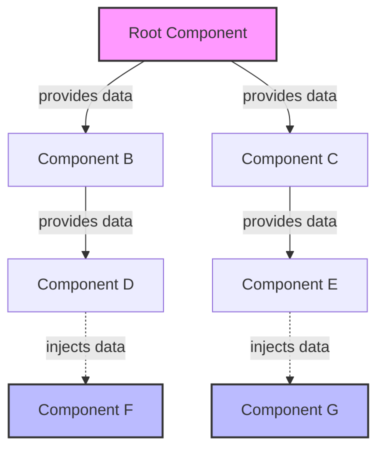

# Vue.js Provide/Inject Pattern

## Introduction

In Vue.js applications, passing data between components is a common requirement. While props are excellent for parent-to-child communication, they can become cumbersome when data needs to be passed through many levels of components—a problem known as "prop drilling."

The **Provide/Inject** pattern (sometimes called dependency injection) solves this problem by allowing a parent component to "provide" data that any descendant component can "inject," regardless of how deep it is in the component hierarchy.

In the Composition API, Vue offers `provide` and `inject` functions that make this pattern more flexible and type-safe compared to the Options API equivalent.

## Understanding Provide/Inject

### Basic Concept



The diagram above illustrates how a root component can provide data that descendant components can inject without passing through intermediate components.

### The Problem It Solves

Consider a scenario where you have a theme setting that needs to be accessible by many components. Without provide/inject, you'd have to pass this theme through all intermediate components even if they don't use it:

```jsx
// Without provide/inject - prop drilling
<GrandparentComponent :theme="theme">
  <ParentComponent :theme="theme">
    <ChildComponent :theme="theme" />
  </ParentComponent>
</GrandparentComponent>
```

With provide/inject, the intermediate components don't need to be aware of the theme prop:

```jsx
// With provide/inject
// GrandparentComponent provides the theme
// ChildComponent injects it directly
// ParentComponent doesn't need to handle the theme
```

## Using Provide/Inject in the Composition API

### Basic Usage

Let's start with a simple example:

```html
<!-- ParentComponent.vue -->
<script setup>
import { provide, ref } from 'vue'
import ChildComponent from './ChildComponent.vue'

// Create a reactive value
const message = ref('Hello from parent')

// Provide the value to descendant components
provide('message', message)
</script>

<template>
  <div>
    <p>Parent component: {{ message }}</p>
    <input v-model="message" placeholder="Change the message" />
    <ChildComponent />
  </div>
</template>
```

```html
<!-- ChildComponent.vue -->
<script setup>
import { inject } from 'vue'

// Inject the value provided by an ancestor
const message = inject('message')
</script>

<template>
  <div class="child">
    <p>Child component received: {{ message }}</p>
  </div>
</template>
```

In this example:
1. The parent component creates a reactive `message` with `ref`
2. It provides this value using `provide('message', message)`
3. The child component injects the value using `inject('message')`
4. When the parent updates the message, the child automatically receives the update

### Providing Default Values

When using `inject`, you can specify a default value in case no ancestor provides the expected data:

```js
// Default primitive value
const theme = inject('theme', 'light')

// Default computed by a factory function
const userConfig = inject('userConfig', () => ({ showNotifications: true }))
```

### Using Symbols as Keys

For large applications, it's recommended to use Symbols as inject keys to avoid potential naming collisions:

```js
// In a separate file (injection-keys.js)
export const MESSAGE_KEY = Symbol('message')
export const THEME_KEY = Symbol('theme')
```

```html
<!-- Provider component -->
<script setup>
import { provide, ref } from 'vue'
import { MESSAGE_KEY } from './injection-keys'

const message = ref('Hello')
provide(MESSAGE_KEY, message)
</script>
```

```html
<!-- Consumer component -->
<script setup>
import { inject } from 'vue'
import { MESSAGE_KEY } from './injection-keys'

const message = inject(MESSAGE_KEY)
</script>
```

### Readonly Provided Values

To prevent a descendant component from mutating the provided data (which could lead to confusing data flow), you can wrap the provided value with `readonly`:

```html
<script setup>
import { provide, readonly, ref } from 'vue'

const count = ref(0)

// Provide a readonly version to prevent descendants from mutating it
provide('count', readonly(count))

function increment() {
  count.value++
}
</script>
```

## Real-World Example: Theme Provider

Let's implement a theme system with light/dark mode switching:

```html
<!-- ThemeProvider.vue -->
<script setup>
import { provide, readonly, ref } from 'vue'

// Theme state
const theme = ref('light')

// Theme changing function
function toggleTheme() {
  theme.value = theme.value === 'light' ? 'dark' : 'light'
}

// Provide both the state and a way to modify it
provide('theme', readonly(theme))
provide('toggleTheme', toggleTheme)
</script>

<template>
  <div :class="['app-container', theme]">
    <slot></slot>
  </div>
</template>

<style scoped>
.app-container {
  min-height: 100vh;
  transition: background-color 0.3s, color 0.3s;
}

.light {
  background-color: #f8f8f8;
  color: #333;
}

.dark {
  background-color: #333;
  color: #f8f8f8;
}
</style>
```

```html
<!-- ThemeButton.vue -->
<script setup>
import { inject } from 'vue'

const theme = inject('theme')
const toggleTheme = inject('toggleTheme')
</script>

<template>
  <button @click="toggleTheme" class="theme-toggle">
    Switch to {{ theme === 'light' ? 'dark' : 'light' }} mode
  </button>
</template>
```

```html
<!-- App.vue -->
<script setup>
import ThemeProvider from './ThemeProvider.vue'
import ThemeButton from './ThemeButton.vue'
import Content from './Content.vue'
</script>

<template>
  <ThemeProvider>
    <header>
      <h1>My App</h1>
      <ThemeButton />
    </header>
    <main>
      <Content />
    </main>
  </ThemeProvider>
</template>
```

In this example:

1. `ThemeProvider` maintains the theme state and provides it to all descendants
2. It also provides a function to toggle the theme
3. `ThemeButton` can be placed anywhere in the component tree and still access the theme state
4. All components wrapped by `ThemeProvider` can inject and use the theme

## Function Style Provide/Inject

For more complex cases, you might want to use a function-style approach:

```html
<!-- UserProvider.vue -->
<script setup>
import { provide, reactive } from 'vue'

const userState = reactive({
  user: null,
  loading: false,
  error: null
})

// Login function
async function login(username, password) {
  try {
    userState.loading = true
    userState.error = null
    
    // Simulated API call
    const response = await fetch('/api/login', {
      method: 'POST',
      body: JSON.stringify({ username, password })
    })
    
    if (!response.ok) throw new Error('Login failed')
    
    userState.user = await response.json()
  } catch (err) {
    userState.error = err.message
  } finally {
    userState.loading = false
  }
}

// Logout function
function logout() {
  userState.user = null
}

// Provide the user state and functions
provide('userState', userState)
provide('userActions', {
  login,
  logout
})
</script>

<template>
  <slot></slot>
</template>
```

```html
<!-- LoginForm.vue -->
<script setup>
import { inject, ref } from 'vue'

const username = ref('')
const password = ref('')

const userState = inject('userState')
const { login } = inject('userActions')

function submitForm() {
  login(username.value, password.value)
}
</script>

<template>
  <form @submit.prevent="submitForm">
    <div v-if="userState.error" class="error">{{ userState.error }}</div>
    
    <input v-model="username" placeholder="Username" required />
    <input v-model="password" type="password" placeholder="Password" required />
    
    <button type="submit" :disabled="userState.loading">
      {{ userState.loading ? 'Logging in...' : 'Log in' }}
    </button>
  </form>
</template>
```

## Best Practices

1. **Use symbols for keys** in large applications to avoid name conflicts
2. **Provide readonly versions** of mutable data to prevent unwanted mutations
3. **Use provide/inject for app-wide or deeply nested data needs**, not as a replacement for props in simple parent-child relationships
4. **Centralize providers** in dedicated components or composables
5. **Document your injection keys** to make the code more maintainable
6. **Provide methods along with state** for modifying provided data when needed

## Common Pitfalls

### Reactivity Loss

When providing primitive values directly, reactivity can be lost:

```js
// Wrong - changes to message won't be reflected in components that inject it
const message = 'Hello'
provide('message', message)

// Correct - wrap in ref to maintain reactivity
const message = ref('Hello')
provide('message', message)
```

### Mutation from Descendants

Unless using `readonly`, descendants can mutate provided values:

```js
// In descendant component
const count = inject('count')
// If count is not readonly, this will affect the original value
count.value++ // This could cause unexpected side effects
```

## Summary

The Provide/Inject pattern in Vue's Composition API offers a powerful way to share data across component hierarchies without prop drilling. Key points to remember:

- Use `provide()` in parent components to make data available to descendants
- Use `inject()` in child components to access data from ancestors
- Data remains reactive when changes occur at the source
- Consider using `readonly` when providing mutable data
- Use Symbols as keys in larger applications
- Provide both state and functions to modify that state when needed

This pattern is especially valuable for sharing application-wide concerns like themes, authentication state, or user preferences without having to pass props through every component level.

## Additional Resources

- [Vue.js Official Documentation: Provide / Inject](https://vuejs.org/guide/components/provide-inject.html)
- [Vue 3 Composition API Reference](https://vuejs.org/api/composition-api-dependency-injection.html)

## Exercises

1. Create a simple language selector that uses provide/inject to change the language across all components
2. Implement a notification system where any component can trigger notifications
3. Convert an existing prop-drilling scenario in your application to use provide/inject
4. Implement a form validation system where form fields can access validation rules from a provider

By mastering provide/inject, you'll be able to create cleaner component architectures with better separation of concerns and less prop-drilling code.