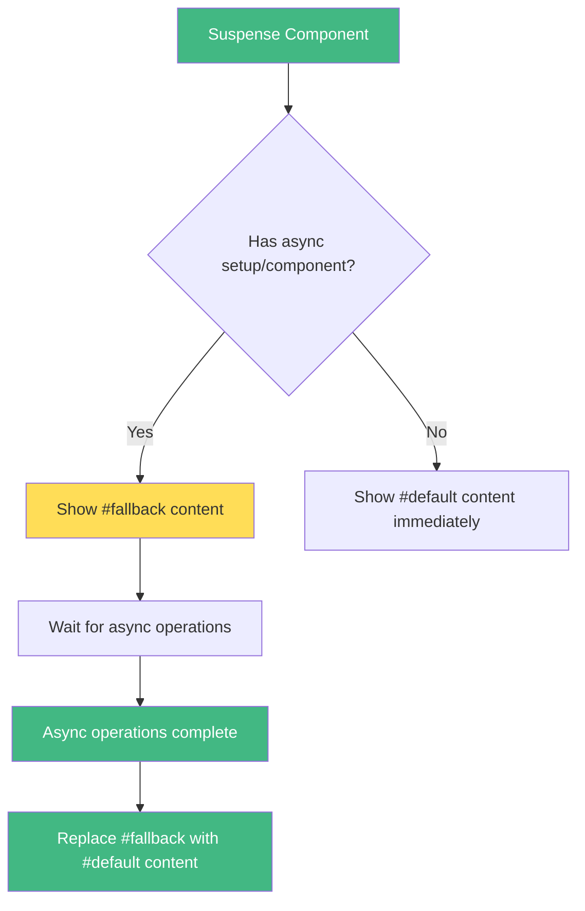

# Vue.js Suspense

## Introduction

The Suspense component is one of Vue 3's exciting features that helps manage asynchronous dependencies in your application. When rendering components that have asynchronous setup functions or contain async components, you might want to display loading states or fallback content until the asynchronous operations complete. This is where Suspense comes in.

Suspense provides two main slots:
- `#default`: Contains the component with async dependencies
- `#fallback`: Content to display while the async dependencies are being resolved

This feature is particularly useful for handling loading states, showing spinners, skeleton screens, or placeholder content while your data is loading or async components are being prepared.

## Prerequisites

Before diving into Suspense, you should be familiar with:
- Vue 3 basics
- Composition API fundamentals
- Async/await JavaScript syntax

## Basic Usage of Suspense

### Simple Example

Here's a basic example of how to use Suspense:

```html
<template>
  <Suspense>
    <!-- Default slot for the component with async setup -->
    <template #default>
      <AsyncComponent />
    </template>
    
    <!-- Fallback slot for loading content -->
    <template #fallback>
      <div>Loading...</div>
    </template>
  </Suspense>
</template>

<script>
import { defineComponent } from 'vue'
import AsyncComponent from './AsyncComponent.vue'

export default defineComponent({
  components: {
    AsyncComponent
  }
})
</script>
```

In this example, the `AsyncComponent` has asynchronous operations in its setup function. While those operations are being completed, the "Loading..." text will be displayed.

### Creating an Async Component

Let's create an example of an async component that loads data before rendering:

```html
<!-- AsyncComponent.vue -->
<template>
  <div>
    <h2>User Details</h2>
    <div>Name: {{ user.name }}</div>
    <div>Email: {{ user.email }}</div>
    <div>Website: {{ user.website }}</div>
  </div>
</template>

<script>
import { defineComponent } from 'vue'

export default defineComponent({
  async setup() {
    // Simulating an API call with a delay
    const response = await fetch('https://jsonplaceholder.typicode.com/users/1')
    const user = await response.json()
    
    // Artificial delay to demonstrate loading state
    await new Promise(resolve => setTimeout(resolve, 2000))
    
    return { user }
  }
})
</script>
```

When this component is used with Suspense, the fallback content will be shown for 2 seconds (plus API request time) before the user details are displayed.

## Error Handling with Suspense

Suspense doesn't handle errors on its own. You need to combine it with Vue's error boundaries. Here's how to handle errors that might occur in the async setup:

```html
<template>
  <ErrorBoundary>
    <Suspense>
      <template #default>
        <AsyncComponent />
      </template>
      <template #fallback>
        <div>Loading...</div>
      </template>
    </Suspense>
    
    <template #error="{ error }">
      <div class="error-container">
        <h3>Oops! Something went wrong:</h3>
        <p>{{ error.message }}</p>
      </div>
    </template>
  </ErrorBoundary>
</template>

<script>
import { defineComponent } from 'vue'
import { ErrorBoundary } from './ErrorBoundary.vue'
import AsyncComponent from './AsyncComponent.vue'

export default defineComponent({
  components: {
    ErrorBoundary,
    AsyncComponent
  }
})
</script>
```

The `ErrorBoundary` component can be implemented like this:

```html
<!-- ErrorBoundary.vue -->
<script>
import { defineComponent, ref, provide } from 'vue'

export default defineComponent({
  setup(props, { slots }) {
    const error = ref(null)

    provide('handleError', (err) => {
      error.value = err
    })

    return () => {
      if (error.value && slots.error) {
        return slots.error({ error: error.value })
      }
      
      return slots.default ? slots.default() : null
    }
  }
})
</script>
```

## Nested Suspense Components

You can nest Suspense components for complex loading scenarios. Each Suspense will manage its own async dependencies:

```html
<template>
  <Suspense>
    <template #default>
      <div>
        <h1>Dashboard</h1>
        
        <Suspense>
          <template #default>
            <UserProfile />
          </template>
          <template #fallback>
            <p>Loading user profile...</p>
          </template>
        </Suspense>
        
        <Suspense>
          <template #default>
            <ActivityFeed />
          </template>
          <template #fallback>
            <p>Loading activity feed...</p>
          </template>
        </Suspense>
      </div>
    </template>
    <template #fallback>
      <div>Loading entire dashboard...</div>
    </template>
  </Suspense>
</template>
```

In this example, the outer Suspense will wait for the immediate async dependencies to resolve, while the inner Suspense components handle their specific components' async dependencies.

## Practical Example: Data Dashboard

Let's create a more complete example of a simple dashboard with Suspense:

```html
<!-- Dashboard.vue -->
<template>
  <div class="dashboard">
    <h1>Analytics Dashboard</h1>
    
    <Suspense>
      <template #default>
        <div class="dashboard-content">
          <SalesChart />
          <UserStats />
          <RecentActivities />
        </div>
      </template>
      
      <template #fallback>
        <div class="dashboard-skeleton">
          <div class="skeleton-chart"></div>
          <div class="skeleton-stats"></div>
          <div class="skeleton-activities"></div>
          <p>Loading dashboard data...</p>
        </div>
      </template>
    </Suspense>
  </div>
</template>

<script>
import { defineComponent } from 'vue'
import SalesChart from './SalesChart.vue'
import UserStats from './UserStats.vue'
import RecentActivities from './RecentActivities.vue'

export default defineComponent({
  components: {
    SalesChart,
    UserStats,
    RecentActivities
  }
})
</script>

<style scoped>
.dashboard-content {
  display: grid;
  grid-template-columns: 1fr 1fr;
  grid-gap: 20px;
}

.dashboard-skeleton {
  display: grid;
  grid-template-columns: 1fr 1fr;
  grid-gap: 20px;
  opacity: 0.7;
}

.skeleton-chart, .skeleton-stats, .skeleton-activities {
  height: 200px;
  background: #f0f0f0;
  border-radius: 4px;
  animation: pulse 1.5s infinite;
}

.skeleton-chart {
  grid-column: 1 / -1;
}

@keyframes pulse {
  0% { opacity: 0.6; }
  50% { opacity: 0.8; }
  100% { opacity: 0.6; }
}
</style>
```

Now, let's implement one of the async components:

```html
<!-- SalesChart.vue -->
<template>
  <div class="chart-container">
    <h2>Monthly Sales</h2>
    <div class="chart">
      <div 
        v-for="(value, month) in salesData" 
        :key="month"
        class="chart-bar"
        :style="{ height: `${value / 2}px` }"
      >
        <span class="bar-value">{{ value }}</span>
        <span class="bar-label">{{ month }}</span>
      </div>
    </div>
  </div>
</template>

<script>
import { defineComponent } from 'vue'

export default defineComponent({
  async setup() {
    // Simulate API request
    await new Promise(resolve => setTimeout(resolve, 2000))
    
    const salesData = {
      Jan: 120,
      Feb: 150,
      Mar: 180,
      Apr: 110,
      May: 190,
      Jun: 170
    }
    
    return {
      salesData
    }
  }
})
</script>

<style scoped>
.chart-container {
  background: white;
  border-radius: 8px;
  padding: 20px;
  box-shadow: 0 2px 10px rgba(0, 0, 0, 0.05);
}

.chart {
  display: flex;
  align-items: flex-end;
  height: 200px;
  gap: 10px;
}

.chart-bar {
  flex: 1;
  background: #42b883;
  min-width: 20px;
  border-radius: 4px 4px 0 0;
  position: relative;
  display: flex;
  flex-direction: column;
  justify-content: space-between;
  align-items: center;
  padding-top: 5px;
}

.bar-value {
  color: white;
  font-weight: bold;
}

.bar-label {
  position: absolute;
  bottom: -25px;
  font-size: 12px;
}
</style>
```

## Lifecycle Hooks and Suspense

When working with Suspense, it's important to understand the component lifecycle. The `onMounted` and other lifecycle hooks won't fire until after the async setup function completes. If you need to run code before the component is fully resolved, you can place it in the setup function before any await statements.

```html
<script>
import { defineComponent, onMounted } from 'vue'

export default defineComponent({
  async setup() {
    console.log('Setup function started - this runs immediately')
    
    // This code runs before any async operations
    const startTime = performance.now()
    
    // Async operation
    await new Promise(resolve => setTimeout(resolve, 2000))
    
    // This runs after async operations complete
    const loadTime = performance.now() - startTime
    console.log(`Data loaded in ${loadTime}ms`)
    
    onMounted(() => {
      // This only runs after the async setup completes and component is mounted
      console.log('Component mounted')
    })
    
    return { loadTime }
  }
})
</script>
```

## Advanced Usage: Dynamic Suspense

You might want to control when to use Suspense or show an immediate error. Here's how to dynamically handle async components:

```html
<template>
  <div>
    <button @click="showData = true">Load Data</button>
    
    <div v-if="showData">
      <Suspense v-if="!hasError">
        <template #default>
          <AsyncComponent @error="handleError" />
        </template>
        <template #fallback>
          <div class="loading">
            <div class="spinner"></div>
            <p>Loading data...</p>
          </div>
        </template>
      </Suspense>
      
      <div v-else class="error-message">
        <p>Failed to load data: {{ errorMessage }}</p>
        <button @click="retryLoading">Retry</button>
      </div>
    </div>
  </div>
</template>

<script>
import { defineComponent, ref } from 'vue'
import AsyncComponent from './AsyncComponent.vue'

export default defineComponent({
  components: { AsyncComponent },
  setup() {
    const showData = ref(false)
    const hasError = ref(false)
    const errorMessage = ref('')
    
    const handleError = (error) => {
      hasError.value = true
      errorMessage.value = error.message
    }
    
    const retryLoading = () => {
      hasError.value = false
      // Force re-render of AsyncComponent by toggling showData
      showData.value = false
      setTimeout(() => {
        showData.value = true
      }, 100)
    }
    
    return {
      showData,
      hasError,
      errorMessage,
      handleError,
      retryLoading
    }
  }
})
</script>

<style scoped>
.loading {
  display: flex;
  flex-direction: column;
  align-items: center;
  padding: 30px;
}

.spinner {
  width: 40px;
  height: 40px;
  border: 4px solid #f3f3f3;
  border-top: 4px solid #42b883;
  border-radius: 50%;
  animation: spin 1s linear infinite;
}

@keyframes spin {
  0% { transform: rotate(0deg); }
  100% { transform: rotate(360deg); }
}

.error-message {
  color: red;
  padding: 20px;
  background: #ffeeee;
  border-radius: 4px;
}
</style>
```

## Suspense Flow Visualization

Here's a diagram showing how Suspense works:



## Summary

Vue.js Suspense is a powerful feature that simplifies handling asynchronous components and data loading. Key points to remember:

- Suspense provides a way to show fallback content while async components or setup functions are resolving
- It requires two slots: `#default` for your async content and `#fallback` for loading states
- Error handling requires additional implementation, typically with error boundaries
- You can nest Suspense components for complex loading scenarios
- Lifecycle hooks in components with async setup functions will only fire after the async operations complete

When used correctly, Suspense can significantly improve the user experience by providing smooth transitions during loading states and a more predictable component behavior.

## Exercises

1. Create a simple app that uses Suspense to load user data from an API
2. Implement a photo gallery that uses Suspense to show skeleton screens while images are loading
3. Create a nested Suspense example with different loading times for parent and child components
4. Add proper error handling to an async component
5. Build a tabbed interface where each tab's content loads asynchronously with its own Suspense component

## Additional Resources

- [Vue.js Official Documentation on Suspense](https://v3.vuejs.org/guide/migration/suspense.html)
- [Composition API Documentation](https://v3.vuejs.org/guide/composition-api-introduction.html)
- [JavaScript Async/Await](https://developer.mozilla.org/en-US/docs/Web/JavaScript/Reference/Statements/async_function)

Happy coding with Vue.js Suspense!