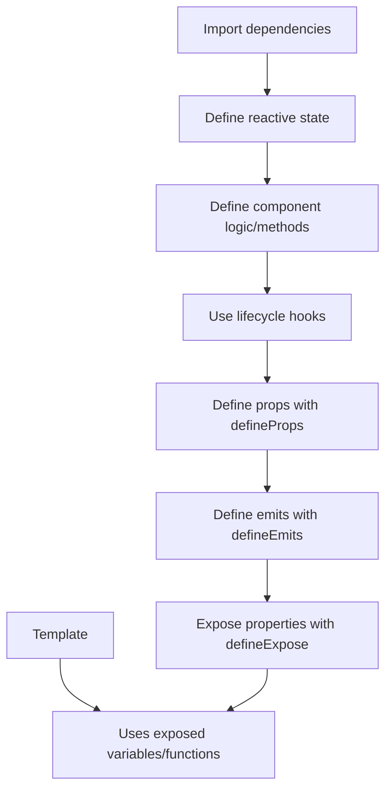

# Vue.js Script Setup

## Introduction

The `<script setup>` syntax is a compile-time sugar for using Composition API inside Single-File Components (SFCs). It's more concise and ergonomic than the standard `<script>` with the `setup()` function. If you've been working with Vue 3's Composition API, you'll find this syntax significantly reduces boilerplate while making your components cleaner and easier to read.

This feature was introduced to streamline component authoring with the Composition API. With `<script setup>`, you can:

- Write less code to achieve the same functionality
- Access component props and emitted events more directly
- Have top-level bindings automatically exposed to the template
- Enjoy better TypeScript support

Let's dive into how it works and how it can improve your Vue development experience.

## Basic Syntax

### Traditional Composition API vs Script Setup

First, let's compare the traditional Composition API syntax with the new `<script setup>` syntax:

**Traditional Composition API:**

```html
<script>
import { ref, onMounted } from 'vue'
import HelloWorld from './HelloWorld.vue'

export default {
  components: {
    HelloWorld
  },
  setup() {
    const count = ref(0)
    
    function increment() {
      count.value++
    }
    
    onMounted(() => {
      console.log('Component mounted!')
    })
    
    return {
      count,
      increment
    }
  }
}
</script>
```

**Script Setup Syntax:**

```html
<script setup>
import { ref, onMounted } from 'vue'
import HelloWorld from './HelloWorld.vue'

const count = ref(0)

function increment() {
  count.value++
}

onMounted(() => {
  console.log('Component mounted!')
})
</script>
```

Notice how much cleaner the `<script setup>` version is! We don't need to:
- Explicitly register components
- Return variables to expose them to the template
- Use an export default object

Everything defined in the `<script setup>` block is automatically available in the template.

## Key Features of Script Setup

### 1. Top-Level Imports and Variables

All imports and top-level variables declared in `<script setup>` are automatically available in the template:

```html
<script setup>
import { ref } from 'vue'
import ButtonComponent from './ButtonComponent.vue'

const username = ref('Vue Developer')
const isLoggedIn = ref(true)

const userDetails = {
  level: 'Intermediate',
  joinDate: '2023-01-15'
}
</script>

<template>
  <div>
    <h1>Welcome, {{ username }}</h1>
    <p>User Level: {{ userDetails.level }}</p>
    <!-- Imported components are available automatically -->
    <ButtonComponent v-if="isLoggedIn" label="Logout" />
  </div>
</template>
```

### 2. Working with Props

To define props in `<script setup>`, use the `defineProps` compiler macro:

```html
<script setup>
// No need to import defineProps - it's a compiler macro
const props = defineProps({
  title: {
    type: String,
    required: true
  },
  count: {
    type: Number,
    default: 0
  }
})

console.log(props.title) // Access props directly
</script>

<template>
  <div>
    <h1>{{ title }}</h1>
    <p>Count: {{ count }}</p>
  </div>
</template>
```

With TypeScript, you can also use type-based props declaration:

```html
<script setup lang="ts">
const props = defineProps<{
  title: string
  count?: number
}>()
</script>
```

### 3. Emitting Events

Use the `defineEmits` compiler macro to define emitted events:

```html
<script setup>
const emit = defineEmits(['update', 'delete', 'create'])

function submitForm() {
  // Form processing logic
  emit('update', { id: 1, name: 'Updated Item' })
}
</script>

<template>
  <form @submit.prevent="submitForm">
    <!-- Form content -->
    <button type="submit">Submit</button>
  </form>
</template>
```

TypeScript users can define typed emits:

```html
<script setup lang="ts">
const emit = defineEmits<{
  (e: 'update', payload: { id: number, name: string }): void
  (e: 'delete', id: number): void
  (e: 'create'): void
}>()
</script>
```

### 4. Exposing Properties to Parent Components

By default, variables in `<script setup>` are private. To expose properties to parent components (for example, to allow a parent to call a child's method), use the `defineExpose` compiler macro:

```html
<script setup>
import { ref } from 'vue'

const count = ref(0)

function reset() {
  count.value = 0
}

// Make these methods/properties available to parent components
defineExpose({
  reset,
  count
})
</script>
```

In the parent component, you can access these with a template ref:

```html
<script setup>
import { ref, onMounted } from 'vue'
import ChildComponent from './ChildComponent.vue'

const childRef = ref(null)

onMounted(() => {
  // Access the exposed methods/properties
  console.log(childRef.value.count)
  childRef.value.reset()
})
</script>

<template>
  <ChildComponent ref="childRef" />
</template>
```

### 5. Using `useSlots()` and `useAttrs()`

To access slots and attributes in `<script setup>`, use the `useSlots` and `useAttrs` helpers:

```html
<script setup>
import { useSlots, useAttrs } from 'vue'

const slots = useSlots()
const attrs = useAttrs()

console.log(slots.default) // Access the default slot
console.log(attrs.class)   // Access attributes passed to the component
</script>
```

## Practical Examples

### Example 1: Todo List Component

Let's create a simple todo list component using `<script setup>`:

```html
<script setup>
import { ref } from 'vue'

const newTodo = ref('')
const todos = ref([
  { id: 1, text: 'Learn Vue.js', completed: true },
  { id: 2, text: 'Master Script Setup', completed: false },
  { id: 3, text: 'Build amazing apps', completed: false }
])

function addTodo() {
  if (newTodo.value.trim()) {
    todos.value.push({
      id: Date.now(),
      text: newTodo.value,
      completed: false
    })
    newTodo.value = ''
  }
}

function toggleTodo(todo) {
  todo.completed = !todo.completed
}

function removeTodo(todoId) {
  todos.value = todos.value.filter(todo => todo.id !== todoId)
}
</script>

<template>
  <div class="todo-app">
    <h1>My Todo List</h1>
    
    <form @submit.prevent="addTodo">
      <input 
        v-model="newTodo" 
        placeholder="Add new todo..."
      />
      <button type="submit">Add</button>
    </form>
    
    <ul class="todo-list">
      <li 
        v-for="todo in todos" 
        :key="todo.id" 
        :class="{ completed: todo.completed }"
      >
        <input 
          type="checkbox"
          :checked="todo.completed"
          @change="toggleTodo(todo)"
        />
        <span>{{ todo.text }}</span>
        <button @click="removeTodo(todo.id)">×</button>
      </li>
    </ul>
    
    <div class="todo-stats">
      <p>{{ todos.filter(t => t.completed).length }} completed out of {{ todos.length }} tasks</p>
    </div>
  </div>
</template>

<style scoped>
.completed {
  text-decoration: line-through;
  color: gray;
}
</style>
```

### Example 2: Data Fetching Component

Here's a component that fetches data from an API using `<script setup>`:

```html
<script setup>
import { ref, onMounted } from 'vue'

const users = ref([])
const loading = ref(true)
const error = ref(null)

// Options for the component
const props = defineProps({
  endpoint: {
    type: String,
    default: 'https://jsonplaceholder.typicode.com/users'
  },
  limit: {
    type: Number,
    default: 5
  }
})

async function fetchUsers() {
  loading.value = true
  error.value = null
  
  try {
    const response = await fetch(props.endpoint)
    
    if (!response.ok) {
      throw new Error('Failed to fetch users')
    }
    
    const data = await response.json()
    users.value = data.slice(0, props.limit)
  } catch (err) {
    error.value = err.message
    console.error('Error fetching users:', err)
  } finally {
    loading.value = false
  }
}

// Expose method to allow parent to refresh data
defineExpose({ fetchUsers })

onMounted(fetchUsers)
</script>

<template>
  <div class="users-list">
    <h2>Users List</h2>
    
    <div v-if="loading" class="loading">
      Loading users...
    </div>
    
    <div v-else-if="error" class="error">
      {{ error }}
    </div>
    
    <ul v-else>
      <li v-for="user in users" :key="user.id" class="user-item">
        <h3>{{ user.name }}</h3>
        <p>{{ user.email }}</p>
        <p>{{ user.company.name }}</p>
      </li>
    </ul>
    
    <button @click="fetchUsers">Refresh Data</button>
  </div>
</template>
```

### Example 3: Form Validation Component

A form with basic validation using `<script setup>`:

```html
<script setup>
import { ref, reactive, computed } from 'vue'

const emit = defineEmits(['submit'])

const formData = reactive({
  name: '',
  email: '',
  password: ''
})

const errors = reactive({
  name: '',
  email: '',
  password: ''
})

const touched = reactive({
  name: false,
  email: false,
  password: false
})

// Validate individual fields
function validateName() {
  touched.name = true
  errors.name = formData.name.length < 3 
    ? 'Name must be at least 3 characters' 
    : ''
}

function validateEmail() {
  touched.email = true
  const emailRegex = /^[^\s@]+@[^\s@]+\.[^\s@]+$/
  errors.email = !emailRegex.test(formData.email)
    ? 'Please enter a valid email address'
    : ''
}

function validatePassword() {
  touched.password = true
  errors.password = formData.password.length < 6
    ? 'Password must be at least 6 characters'
    : ''
}

// Check if the form is valid
const isFormValid = computed(() => {
  return formData.name.length >= 3 && 
    /^[^\s@]+@[^\s@]+\.[^\s@]+$/.test(formData.email) && 
    formData.password.length >= 6
})

function handleSubmit() {
  // Mark all fields as touched
  Object.keys(touched).forEach(key => {
    touched[key] = true
  })
  
  // Validate all fields
  validateName()
  validateEmail()
  validatePassword()
  
  if (isFormValid.value) {
    emit('submit', { ...formData })
  }
}
</script>

<template>
  <form @submit.prevent="handleSubmit" class="signup-form">
    <h2>Sign Up</h2>
    
    <div class="form-group">
      <label for="name">Name</label>
      <input
        id="name"
        v-model="formData.name"
        @blur="validateName"
        type="text"
        :class="{ 'input-error': touched.name && errors.name }"
      />
      <p v-if="touched.name && errors.name" class="error-message">
        {{ errors.name }}
      </p>
    </div>
    
    <div class="form-group">
      <label for="email">Email</label>
      <input
        id="email"
        v-model="formData.email"
        @blur="validateEmail"
        type="email"
        :class="{ 'input-error': touched.email && errors.email }"
      />
      <p v-if="touched.email && errors.email" class="error-message">
        {{ errors.email }}
      </p>
    </div>
    
    <div class="form-group">
      <label for="password">Password</label>
      <input
        id="password"
        v-model="formData.password"
        @blur="validatePassword"
        type="password"
        :class="{ 'input-error': touched.password && errors.password }"
      />
      <p v-if="touched.password && errors.password" class="error-message">
        {{ errors.password }}
      </p>
    </div>
    
    <button type="submit" :disabled="!isFormValid">Sign Up</button>
  </form>
</template>
```

## Script Setup Workflow

Here's a visual representation of how `<script setup>` fits into the Vue component lifecycle:



## Best Practices

When using `<script setup>`, consider these best practices:

1. **Keep components focused**: Although it's easier to write code with `<script setup>`, still follow the single responsibility principle.

2. **Group related code**: Organize your code logically - keep related state and functions together.

3. **Use composables for reusable logic**: Extract common functionality into composable functions.

4. **Name your functions clearly**: Since functions are directly exposed to the template, use descriptive names.

5. **TypeScript for better tooling**: Consider using TypeScript to get better IDE support and type safety.

6. **Prefer `ref` for primitive values and `reactive` for objects**: This aligns with Vue.js best practices.

## Common Gotchas and Solutions

### 1. Variables with the same name as props

If you declare a variable with the same name as a prop, the variable will shadow the prop in the template:

```html
<script setup>
// Avoid this pattern
const props = defineProps(['title'])
const title = 'Local Title' // This shadows props.title
</script>
```

**Solution**: Use different names for local variables or destructure props with a different name.

### 2. Accessing `this`

There is no `this` in `<script setup>` since it doesn't use an options object:

```html
<script setup>
// This won't work
function someMethod() {
  this.anotherMethod() // Error: 'this' is undefined
}
</script>
```

**Solution**: Everything is available at the top level, so just call functions directly:

```html
<script setup>
function anotherMethod() {
  console.log('Another method called')
}

function someMethod() {
  anotherMethod() // Call directly
}
</script>
```

### 3. Dynamic component registration

Since components are auto-imported, registering dynamic components requires a different approach:

```html
<script setup>
import { markRaw, shallowRef } from 'vue'
import ComponentA from './ComponentA.vue'
import ComponentB from './ComponentB.vue'

const components = {
  ComponentA: markRaw(ComponentA),
  ComponentB: markRaw(ComponentB)
}

const currentComponent = shallowRef('ComponentA')
</script>

<template>
  <component :is="components[currentComponent]"></component>
  <button @click="currentComponent = 'ComponentB'">Switch</button>
</template>
```

## Summary

The `<script setup>` syntax is a game-changer for Vue 3 development, offering:

- More concise components with less boilerplate
- Automatic exposure of variables and imports to templates
- Simplified props and emits handling with compiler macros
- Better TypeScript integration
- Improved readability and maintainability

By eliminating the need for an explicit `setup()` function and return statement, `<script setup>` makes your components cleaner while preserving all the power of the Composition API. This approach results in components that are easier to write, understand, and maintain.

## Further Resources and Exercises

### Resources

1. [Vue.js Official Documentation on Script Setup](https://vuejs.org/api/sfc-script-setup.html)
2. [Vue.js Composition API Documentation](https://vuejs.org/guide/extras/composition-api-faq.html)

### Practice Exercises

1. **Basic Converter**: Create a temperature converter component that allows converting between Celsius and Fahrenheit. Use `<script setup>` and reactive references.

2. **API Integration**: Build a component that fetches data from a public API of your choice and displays it. Include loading states, error handling, and pagination.

3. **Parent-Child Communication**: Create a parent component and a child component. Use `defineExpose`, props, and emits to establish two-way communication between them.

4. **Refactor a Component**: Take an existing component built with the Options API and refactor it to use `<script setup>`. Compare the before and after versions.

5. **Custom Form Control**: Create a reusable form input component with validation using `<script setup>`. Make it emit events when the value changes or validation status changes.

These exercises will help solidify your understanding of `<script setup>` and the Vue 3 Composition API in real-world scenarios.