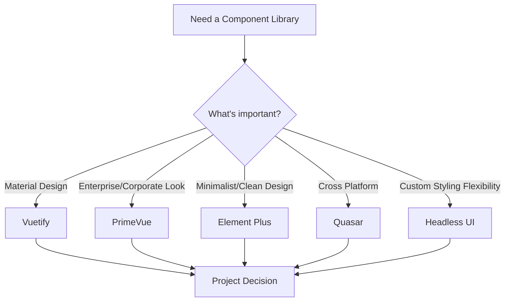

# Vue.js Component Libraries

When building Vue applications, you don't always need to create every UI component from scratch. Vue.js component libraries provide pre-built, styled, and functional components that can accelerate your development process significantly.

## Introduction to Vue.js Component Libraries

Component libraries are collections of pre-designed, reusable UI elements that follow a consistent design language. These libraries help developers create aesthetically pleasing and functional interfaces without having to reinvent the wheel for common elements like buttons, forms, tables, and modals.

### Why Use Component Libraries?

- **Accelerate development** - Save time by using pre-built components
- **Ensure consistency** - Maintain a unified look across your application
- **Follow best practices** - Benefit from accessible, tested components
- **Focus on business logic** - Spend less time on UI implementation details

## Popular Vue.js Component Libraries

Let's explore some of the most widely used Vue component libraries and what makes each one unique.

### 1. Vuetify

[Vuetify](https://vuetifyjs.com/) is a Material Design component framework that follows Google's design specifications.

#### Getting Started with Vuetify

```bash
# Create a new Vue project with Vuetify
vue create my-vuetify-app
cd my-vuetify-app
vue add vuetify
```

#### Basic Usage

```html
<template>
  <v-app>
    <v-main>
      <v-container>
        <v-btn color="primary">Click Me</v-btn>
        <v-btn color="secondary" class="ml-2">Cancel</v-btn>
      </v-container>
    </v-main>
  </v-app>
</template>

<script>
export default {
  name: 'HelloVuetify'
}
</script>
```

This renders two styled buttons - a primary "Click Me" button and a secondary "Cancel" button.

### 2. Element Plus

[Element Plus](https://element-plus.org/) is a Vue 3 UI library with a rich collection of components.

#### Installation

```bash
# Using npm
npm install element-plus

# Using yarn
yarn add element-plus
```

#### Including in Your Project

```js
// main.js
import { createApp } from 'vue'
import ElementPlus from 'element-plus'
import 'element-plus/dist/index.css'
import App from './App.vue'

const app = createApp(App)
app.use(ElementPlus)
app.mount('#app')
```

#### Basic Usage

```html
<template>
  <div>
    <el-button type="primary">Primary Button</el-button>
    <el-date-picker
      v-model="date"
      type="date"
      placeholder="Pick a date"
    />
  </div>
</template>

<script>
export default {
  data() {
    return {
      date: ''
    }
  }
}
</script>
```

This example shows an Element Plus button and date picker component.

### 3. Quasar Framework

[Quasar](https://quasar.dev/) is not just a component library but a full framework that allows you to build responsive websites, mobile apps, and desktop applications from the same codebase.

#### Installation

```bash
# Install Quasar CLI
npm install -g @quasar/cli

# Create a new project
quasar create my-quasar-app
```

#### Basic Usage

```html
<template>
  <q-page class="flex flex-center">
    <q-btn color="primary" label="Primary" />
    <q-card class="my-card" style="max-width: 350px">
      <q-card-section>
        <div class="text-h6">Card Title</div>
      </q-card-section>
      <q-card-section>
        {{ lorem }}
      </q-card-section>
    </q-card>
  </q-page>
</template>

<script>
export default {
  name: 'PageIndex',
  data() {
    return {
      lorem: 'Lorem ipsum dolor sit amet, consectetur adipiscing elit.'
    }
  }
}
</script>
```

This example demonstrates a Quasar page with a button and card component.

### 4. PrimeVue

[PrimeVue](https://primefaces.org/primevue/) offers a comprehensive set of UI components with multiple themes.

#### Installation

```bash
npm install primevue primeflex primeicons
```

#### Basic Usage

```html
<template>
  <div>
    <Button label="Submit" icon="pi pi-check" />
    <DataTable :value="products">
      <Column field="code" header="Code"></Column>
      <Column field="name" header="Name"></Column>
      <Column field="price" header="Price"></Column>
    </DataTable>
  </div>
</template>

<script>
export default {
  data() {
    return {
      products: [
        { code: '1001', name: 'Product A', price: 99 },
        { code: '1002', name: 'Product B', price: 149 },
        { code: '1003', name: 'Product C', price: 249 }
      ]
    }
  }
}
</script>
```

This example shows a PrimeVue button and data table component.

## Choosing the Right Component Library

Selecting the appropriate component library for your project depends on several factors:

### Comparison Chart



### Selection Criteria:

1. **Design Language**: Do you need to follow a specific design system?
2. **Component Range**: Which UI components are essential for your project?
3. **Customization**: How much styling flexibility do you need?
4. **Project Size**: Are you building a small app or an enterprise solution?
5. **Learning Curve**: Does your team already have experience with a specific library?

## Real-World Application: Building a Dashboard

Let's build a simple analytics dashboard using Vuetify to demonstrate a practical use case.

```html
<template>
  <v-app>
    <v-app-bar app color="primary" dark>
      <v-toolbar-title>Analytics Dashboard</v-toolbar-title>
    </v-app-bar>

    <v-main>
      <v-container fluid>
        <v-row>
          <!-- Stats Cards -->
          <v-col cols="12" md="4" v-for="(stat, index) in stats" :key="index">
            <v-card>
              <v-card-title>{{ stat.title }}</v-card-title>
              <v-card-text>
                <div class="text-h4">{{ stat.value }}</div>
                <div :class="stat.change >= 0 ? 'success--text' : 'error--text'">
                  {{ stat.change >= 0 ? '+' : '' }}{{ stat.change }}% from last month
                </div>
              </v-card-text>
            </v-card>
          </v-col>
        </v-row>
        
        <v-row>
          <v-col cols="12" md="8">
            <v-card>
              <v-card-title>Monthly Revenue</v-card-title>
              <v-card-text>
                <!-- Chart would be placed here in a real app -->
                <div class="chart-placeholder" style="height: 300px; background: #f5f5f5;">
                  Chart Area
                </div>
              </v-card-text>
            </v-card>
          </v-col>
          
          <v-col cols="12" md="4">
            <v-card>
              <v-card-title>Recent Activities</v-card-title>
              <v-list>
                <v-list-item v-for="(activity, i) in recentActivities" :key="i">
                  <v-list-item-avatar>
                    <v-icon :color="activity.color">{{ activity.icon }}</v-icon>
                  </v-list-item-avatar>
                  <v-list-item-content>
                    <v-list-item-title>{{ activity.title }}</v-list-item-title>
                    <v-list-item-subtitle>{{ activity.time }}</v-list-item-subtitle>
                  </v-list-item-content>
                </v-list-item>
              </v-list>
            </v-card>
          </v-col>
        </v-row>
      </v-container>
    </v-main>
  </v-app>
</template>

<script>
export default {
  data() {
    return {
      stats: [
        { title: 'Total Users', value: '8,249', change: 12.5 },
        { title: 'Total Revenue', value: '$24,750', change: 8.2 },
        { title: 'Pending Orders', value: '35', change: -2.4 }
      ],
      recentActivities: [
        { 
          title: 'New order placed', 
          time: '2 minutes ago', 
          icon: 'mdi-cart', 
          color: 'blue' 
        },
        { 
          title: 'User registration', 
          time: '10 minutes ago', 
          icon: 'mdi-account', 
          color: 'green' 
        },
        { 
          title: 'Payment received', 
          time: '25 minutes ago', 
          icon: 'mdi-currency-usd', 
          color: 'purple' 
        }
      ]
    }
  }
}
</script>
```

This example creates a dashboard with:
- Statistics cards showing key metrics
- A placeholder for a data visualization chart
- A list of recent activities

In a real application, you would integrate with data sources and add interactive features, but this demonstrates how quickly you can create a visually appealing layout using a component library.

## Best Practices When Using Component Libraries

1. **Don't overcomplicate** - Use the default styling and behaviors when possible
2. **Learn the customization system** - Understand how to modify components to match your brand
3. **Stay consistent** - Stick to one library throughout your project
4. **Check bundle size** - Consider using tree-shaking to reduce your final bundle size
5. **Read the documentation** - Component libraries often have many hidden features and props

### Tree-Shaking Example

```js
// Bad: imports entire library
import ElementPlus from 'element-plus'
import 'element-plus/dist/index.css'
app.use(ElementPlus)

// Better: import only what you need
import { ElButton, ElDatePicker } from 'element-plus'
import 'element-plus/theme-chalk/el-button.css'
import 'element-plus/theme-chalk/el-date-picker.css'

app.component(ElButton.name, ElButton)
app.component(ElDatePicker.name, ElDatePicker)
```

## Summary

Vue.js component libraries are powerful tools that can significantly speed up your development process. We've explored several popular options:

- **Vuetify**: Material Design components with a rich ecosystem
- **Element Plus**: Clean, minimal components for Vue 3
- **Quasar Framework**: Cross-platform components for web, mobile, and desktop
- **PrimeVue**: Enterprise-ready components with extensive theming options

The right library for your project depends on your specific requirements, design preferences, and development constraints. By leveraging these libraries effectively, you can create polished user interfaces in a fraction of the time it would take to build everything from scratch.

## Additional Resources

- Try exploring the official documentation for each library
- Experiment with combining components from different libraries (though be cautious about consistency)
- Practice customizing components to match specific design requirements
- Build a small project using a component library you haven't tried before

## Exercises

1. Create a sign-up form using components from Vuetify or Element Plus
2. Build a data table with sorting and filtering using PrimeVue
3. Create a responsive layout for both mobile and desktop using Quasar
4. Try implementing a dark mode toggle for your application using a component library's theming system

By becoming proficient with Vue.js component libraries, you'll be able to build sophisticated interfaces quickly while maintaining code quality and visual consistency.