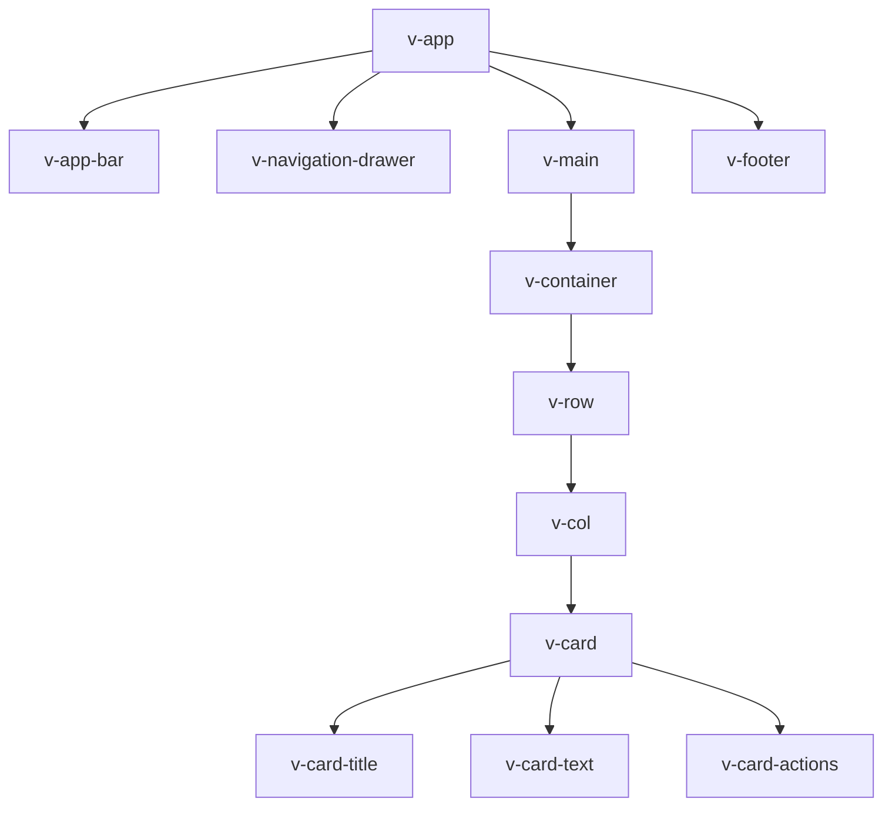

# Vue.js Vuetify

## Introduction

Vuetify is a popular Material Design component framework for Vue.js that provides developers with a comprehensive suite of pre-built UI components following Google's Material Design guidelines. It allows you to create beautiful, responsive, and consistent user interfaces with minimal effort.

In this guide, we'll explore the basics of Vuetify, understand how to set it up in your Vue.js project, and learn how to use its components to build professional-looking applications.

## What is Vuetify?

Vuetify is:
- A complete UI framework built on Vue.js
- Based on Google's Material Design specification
- Collection of 80+ pre-designed components
- Mobile-first with responsive design
- Actively maintained with regular updates
- Well-documented with extensive examples

## Getting Started with Vuetify

### Installation

You can add Vuetify to your Vue.js project in several ways:

#### Using Vue CLI

```bash
vue create my-vuetify-app
cd my-vuetify-app
vue add vuetify
```

#### Using npm or yarn in an existing project

```bash
# npm
npm install vuetify

# yarn
yarn add vuetify
```

### Setting Up Vuetify

After installation, you need to include Vuetify in your Vue application. Here's how to do it:

```javascript
// src/plugins/vuetify.js
import Vue from 'vue';
import Vuetify from 'vuetify/lib';

Vue.use(Vuetify);

export default new Vuetify({
  theme: {
    themes: {
      light: {
        primary: '#1976D2',
        secondary: '#424242',
        accent: '#82B1FF',
        error: '#FF5252',
        info: '#2196F3',
        success: '#4CAF50',
        warning: '#FB8C00',
      },
    },
  },
});
```

Then, in your main.js file:

```javascript
// src/main.js
import Vue from 'vue';
import App from './App.vue';
import vuetify from './plugins/vuetify';
import 'vuetify/dist/vuetify.min.css';

Vue.config.productionTip = false;

new Vue({
  vuetify,
  render: h => h(App)
}).$mount('#app');
```

Now you need to add the Vuetify layout components to your App.vue file:

```html
<template>
  <v-app>
    <v-main>
      <router-view />
    </v-main>
  </v-app>
</template>

<script>
export default {
  name: 'App',
};
</script>
```

## Core Concepts of Vuetify

### Grid System

Vuetify includes a 12-point grid system that helps you create responsive layouts. It consists of containers, rows (`v-row`), and columns (`v-col`).

```html
<template>
  <v-container>
    <v-row>
      <v-col cols="12" md="6">
        <v-card>Column 1</v-card>
      </v-col>
      <v-col cols="12" md="6">
        <v-card>Column 2</v-card>
      </v-col>
    </v-row>
  </v-container>
</template>
```

The above code creates a layout with two columns that will stack on small screens and show side by side on medium (md) screens and larger.

### Theming

Vuetify has a built-in theming system that follows Material Design color guidelines. You can customize your application's theme as shown in the setup section.

You can apply these theme colors to components:

```html
<template>
  <div>
    <v-btn color="primary">Primary Button</v-btn>
    <v-btn color="secondary">Secondary Button</v-btn>
    <v-btn color="accent">Accent Button</v-btn>
    <v-btn color="error">Error Button</v-btn>
  </div>
</template>
```

### Typography

Vuetify provides typography classes for consistent text styling:

```html
<template>
  <div>
    <h1 class="text-h1">Heading 1</h1>
    <h2 class="text-h2">Heading 2</h2>
    <p class="text-body-1">This is body text.</p>
    <p class="text-caption">This is caption text.</p>
  </div>
</template>
```

## Common Vuetify Components

### Buttons

Vuetify provides various button styles and options:

```html
<template>
  <div>
    <v-btn>Default</v-btn>
    <v-btn color="primary">Primary</v-btn>
    <v-btn color="primary" outlined>Outlined</v-btn>
    <v-btn color="primary" text>Text</v-btn>
    <v-btn color="primary" rounded>Rounded</v-btn>
    <v-btn color="primary" fab><v-icon>mdi-plus</v-icon></v-btn>
    <v-btn color="primary" block>Block Button</v-btn>
    <v-btn color="primary" :loading="loading" @click="startLoading">Loading</v-btn>
  </div>
</template>

<script>
export default {
  data: () => ({
    loading: false
  }),
  methods: {
    startLoading() {
      this.loading = true;
      setTimeout(() => {
        this.loading = false;
      }, 2000);
    }
  }
};
</script>
```

### Cards

Cards are versatile components for displaying content:

```html
<template>
  <v-card max-width="400" class="mx-auto">
    <v-img
      height="200"
      src="https://cdn.vuetifyjs.com/images/cards/sunshine.jpg"
    ></v-img>
    
    <v-card-title>Top western road trips</v-card-title>
    
    <v-card-subtitle>1,000 miles of wonder</v-card-subtitle>
    
    <v-card-text>
      <p>This is the description text for the card. It can contain longer paragraphs of information.</p>
    </v-card-text>
    
    <v-card-actions>
      <v-btn text color="orange">Share</v-btn>
      <v-btn text color="orange">Explore</v-btn>
    </v-card-actions>
  </v-card>
</template>
```

### Forms

Vuetify has powerful form components:

```html
<template>
  <v-form ref="form" v-model="valid" @submit.prevent="submitForm">
    <v-container>
      <v-text-field
        v-model="name"
        :rules="nameRules"
        label="Name"
        required
      ></v-text-field>
      
      <v-text-field
        v-model="email"
        :rules="emailRules"
        label="E-mail"
        required
      ></v-text-field>
      
      <v-select
        v-model="select"
        :items="items"
        :rules="[v => !!v || 'Item is required']"
        label="Item"
        required
      ></v-select>
      
      <v-checkbox
        v-model="checkbox"
        :rules="[v => !!v || 'You must agree to continue!']"
        label="Do you agree?"
        required
      ></v-checkbox>
      
      <v-btn
        :disabled="!valid"
        color="success"
        type="submit"
      >
        Submit
      </v-btn>
      
      <v-btn
        color="error"
        @click="reset"
      >
        Reset Form
      </v-btn>
    </v-container>
  </v-form>
</template>

<script>
export default {
  data: () => ({
    valid: false,
    name: '',
    nameRules: [
      v => !!v || 'Name is required',
      v => v.length <= 10 || 'Name must be less than 10 characters',
    ],
    email: '',
    emailRules: [
      v => !!v || 'E-mail is required',
      v => /.+@.+\..+/.test(v) || 'E-mail must be valid',
    ],
    select: null,
    items: ['Item 1', 'Item 2', 'Item 3', 'Item 4'],
    checkbox: false,
  }),
  methods: {
    submitForm() {
      if (this.$refs.form.validate()) {
        // Form submission logic
        alert('Form submitted!');
      }
    },
    reset() {
      this.$refs.form.reset();
    },
  },
};
</script>
```

### Data Tables

Vuetify's data table component provides powerful features for displaying and manipulating tabular data:

```html
<template>
  <v-data-table
    :headers="headers"
    :items="desserts"
    :items-per-page="5"
    class="elevation-1"
  ></v-data-table>
</template>

<script>
export default {
  data() {
    return {
      headers: [
        {
          text: 'Dessert (100g serving)',
          align: 'start',
          sortable: true,
          value: 'name',
        },
        { text: 'Calories', value: 'calories' },
        { text: 'Fat (g)', value: 'fat' },
        { text: 'Carbs (g)', value: 'carbs' },
        { text: 'Protein (g)', value: 'protein' },
        { text: 'Iron (%)', value: 'iron' },
      ],
      desserts: [
        {
          name: 'Frozen Yogurt',
          calories: 159,
          fat: 6.0,
          carbs: 24,
          protein: 4.0,
          iron: '1%',
        },
        {
          name: 'Ice cream sandwich',
          calories: 237,
          fat: 9.0,
          carbs: 37,
          protein: 4.3,
          iron: '1%',
        },
        {
          name: 'Eclair',
          calories: 262,
          fat: 16.0,
          carbs: 23,
          protein: 6.0,
          iron: '7%',
        },
      ],
    };
  },
};
</script>
```

## Real-World Application: Dashboard Layout

Let's create a simple dashboard layout using Vuetify components:

```html
<template>
  <v-app>
    <!-- Navigation Drawer -->
    <v-navigation-drawer
      v-model="drawer"
      app
    >
      <v-list>
        <v-list-item
          v-for="(item, i) in menuItems"
          :key="i"
          :to="item.to"
          link
        >
          <v-list-item-icon>
            <v-icon>{{ item.icon }}</v-icon>
          </v-list-item-icon>
          <v-list-item-content>
            <v-list-item-title>{{ item.title }}</v-list-item-title>
          </v-list-item-content>
        </v-list-item>
      </v-list>
    </v-navigation-drawer>

    <!-- App Bar -->
    <v-app-bar app color="primary" dark>
      <v-app-bar-nav-icon @click="drawer = !drawer"></v-app-bar-nav-icon>
      <v-toolbar-title>Dashboard</v-toolbar-title>
      <v-spacer></v-spacer>
      <v-btn icon>
        <v-icon>mdi-magnify</v-icon>
      </v-btn>
      <v-btn icon>
        <v-icon>mdi-bell</v-icon>
      </v-btn>
      <v-menu
        left
        bottom
      >
        <template v-slot:activator="{ on, attrs }">
          <v-btn
            icon
            v-bind="attrs"
            v-on="on"
          >
            <v-icon>mdi-dots-vertical</v-icon>
          </v-btn>
        </template>

        <v-list>
          <v-list-item
            v-for="(item, i) in userMenuItems"
            :key="i"
            @click="() => {}"
          >
            <v-list-item-title>{{ item.title }}</v-list-item-title>
          </v-list-item>
        </v-list>
      </v-menu>
    </v-app-bar>

    <!-- Main Content -->
    <v-main>
      <v-container fluid>
        <v-row>
          <!-- Stats Cards -->
          <v-col
            v-for="card in statsCards"
            :key="card.title"
            cols="12"
            sm="6"
            md="3"
          >
            <v-card
              class="mx-auto"
              :color="card.color"
              dark
            >
              <v-card-text>
                <div class="text-h6">{{ card.title }}</div>
                <div class="text-h4 text-center">{{ card.value }}</div>
                <v-icon large>{{ card.icon }}</v-icon>
              </v-card-text>
            </v-card>
          </v-col>
        </v-row>
        
        <v-row>
          <!-- Chart Card -->
          <v-col cols="12" md="8">
            <v-card>
              <v-card-title>
                Monthly Sales
              </v-card-title>
              <v-card-text>
                <!-- Chart would go here -->
                <div style="height: 300px; background-color: #f5f5f5; display: flex; align-items: center; justify-content: center;">
                  Chart Placeholder
                </div>
              </v-card-text>
            </v-card>
          </v-col>
          
          <!-- Recent Activity -->
          <v-col cols="12" md="4">
            <v-card>
              <v-card-title>
                Recent Activity
              </v-card-title>
              <v-list two-line>
                <v-list-item
                  v-for="(activity, index) in recentActivities"
                  :key="index"
                >
                  <v-list-item-avatar>
                    <v-icon :color="activity.color">{{ activity.icon }}</v-icon>
                  </v-list-item-avatar>
                  <v-list-item-content>
                    <v-list-item-title>{{ activity.title }}</v-list-item-title>
                    <v-list-item-subtitle>{{ activity.subtitle }}</v-list-item-subtitle>
                  </v-list-item-content>
                </v-list-item>
              </v-list>
            </v-card>
          </v-col>
        </v-row>
      </v-container>
    </v-main>

    <!-- Footer -->
    <v-footer app>
      <span>&copy; {{ new Date().getFullYear() }} My Company</span>
    </v-footer>
  </v-app>
</template>

<script>
export default {
  name: 'DashboardLayout',
  data() {
    return {
      drawer: true,
      menuItems: [
        { title: 'Dashboard', icon: 'mdi-view-dashboard', to: '/' },
        { title: 'Projects', icon: 'mdi-folder', to: '/projects' },
        { title: 'Team', icon: 'mdi-account-group', to: '/team' },
        { title: 'Settings', icon: 'mdi-cog', to: '/settings' },
      ],
      userMenuItems: [
        { title: 'Profile' },
        { title: 'Settings' },
        { title: 'Logout' },
      ],
      statsCards: [
        { title: 'Sales', value: '$54,250', icon: 'mdi-currency-usd', color: 'success' },
        { title: 'Visitors', value: '12,846', icon: 'mdi-account', color: 'primary' },
        { title: 'Orders', value: '156', icon: 'mdi-cart', color: 'info' },
        { title: 'Issues', value: '23', icon: 'mdi-alert-circle', color: 'error' },
      ],
      recentActivities: [
        { title: 'New order placed', subtitle: '5 minutes ago', icon: 'mdi-cart', color: 'blue' },
        { title: 'User registered', subtitle: '1 hour ago', icon: 'mdi-account-plus', color: 'green' },
        { title: 'Payment received', subtitle: '3 hours ago', icon: 'mdi-currency-usd', color: 'purple' },
        { title: 'Server alert', subtitle: '6 hours ago', icon: 'mdi-alert', color: 'red' },
      ],
    };
  },
};
</script>
```

## Best Practices with Vuetify

1. **Follow Material Design Guidelines**: Vuetify is built on Material Design principles, so adhering to these guidelines will result in a more cohesive user interface.

2. **Use Proper Spacing**: Utilize Vuetify's spacing classes (`ma-4`, `pa-2`, etc.) for consistent spacing.

```html
<v-card class="ma-4 pa-3">
  <v-card-title class="mb-2">Properly Spaced Card</v-card-title>
  <v-card-text>Content with proper spacing looks better.</v-card-text>
</v-card>
```

3. **Leverage Utility Classes**: Vuetify provides utility classes for typography, display, and more.

```html
<div class="d-flex justify-center align-center">
  <p class="text-center font-weight-bold">Centered Bold Text</p>
</div>
```

4. **Avoid Overriding Vuetify Styles**: Instead of overriding Vuetify's styles, use the theme configuration to customize colors and other design elements.

5. **Use Breakpoints for Responsive Design**: Vuetify has a built-in responsive system that works seamlessly with its components.

```html
<v-row>
  <v-col cols="12" sm="6" md="4" lg="3">
    <!-- This column will resize based on screen width -->
    <v-card>Responsive Card</v-card>
  </v-col>
</v-row>
```

6. **Use Dynamic Components**: Vuetify components can adapt to different content and states.

```html
<v-btn
  :color="isActive ? 'primary' : 'grey'"
  :outlined="!isActive"
  @click="toggleActive"
>
  {{ isActive ? 'Active' : 'Inactive' }}
</v-btn>
```

## Vuetify Component Flow

Here's a visual representation of how Vuetify components flow in a typical application:



## Summary

Vuetify is a powerful and comprehensive Material Design component framework for Vue.js that provides:

- Pre-designed, customizable UI components
- Responsive grid system
- Theming capabilities
- Rich form inputs with validation
- Data presentation components like data tables and charts
- Navigation components like drawers, app bars, and footers

With Vuetify, you can rapidly develop beautiful, responsive Vue.js applications that follow Material Design guidelines without having to create everything from scratch.

## Additional Resources

1. [Official Vuetify Documentation](https://vuetifyjs.com/) - The most comprehensive resource for learning Vuetify
2. [Vuetify GitHub Repository](https://github.com/vuetifyjs/vuetify) - Source code and issues
3. [Vue.js Official Documentation](https://vuejs.org/) - For more information on Vue.js itself
4. [Material Design Guidelines](https://material.io/design) - Learn more about the design system Vuetify is based on

## Exercises

1. **Simple Todo App**: Create a to-do application using Vuetify components like `v-text-field`, `v-btn`, `v-list`, and `v-checkbox`.

2. **Dashboard Layout**: Build a responsive dashboard layout with a navigation drawer, app bar, and different content areas.

3. **Form Validation**: Create a registration form with validation using Vuetify's form components.

4. **Theme Customization**: Customize Vuetify's theme to match a specific brand color scheme.

5. **Data Visualization**: Use Vuetify's layout components alongside a charting library to create a data visualization dashboard.