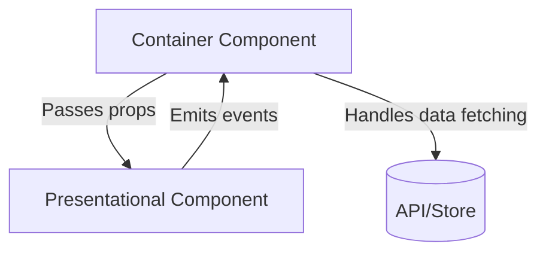

# Vue.js Custom Components

## Introduction

Custom components are the backbone of any Vue.js application. They allow you to create reusable pieces of UI that can be composed together to build complex interfaces while keeping your code organized and maintainable.

In this guide, we'll explore how to create custom components in Vue.js, pass data between components, emit events, and implement several real-world scenarios that demonstrate the power of component-based architecture.

## What Are Vue Components?

Components in Vue.js are reusable Vue instances with a name. They accept the same options as a root Vue instance, such as `data`, `methods`, `computed`, and lifecycle hooks. The only exceptions are root-specific options like `el`.

Components help you:

- **Encapsulate functionality** — keep related HTML, CSS, and JavaScript together
- **Reuse code** — define once, use everywhere
- **Maintain separation of concerns** — each component handles its own logic

## Creating Your First Custom Component

Let's start by creating a simple custom component:

```html
<template>
  <div class="greeting-card">
    <h2>{{ title }}</h2>
    <p>{{ message }}</p>
  </div>
</template>

<script>
export default {
  name: 'GreetingCard',
  props: {
    title: {
      type: String,
      default: 'Hello!'
    },
    message: {
      type: String,
      default: 'Welcome to Vue.js'
    }
  }
}
</script>

<style scoped>
.greeting-card {
  border: 1px solid #ccc;
  border-radius: 4px;
  padding: 16px;
  margin: 16px 0;
  background-color: #f9f9f9;
}
</style>
```

This component creates a simple card with a title and message. To use this component in another Vue component:

```html
<template>
  <div>
    <h1>My App</h1>
    <GreetingCard 
      title="Welcome" 
      message="Thank you for visiting our application!"
    />
    <GreetingCard 
      title="Notice" 
      message="Don't forget to check our latest features."
    />
  </div>
</template>

<script>
import GreetingCard from './components/GreetingCard.vue'

export default {
  components: {
    GreetingCard
  }
}
</script>
```

## Component Registration

There are two ways to register components in Vue:

### 1. Global Registration

Global registration makes components available throughout your application without needing to import them individually:

```js
import { createApp } from 'vue'
import GreetingCard from './components/GreetingCard.vue'

const app = createApp({})

// Register globally
app.component('GreetingCard', GreetingCard)

app.mount('#app')
```

### 2. Local Registration

Local registration limits component availability to the components where they're explicitly imported:

```js
import GreetingCard from './components/GreetingCard.vue'

export default {
  components: {
    GreetingCard
  }
}
```

:::tip
Local registration is generally preferred because it creates a clear dependency relationship and enables better tree-shaking in your build process.
:::

## Props: Passing Data to Components

Props are custom attributes you can register on a component to pass data from parent to child components.

### Defining Props

Props should be clearly defined with validation rules:

```js
export default {
  props: {
    // Basic type check
    title: String,
    
    // More detailed validation
    message: {
      type: String,
      required: true,
      validator(value) {
        return value.length > 0
      }
    },
    
    // With default value
    theme: {
      type: String,
      default: 'light'
    }
  }
}
```

### Using Props

In the template, props are used like regular data properties:

```html
<template>
  <div :class="['card', `theme-${theme}`]">
    <h2>{{ title }}</h2>
    <p>{{ message }}</p>
  </div>
</template>
```

## Events: Communication from Child to Parent

While props allow parents to pass data to children, custom events enable communication in the opposite direction.

### Emitting Events

A child component can notify its parent of changes using the `$emit` method:

```html
<template>
  <div class="button-wrapper">
    <button @click="notifyParent">{{ label }}</button>
  </div>
</template>

<script>
export default {
  props: {
    label: {
      type: String,
      default: 'Click Me'
    }
  },
  methods: {
    notifyParent() {
      this.$emit('button-clicked', {
        time: new Date(),
        label: this.label
      })
    }
  }
}
</script>
```

### Listening to Events

The parent component can listen to these events:

```html
<template>
  <div>
    <h1>Event Demo</h1>
    <CustomButton 
      label="Submit" 
      @button-clicked="handleButtonClick" 
    />
  </div>
</template>

<script>
import CustomButton from './components/CustomButton.vue'

export default {
  components: {
    CustomButton
  },
  methods: {
    handleButtonClick(data) {
      console.log('Button was clicked!', data)
      // Do something with the data
    }
  }
}
</script>
```

## Slots: Content Distribution

Slots allow you to create components that can receive and display content from the parent.

### Basic Slot

```html
<!-- ModalDialog.vue -->
<template>
  <div class="modal" v-if="isVisible">
    <div class="modal-content">
      <div class="modal-header">
        <h2>{{ title }}</h2>
        <button @click="$emit('close')">&times;</button>
      </div>
      <div class="modal-body">
        <slot>Default content if no content is provided</slot>
      </div>
    </div>
  </div>
</template>
```

### Using the Component with a Slot

```html
<template>
  <div>
    <button @click="showModal = true">Open Modal</button>
    
    <ModalDialog 
      title="Important Information" 
      :isVisible="showModal" 
      @close="showModal = false"
    >
      <p>This is custom content passed to the modal.</p>
      <ul>
        <li>Item 1</li>
        <li>Item 2</li>
        <li>Item 3</li>
      </ul>
    </ModalDialog>
  </div>
</template>
```

### Named Slots

For more complex components, you might need multiple slots. Named slots help organize the content:

```html
<!-- Layout.vue -->
<template>
  <div class="layout">
    <header class="header">
      <slot name="header">Default Header</slot>
    </header>
    
    <main class="content">
      <slot>Default Content</slot>
    </main>
    
    <footer class="footer">
      <slot name="footer">Default Footer</slot>
    </footer>
  </div>
</template>
```

### Using Named Slots

```html
<template>
  <Layout>
    <template v-slot:header>
      <h1>My Website</h1>
      <nav>
        <a href="/">Home</a>
        <a href="/about">About</a>
      </nav>
    </template>
    
    <p>Main content goes in the default slot</p>
    
    <template v-slot:footer>
      <p>&copy; 2023 My Website</p>
    </template>
  </Layout>
</template>
```

## Creating Dynamic Components

Sometimes you need to switch between multiple components dynamically. Vue provides the `<component>` element with the `is` attribute:

```html
<template>
  <div>
    <button 
      v-for="tab in tabs" 
      :key="tab"
      @click="currentTab = tab"
      :class="{ active: currentTab === tab }"
    >
      {{ tab }}
    </button>

    <component :is="currentTabComponent" class="tab"></component>
  </div>
</template>

<script>
import HomeTab from './tabs/HomeTab.vue'
import PostsTab from './tabs/PostsTab.vue'
import ArchiveTab from './tabs/ArchiveTab.vue'

export default {
  components: {
    HomeTab,
    PostsTab,
    ArchiveTab
  },
  data() {
    return {
      currentTab: 'Home',
      tabs: ['Home', 'Posts', 'Archive']
    }
  },
  computed: {
    currentTabComponent() {
      return this.currentTab + 'Tab'
    }
  }
}
</script>
```

## Practical Example: Building a Reusable Form Component

Let's create a form component that can be reused across an application:

```html
<!-- FormInput.vue -->
<template>
  <div class="form-group">
    <label v-if="label">{{ label }}</label>
    <input
      :type="type"
      :value="modelValue"
      @input="$emit('update:modelValue', $event.target.value)"
      :placeholder="placeholder"
      :class="{ 'is-invalid': error }"
    />
    <div v-if="error" class="error-message">{{ error }}</div>
  </div>
</template>

<script>
export default {
  name: 'FormInput',
  props: {
    label: String,
    modelValue: [String, Number],
    placeholder: String,
    type: {
      type: String,
      default: 'text'
    },
    error: String
  },
  emits: ['update:modelValue']
}
</script>

<style scoped>
.form-group {
  margin-bottom: 16px;
}

label {
  display: block;
  margin-bottom: 6px;
  font-weight: bold;
}

input {
  width: 100%;
  padding: 8px;
  border: 1px solid #ccc;
  border-radius: 4px;
  font-size: 16px;
}

input.is-invalid {
  border-color: red;
}

.error-message {
  color: red;
  font-size: 12px;
  margin-top: 4px;
}
</style>
```

Now, we can use this component in a registration form:

```html
<!-- RegistrationForm.vue -->
<template>
  <form @submit.prevent="submitForm" class="registration-form">
    <h2>Create Account</h2>
    
    <FormInput
      label="Username"
      v-model="form.username"
      placeholder="Choose a username"
      :error="errors.username"
    />
    
    <FormInput
      label="Email"
      v-model="form.email"
      type="email"
      placeholder="your@email.com"
      :error="errors.email"
    />
    
    <FormInput
      label="Password"
      v-model="form.password"
      type="password"
      placeholder="Enter your password"
      :error="errors.password"
    />
    
    <FormInput
      label="Confirm Password"
      v-model="form.confirmPassword"
      type="password"
      placeholder="Confirm your password"
      :error="errors.confirmPassword"
    />
    
    <button type="submit" :disabled="isSubmitting">
      {{ isSubmitting ? 'Creating account...' : 'Register' }}
    </button>
  </form>
</template>

<script>
import FormInput from './FormInput.vue'

export default {
  components: {
    FormInput
  },
  data() {
    return {
      isSubmitting: false,
      form: {
        username: '',
        email: '',
        password: '',
        confirmPassword: ''
      },
      errors: {
        username: '',
        email: '',
        password: '',
        confirmPassword: ''
      }
    }
  },
  methods: {
    validateForm() {
      // Reset errors
      Object.keys(this.errors).forEach(key => {
        this.errors[key] = ''
      })
      
      let isValid = true
      
      // Simple validation rules
      if (!this.form.username) {
        this.errors.username = 'Username is required'
        isValid = false
      }
      
      if (!this.form.email) {
        this.errors.email = 'Email is required'
        isValid = false
      } else if (!this.form.email.includes('@')) {
        this.errors.email = 'Please enter a valid email'
        isValid = false
      }
      
      if (!this.form.password) {
        this.errors.password = 'Password is required'
        isValid = false
      } else if (this.form.password.length < 8) {
        this.errors.password = 'Password must be at least 8 characters'
        isValid = false
      }
      
      if (this.form.password !== this.form.confirmPassword) {
        this.errors.confirmPassword = 'Passwords do not match'
        isValid = false
      }
      
      return isValid
    },
    
    async submitForm() {
      if (!this.validateForm()) return
      
      this.isSubmitting = true
      
      try {
        // Simulate API call
        await new Promise(resolve => setTimeout(resolve, 1500))
        
        console.log('Form submitted successfully', this.form)
        
        // Clear form
        Object.keys(this.form).forEach(key => {
          this.form[key] = ''
        })
        
        // Show success message
        alert('Account created successfully!')
      } catch (error) {
        console.error('Form submission error', error)
      } finally {
        this.isSubmitting = false
      }
    }
  }
}
</script>

<style scoped>
.registration-form {
  max-width: 500px;
  margin: 0 auto;
  padding: 20px;
  border: 1px solid #ddd;
  border-radius: 8px;
  background-color: #f9f9f9;
}

button {
  padding: 10px 16px;
  background-color: #4CAF50;
  color: white;
  border: none;
  border-radius: 4px;
  cursor: pointer;
  font-size: 16px;
  width: 100%;
}

button:disabled {
  background-color: #cccccc;
  cursor: not-allowed;
}
</style>
```

## Component Design Patterns

Here are some common patterns for creating effective Vue components:

### 1. Container/Presentational Pattern

This pattern separates components into:

- **Container components**: Handle data fetching, state management, and business logic
- **Presentational components**: Focus on appearance and UI rendering



### 2. Renderless Components

Renderless components manage logic but don't render HTML themselves:

```html
<!-- Countdown.vue -->
<script>
export default {
  props: {
    startFrom: {
      type: Number,
      required: true
    }
  },
  data() {
    return {
      count: this.startFrom,
      timer: null
    }
  },
  created() {
    this.timer = setInterval(() => {
      if (this.count > 0) {
        this.count--
      } else {
        clearInterval(this.timer)
        this.$emit('finished')
      }
    }, 1000)
  },
  beforeUnmount() {
    clearInterval(this.timer)
  },
  render() {
    return this.$slots.default({
      count: this.count,
      isRunning: this.count > 0
    })
  }
}
</script>
```

Usage:

```html
<template>
  <div>
    <Countdown :start-from="10" @finished="handleCountdownFinished">
      <template v-slot="{ count, isRunning }">
        <div class="countdown">
          <h3>Time remaining: {{ count }}s</h3>
          <p v-if="!isRunning">Time's up!</p>
        </div>
      </template>
    </Countdown>
  </div>
</template>
```

## Best Practices for Creating Custom Components

1. **Single Responsibility Principle**: Each component should do one thing well
2. **Naming Conventions**: Use clear, descriptive names with PascalCase
3. **Component Size**: Keep components focused; split large components into smaller ones
4. **Prop Validation**: Always validate props with proper types and constraints
5. **Documentation**: Document your component API, especially for team projects
6. **Reusability**: Design components to be reusable where appropriate
7. **Accessibility**: Ensure components follow accessibility best practices

## Summary

In this guide, we've covered:

- The concept of Vue.js custom components and their benefits
- How to create and register components
- Passing data with props
- Communication between components with events
- Content distribution with slots
- Dynamic component switching
- A practical form component implementation
- Component design patterns and best practices

Custom components are fundamental to building scalable Vue.js applications. By breaking down your UI into modular, reusable pieces, you can create maintainable code that's easier to develop, test, and extend.

## Exercises

1. Create a custom `<Tabs>` component that can manage multiple content panels
2. Build a reusable `<ImageGallery>` component with thumbnails and a main image view
3. Implement a `<Toast>` notification system using dynamic components and events
4. Create a data table component that supports sorting and filtering
5. Build a reusable accordion/collapse component with customizable content

## Additional Resources

- [Vue.js Official Component Documentation](https://vuejs.org/guide/essentials/component-basics.html)
- [Vue Style Guide](https://vuejs.org/style-guide/) - Learn best practices for component conventions
- [Vue Component Communication Patterns](https://vuejs.org/guide/components/props.html)
- [Vue Component Design Patterns eBook](https://leanpub.com/vuejs-component-patterns) - Advanced techniques for component design

Remember, component-based architecture is about thinking in terms of reusable pieces that can be composed together. With practice, you'll develop an intuition for how to structure your components effectively.