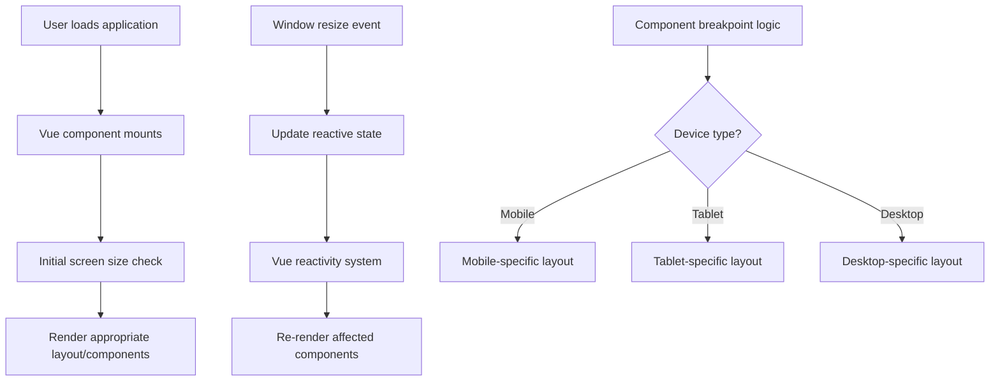

# Vue.js Responsive Design

## Introduction

Responsive design is a critical aspect of modern web development that ensures your application looks and functions well across different device sizes, from desktop monitors to mobile phones. In Vue.js applications, implementing responsive design involves a combination of Vue's reactive capabilities, CSS techniques, and specialized components.

This guide will walk you through creating responsive layouts in Vue.js, helping you build applications that provide an optimal viewing experience across a wide range of devices.

## Understanding Responsive Design Basics

Before diving into Vue-specific implementations, let's quickly review the core principles of responsive design:

1. **Fluid Grids**: Using relative units (%, vw, vh) instead of fixed units (px)
2. **Flexible Images**: Ensuring images scale properly within their containers
3. **Media Queries**: Applying different styles based on device characteristics
4. **Mobile-First Approach**: Designing for mobile devices first, then enhancing for larger screens

## Vue.js Responsive Design Techniques

### 1. Reactive Properties for Responsive Behavior

Vue's reactivity system allows you to respond to viewport changes dynamically:

```html
<template>
  <div class="container">
    <div v-if="isMobile">
      <MobileNavigation />
    </div>
    <div v-else>
      <DesktopNavigation />
    </div>
    
    <h1 :class="{ 'large-title': !isMobile, 'small-title': isMobile }">
      Responsive Vue App
    </h1>
  </div>
</template>

<script>
export default {
  data() {
    return {
      windowWidth: window.innerWidth,
      isMobile: false
    }
  },
  
  mounted() {
    this.checkScreenSize();
    window.addEventListener('resize', this.checkScreenSize);
  },
  
  beforeDestroy() {
    window.removeEventListener('resize', this.checkScreenSize);
  },
  
  methods: {
    checkScreenSize() {
      this.windowWidth = window.innerWidth;
      this.isMobile = this.windowWidth < 768;
    }
  }
}
</script>
```

This example shows how to:
- Track the window width in a reactive property
- Determine if the current view is mobile-sized
- Conditionally render components based on screen size
- Apply different CSS classes for responsive styling

### 2. Using CSS Grid and Flexbox with Vue

Vue works seamlessly with modern CSS layout techniques. Here's an example of a responsive card layout using CSS Grid:

```html
<template>
  <div class="card-container">
    <div class="card" v-for="item in items" :key="item.id">
      
      <div class="card-content">
        <h3>{{ item.title }}</h3>
        <p>{{ item.description }}</p>
      </div>
    </div>
  </div>
</template>

<script>
export default {
  data() {
    return {
      items: [
        { id: 1, title: 'Card 1', description: 'Description for card 1', image: 'path/to/image1' },
        { id: 2, title: 'Card 2', description: 'Description for card 2', image: 'path/to/image2' },
        { id: 3, title: 'Card 3', description: 'Description for card 3', image: 'path/to/image3' },
        // More items...
      ]
    }
  }
}
</script>

<style scoped>
.card-container {
  display: grid;
  grid-template-columns: repeat(auto-fill, minmax(300px, 1fr));
  gap: 1rem;
  padding: 1rem;
}

.card {
  display: flex;
  flex-direction: column;
  border: 1px solid #eaeaea;
  border-radius: 8px;
  overflow: hidden;
}

.card img {
  width: 100%;
  height: 200px;
  object-fit: cover;
}

.card-content {
  padding: 1rem;
}

@media (max-width: 640px) {
  .card-container {
    grid-template-columns: 1fr;
  }
  
  .card img {
    height: 150px;
  }
}
</style>
```

This example demonstrates:
- A responsive grid layout that adjusts columns based on available space
- Media queries to modify the layout for mobile devices
- Fluid images that maintain their aspect ratio

### 3. Vue Composition API for Responsive Logic

If you're using Vue 3, the Composition API provides a clean way to organize responsive behavior:

```html
<template>
  <div>
    <h1 :style="{ fontSize: titleSize }">Dynamic Title</h1>
    <p>Current breakpoint: {{ currentBreakpoint }}</p>
  </div>
</template>

<script>
import { ref, computed, onMounted, onBeforeUnmount } from 'vue';

export default {
  setup() {
    const windowWidth = ref(window.innerWidth);
    
    const currentBreakpoint = computed(() => {
      if (windowWidth.value < 640) return 'xs';
      if (windowWidth.value < 768) return 'sm';
      if (windowWidth.value < 1024) return 'md';
      if (windowWidth.value < 1280) return 'lg';
      return 'xl';
    });
    
    const titleSize = computed(() => {
      switch (currentBreakpoint.value) {
        case 'xs': return '1.5rem';
        case 'sm': return '1.8rem';
        case 'md': return '2.2rem';
        default: return '2.5rem';
      }
    });
    
    const handleResize = () => {
      windowWidth.value = window.innerWidth;
    };
    
    onMounted(() => {
      window.addEventListener('resize', handleResize);
    });
    
    onBeforeUnmount(() => {
      window.removeEventListener('resize', handleResize);
    });
    
    return {
      currentBreakpoint,
      titleSize
    };
  }
}
</script>
```

The Composition API approach offers:
- Cleaner separation of concerns
- Reusable responsive logic that can be extracted into composables
- Reactive properties that directly affect the DOM

### 4. Creating a Responsive Utility Hook

You can extract responsive logic into a reusable composition function:

```html
<!-- useResponsive.js -->
<script>
import { ref, computed, onMounted, onBeforeUnmount } from 'vue';

export function useResponsive() {
  const windowWidth = ref(window.innerWidth);
  const windowHeight = ref(window.innerHeight);
  
  const isMobile = computed(() => windowWidth.value < 768);
  const isTablet = computed(() => windowWidth.value >= 768 && windowWidth.value < 1024);
  const isDesktop = computed(() => windowWidth.value >= 1024);
  
  const breakpoint = computed(() => {
    if (windowWidth.value < 640) return 'xs';
    if (windowWidth.value < 768) return 'sm';
    if (windowWidth.value < 1024) return 'md';
    if (windowWidth.value < 1280) return 'lg';
    if (windowWidth.value < 1536) return 'xl';
    return '2xl';
  });
  
  const handleResize = () => {
    windowWidth.value = window.innerWidth;
    windowHeight.value = window.innerHeight;
  };
  
  onMounted(() => {
    window.addEventListener('resize', handleResize);
  });
  
  onBeforeUnmount(() => {
    window.removeEventListener('resize', handleResize);
  });
  
  return {
    windowWidth,
    windowHeight,
    isMobile,
    isTablet,
    isDesktop,
    breakpoint
  };
}
</script>

<!-- Using the hook in a component -->
<script>
import { useResponsive } from './useResponsive';

export default {
  setup() {
    const { isMobile, breakpoint } = useResponsive();
    
    return {
      isMobile,
      breakpoint
    };
  }
}
</script>
```

## Real-World Application: Responsive Navigation

Here's a complete example of a responsive navigation component:

```html
<template>
  <header class="header">
    <div class="logo">
      
      <h1>Vue App</h1>
    </div>
    
    <button class="mobile-toggle" v-if="isMobile" @click="toggleMenu">
      <span class="sr-only">Menu</span>
      <span class="hamburger" aria-hidden="true"></span>
    </button>
    
    <nav :class="['main-nav', { 'nav-open': menuOpen && isMobile }]">
      <ul>
        <li><router-link to="/">Home</router-link></li>
        <li><router-link to="/about">About</router-link></li>
        <li><router-link to="/services">Services</router-link></li>
        <li><router-link to="/contact">Contact</router-link></li>
      </ul>
    </nav>
  </header>
</template>

<script>
import { ref, onMounted, onBeforeUnmount } from 'vue';

export default {
  setup() {
    const windowWidth = ref(window.innerWidth);
    const isMobile = ref(windowWidth.value < 768);
    const menuOpen = ref(false);
    
    const checkScreenSize = () => {
      windowWidth.value = window.innerWidth;
      isMobile.value = windowWidth.value < 768;
      
      if (!isMobile.value) {
        menuOpen.value = false;
      }
    };
    
    const toggleMenu = () => {
      menuOpen.value = !menuOpen.value;
    };
    
    onMounted(() => {
      window.addEventListener('resize', checkScreenSize);
    });
    
    onBeforeUnmount(() => {
      window.removeEventListener('resize', checkScreenSize);
    });
    
    return {
      isMobile,
      menuOpen,
      toggleMenu
    };
  }
}
</script>

<style scoped>
.header {
  display: flex;
  justify-content: space-between;
  align-items: center;
  padding: 1rem;
  background-color: #f8f9fa;
}

.logo {
  display: flex;
  align-items: center;
}

.logo img {
  height: 40px;
  margin-right: 10px;
}

.main-nav ul {
  display: flex;
  list-style: none;
  margin: 0;
  padding: 0;
}

.main-nav li {
  margin-left: 1.5rem;
}

.mobile-toggle {
  display: none;
}

.sr-only {
  position: absolute;
  width: 1px;
  height: 1px;
  padding: 0;
  margin: -1px;
  overflow: hidden;
  clip: rect(0, 0, 0, 0);
  white-space: nowrap;
  border: 0;
}

/* Mobile styles */
@media (max-width: 767px) {
  .header {
    flex-wrap: wrap;
  }
  
  .mobile-toggle {
    display: block;
    background: none;
    border: none;
    cursor: pointer;
    padding: 10px;
  }
  
  .hamburger {
    display: block;
    position: relative;
    width: 24px;
    height: 2px;
    background: #333;
  }
  
  .hamburger::before,
  .hamburger::after {
    content: '';
    position: absolute;
    width: 100%;
    height: 2px;
    background: #333;
    left: 0;
  }
  
  .hamburger::before {
    top: -6px;
  }
  
  .hamburger::after {
    top: 6px;
  }
  
  .main-nav {
    display: none;
    width: 100%;
    order: 3;
  }
  
  .nav-open {
    display: block;
  }
  
  .main-nav ul {
    flex-direction: column;
    padding: 1rem 0;
  }
  
  .main-nav li {
    margin: 0;
    padding: 0.5rem 0;
    border-bottom: 1px solid #eee;
  }
}
</style>
```

This navigation component:
1. Shows a horizontal menu on desktop
2. Collapses to a hamburger menu on mobile
3. Toggles the mobile menu visibility on click
4. Adapts its layout based on screen size

## Best Practices for Vue.js Responsive Design

1. **Use Vue's reactive system** to respond to viewport changes
2. **Implement component-based breakpoints** for more granular control
3. **Leverage Vue's conditional rendering** (`v-if`, `v-show`) for different layouts
4. **Combine Vue with CSS Grid and Flexbox** for responsive layouts
5. **Create responsive composables/mixins** to reuse responsive logic
6. **Prioritize performance** by debouncing resize event handlers
7. **Test on real devices** not just browser emulators

## Creating a Responsive Image Component

A common requirement is responsive images. Here's a Vue component for that:

```html
<template>
  <div class="responsive-image" :style="containerStyle">
    
    <div v-if="loading" class="loading-overlay">
      <div class="spinner"></div>
    </div>
  </div>
</template>

<script>
import { ref, computed, onMounted } from 'vue';

export default {
  props: {
    sources: {
      type: Object,
      required: true,
      // Example: { sm: 'small.jpg', md: 'medium.jpg', lg: 'large.jpg' }
    },
    alt: {
      type: String,
      required: true
    },
    aspectRatio: {
      type: String,
      default: '16/9' // width/height
    },
    objectFit: {
      type: String,
      default: 'cover'
    }
  },
  
  setup(props) {
    const windowWidth = ref(window.innerWidth);
    const loading = ref(true);
    
    const selectedSource = computed(() => {
      if (windowWidth.value < 640) return props.sources.sm || props.sources.md || props.sources.lg;
      if (windowWidth.value < 1024) return props.sources.md || props.sources.lg || props.sources.sm;
      return props.sources.lg || props.sources.md || props.sources.sm;
    });
    
    const containerStyle = computed(() => ({
      aspectRatio: props.aspectRatio
    }));
    
    const imageStyle = computed(() => ({
      objectFit: props.objectFit
    }));
    
    const handleResize = () => {
      windowWidth.value = window.innerWidth;
    };
    
    const imageLoaded = () => {
      loading.value = false;
    };
    
    onMounted(() => {
      window.addEventListener('resize', handleResize);
    });
    
    return {
      selectedSource,
      containerStyle,
      imageStyle,
      loading,
      imageLoaded
    };
  }
}
</script>

<style scoped>
.responsive-image {
  position: relative;
  width: 100%;
  overflow: hidden;
}

.responsive-image img {
  width: 100%;
  height: 100%;
  display: block;
}

.loading-overlay {
  position: absolute;
  top: 0;
  left: 0;
  width: 100%;
  height: 100%;
  display: flex;
  align-items: center;
  justify-content: center;
  background-color: rgba(255, 255, 255, 0.7);
}

.spinner {
  width: 40px;
  height: 40px;
  border: 4px solid #f3f3f3;
  border-top: 4px solid #3498db;
  border-radius: 50%;
  animation: spin 1s linear infinite;
}

@keyframes spin {
  0% { transform: rotate(0deg); }
  100% { transform: rotate(360deg); }
}
</style>
```

Usage example:

```html
<template>
  <div>
    <h2>Product Gallery</h2>
    <ResponsiveImage
      :sources="{
        sm: '/images/product-small.jpg',
        md: '/images/product-medium.jpg',
        lg: '/images/product-large.jpg'
      }"
      alt="Product image"
      aspectRatio="4/3"
    />
  </div>
</template>

<script>
import ResponsiveImage from '@/components/ResponsiveImage.vue';

export default {
  components: {
    ResponsiveImage
  }
}
</script>
```

## Understanding Responsive Design Flow

The following diagram illustrates how responsive design works in a Vue.js application:



## Summary

Creating responsive designs in Vue.js is accomplished through a combination of:

1. Vue's reactive system for detecting and responding to viewport changes
2. CSS techniques like media queries, Grid, and Flexbox for layout adjustments
3. Conditional rendering to show different components based on screen size
4. Reusable composables or mixins to encapsulate responsive logic
5. Component props to customize responsive behavior

By following these patterns and best practices, you can create Vue.js applications that work seamlessly across all device sizes, providing an optimal user experience regardless of how your app is accessed.

## Additional Resources and Exercises

### Resources
- [Vue.js Documentation](https://vuejs.org/guide/introduction.html)
- [CSS Media Queries MDN Documentation](https://developer.mozilla.org/en-US/docs/Web/CSS/Media_Queries)
- [CSS Grid Layout Guide](https://css-tricks.com/snippets/css/complete-guide-grid/)
- [Flexbox Guide](https://css-tricks.com/snippets/css/a-guide-to-flexbox/)

### Exercises

1. **Basic Responsive Component**: Create a card component that displays as a horizontal card on desktop (image on left, content on right) and vertical card on mobile (image on top, content below).

2. **Responsive Data Table**: Build a table component that shows all columns on desktop, but collapses into a list view on mobile where each row becomes a card.

3. **Breakpoint Visualizer**: Create a simple Vue component that displays the current breakpoint (xs, sm, md, lg, xl) and updates in real-time as the window resizes.

4. **Advanced Challenge**: Build a responsive dashboard layout with a sidebar navigation that transforms into a top navigation bar on mobile devices, with appropriate animations for the transition.

By completing these exercises, you'll gain practical experience in implementing responsive design patterns in Vue.js applications, ensuring they look and function well across all devices.