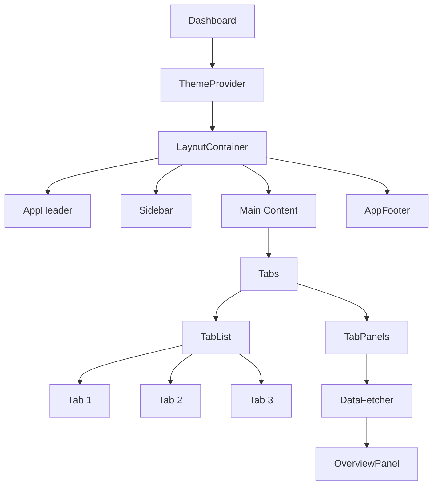

# Vue.js UI Patterns

## Introduction

UI patterns are reusable solutions to common design problems that appear across many applications. In Vue.js, these patterns can be implemented through components, directives, and composable functions to create maintainable and consistent user interfaces.

In this guide, we'll explore several essential UI patterns that will help you build better Vue applications. These patterns solve common problems like managing component communication, creating reusable layouts, and implementing dynamic interfaces.

## Why UI Patterns Matter

Before diving into specific patterns, let's understand why UI patterns are important:

1. **Consistency** - They provide a unified approach to solving common problems
2. **Reusability** - Well-implemented patterns can be reused across projects
3. **Maintainability** - Following established patterns makes code easier to understand and update
4. **Developer Experience** - Patterns create shared vocabulary and concepts among team members

## Common Vue.js UI Patterns

### 1. Container/Presentational Pattern

This pattern separates components into two categories:

- **Container components**: Handle data fetching, state management, and business logic
- **Presentational components**: Focus on rendering UI and are driven by props

#### Example Implementation

```html
<!-- Container Component (UserContainer.vue) -->
<template>
  <user-profile 
    :user="user" 
    :loading="loading" 
    :error="error"
    @update="updateUser" />
</template>

<script>
import { ref, onMounted } from 'vue'
import UserProfile from './UserProfile.vue'

export default {
  components: { UserProfile },
  setup() {
    const user = ref(null)
    const loading = ref(true)
    const error = ref(null)

    const fetchUser = async () => {
      try {
        loading.value = true
        // Simulate API call
        const response = await fetch('/api/user/1')
        user.value = await response.json()
      } catch (err) {
        error.value = 'Failed to load user'
      } finally {
        loading.value = false
      }
    }

    const updateUser = async (userData) => {
      // Logic to update user
    }

    onMounted(() => {
      fetchUser()
    })

    return { user, loading, error, updateUser }
  }
}
</script>
```

```html
<!-- Presentational Component (UserProfile.vue) -->
<template>
  <div class="user-profile">
    <div v-if="loading" class="loading">Loading...</div>
    <div v-else-if="error" class="error">{{ error }}</div>
    <div v-else class="user-details">
      <h2>{{ user.name }}</h2>
      <p>{{ user.email }}</p>
      <button @click="$emit('update', user)">Edit Profile</button>
    </div>
  </div>
</template>

<script>
export default {
  props: {
    user: Object,
    loading: Boolean,
    error: String
  },
  emits: ['update']
}
</script>
```

**Benefits:**
- Separation of concerns
- Improved testability
- Better component reusability
- Clearer data flow

### 2. Compound Components Pattern

This pattern creates a group of components that work together to provide a cohesive experience, with a parent component managing the shared state.

#### Example Implementation

```html
<!-- Parent Component (Tabs.vue) -->
<template>
  <div class="tabs">
    <slot :selectedTab="selectedTab" :selectTab="selectTab"></slot>
  </div>
</template>

<script>
import { ref, provide } from 'vue'

export default {
  setup() {
    const selectedTab = ref(0)
    
    const selectTab = (index) => {
      selectedTab.value = index
    }
    
    provide('tabs', {
      selectedTab,
      selectTab
    })
    
    return { selectedTab, selectTab }
  }
}
</script>
```

```html
<!-- Child Component (TabList.vue) -->
<template>
  <div class="tab-list">
    <slot></slot>
  </div>
</template>
```

```html
<!-- Child Component (Tab.vue) -->
<template>
  <button 
    class="tab" 
    :class="{ active: isActive }"
    @click="select">
    <slot></slot>
  </button>
</template>

<script>
import { inject, computed } from 'vue'

export default {
  props: {
    index: {
      type: Number,
      required: true
    }
  },
  setup(props) {
    const { selectedTab, selectTab } = inject('tabs')
    
    const isActive = computed(() => selectedTab.value === props.index)
    
    const select = () => selectTab(props.index)
    
    return { isActive, select }
  }
}
</script>
```

```html
<!-- Child Component (TabPanel.vue) -->
<template>
  <div v-if="isActive" class="tab-panel">
    <slot></slot>
  </div>
</template>

<script>
import { inject, computed } from 'vue'

export default {
  props: {
    index: {
      type: Number,
      required: true
    }
  },
  setup(props) {
    const { selectedTab } = inject('tabs')
    
    const isActive = computed(() => selectedTab.value === props.index)
    
    return { isActive }
  }
}
</script>
```

**Usage Example:**

```html
<template>
  <Tabs>
    <template v-slot="{ selectedTab, selectTab }">
      <TabList>
        <Tab :index="0">Profile</Tab>
        <Tab :index="1">Settings</Tab>
        <Tab :index="2">Notifications</Tab>
      </TabList>
      
      <TabPanel :index="0">
        Profile content here
      </TabPanel>
      <TabPanel :index="1">
        Settings content here
      </TabPanel>
      <TabPanel :index="2">
        Notifications content here
      </TabPanel>
    </template>
  </Tabs>
</template>

<script>
import Tabs from './Tabs.vue'
import TabList from './TabList.vue'
import Tab from './Tab.vue'
import TabPanel from './TabPanel.vue'

export default {
  components: {
    Tabs,
    TabList,
    Tab,
    TabPanel
  }
}
</script>
```

**Benefits:**
- Flexible component composition
- Encapsulated state management
- Clean, declarative API
- Customizable subcomponents

### 3. Render Props Pattern

This pattern allows components to share code by passing a function as a prop that returns a VNode or reactive data.

#### Example Implementation

```html
<!-- DataFetcher.vue -->
<template>
  <slot 
    :data="data" 
    :loading="loading" 
    :error="error" 
    :refetch="fetchData"
  ></slot>
</template>

<script>
import { ref, onMounted } from 'vue'

export default {
  props: {
    url: {
      type: String,
      required: true
    }
  },
  setup(props) {
    const data = ref(null)
    const loading = ref(false)
    const error = ref(null)

    const fetchData = async () => {
      loading.value = true
      error.value = null
      
      try {
        const response = await fetch(props.url)
        if (!response.ok) {
          throw new Error('Network response was not ok')
        }
        data.value = await response.json()
      } catch (err) {
        error.value = err.message
      } finally {
        loading.value = false
      }
    }

    onMounted(() => {
      fetchData()
    })

    return { data, loading, error, fetchData }
  }
}
</script>
```

**Usage Example:**

```html
<template>
  <div>
    <h1>User Data</h1>
    
    <DataFetcher url="/api/users">
      <template v-slot="{ data, loading, error, refetch }">
        <div v-if="loading">Loading...</div>
        <div v-else-if="error" class="error">Error: {{ error }}</div>
        <div v-else-if="data">
          <ul>
            <li v-for="user in data" :key="user.id">
              {{ user.name }}
            </li>
          </ul>
          <button @click="refetch">Refresh</button>
        </div>
      </template>
    </DataFetcher>
  </div>
</template>

<script>
import DataFetcher from './DataFetcher.vue'

export default {
  components: {
    DataFetcher
  }
}
</script>
```

**Benefits:**
- Reusable logic across components
- Flexible rendering control
- Separation of concerns
- Reduced code duplication

### 4. Provider Pattern

This pattern uses Vue's dependency injection (`provide` and `inject`) to share data across components without prop drilling.

#### Example Implementation

```html
<!-- ThemeProvider.vue -->
<template>
  <div :class="currentTheme">
    <slot></slot>
  </div>
</template>

<script>
import { ref, provide, computed } from 'vue'

export default {
  props: {
    initialTheme: {
      type: String,
      default: 'light'
    }
  },
  setup(props) {
    const theme = ref(props.initialTheme)
    
    const toggleTheme = () => {
      theme.value = theme.value === 'light' ? 'dark' : 'light'
    }
    
    const currentTheme = computed(() => `theme-${theme.value}`)
    
    // Provide theme context to descendant components
    provide('theme', {
      theme,
      toggleTheme
    })
    
    return { currentTheme }
  }
}
</script>
```

```html
<!-- ThemeConsumer.vue -->
<template>
  <div>
    <p>Current theme: {{ theme }}</p>
    <button @click="toggleTheme">Toggle Theme</button>
  </div>
</template>

<script>
import { inject } from 'vue'

export default {
  setup() {
    // Inject theme from nearest provider
    const { theme, toggleTheme } = inject('theme')
    
    return { theme, toggleTheme }
  }
}
</script>
```

**Usage Example:**

```html
<template>
  <ThemeProvider>
    <h1>My App</h1>
    <ThemeConsumer />
    <div>
      <p>Some content here</p>
      <AnotherComponent />
    </div>
  </ThemeProvider>
</template>

<script>
import ThemeProvider from './ThemeProvider.vue'
import ThemeConsumer from './ThemeConsumer.vue'
import AnotherComponent from './AnotherComponent.vue'

export default {
  components: {
    ThemeProvider,
    ThemeConsumer,
    AnotherComponent
  }
}
</script>

<style>
.theme-light {
  background-color: #fff;
  color: #333;
}

.theme-dark {
  background-color: #333;
  color: #fff;
}
</style>
```

**Benefits:**
- Avoids prop drilling
- Centralized state management
- Flexible component composition
- Improves component reusability

### 5. Higher-Order Component (HOC) Pattern

Higher-Order Components wrap and enhance existing components with additional functionality.

#### Example Implementation

```js
// withLogging.js
import { h } from 'vue'

export function withLogging(Component) {
  return {
    props: Component.props,
    setup(props, { slots, attrs, emit }) {
      console.log('Component props:', props)
      
      // Called when component is mounted
      const onMounted = () => {
        console.log('Component mounted:', Component.name)
      }
      
      // Called before component is unmounted
      const onUnmounted = () => {
        console.log('Component will unmount:', Component.name)
      }
      
      return () => h(Component, { ...props, ...attrs, onMounted, onUnmounted }, slots)
    }
  }
}
```

**Usage Example:**

```html
<script>
import BaseButton from './BaseButton.vue'
import { withLogging } from './withLogging'

const EnhancedButton = withLogging(BaseButton)

export default {
  components: {
    EnhancedButton
  }
}
</script>

<template>
  <div>
    <EnhancedButton @click="handleClick">
      Click Me!
    </EnhancedButton>
  </div>
</template>
```

**Benefits:**
- Code reuse across components
- Separation of cross-cutting concerns
- Non-intrusive component enhancement
- Composition-based feature extension

## Real-World Application: Building a Component Library

Let's put these patterns together to build a small component library for a dashboard application.

```html
<!-- Dashboard.vue -->
<template>
  <ThemeProvider>
    <LayoutContainer>
      <template #header>
        <AppHeader />
      </template>
      
      <template #sidebar>
        <Sidebar />
      </template>
      
      <template #main>
        <Tabs>
          <template v-slot="{ selectedTab }">
            <TabList>
              <Tab :index="0">Overview</Tab>
              <Tab :index="1">Analytics</Tab>
              <Tab :index="2">Settings</Tab>
            </TabList>
            
            <TabPanel :index="0">
              <DataFetcher url="/api/dashboard/overview">
                <template v-slot="{ data, loading, error, refetch }">
                  <LoadingState v-if="loading" />
                  <ErrorState v-else-if="error" :message="error" />
                  <OverviewPanel v-else :data="data" @refresh="refetch" />
                </template>
              </DataFetcher>
            </TabPanel>
            
            <TabPanel :index="1">
              <AnalyticsPanel />
            </TabPanel>
            
            <TabPanel :index="2">
              <SettingsPanel />
            </TabPanel>
          </template>
        </Tabs>
      </template>
      
      <template #footer>
        <AppFooter />
      </template>
    </LayoutContainer>
  </ThemeProvider>
</template>

<script>
// Import all necessary components...

export default {
  components: {
    // Register all components...
  }
}
</script>
```

This example demonstrates how different UI patterns work together to create a maintainable dashboard:

1. **Provider Pattern** - `ThemeProvider` manages theme state for all components
2. **Compound Components** - `Tabs`, `TabList`, `Tab`, and `TabPanel` work together
3. **Container/Presentational** - `DataFetcher` separates data loading from presentation
4. **Render Props** - Content rendering is controlled by consumers via slots
5. **Layout Components** - `LayoutContainer` provides structure with named slots

## Visualizing Component Relationships



## Best Practices for UI Patterns

1. **Choose the right pattern for the problem**
   - Don't overcomplicate simple solutions
   - Consider maintainability and reusability

2. **Document component APIs**
   - Clearly define props, events, and slots
   - Provide usage examples

3. **Keep components focused**
   - Follow single responsibility principle
   - Avoid components that do too much

4. **Test components separately**
   - Write unit tests for each component
   - Test interaction between related components

5. **Create consistent interfaces**
   - Use similar prop names across components
   - Follow a naming convention

## Summary

In this guide, we've explored several powerful UI patterns in Vue.js:

- **Container/Presentational Pattern** - Separates data management from UI rendering
- **Compound Components** - Creates cohesive component groups that work together
- **Render Props** - Shares code through function props that control rendering
- **Provider Pattern** - Uses dependency injection for cross-component state sharing
- **Higher-Order Component Pattern** - Enhances components with additional functionality

These patterns provide reusable solutions to common UI problems and help you build more maintainable Vue applications. By understanding and applying these patterns, you'll become more efficient at building robust user interfaces.

## Exercises

1. Convert an existing component into a container/presentational pattern
2. Build a dropdown menu using the compound components pattern
3. Implement a theme switcher using the provider pattern
4. Create a data loading component with the render props pattern
5. Write a higher-order component that adds form validation

## Additional Resources

- [Vue.js Documentation](https://vuejs.org/guide/introduction.html)
- [Vue Composition API Reference](https://vuejs.org/api/composition-api-setup.html)
- [Component Design Patterns](https://vuejs.org/guide/reusability/composables.html)
- [Best Practices for Component Design](https://www.patterns.dev)

By mastering these UI patterns, you'll be able to solve complex UI challenges with elegant, reusable solutions in your Vue.js applications.