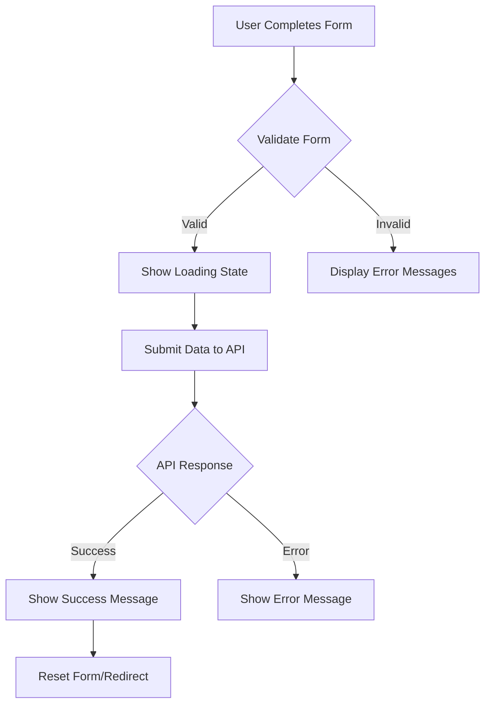

# Vue.js Form Components

## Introduction

Forms are a fundamental part of web applications, allowing users to input data and interact with your application. Vue.js offers powerful tools for building form components that are both functional and user-friendly. In this tutorial, we'll explore how to create reusable form components in Vue.js, implement validation, and structure complex forms.

By the end of this tutorial, you'll be able to:
- Create custom form components
- Implement form validation
- Handle form submission
- Structure complex forms using Vue components

## Basic Form Binding in Vue

Vue's two-way data binding makes handling form inputs straightforward using the `v-model` directive. This creates a connection between form inputs and your application data.

### Simple Input Binding

Let's start with a basic example:

```html
<template>
  <div>
    <label for="username">Username:</label>
    <input 
      id="username" 
      v-model="username" 
      type="text" 
    />
    <p>Your username is: {{ username }}</p>
  </div>
</template>

<script>
export default {
  data() {
    return {
      username: ''
    }
  }
}
</script>
```

In this example, the value of the `username` input is automatically synchronized with the `username` property in our component's data.

## Creating Custom Form Components

As applications grow, it's beneficial to create reusable form components. Let's create a custom text input component:

```html
<!-- TextInput.vue -->
<template>
  <div class="form-group">
    <label v-if="label" :for="id">{{ label }}</label>
    <input
      :id="id"
      :type="type"
      :value="modelValue"
      @input="$emit('update:modelValue', $event.target.value)"
      class="form-control"
      :placeholder="placeholder"
      :required="required"
    />
    <small v-if="error" class="error-text">{{ error }}</small>
  </div>
</template>

<script>
export default {
  name: 'TextInput',
  props: {
    modelValue: {
      type: [String, Number],
      default: ''
    },
    label: {
      type: String,
      default: ''
    },
    id: {
      type: String,
      required: true
    },
    type: {
      type: String,
      default: 'text'
    },
    placeholder: {
      type: String,
      default: ''
    },
    required: {
      type: Boolean,
      default: false
    },
    error: {
      type: String,
      default: ''
    }
  }
}
</script>

<style scoped>
.form-group {
  margin-bottom: 1rem;
}
.form-control {
  width: 100%;
  padding: 0.5rem;
  font-size: 1rem;
  border: 1px solid #ccc;
  border-radius: 4px;
}
.error-text {
  color: red;
  font-size: 0.8rem;
  margin-top: 0.25rem;
  display: block;
}
</style>
```

Now we can use this component in a parent form:

```html
<template>
  <form @submit.prevent="submitForm">
    <TextInput
      id="first-name"
      v-model="form.firstName"
      label="First Name"
      required
      :error="errors.firstName"
    />
    <TextInput
      id="email"
      v-model="form.email"
      label="Email"
      type="email"
      required
      :error="errors.email"
    />
    <button type="submit">Submit</button>
  </form>
</template>

<script>
import TextInput from './TextInput.vue'

export default {
  components: {
    TextInput
  },
  data() {
    return {
      form: {
        firstName: '',
        email: ''
      },
      errors: {
        firstName: '',
        email: ''
      }
    }
  },
  methods: {
    submitForm() {
      // Validate form
      this.validateForm()
      
      // Submit if no errors
      if (!Object.values(this.errors).some(error => error)) {
        console.log('Form submitted:', this.form)
        // API call would go here
      }
    },
    validateForm() {
      // Reset errors
      this.errors = {
        firstName: '',
        email: ''
      }
      
      // Validate first name
      if (!this.form.firstName) {
        this.errors.firstName = 'First name is required'
      }
      
      // Validate email
      if (!this.form.email) {
        this.errors.email = 'Email is required'
      } else if (!this.isValidEmail(this.form.email)) {
        this.errors.email = 'Please enter a valid email'
      }
    },
    isValidEmail(email) {
      return /^[^\s@]+@[^\s@]+\.[^\s@]+$/.test(email)
    }
  }
}
</script>
```

## Form Component Types

Let's explore various form components you can create in Vue:

### Checkbox Component

```html
<!-- CheckBox.vue -->
<template>
  <div class="checkbox-group">
    <label class="checkbox-container">
      <input
        type="checkbox"
        :checked="modelValue"
        @change="$emit('update:modelValue', $event.target.checked)"
      />
      <span class="label-text">{{ label }}</span>
    </label>
    <small v-if="error" class="error-text">{{ error }}</small>
  </div>
</template>

<script>
export default {
  name: 'CheckBox',
  props: {
    modelValue: {
      type: Boolean,
      default: false
    },
    label: {
      type: String,
      required: true
    },
    error: {
      type: String,
      default: ''
    }
  }
}
</script>

<style scoped>
.checkbox-group {
  margin-bottom: 1rem;
}
.checkbox-container {
  display: flex;
  align-items: center;
}
.label-text {
  margin-left: 0.5rem;
}
.error-text {
  color: red;
  font-size: 0.8rem;
  margin-top: 0.25rem;
  display: block;
}
</style>
```

### Select Dropdown Component

```html
<!-- SelectInput.vue -->
<template>
  <div class="form-group">
    <label v-if="label" :for="id">{{ label }}</label>
    <select
      :id="id"
      :value="modelValue"
      @change="$emit('update:modelValue', $event.target.value)"
      class="form-control"
      :required="required"
    >
      <option v-if="placeholder" value="" disabled selected>
        {{ placeholder }}
      </option>
      <option
        v-for="option in options"
        :key="option.value"
        :value="option.value"
      >
        {{ option.label }}
      </option>
    </select>
    <small v-if="error" class="error-text">{{ error }}</small>
  </div>
</template>

<script>
export default {
  name: 'SelectInput',
  props: {
    modelValue: {
      type: [String, Number],
      default: ''
    },
    options: {
      type: Array,
      required: true
      // Each option should have: { value: 'value', label: 'Label' }
    },
    label: {
      type: String,
      default: ''
    },
    id: {
      type: String,
      required: true
    },
    placeholder: {
      type: String,
      default: 'Select an option'
    },
    required: {
      type: Boolean,
      default: false
    },
    error: {
      type: String,
      default: ''
    }
  }
}
</script>
```

## Implementing Form Validation

Vue doesn't include form validation out of the box, but we can implement it ourselves or use libraries like Vuelidate or VeeValidate. Let's examine a simple custom validation approach:

```html
<template>
  <form @submit.prevent="submitForm">
    <TextInput
      id="username"
      v-model="form.username"
      label="Username"
      :error="errors.username"
    />
    <TextInput
      id="password"
      v-model="form.password"
      label="Password"
      type="password"
      :error="errors.password"
    />
    <button type="submit" :disabled="isSubmitting">
      {{ isSubmitting ? 'Submitting...' : 'Submit' }}
    </button>
    
    <div v-if="submitSuccess" class="success-message">
      Form submitted successfully!
    </div>
  </form>
</template>

<script>
import TextInput from './TextInput.vue'

export default {
  components: {
    TextInput
  },
  data() {
    return {
      form: {
        username: '',
        password: ''
      },
      errors: {
        username: '',
        password: ''
      },
      isSubmitting: false,
      submitSuccess: false
    }
  },
  methods: {
    validateForm() {
      let isValid = true
      this.errors = {
        username: '',
        password: ''
      }
      
      // Username validation
      if (!this.form.username) {
        this.errors.username = 'Username is required'
        isValid = false
      } else if (this.form.username.length < 3) {
        this.errors.username = 'Username must be at least 3 characters'
        isValid = false
      }
      
      // Password validation
      if (!this.form.password) {
        this.errors.password = 'Password is required'
        isValid = false
      } else if (this.form.password.length < 6) {
        this.errors.password = 'Password must be at least 6 characters'
        isValid = false
      }
      
      return isValid
    },
    
    async submitForm() {
      if (!this.validateForm()) return
      
      this.isSubmitting = true
      
      try {
        // Simulate API call
        await new Promise(resolve => setTimeout(resolve, 1000))
        
        console.log('Form submitted:', this.form)
        this.submitSuccess = true
        
        // Reset form after submission
        this.form = {
          username: '',
          password: ''
        }
      } catch (error) {
        console.error('Submission error:', error)
      } finally {
        this.isSubmitting = false
      }
    }
  }
}
</script>

<style scoped>
.success-message {
  color: green;
  margin-top: 1rem;
  padding: 0.5rem;
  background-color: #e8f5e9;
  border-radius: 4px;
}
</style>
```

## Building a Complete Registration Form

Let's combine everything we've learned to create a comprehensive registration form:

```html
<template>
  <div class="registration-container">
    <h2>Create an Account</h2>
    
    <form @submit.prevent="submitForm" novalidate>
      <div class="form-row">
        <TextInput
          id="first-name"
          v-model="form.firstName"
          label="First Name"
          required
          :error="errors.firstName"
        />
        
        <TextInput
          id="last-name"
          v-model="form.lastName"
          label="Last Name"
          required
          :error="errors.lastName"
        />
      </div>
      
      <TextInput
        id="email"
        v-model="form.email"
        label="Email"
        type="email"
        required
        :error="errors.email"
      />
      
      <TextInput
        id="password"
        v-model="form.password"
        label="Password"
        type="password"
        required
        :error="errors.password"
      />
      
      <SelectInput
        id="country"
        v-model="form.country"
        label="Country"
        :options="countries"
        required
        :error="errors.country"
      />
      
      <CheckBox
        v-model="form.agreeTerms"
        label="I agree to the Terms and Conditions"
        :error="errors.agreeTerms"
      />
      
      <button type="submit" :disabled="isSubmitting" class="submit-btn">
        {{ isSubmitting ? 'Creating Account...' : 'Create Account' }}
      </button>
      
      <div v-if="submitSuccess" class="success-message">
        Account created successfully!
      </div>
    </form>
  </div>
</template>

<script>
import TextInput from './TextInput.vue'
import SelectInput from './SelectInput.vue'
import CheckBox from './CheckBox.vue'

export default {
  components: {
    TextInput,
    SelectInput,
    CheckBox
  },
  data() {
    return {
      form: {
        firstName: '',
        lastName: '',
        email: '',
        password: '',
        country: '',
        agreeTerms: false
      },
      errors: {
        firstName: '',
        lastName: '',
        email: '',
        password: '',
        country: '',
        agreeTerms: ''
      },
      countries: [
        { value: 'us', label: 'United States' },
        { value: 'ca', label: 'Canada' },
        { value: 'uk', label: 'United Kingdom' },
        { value: 'au', label: 'Australia' }
      ],
      isSubmitting: false,
      submitSuccess: false
    }
  },
  methods: {
    validateForm() {
      let isValid = true
      this.errors = {
        firstName: '',
        lastName: '',
        email: '',
        password: '',
        country: '',
        agreeTerms: ''
      }
      
      // First name validation
      if (!this.form.firstName.trim()) {
        this.errors.firstName = 'First name is required'
        isValid = false
      }
      
      // Last name validation
      if (!this.form.lastName.trim()) {
        this.errors.lastName = 'Last name is required'
        isValid = false
      }
      
      // Email validation
      if (!this.form.email) {
        this.errors.email = 'Email is required'
        isValid = false
      } else if (!this.isValidEmail(this.form.email)) {
        this.errors.email = 'Please enter a valid email'
        isValid = false
      }
      
      // Password validation
      if (!this.form.password) {
        this.errors.password = 'Password is required'
        isValid = false
      } else if (this.form.password.length < 8) {
        this.errors.password = 'Password must be at least 8 characters'
        isValid = false
      }
      
      // Country validation
      if (!this.form.country) {
        this.errors.country = 'Please select a country'
        isValid = false
      }
      
      // Terms agreement validation
      if (!this.form.agreeTerms) {
        this.errors.agreeTerms = 'You must agree to the Terms and Conditions'
        isValid = false
      }
      
      return isValid
    },
    
    isValidEmail(email) {
      return /^[^\s@]+@[^\s@]+\.[^\s@]+$/.test(email)
    },
    
    async submitForm() {
      if (!this.validateForm()) return
      
      this.isSubmitting = true
      
      try {
        // Simulate API call
        await new Promise(resolve => setTimeout(resolve, 1500))
        
        console.log('Registration form submitted:', this.form)
        this.submitSuccess = true
        
        // Reset form after successful submission
        this.form = {
          firstName: '',
          lastName: '',
          email: '',
          password: '',
          country: '',
          agreeTerms: false
        }
      } catch (error) {
        console.error('Registration error:', error)
      } finally {
        this.isSubmitting = false
      }
    }
  }
}
</script>

<style scoped>
.registration-container {
  max-width: 600px;
  margin: 0 auto;
  padding: 2rem;
  border: 1px solid #e1e1e1;
  border-radius: 8px;
  background-color: #f9f9f9;
}

.form-row {
  display: flex;
  gap: 1rem;
}

.form-row > * {
  flex: 1;
}

.submit-btn {
  width: 100%;
  padding: 0.75rem;
  background-color: #4caf50;
  color: white;
  border: none;
  border-radius: 4px;
  font-size: 1rem;
  cursor: pointer;
  margin-top: 1rem;
}

.submit-btn:hover {
  background-color: #45a049;
}

.submit-btn:disabled {
  background-color: #cccccc;
  cursor: not-allowed;
}

.success-message {
  margin-top: 1rem;
  padding: 0.75rem;
  background-color: #e8f5e9;
  color: #2e7d32;
  border-radius: 4px;
  text-align: center;
}
</style>
```

## Form Submission Flow

Understanding the flow of form submission is important. Here's a visualization:



## Best Practices for Vue Form Components

1. **Keep Components Focused:** Each form component should do one thing well.

2. **Consistent Prop Naming:** Use consistent naming conventions for props across all components.

3. **Handle Validation Properly:** Decide between client-side or server-side validation based on your needs.

4. **Feedback to Users:** Always provide feedback on form submission status.

5. **Accessibility:** Ensure your forms are accessible with proper labels, aria attributes, and keyboard navigation.

6. **Error Handling:** Have clear error states and messages.

7. **Loading States:** Show loading indicators during form submission to provide visual feedback.

```html
<button type="submit" :disabled="isSubmitting">
  <span v-if="isSubmitting" class="spinner"></span>
  {{ isSubmitting ? 'Submitting...' : 'Submit' }}
</button>
```

8. **Use Computed Properties:** Leverage computed properties for derived form values and validation.

```html
<script>
export default {
  // ...
  computed: {
    isFormValid() {
      return (
        this.form.firstName && 
        this.form.lastName && 
        this.isValidEmail(this.form.email) && 
        this.form.password.length >= 8 &&
        this.form.country &&
        this.form.agreeTerms
      )
    }
  }
  // ...
}
</script>
```

## Summary

In this tutorial, we've learned how to create robust form components in Vue.js:

1. We started with basic form binding using `v-model`
2. We created reusable form components such as text inputs, checkboxes, and select dropdowns
3. We implemented form validation with detailed error messages
4. We built a complete registration form combining multiple components
5. We discussed best practices for creating and managing form components

Vue's reactivity system and component architecture make it an excellent choice for building interactive forms. By creating reusable form components, you can maintain consistency across your application while keeping your code DRY (Don't Repeat Yourself).

## Additional Resources

- [Vue.js Official Documentation on Forms](https://vuejs.org/guide/essentials/forms.html)
- [Vuelidate](https://vuelidate.js.org/) - A simple, lightweight model-based validation for Vue.js
- [VeeValidate](https://vee-validate.logaretm.com/v4/) - Template Based Form Validation Framework for Vue.js

## Exercises

1. Create a login form component using the techniques learned in this tutorial.
2. Add custom validation for a phone number input component.
3. Create a multi-step form with navigation between steps.
4. Implement form data persistence using local storage so users can continue later.
5. Create a dynamic form component that can render different form fields based on a JSON configuration.

These exercises will reinforce your understanding of Vue.js form components and help you apply these concepts to real-world scenarios.