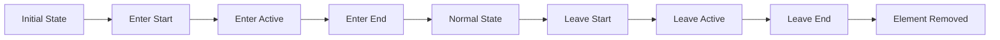

# Vue.js Transitions

## Introduction

Transitions and animations are essential aspects of modern web applications, providing visual feedback, improving user experience, and guiding users through interface changes. Vue.js offers a powerful set of tools for implementing transitions that are both elegant and performant.

In this tutorial, we'll explore Vue's transition system, starting with basic CSS transitions and advancing to more complex animated interactions. By the end, you'll be able to create fluid, engaging user experiences that make your applications stand out.

## Understanding Vue Transitions Basics

Vue provides a wrapper component called `<Transition>` that allows you to add entering/leaving transitions for elements or components in the following contexts:

- Conditional rendering (using `v-if`)
- Conditional display (using `v-show`)
- Dynamic components
- Component root nodes

### How Vue Transitions Work

When an element wrapped in a `<Transition>` component is inserted or removed from the DOM, Vue will:

1. Automatically detect if the target element has CSS transitions or animations applied
2. Add/remove appropriate CSS classes at specific timing points
3. Execute JavaScript hooks if provided
4. Perform the DOM insertion/removal operation at the appropriate time

Here's a visual representation of the transition flow:



## Basic CSS Transitions

Let's start with a simple example of a fade transition on an element.

### Example 1: Basic Fade Transition

```html
<template>
  <div>
    <button @click="show = !show">Toggle</button>
    
    <Transition name="fade">
      <p v-if="show">Hello Vue Transitions!</p>
    </Transition>
  </div>
</template>

<script>
export default {
  data() {
    return {
      show: true
    }
  }
}
</script>

<style>
.fade-enter-active,
.fade-leave-active {
  transition: opacity 0.5s ease;
}

.fade-enter-from,
.fade-leave-to {
  opacity: 0;
}
</style>
```

When you click the toggle button, the paragraph will fade in or out smoothly instead of appearing or disappearing instantly.

### CSS Transition Classes

Vue applies six different CSS classes during transitions:

1. `v-enter-from`: Starting state for enter. Added before element is inserted, removed one frame after.
2. `v-enter-active`: Active state for enter. Applied during the entire entering phase. Added before element is inserted, removed when transition/animation finishes.
3. `v-enter-to`: Ending state for enter. Added one frame after element is inserted, removed when transition/animation finishes.
4. `v-leave-from`: Starting state for leave. Added immediately when a leaving transition is triggered, removed after one frame.
5. `v-leave-active`: Active state for leave. Applied during the entire leaving phase.
6. `v-leave-to`: Ending state for leave. Added one frame after a leaving transition is triggered, removed when the transition/animation finishes.

The `v-` prefix is replaced by the `name` attribute of the `<Transition>` component. In our example, `v-` is replaced with `fade-`.

## Custom Transition Classes

You can customize transitions further by providing specific class names:

```html
<template>
  <Transition
    enter-active-class="animate__animated animate__fadeIn"
    leave-active-class="animate__animated animate__fadeOut"
  >
    <p v-if="show">Hello Vue Transitions!</p>
  </Transition>
</template>
```

This is particularly useful when you want to integrate with CSS animation libraries like Animate.css.

## Multiple Elements Transition

### Example 2: Toggling Between Elements

```html
<template>
  <div>
    <button @click="toggle">Toggle</button>
    
    <Transition name="slide-fade" mode="out-in">
      <p v-if="showFirst" key="first">First Content</p>
      <p v-else key="second">Second Content</p>
    </Transition>
  </div>
</template>

<script>
export default {
  data() {
    return {
      showFirst: true
    }
  },
  methods: {
    toggle() {
      this.showFirst = !this.showFirst
    }
  }
}
</script>

<style>
.slide-fade-enter-active, 
.slide-fade-leave-active {
  transition: all 0.3s ease;
}

.slide-fade-enter-from {
  transform: translateX(20px);
  opacity: 0;
}

.slide-fade-leave-to {
  transform: translateX(-20px);
  opacity: 0;
}
</style>
```

### Transition Modes

In the example above, we used `mode="out-in"`, which means the current element transitions out first, then the new element transitions in. Vue offers three transition modes:

- `default`: Enter and leave transitions happen simultaneously
- `out-in`: Current element transitions out first, then new element transitions in
- `in-out`: New element transitions in first, then current element transitions out

## JavaScript Hooks

For complex animations or transitions that can't be achieved with CSS, Vue provides JavaScript hooks:

```html
<template>
  <Transition
    @before-enter="beforeEnter"
    @enter="enter"
    @after-enter="afterEnter"
    @enter-cancelled="enterCancelled"
    @before-leave="beforeLeave"
    @leave="leave"
    @after-leave="afterLeave"
    @leave-cancelled="leaveCancelled"
  >
    <p v-if="show">Hello JavaScript Hooks</p>
  </Transition>
</template>

<script>
export default {
  data() {
    return {
      show: true
    }
  },
  methods: {
    beforeEnter(el) {
      // element is about to be inserted
      el.style.opacity = 0
      el.style.height = '0px'
    },
    enter(el, done) {
      // element has been inserted
      gsap.to(el, {
        opacity: 1,
        height: '1.5em',
        onComplete: done
      })
    },
    afterEnter(el) {
      // transition has finished
      console.log('Transition completed!')
    },
    // similar hooks for leaving...
    beforeLeave(el) {
      el.style.opacity = 1
    },
    leave(el, done) {
      gsap.to(el, {
        opacity: 0,
        height: 0,
        onComplete: done
      })
    },
    afterLeave(el) {
      console.log('Left the scene!')
    }
  }
}
</script>
```

This example demonstrates integration with GreenSock Animation Platform (GSAP), a powerful JavaScript animation library.

## List Transitions

For rendering lists, Vue provides the `<TransitionGroup>` component:

### Example 3: Animated List

```html
<template>
  <div>
    <button @click="addItem">Add Item</button>
    <button @click="removeItem">Remove Item</button>
    
    <TransitionGroup name="list" tag="ul">
      <li v-for="(item, index) in items" :key="item">
        {{ item }} - {{ index }}
      </li>
    </TransitionGroup>
  </div>
</template>

<script>
export default {
  data() {
    return {
      items: [1, 2, 3, 4, 5],
      nextNum: 6
    }
  },
  methods: {
    addItem() {
      this.items.splice(
        Math.floor(Math.random() * (this.items.length + 1)), 
        0, 
        this.nextNum++
      )
    },
    removeItem() {
      if (this.items.length) {
        const index = Math.floor(Math.random() * this.items.length)
        this.items.splice(index, 1)
      }
    }
  }
}
</script>

<style>
.list-enter-active,
.list-leave-active {
  transition: all 0.5s ease;
}

.list-enter-from,
.list-leave-to {
  opacity: 0;
  transform: translateX(30px);
}

.list-move {
  transition: transform 0.5s ease;
}
</style>
```

The special `.list-move` class is added when items are changing positions. This creates a smooth movement animation when items are reordered.

## Real-World Example: Modal Dialog

Let's create a reusable modal component with transitions:

```html
<template>
  <Transition name="modal">
    <div v-if="show" class="modal-mask">
      <div class="modal-container">
        <div class="modal-header">
          <slot name="header">Default Header</slot>
        </div>
        
        <div class="modal-body">
          <slot>Default body content</slot>
        </div>
        
        <div class="modal-footer">
          <slot name="footer">
            <button class="modal-button" @click="$emit('close')">Close</button>
          </slot>
        </div>
      </div>
    </div>
  </Transition>
</template>

<script>
export default {
  props: {
    show: {
      type: Boolean,
      default: false
    }
  }
}
</script>

<style scoped>
.modal-mask {
  position: fixed;
  z-index: 9998;
  top: 0;
  left: 0;
  width: 100%;
  height: 100%;
  background-color: rgba(0, 0, 0, 0.5);
  display: flex;
  align-items: center;
  justify-content: center;
}

.modal-container {
  width: 300px;
  padding: 20px 30px;
  background-color: #fff;
  border-radius: 2px;
  box-shadow: 0 2px 8px rgba(0, 0, 0, 0.33);
}

.modal-header {
  margin-top: 0;
  font-weight: bold;
}

.modal-body {
  margin: 20px 0;
}

.modal-footer {
  text-align: right;
}

.modal-button {
  padding: 8px 16px;
  background-color: #4CAF50;
  color: white;
  border: none;
  border-radius: 4px;
  cursor: pointer;
}

.modal-enter-active,
.modal-leave-active {
  transition: opacity 0.3s ease;
}

.modal-enter-from,
.modal-leave-to {
  opacity: 0;
}
</style>
```

Usage:

```html
<template>
  <div>
    <button @click="showModal = true">Open Modal</button>
    
    <Modal :show="showModal" @close="showModal = false">
      <template #header>
        <h3>Custom Header</h3>
      </template>
      
      <p>This is a modal with custom content and animations!</p>
      
      <template #footer>
        <button @click="showModal = false">Cancel</button>
        <button @click="confirmAction">Confirm</button>
      </template>
    </Modal>
  </div>
</template>

<script>
import Modal from './Modal.vue'

export default {
  components: {
    Modal
  },
  data() {
    return {
      showModal: false
    }
  },
  methods: {
    confirmAction() {
      // Handle confirmation
      console.log('Action confirmed!')
      this.showModal = false
    }
  }
}
</script>
```

## Advanced Techniques

### Staggered Transitions

Staggering transitions can create visually appealing effects, especially for lists:

```html
<template>
  <TransitionGroup
    tag="ul"
    :css="false"
    @before-enter="beforeEnter"
    @enter="enter"
    @leave="leave"
  >
    <li
      v-for="(item, index) in items"
      :key="item.id"
      :data-index="index"
    >
      {{ item.text }}
    </li>
  </TransitionGroup>
</template>

<script>
import gsap from 'gsap'

export default {
  data() {
    return {
      items: [
        { id: 1, text: 'Item 1' },
        { id: 2, text: 'Item 2' },
        { id: 3, text: 'Item 3' }
      ]
    }
  },
  methods: {
    beforeEnter(el) {
      el.style.opacity = 0
      el.style.height = 0
    },
    enter(el, done) {
      gsap.to(el, {
        opacity: 1,
        height: '1.5em',
        delay: el.dataset.index * 0.15, // staggered delay
        onComplete: done
      })
    },
    leave(el, done) {
      gsap.to(el, {
        opacity: 0,
        height: 0,
        delay: el.dataset.index * 0.15,
        onComplete: done
      })
    }
  }
}
</script>
```

### Page Transitions

For page transitions in a Vue Router setup:

```html
<template>
  <div class="app">
    <Transition name="page" mode="out-in">
      <!-- Use a dynamic component to render the current route -->
      <component :is="currentView"></component>
    </Transition>
  </div>
</template>

<style>
.page-enter-active,
.page-leave-active {
  transition: opacity 0.3s, transform 0.3s;
}

.page-enter-from {
  opacity: 0;
  transform: translateX(20px);
}

.page-leave-to {
  opacity: 0;
  transform: translateX(-20px);
}
</style>
```

## Performance Considerations

1. **Keep animations simple**: Complex animations can impact performance, especially on mobile devices.
2. **Use hardware acceleration**: Add `transform: translateZ(0)` or `will-change: opacity, transform` for better performance.
3. **Animate only necessary properties**: Properties like `opacity` and `transform` are most performant.
4. **Avoid animating large DOM trees**: Limit animations to necessary elements.

## Summary

In this tutorial, we've explored Vue's transition system from basic CSS transitions to more advanced techniques:

- Basic CSS transitions with `<Transition>`
- Custom transition classes and integration with CSS libraries
- Multiple element transitions with modes
- JavaScript hooks for complex animations
- List transitions with `<TransitionGroup>`
- Real-world applications like modals
- Advanced techniques like staggered transitions and page transitions

Vue's transition system provides a powerful and flexible way to create engaging user experiences. By combining these techniques, you can create applications that not only function well but also delight users with smooth, intuitive animations.

## Additional Resources

- [Vue.js Transitions Documentation](https://vuejs.org/guide/built-ins/transition.html)
- [GreenSock Animation Platform (GSAP)](https://greensock.com/gsap/)
- [Animate.css](https://animate.style/)

## Exercises

1. Create a custom transition for a dropdown menu that slides down when opened.
2. Build a carousel component that transitions between slides with different effects.
3. Implement a notification system with staggered entrance and exit animations.
4. Create a page transition system for a multi-page Vue application using Vue Router.
5. Design a form with animated validation feedback using transition hooks.

By practicing these exercises, you'll gain practical experience with Vue's transition system and be able to create more engaging user interfaces in your applications.