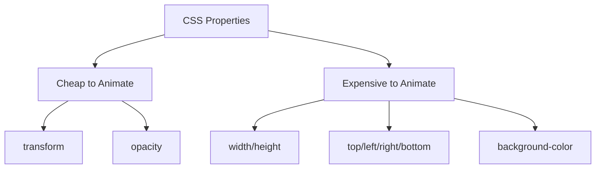

# Vue.js Performant Animations

## Introduction

Animation adds life to web applications, making user interfaces more intuitive and engaging. However, poorly implemented animations can significantly impact your application's performance, leading to janky experiences and frustrated users.

In this guide, we'll explore techniques for creating performant animations in Vue.js that run smoothly even on less powerful devices. We'll focus on leveraging Vue's built-in capabilities while following best practices to ensure your animations don't slow down your application.

## Understanding Animation Performance

Before diving into code, let's understand what makes an animation performant:

1. **Frame Rate** - Animations should maintain 60 frames per second (fps) for smooth movement
2. **CPU/GPU Usage** - Efficient animations minimize processor usage
3. **Memory Consumption** - Well-optimized animations avoid memory leaks
4. **Reflows and Repaints** - Minimizing browser layout recalculations

## Which CSS Properties to Animate

One of the most fundamental rules for performant animations is animating the right properties:



### Cheap to animate (GPU accelerated):
- `transform` (translate, scale, rotate)
- `opacity`

### Expensive to animate (cause reflows):
- `width`/`height`
- `top`/`left`/`right`/`bottom`
- `margin`/`padding`

## Vue Transition Component Optimization

Vue's `<transition>` component is powerful, but requires care for optimal performance.

### Basic Optimized Transition Example

```html
<template>
  <div>
    <button @click="show = !show">Toggle Element</button>
    
    <transition name="fade">
      <div v-if="show" class="box"></div>
    </transition>
  </div>
</template>

<script>
export default {
  data() {
    return {
      show: true
    }
  }
}
</script>

<style>
.box {
  width: 100px;
  height: 100px;
  background-color: blue;
}

/* Using transform instead of width/height changes */
.fade-enter-active, 
.fade-leave-active {
  transition: opacity 0.5s, transform 0.5s;
}

.fade-enter-from, 
.fade-leave-to {
  opacity: 0;
  transform: scale(0.8);
}
</style>
```

In this example, we're using `opacity` and `transform: scale()` which are GPU-accelerated properties, instead of changing `width` and `height` directly.

## Using CSS `will-change` Property

The `will-change` property hints to browsers about which properties are expected to change, allowing for optimizations:

```html
<style>
.animated-element {
  will-change: transform, opacity;
}

.animated-element:hover {
  transform: scale(1.1);
  opacity: 0.8;
}
</style>
```

⚠️ **Warning**: Use `will-change` sparingly! Overusing it can cause the browser to create unnecessary memory consumption.

## Reducing JavaScript Overhead

### Debouncing Animation Triggers

When animations are triggered by events that fire rapidly (like scrolling or resizing), debounce them to improve performance:

```html
<template>
  <div class="card" :style="cardStyle">
    <!-- Card content -->
  </div>
</template>

<script>
export default {
  data() {
    return {
      cardStyle: {},
      scrollPosition: 0,
      debounceTimer: null
    }
  },
  methods: {
    handleScroll() {
      // Clear the previous timeout
      clearTimeout(this.debounceTimer)
      
      // Set a new timeout
      this.debounceTimer = setTimeout(() => {
        this.scrollPosition = window.scrollY
        this.updateCardStyle()
      }, 10) // Short delay for smoother feeling
    },
    updateCardStyle() {
      const translateY = Math.min(this.scrollPosition / 10, 50)
      this.cardStyle = {
        transform: `translateY(${translateY}px)`
      }
    }
  },
  mounted() {
    window.addEventListener('scroll', this.handleScroll)
  },
  beforeUnmount() {
    window.removeEventListener('scroll', this.handleScroll)
    clearTimeout(this.debounceTimer)
  }
}
</script>
```

## Preventing Layout Thrashing

Layout thrashing occurs when you read and write to the DOM in rapid succession, forcing the browser to recalculate layouts multiple times. Here's how to avoid it:

```html
<script>
export default {
  methods: {
    // BAD: Causes layout thrashing
    badPerformance() {
      const elements = document.querySelectorAll('.animated')
      
      elements.forEach(el => {
        const height = el.offsetHeight // Read
        el.style.height = `${height + 10}px` // Write
        const width = el.offsetWidth // Read again
        el.style.width = `${width + 10}px` // Write again
      })
    },
    
    // GOOD: Batch reads and writes
    goodPerformance() {
      const elements = document.querySelectorAll('.animated')
      const measurements = []
      
      // Read phase
      elements.forEach(el => {
        measurements.push({
          height: el.offsetHeight,
          width: el.offsetWidth
        })
      })
      
      // Write phase
      elements.forEach((el, i) => {
        const { height, width } = measurements[i]
        el.style.height = `${height + 10}px`
        el.style.width = `${width + 10}px`
      })
    }
  }
}
</script>
```

## Practical Example: Animated List with Vue Transition Group

Here's a practical example of an optimized animated list using Vue's `<transition-group>`:

```html
<template>
  <div>
    <button @click="addItem">Add Item</button>
    <button @click="shuffleItems">Shuffle</button>
    <button @click="removeItem">Remove Item</button>
    
    <transition-group 
      name="list" 
      tag="ul" 
      class="items-list">
      <li v-for="item in items" 
          :key="item.id" 
          class="list-item">
        {{ item.name }}
      </li>
    </transition-group>
  </div>
</template>

<script>
export default {
  data() {
    return {
      nextId: 4,
      items: [
        { id: 1, name: 'Item 1' },
        { id: 2, name: 'Item 2' },
        { id: 3, name: 'Item 3' },
      ]
    }
  },
  methods: {
    addItem() {
      this.items.push({
        id: this.nextId++,
        name: `Item ${this.nextId - 1}`
      })
    },
    removeItem() {
      if (this.items.length > 0) {
        this.items.pop()
      }
    },
    shuffleItems() {
      this.items = [...this.items].sort(() => Math.random() - 0.5)
    }
  }
}
</script>

<style>
.items-list {
  padding: 0;
}

.list-item {
  display: inline-block;
  margin-right: 10px;
  padding: 10px 20px;
  background-color: #42b983;
  border-radius: 4px;
  color: white;
  margin-bottom: 10px;
  /* Use will-change only on elements actually being animated */
  will-change: transform, opacity;
}

/* Enter and leave animations */
.list-enter-active,
.list-leave-active {
  transition: all 0.5s ease;
}

.list-enter-from,
.list-leave-to {
  opacity: 0;
  transform: translateY(30px);
}

/* Moving animation between positions */
.list-move {
  transition: transform 0.5s;
}
</style>
```

Notice how we're using GPU-accelerated properties (`transform` and `opacity`) for better performance.

## Using Vue 3's Composition API for Animations

Vue 3's Composition API offers a cleaner way to organize animation code:

```html
<template>
  <div>
    <div 
      class="animated-box"
      :style="{ transform: `translateY(${position}px)` }"
      @mouseenter="startAnimation"
      @mouseleave="stopAnimation">
      Hover me!
    </div>
  </div>
</template>

<script>
import { ref, onUnmounted } from 'vue'

export default {
  setup() {
    const position = ref(0)
    let animationFrame = null
    let direction = 1
    let speed = 2
    
    const animate = () => {
      position.value += speed * direction
      
      // Reverse direction at boundaries
      if (position.value > 50 || position.value < 0) {
        direction *= -1
      }
      
      animationFrame = requestAnimationFrame(animate)
    }
    
    const startAnimation = () => {
      if (!animationFrame) {
        animationFrame = requestAnimationFrame(animate)
      }
    }
    
    const stopAnimation = () => {
      if (animationFrame) {
        cancelAnimationFrame(animationFrame)
        animationFrame = null
      }
    }
    
    // Clean up any running animations when component is unmounted
    onUnmounted(() => {
      stopAnimation()
    })
    
    return {
      position,
      startAnimation,
      stopAnimation
    }
  }
}
</script>

<style>
.animated-box {
  width: 100px;
  height: 100px;
  background-color: #42b983;
  color: white;
  display: flex;
  align-items: center;
  justify-content: center;
  cursor: pointer;
  will-change: transform;
}
</style>
```

This example uses `requestAnimationFrame` for smooth animations and properly cleans up resources when the component is unmounted.

## Key Optimization Techniques Summary

1. **Use the right CSS properties**: Prefer `transform` and `opacity` over other properties
2. **Use `will-change` sparingly**: Only on elements that will actually animate
3. **Avoid layout thrashing**: Batch DOM reads and writes
4. **Use `requestAnimationFrame`**: For JavaScript animations instead of `setInterval`
5. **Clean up resources**: Cancel animations when components unmount
6. **Debounce rapidly firing events**: Especially scroll and resize events
7. **Avoid animating too many elements** at once: Be strategic about what needs animation

## Advanced: Measuring Animation Performance

To ensure your animations remain performant, check them using browser developer tools:

1. Open Chrome DevTools (F12)
2. Go to the "Performance" tab
3. Click the record button and interact with your animations
4. Stop recording and analyze for:
   - Frames per second (should stay close to 60fps)
   - Long tasks that might be blocking the main thread
   - Layout and style recalculations

## Summary

Creating performant animations in Vue.js requires understanding the rendering pipeline and making strategic choices about which properties to animate and how to structure your code. By following the guidelines in this guide, you can create smooth, engaging animations that enhance your user experience without sacrificing performance.

Focus on using GPU-accelerated properties like `transform` and `opacity`, avoid layout thrashing, use appropriate Vue transition components, and always clean up animations when components unmount. With these best practices, your Vue applications will maintain their performance while delighting users with smooth, responsive animations.

## Additional Resources

- [Vue.js Transitions & Animation Guide](https://v3.vuejs.org/guide/transitions-overview.html)
- [High Performance Animations](https://www.html5rocks.com/en/tutorials/speed/high-performance-animations/)
- [CSS Triggers](https://csstriggers.com/) - See which CSS properties trigger layout, paint, or composite

## Exercises

1. Convert an existing animation in your project from using `width`/`height` to using `transform: scale()`
2. Create a loading spinner using only CSS and Vue transitions
3. Implement a "card flip" animation using 3D transforms
4. Build a performant infinite scroll component that loads and animates new items
5. Profile one of your animations using Chrome DevTools and optimize its performance