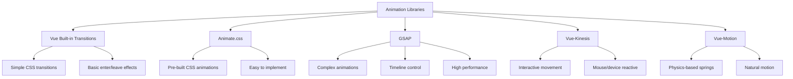

# Vue.js Animation Libraries

## Introduction

Animations add life to web applications, improving user experience and making interfaces more intuitive. While Vue.js provides built-in transition capabilities, specialized animation libraries can greatly expand your animation toolkit and save you development time.

In this guide, we'll explore popular animation libraries that integrate well with Vue.js applications, comparing their features, use cases, and implementation approaches. Whether you're looking to add simple transitions or complex choreographed animations, these libraries will help you achieve professional results with minimal effort.

## Why Use Animation Libraries?

Before diving into specific libraries, let's understand why you might want to use a specialized animation library instead of building animations from scratch:

- **Time efficiency**: Pre-built animations save development time
- **Performance optimization**: Libraries often implement performance best practices
- **Cross-browser compatibility**: Libraries handle browser inconsistencies
- **Advanced features**: Access to easing functions, timelines, and physics-based animations
- **Community support**: Active communities for troubleshooting and examples

## Popular Vue.js Animation Libraries

### 1. Vue Transition and Animation Components

Vue provides built-in transition components that serve as the foundation for animations.

#### Basic Usage of Vue Transitions

```html
<template>
  <div>
    <button @click="show = !show">Toggle</button>
    
    <transition name="fade">
      <p v-if="show">Hello Animation World!</p>
    </transition>
  </div>
</template>

<script>
export default {
  data() {
    return {
      show: true
    }
  }
}
</script>

<style>
.fade-enter-active, .fade-leave-active {
  transition: opacity 0.5s;
}
.fade-enter, .fade-leave-to {
  opacity: 0;
}
</style>
```

This creates a simple fade effect when the element appears or disappears. Vue's transition component adds classes during different animation phases that you can target with CSS.

### 2. Animate.css with Vue

[Animate.css](https://animate.style/) is a popular library that provides ready-to-use CSS animations.

#### Installation and Setup

```bash
npm install animate.css
```

Then import it in your main.js file:

```javascript
// In main.js
import 'animate.css';
```

#### Usage with Vue Transitions

```html
<template>
  <div>
    <button @click="show = !show">Toggle Animation</button>
    
    <transition
      enter-active-class="animate__animated animate__fadeIn"
      leave-active-class="animate__animated animate__fadeOut"
    >
      <div v-if="show" class="animated-box">
        <p>This element uses Animate.css!</p>
      </div>
    </transition>
  </div>
</template>

<script>
export default {
  data() {
    return {
      show: true
    }
  }
}
</script>

<style>
.animated-box {
  padding: 20px;
  background-color: #e0f7fa;
  border-radius: 4px;
}
</style>
```

Animate.css provides a wide variety of pre-built animations that can be applied simply by using the appropriate classes.

### 3. GSAP (GreenSock Animation Platform)

GSAP is an industry-standard animation library known for its performance and flexibility.

#### Installation and Setup

```bash
npm install gsap
```

#### Basic GSAP Example

```html
<template>
  <div>
    <button @click="animate">Animate Element</button>
    <div ref="box" class="gsap-box">GSAP Animation</div>
  </div>
</template>

<script>
import { gsap } from 'gsap';

export default {
  methods: {
    animate() {
      gsap.to(this.$refs.box, {
        duration: 1,
        x: 100,
        rotation: 360,
        backgroundColor: '#9c27b0',
        ease: 'bounce.out',
        onComplete: () => {
          // Reset after animation
          gsap.to(this.$refs.box, {
            duration: 1,
            x: 0,
            rotation: 0,
            backgroundColor: '#42b883',
            delay: 0.5
          });
        }
      });
    }
  }
}
</script>

<style>
.gsap-box {
  width: 100px;
  height: 100px;
  background-color: #42b883;
  color: white;
  display: flex;
  align-items: center;
  justify-content: center;
  font-weight: bold;
}
</style>
```

#### GSAP Timeline Example

Timelines allow you to sequence animations:

```html
<template>
  <div>
    <button @click="playTimeline">Play Timeline</button>
    <div class="stage">
      <div ref="circle" class="circle"></div>
      <div ref="square" class="square"></div>
      <div ref="triangle" class="triangle"></div>
    </div>
  </div>
</template>

<script>
import { gsap } from 'gsap';

export default {
  methods: {
    playTimeline() {
      const timeline = gsap.timeline();
      
      // Sequence animations
      timeline.to(this.$refs.circle, { duration: 1, x: 200 })
             .to(this.$refs.square, { duration: 0.5, rotation: 360 })
             .to(this.$refs.triangle, { duration: 0.7, y: -50, ease: 'elastic' })
             .to([this.$refs.circle, this.$refs.square, this.$refs.triangle], {
               duration: 1, 
               opacity: 0.5, 
               stagger: 0.2
             })
             .to([this.$refs.circle, this.$refs.square, this.$refs.triangle], {
               duration: 1, 
               x: 0, 
               y: 0, 
               rotation: 0, 
               opacity: 1
             });
    }
  }
}
</script>

<style>
.stage {
  position: relative;
  height: 200px;
  margin-top: 20px;
}

.circle {
  width: 50px;
  height: 50px;
  background-color: #f44336;
  border-radius: 50%;
  position: absolute;
}

.square {
  width: 50px;
  height: 50px;
  background-color: #2196f3;
  position: absolute;
  top: 60px;
}

.triangle {
  width: 0;
  height: 0;
  border-left: 25px solid transparent;
  border-right: 25px solid transparent;
  border-bottom: 50px solid #4caf50;
  position: absolute;
  top: 120px;
}
</style>
```

### 4. Vue-Kinesis

Vue-Kinesis is a library for creating interactive animations that respond to user input.

#### Installation

```bash
npm install vue-kinesis
```

#### Basic Usage

```html
<template>
  <div>
    <h3>Move your mouse over this area</h3>
    <kinesis-container>
      <kinesis-element :strength="10" type="depth">
        <div class="kinesis-box">Moves a little</div>
      </kinesis-element>
      
      <kinesis-element :strength="20" type="depth">
        <div class="kinesis-box medium">Moves more</div>
      </kinesis-element>
      
      <kinesis-element :strength="30" type="depth">
        <div class="kinesis-box large">Moves a lot</div>
      </kinesis-element>
    </kinesis-container>
  </div>
</template>

<script>
import { KinesisContainer, KinesisElement } from 'vue-kinesis'

export default {
  components: {
    KinesisContainer,
    KinesisElement
  }
}
</script>

<style>
.kinesis-box {
  width: 80px;
  height: 80px;
  background-color: #42b883;
  color: white;
  display: flex;
  align-items: center;
  justify-content: center;
  margin: 10px;
  font-size: 12px;
  text-align: center;
}

.medium {
  background-color: #35495e;
  width: 100px;
  height: 100px;
}

.large {
  background-color: #ff7043;
  width: 120px;
  height: 120px;
}
</style>
```

### 5. Vue-Motion

Vue-Motion provides spring-based animations inspired by React Motion.

#### Installation

```bash
npm install vue-motion
```

#### Spring Animation Example

```html
<template>
  <div>
    <button @click="toggle = !toggle">Toggle Spring Animation</button>
    
    <motion 
      tag="div"
      :values="{ x: toggle ? 300 : 0, opacity: toggle ? 1 : 0.3 }"
      class="motion-box"
    >
      <template v-slot="{ x, opacity }">
        <div 
          class="spring-box" 
          :style="{ 
            transform: `translateX(${x}px)`,
            opacity: opacity 
          }"
        >
          Spring Animation!
        </div>
      </template>
    </motion>
  </div>
</template>

<script>
import { Motion } from 'vue-motion'

export default {
  components: {
    Motion
  },
  data() {
    return {
      toggle: false
    }
  }
}
</script>

<style>
.motion-box {
  margin-top: 20px;
  height: 100px;
}

.spring-box {
  width: 150px;
  height: 80px;
  background-color: #673ab7;
  color: white;
  display: flex;
  align-items: center;
  justify-content: center;
  border-radius: 4px;
}
</style>
```

## Creating a Custom Animation Component

Now let's create a practical example that combines multiple animation techniques into a reusable component:

### Animated Notification Component

```html
<template>
  <div class="notification-container">
    <transition-group 
      tag="div" 
      name="notification" 
      @before-enter="beforeEnter"
      @enter="enter"
      @leave="leave"
    >
      <div 
        v-for="notification in notifications" 
        :key="notification.id" 
        class="notification"
        :class="notification.type"
      >
        <div class="notification-content">
          <h4>{{ notification.title }}</h4>
          <p>{{ notification.message }}</p>
        </div>
        <button @click="removeNotification(notification.id)" class="close-btn">
          &times;
        </button>
      </div>
    </transition-group>
    
    <div class="controls">
      <button @click="addNotification('success')" class="success">Add Success</button>
      <button @click="addNotification('error')" class="error">Add Error</button>
      <button @click="addNotification('info')" class="info">Add Info</button>
    </div>
  </div>
</template>

<script>
import gsap from 'gsap';

export default {
  data() {
    return {
      notifications: [],
      nextId: 1
    }
  },
  methods: {
    addNotification(type) {
      const types = {
        success: {
          title: 'Success!',
          message: 'Operation completed successfully.'
        },
        error: {
          title: 'Error!',
          message: 'Something went wrong. Please try again.'
        },
        info: {
          title: 'Info',
          message: 'This is an informational notification.'
        }
      };
      
      const notification = {
        id: this.nextId++,
        type: type,
        title: types[type].title,
        message: types[type].message
      };
      
      this.notifications.push(notification);
      
      // Auto-remove after 5 seconds
      setTimeout(() => {
        this.removeNotification(notification.id);
      }, 5000);
    },
    
    removeNotification(id) {
      const index = this.notifications.findIndex(n => n.id === id);
      if (index !== -1) {
        this.notifications.splice(index, 1);
      }
    },
    
    beforeEnter(el) {
      el.style.opacity = 0;
      el.style.transform = 'translateX(100%)';
    },
    
    enter(el, done) {
      gsap.to(el, {
        opacity: 1,
        x: 0,
        duration: 0.4,
        onComplete: done,
        ease: 'power2.out'
      });
    },
    
    leave(el, done) {
      gsap.to(el, {
        opacity: 0,
        x: 100,
        duration: 0.4,
        onComplete: done,
        ease: 'power2.in'
      });
    }
  }
}
</script>

<style>
.notification-container {
  position: fixed;
  top: 20px;
  right: 20px;
  width: 300px;
  z-index: 1000;
}

.notification {
  margin-bottom: 10px;
  padding: 15px;
  border-radius: 4px;
  box-shadow: 0 3px 6px rgba(0,0,0,0.16);
  display: flex;
  justify-content: space-between;
  align-items: flex-start;
  color: white;
}

.notification h4 {
  margin: 0 0 5px 0;
}

.notification p {
  margin: 0;
}

.notification.success {
  background-color: #4caf50;
}

.notification.error {
  background-color: #f44336;
}

.notification.info {
  background-color: #2196f3;
}

.close-btn {
  background: none;
  border: none;
  color: white;
  font-size: 20px;
  cursor: pointer;
  opacity: 0.7;
}

.close-btn:hover {
  opacity: 1;
}

.controls {
  margin-top: 20px;
  display: flex;
  gap: 10px;
}

.controls button {
  padding: 8px 12px;
  border: none;
  border-radius: 4px;
  color: white;
  cursor: pointer;
}

.controls button.success {
  background-color: #4caf50;
}

.controls button.error {
  background-color: #f44336;
}

.controls button.info {
  background-color: #2196f3;
}

/* For Vue's transition-group */
.notification-move {
  transition: transform 0.4s ease;
}
</style>
```

This notification component demonstrates:

1. Using Vue's transition-group for list animations
2. Integrating GSAP for entry and exit animations
3. Creating a reusable component with different notification types
4. Handling automatic removal of notifications

## Comparing Animation Libraries

Let's compare the libraries we've discussed to help you choose the right one for your project:



### Choosing the Right Library

- **Vue Built-in Transitions**: Good for simple transitions and when you want to avoid additional dependencies
- **Animate.css**: Perfect for quick, pre-built animations that don't require complex sequencing
- **GSAP**: Best for complex, high-performance animations with precise control
- **Vue-Kinesis**: Ideal for interactive UI elements that respond to user input
- **Vue-Motion**: Excellent for natural-feeling, physics-based animations

## Performance Considerations

When implementing animations in Vue.js, keep these performance tips in mind:

1. **Animate cheap properties**: Prefer `transform` and `opacity` over properties that cause layout recalculations
2. **Use `will-change` property**: For complex animations that might benefit from GPU acceleration
3. **Debounce user interactions**: When animations are triggered by frequent events like scrolling or mouse movement
4. **Avoid animating too many elements**: Be selective about what you animate
5. **Test on lower-end devices**: Ensure animations remain smooth across different device capabilities

## Summary

Animation libraries make it easier to create engaging user experiences in Vue.js applications. In this guide, we've explored:

- Vue's built-in transition system as the foundation for animations
- Animate.css for ready-to-use CSS animations
- GSAP for complex, high-performance animations
- Vue-Kinesis for interactive, mouse-reactive animations
- Vue-Motion for spring physics-based animations

By choosing the right library for your needs and following performance best practices, you can create animations that enhance your user interface without compromising on performance or development efficiency.

## Additional Resources

- [Vue.js Transitions Documentation](https://vuejs.org/guide/built-ins/transition.html)
- [GSAP Documentation](https://greensock.com/docs/)
- [Animate.css Examples](https://animate.style/)
- [Vue Animation Performance Guide](https://css-tricks.com/how-to-create-vue-js-transitions/)

## Exercises

1. Create an animated form that highlights fields as the user progresses through it.
2. Implement a carousel component using GSAP for slide transitions.
3. Build a loading indicator with sequenced animations that plays while content is loading.
4. Design a navigation menu with different animation effects for desktop and mobile views.
5. Create animated data visualizations that animate into view as the user scrolls down the page.