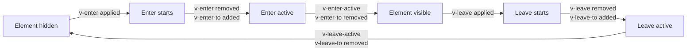

# Vue.js CSS Animations

## Introduction

CSS animations provide a powerful way to enhance your Vue.js applications by adding movement, transitions, and visual feedback to your user interfaces. When implemented effectively, animations can improve user experience by making your application feel more responsive and intuitive.

In this guide, we'll explore how to integrate CSS animations with Vue.js components. We'll learn how to trigger animations based on user interactions, component state changes, and Vue's lifecycle hooks.

## Understanding CSS Animations in Vue.js

Vue provides excellent support for CSS animations through its transition system. This system allows you to easily apply enter and leave animations to elements when they're added, updated, or removed from the DOM.

### Basic Principles

CSS animations in Vue.js typically involve:

1. Defining the animation using CSS rules
2. Connecting these animations to Vue components
3. Controlling the timing and triggering of animations

## The Vue Transition Component

Vue's built-in `<transition>` component is the foundation for applying CSS animations to elements that are being inserted, updated, or removed from the DOM.

### Basic Usage

```html
<template>
  <div>
    <button @click="show = !show">Toggle</button>
    
    <transition name="fade">
      <p v-if="show">Hello Vue.js Animations!</p>
    </transition>
  </div>
</template>

<script>
export default {
  data() {
    return {
      show: true
    }
  }
}
</script>

<style>
.fade-enter-active, .fade-leave-active {
  transition: opacity 0.5s;
}
.fade-enter, .fade-leave-to {
  opacity: 0;
}
</style>
```

In this example:

1. We use the `<transition>` component with a name attribute set to "fade"
2. The `v-if` directive controls whether the paragraph is shown or hidden
3. CSS classes are automatically applied during the transition based on the name prefix

When you click the toggle button, the paragraph will fade in and out instead of appearing and disappearing instantly.

## Transition Classes

Vue's transition system applies six different classes to elements during transitions:

1. `v-enter`: Starting state for enter. Added before element is inserted, removed one frame after.
2. `v-enter-active`: Active state for enter. Applied during the entire enter phase.
3. `v-enter-to`: Ending state for enter. Added one frame after element is inserted, removed when transition finishes.
4. `v-leave`: Starting state for leave. Added immediately when a leaving transition is triggered, removed after one frame.
5. `v-leave-active`: Active state for leave. Applied during the entire leaving phase.
6. `v-leave-to`: Ending state for leave. Added one frame after leave transition is triggered, removed when transition finishes.

When you use `name="fade"`, the class names become `fade-enter`, `fade-enter-active`, etc.



## Creating a Simple Fade Animation

Let's create a simple fade animation for a modal component:

```html
<template>
  <div>
    <button @click="showModal = !showModal">
      {{ showModal ? 'Hide Modal' : 'Show Modal' }}
    </button>
    
    <transition name="modal-fade">
      <div v-if="showModal" class="modal">
        <div class="modal-content">
          <h2>Modal Title</h2>
          <p>This is a modal with a fade animation.</p>
          <button @click="showModal = false">Close</button>
        </div>
      </div>
    </transition>
  </div>
</template>

<script>
export default {
  data() {
    return {
      showModal: false
    }
  }
}
</script>

<style>
.modal {
  position: fixed;
  top: 0;
  left: 0;
  right: 0;
  bottom: 0;
  background-color: rgba(0, 0, 0, 0.5);
  display: flex;
  align-items: center;
  justify-content: center;
}

.modal-content {
  background-color: white;
  padding: 20px;
  border-radius: 5px;
  width: 80%;
  max-width: 500px;
}

/* Fade animation classes */
.modal-fade-enter-active, .modal-fade-leave-active {
  transition: opacity 0.3s;
}

.modal-fade-enter, .modal-fade-leave-to {
  opacity: 0;
}
</style>
```

## Using CSS Animations with Keyframes

While transitions are great for simple effects, CSS animations using `@keyframes` provide more complex, multi-step animations.

```html
<template>
  <div>
    <button @click="showNotification = !showNotification">
      Show Notification
    </button>
    
    <transition name="notification">
      <div v-if="showNotification" class="notification">
        New message received!
      </div>
    </transition>
  </div>
</template>

<script>
export default {
  data() {
    return {
      showNotification: false
    }
  },
  watch: {
    showNotification(newVal) {
      if (newVal) {
        setTimeout(() => {
          this.showNotification = false;
        }, 3000);
      }
    }
  }
}
</script>

<style>
.notification {
  position: fixed;
  top: 20px;
  right: 20px;
  background-color: #4CAF50;
  color: white;
  padding: 15px;
  border-radius: 4px;
}

.notification-enter-active {
  animation: slide-in 0.5s;
}

.notification-leave-active {
  animation: slide-out 0.5s;
}

@keyframes slide-in {
  from {
    transform: translateX(100%);
    opacity: 0;
  }
  to {
    transform: translateX(0);
    opacity: 1;
  }
}

@keyframes slide-out {
  from {
    transform: translateX(0);
    opacity: 1;
  }
  to {
    transform: translateX(100%);
    opacity: 0;
  }
}
</style>
```

In this example:
1. We create a notification that slides in from the right side
2. After 3 seconds, it slides back out automatically
3. We use `@keyframes` to define the animation sequence for both entry and exit

## Animating Lists with `<transition-group>`

When animating lists in Vue, we use the `<transition-group>` component which is designed specifically for animating list items.

```html
<template>
  <div>
    <button @click="addItem">Add Item</button>
    <button @click="removeItem">Remove Item</button>

    <transition-group name="list" tag="ul">
      <li v-for="(item, index) in items" :key="item" class="list-item">
        {{ item }}
      </li>
    </transition-group>
  </div>
</template>

<script>
export default {
  data() {
    return {
      nextItem: 1,
      items: [1, 2, 3, 4, 5]
    }
  },
  methods: {
    addItem() {
      this.items.splice(Math.floor(Math.random() * (this.items.length + 1)), 0, this.nextItem++);
    },
    removeItem() {
      if (this.items.length) {
        this.items.splice(Math.floor(Math.random() * this.items.length), 1);
      }
    }
  }
}
</script>

<style>
.list-item {
  display: inline-block;
  margin-right: 10px;
  padding: 10px;
  background-color: #f3f3f3;
  border-radius: 4px;
}

.list-enter-active, .list-leave-active {
  transition: all 0.5s;
}

.list-enter, .list-leave-to {
  opacity: 0;
  transform: translateY(30px);
}

/* For move transitions */
.list-move {
  transition: transform 0.5s;
}
</style>
```

Key features of this example:
1. `<transition-group>` renders as a `<ul>` element (because of the `tag` attribute)
2. Each item must have a unique `:key` attribute
3. When items are added or removed, the remaining items smoothly move to their new positions
4. The `.list-move` class is important for the FLIP animation technique that Vue uses behind the scenes

## Practical Examples

### Loading Spinner

Create a loading spinner that appears during async operations:

```html
<template>
  <div>
    <button @click="fetchData" :disabled="loading">
      Fetch Data
    </button>

    <transition name="fade">
      <div v-if="loading" class="loader-container">
        <div class="spinner"></div>
      </div>
    </transition>

    <div v-if="data" class="data-container">
      <pre>{{ data }}</pre>
    </div>
  </div>
</template>

<script>
export default {
  data() {
    return {
      loading: false,
      data: null
    }
  },
  methods: {
    fetchData() {
      this.loading = true;
      this.data = null;
      
      // Simulate API call
      setTimeout(() => {
        this.data = { message: "Data loaded successfully", timestamp: new Date().toISOString() };
        this.loading = false;
      }, 2000);
    }
  }
}
</script>

<style>
.loader-container {
  display: flex;
  justify-content: center;
  padding: 20px;
}

.spinner {
  width: 40px;
  height: 40px;
  border: 4px solid rgba(0, 0, 0, 0.1);
  border-radius: 50%;
  border-top-color: #09f;
  animation: spin 1s ease-in-out infinite;
}

@keyframes spin {
  to { transform: rotate(360deg); }
}

.fade-enter-active, .fade-leave-active {
  transition: opacity 0.3s;
}

.fade-enter, .fade-leave-to {
  opacity: 0;
}

.data-container {
  margin-top: 20px;
  padding: 15px;
  background-color: #f5f5f5;
  border-radius: 4px;
}
</style>
```

### Page Transition

Create smooth transitions between routes using Vue Router:

```html
<template>
  <div class="app">
    <nav>
      <router-link to="/">Home</router-link>
      <router-link to="/about">About</router-link>
      <router-link to="/contact">Contact</router-link>
    </nav>
    
    <transition name="page">
      <router-view class="page-container"></router-view>
    </transition>
  </div>
</template>

<style>
.app {
  position: relative;
  min-height: 100vh;
}

.page-container {
  position: absolute;
  width: 100%;
}

.page-enter-active, .page-leave-active {
  transition: opacity 0.5s, transform 0.5s;
}

.page-enter {
  opacity: 0;
  transform: translateX(30px);
}

.page-leave-to {
  opacity: 0;
  transform: translateX(-30px);
}
</style>
```

## Animation Performance Tips

1. **Use hardware acceleration**: Add `transform: translateZ(0)` or `will-change` properties to leverage GPU acceleration.

```css
.animated-element {
  will-change: transform, opacity;
  /* or */
  transform: translateZ(0);
}
```

2. **Animate only transform and opacity**: These properties are the most efficient to animate.

```css
/* Good - efficient animations */
.efficient-animation {
  transition: transform 0.3s, opacity 0.3s;
}

/* Avoid - may cause layout thrashing */
.inefficient-animation {
  transition: width 0.3s, height 0.3s, margin 0.3s;
}
```

3. **Use `v-show` instead of `v-if`** for elements that toggle frequently, as it doesn't remove elements from the DOM.

## Conditional Animation Classes

You can apply different animations based on conditions:

```html
<template>
  <div>
    <button @click="status = 'success'">Success</button>
    <button @click="status = 'error'">Error</button>
    <button @click="status = 'warning'">Warning</button>
    
    <transition name="notification">
      <div :class="['alert', status]" v-if="status">
        {{ message }}
      </div>
    </transition>
  </div>
</template>

<script>
export default {
  data() {
    return {
      status: '',
    }
  },
  computed: {
    message() {
      switch(this.status) {
        case 'success': return 'Operation completed successfully!';
        case 'error': return 'An error has occurred!';
        case 'warning': return 'Warning: Please check your input';
        default: return '';
      }
    }
  },
  watch: {
    status() {
      if (this.status) {
        setTimeout(() => {
          this.status = '';
        }, 3000);
      }
    }
  }
}
</script>

<style>
.alert {
  padding: 15px;
  margin: 20px 0;
  border-radius: 4px;
  color: white;
}

.success {
  background-color: #4CAF50;
}

.error {
  background-color: #f44336;
}

.warning {
  background-color: #ff9800;
}

.notification-enter-active {
  animation: bounce-in 0.5s;
}

.notification-leave-active {
  animation: bounce-out 0.5s;
}

@keyframes bounce-in {
  0% {
    transform: scale(0);
  }
  50% {
    transform: scale(1.05);
  }
  100% {
    transform: scale(1);
  }
}

@keyframes bounce-out {
  0% {
    transform: scale(1);
  }
  50% {
    transform: scale(1.05);
  }
  100% {
    transform: scale(0);
  }
}
</style>
```

## Summary

In this guide, we've explored how to implement CSS animations in Vue.js applications:

- Using the `<transition>` component for simple element animations
- Understanding the six transition classes that Vue automatically applies
- Creating complex animations with CSS `@keyframes`
- Animating lists with `<transition-group>`
- Building practical animations like loaders, notifications, and page transitions
- Optimizing animations for better performance

CSS animations are a powerful tool to enhance your Vue applications, making them more dynamic and engaging. By using Vue's built-in transition system, you can easily add professional-looking animations with minimal code.

## Exercises

1. Create a dropdown menu that smoothly expands and collapses using Vue transitions.
2. Build an image carousel that crossfades between images.
3. Implement a form validation system that shakes form fields when there's an error.
4. Create an accordion component with smooth expand/collapse animations.
5. Build a to-do list application with animation effects when tasks are added, completed, or removed.

## Additional Resources

- [Vue.js Transitions Documentation](https://vuejs.org/guide/built-ins/transition.html)
- [CSS Animation MDN Guide](https://developer.mozilla.org/en-US/docs/Web/CSS/CSS_Animations/Using_CSS_animations)
- [FLIP Animation Technique](https://aerotwist.com/blog/flip-your-animations/)
- [GreenSock Animation Platform (GSAP)](https://greensock.com) - For more advanced animations

By mastering CSS animations in Vue.js, you'll be able to create more engaging user experiences that stand out from the crowd. Remember that good animations should enhance your application without getting in the way of usability.