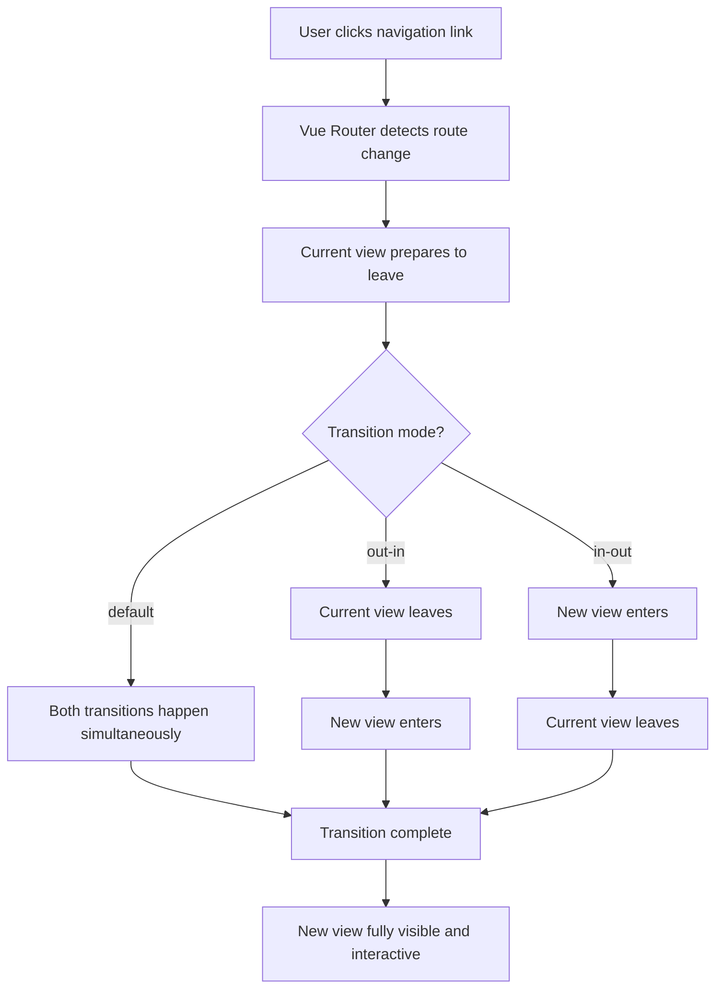

# Vue.js Page Transitions

## Introduction

Page transitions are animations that occur when navigating between different pages or views in your application. A well-designed page transition can greatly enhance the user experience by creating a sense of continuity and flow as users navigate through your Vue.js application.

In this tutorial, we'll learn how to implement smooth and professional page transitions in Vue.js using Vue's built-in transition components combined with CSS animations. We'll start with the basics and gradually build up to more complex and customized transitions.

## Prerequisites

Before diving into page transitions, you should have:
- Basic knowledge of Vue.js
- Understanding of Vue Router
- Familiarity with CSS animations and transitions

## Basic Page Transitions

### Setting Up Vue Router

To implement page transitions, we first need a Vue application with multiple pages and Vue Router set up. Let's start by creating a simple Vue application with two pages:

```javascript
// main.js
import { createApp } from 'vue'
import { createRouter, createWebHistory } from 'vue-router'
import App from './App.vue'
import HomePage from './components/HomePage.vue'
import AboutPage from './components/AboutPage.vue'

const routes = [
  { path: '/', component: HomePage },
  { path: '/about', component: AboutPage }
]

const router = createRouter({
  history: createWebHistory(),
  routes
})

const app = createApp(App)
app.use(router)
app.mount('#app')
```

### Basic Transition Component

Vue provides a built-in `Transition` component that allows us to add transition effects when elements are inserted, updated, or removed from the DOM. We can wrap our router-view with this component to add transitions between pages:

```html
<!-- App.vue -->
<template>
  <div class="app">
    <nav>
      <router-link to="/">Home</router-link> | 
      <router-link to="/about">About</router-link>
    </nav>
    
    <transition name="fade">
      <router-view />
    </transition>
  </div>
</template>

<style>
.fade-enter-active,
.fade-leave-active {
  transition: opacity 0.5s ease;
}

.fade-enter-from,
.fade-leave-to {
  opacity: 0;
}
</style>
```

In this example, we're applying a simple fade transition to our pages. When a page enters, it fades in, and when it leaves, it fades out.

### How It Works

The `transition` component automatically applies classes to the element during different stages of the transition:

1. `fade-enter-from`: Applied at the beginning of the enter transition
2. `fade-enter-active`: Applied during the entire enter transition
3. `fade-enter-to`: Applied at the end of the enter transition
4. `fade-leave-from`: Applied at the beginning of the leave transition
5. `fade-leave-active`: Applied during the entire leave transition
6. `fade-leave-to`: Applied at the end of the leave transition

## Advanced Page Transitions

Let's explore more advanced transitions for a more engaging user experience.

### Slide Transitions

A common pattern is to have pages slide in and out:

```html
<template>
  <div class="app">
    <nav>
      <router-link to="/">Home</router-link> | 
      <router-link to="/about">About</router-link>
    </nav>
    
    <transition name="slide">
      <router-view />
    </transition>
  </div>
</template>

<style>
.slide-enter-active,
.slide-leave-active {
  transition: transform 0.5s ease;
}

.slide-enter-from {
  transform: translateX(100%);
}

.slide-leave-to {
  transform: translateX(-100%);
}
</style>
```

This creates a sliding effect where new pages come in from the right and exiting pages leave to the left.

### Direction-Aware Transitions

We can create more sophisticated transitions that change based on navigation direction:

```html
<template>
  <div class="app">
    <nav>
      <router-link to="/">Home</router-link> | 
      <router-link to="/about">About</router-link> | 
      <router-link to="/contact">Contact</router-link>
    </nav>
    
    <transition :name="transitionName">
      <router-view />
    </transition>
  </div>
</template>

<script>
export default {
  data() {
    return {
      transitionName: 'slide-right'
    }
  },
  watch: {
    '$route'(to, from) {
      const toDepth = to.path.split('/').length
      const fromDepth = from.path.split('/').length
      this.transitionName = toDepth < fromDepth ? 'slide-right' : 'slide-left'
    }
  }
}
</script>

<style>
.slide-left-enter-active,
.slide-left-leave-active,
.slide-right-enter-active,
.slide-right-leave-active {
  transition: transform 0.5s ease;
}

.slide-left-enter-from {
  transform: translateX(100%);
}
.slide-left-leave-to {
  transform: translateX(-100%);
}
.slide-right-enter-from {
  transform: translateX(-100%);
}
.slide-right-leave-to {
  transform: translateX(100%);
}
</style>
```

This example watches route changes and determines the transition direction based on the route depth, creating a more intuitive navigation experience.

## Using the `<transition-group>` Component

When transitioning between pages with lists or multiple elements, we can use the `transition-group` component:

```html
<template>
  <transition-group name="list" tag="ul">
    <li v-for="item in items" :key="item.id">
      {{ item.text }}
    </li>
  </transition-group>
</template>

<style>
.list-enter-active,
.list-leave-active {
  transition: all 0.5s ease;
}
.list-enter-from,
.list-leave-to {
  opacity: 0;
  transform: translateX(30px);
}
</style>
```

This creates a staggered animation effect for lists when navigating between pages.

## Real-world Example: E-commerce Product Browser

Let's create a more practical example of page transitions in an e-commerce product browsing context:

```html
<!-- ProductBrowser.vue -->
<template>
  <div class="product-browser">
    <div class="categories">
      <button 
        v-for="category in categories" 
        :key="category"
        @click="currentCategory = category"
        :class="{ active: currentCategory === category }"
      >
        {{ category }}
      </button>
    </div>
    
    <transition-group name="product-fade" tag="div" class="products-container">
      <div v-for="product in filteredProducts" :key="product.id" class="product-card">
        <h3>{{ product.name }}</h3>
        <p>{{ product.description }}</p>
        <span class="price">${{ product.price.toFixed(2) }}</span>
      </div>
    </transition-group>
  </div>
</template>

<script>
export default {
  data() {
    return {
      currentCategory: 'All',
      categories: ['All', 'Electronics', 'Clothing', 'Books'],
      products: [
        { id: 1, name: 'Smartphone', category: 'Electronics', price: 699.99, description: 'Latest model with advanced features' },
        { id: 2, name: 'T-shirt', category: 'Clothing', price: 19.99, description: 'Cotton t-shirt with logo' },
        { id: 3, name: 'JavaScript Book', category: 'Books', price: 39.99, description: 'Learn JavaScript programming' },
        // More products...
      ]
    }
  },
  computed: {
    filteredProducts() {
      if (this.currentCategory === 'All') {
        return this.products
      }
      return this.products.filter(p => p.category === this.currentCategory)
    }
  }
}
</script>

<style>
.product-browser {
  padding: 20px;
}

.categories {
  margin-bottom: 20px;
}

button {
  margin-right: 10px;
  padding: 5px 15px;
  border: none;
  background-color: #eee;
  cursor: pointer;
}

button.active {
  background-color: #42b983;
  color: white;
}

.products-container {
  display: grid;
  grid-template-columns: repeat(auto-fill, minmax(250px, 1fr));
  gap: 20px;
}

.product-card {
  border: 1px solid #ddd;
  padding: 15px;
  border-radius: 5px;
}

/* Transition styles */
.product-fade-enter-active,
.product-fade-leave-active {
  transition: all 0.5s ease;
}

.product-fade-enter-from,
.product-fade-leave-to {
  opacity: 0;
  transform: translateY(30px);
}

/* Staggered list effect */
.product-fade-move {
  transition: transform 0.5s ease;
}
</style>
```

In this example, when users switch between product categories, the products fade in and out with a slight vertical movement, creating a pleasant browsing experience.

## Performance Considerations

While page transitions can enhance user experience, it's important to consider performance:

1. **Keep animations simple**: Complex animations can cause performance issues, especially on mobile devices.
2. **Use `will-change` property**: This can help browser optimization but use it sparingly.
3. **Use hardware acceleration**: Transform and opacity are properties that can be hardware-accelerated.

```css
.optimized-transition {
  will-change: transform, opacity;
  transition: transform 0.5s ease, opacity 0.5s ease;
}
```

## Mode Property for Transitions

Vue's transition component offers a `mode` property that helps control the timing of enter and leave transitions:

```html
<transition name="fade" mode="out-in">
  <router-view />
</transition>
```

Modes:
- `out-in`: The current element transitions out first, then the new element transitions in
- `in-out`: The new element transitions in first, then the current element transitions out
- Default (simultaneous): Both transitions happen at the same time

The `out-in` mode is often preferred for page transitions as it creates a cleaner experience.

## Using Third-party Animation Libraries

You can enhance your page transitions by incorporating libraries like GSAP (GreenSock Animation Platform):

```html
<template>
  <div class="app">
    <nav>
      <router-link to="/">Home</router-link> | 
      <router-link to="/about">About</router-link>
    </nav>
    
    <transition
      @enter="enterWithGSAP"
      @leave="leaveWithGSAP"
    >
      <router-view />
    </transition>
  </div>
</template>

<script>
import { gsap } from 'gsap'

export default {
  methods: {
    enterWithGSAP(el, done) {
      gsap.fromTo(el, 
        { 
          opacity: 0, 
          y: 50 
        },
        { 
          opacity: 1, 
          y: 0, 
          duration: 0.8, 
          ease: 'power2.out',
          onComplete: done 
        }
      )
    },
    leaveWithGSAP(el, done) {
      gsap.to(el, { 
        opacity: 0, 
        y: -50, 
        duration: 0.6, 
        ease: 'power2.in',
        onComplete: done 
      })
    }
  }
}
</script>
```

This example demonstrates how to use GSAP for more powerful and customizable animations during page transitions.

## Flowchart of Page Transition Process

Here's a visualization of how the page transition process works:



## Summary

In this tutorial, we've explored Vue.js page transitions from basic to advanced implementations:

- Basic fade and slide transitions using Vue's built-in transition component
- Direction-aware transitions that change based on navigation patterns
- Using transition-group for transitioning multiple elements
- A real-world example of an e-commerce product category browser
- Performance considerations and optimizations
- Different transition modes and their use cases
- Integration with third-party animation libraries like GSAP

Page transitions are a powerful way to enhance the user experience of your Vue applications. When implemented correctly, they provide visual continuity between views and make your application feel more responsive and polished.

## Exercises

1. Create a page transition that simulates page turning (like in a book).
2. Implement a zoom transition where clicking on an item expands it into a full detail view.
3. Build a dashboard with multiple widgets that transition in sequence when the page loads.
4. Create an animation where the background color gradually changes between different sections of your site.
5. Implement a "shared element transition" where an element from one page appears to continue into the next page.

## Additional Resources

- [Vue.js Transitions Documentation](https://vuejs.org/guide/transitions/overview.html)
- [Vue Router Documentation](https://router.vuejs.org/)
- [GSAP Animation Library](https://greensock.com/gsap/)
- [CSS Tricks on Vue Transitions](https://css-tricks.com/introduction-to-vue-animations/)
- [Advanced Vue.js Animation Patterns](https://vueschool.io/articles/vuejs-tutorials/advanced-vue-js-animations/)

Mastering page transitions will give your Vue.js applications that extra polish that users have come to expect from modern web experiences. Happy coding!