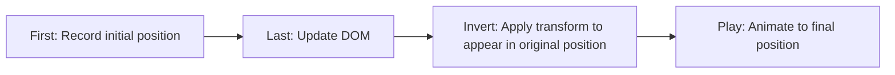

# Vue.js List Animations

## Introduction

When building modern web applications, smooth and elegant animations can significantly enhance the user experience. Vue.js provides powerful tools for animating elements, and one of the most practical applications is animating lists as items are added, removed, or reordered.

In this tutorial, we'll explore how to implement beautiful list animations in Vue.js using the built-in `<TransitionGroup>` component. By the end of this guide, you'll be able to create fluid, responsive list animations that make your applications feel polished and professional.

## Understanding Vue.js List Animation Basics

Vue.js provides the `<TransitionGroup>` component specifically designed for animating lists where multiple elements are being inserted, removed, or moved. Unlike the regular `<Transition>` component, `<TransitionGroup>` renders an actual element (by default, a `<span>`) and keeps track of elements with the `key` attribute to animate them properly.

### Key Concepts

- **`<TransitionGroup>`**: A specialized component for list transitions
- **CSS Classes**: Similar to `<Transition>`, but with additional move-related classes
- **FLIP Animation Technique**: For efficient transformations (First, Last, Invert, Play)
- **Key Attribute**: Required for Vue to track individual list items

## Basic List Animation Example

Let's start with a simple example to show how `<TransitionGroup>` works:

```html
<template>
  <div>
    <button @click="addItem">Add Item</button>
    <button @click="removeItem">Remove Item</button>
    
    <TransitionGroup name="list" tag="ul">
      <li v-for="item in items" :key="item.id" class="list-item">
        {{ item.text }}
      </li>
    </TransitionGroup>
  </div>
</template>

<script>
export default {
  data() {
    return {
      nextId: 3,
      items: [
        { id: 1, text: 'Item 1' },
        { id: 2, text: 'Item 2' }
      ]
    }
  },
  methods: {
    addItem() {
      this.items.push({
        id: this.nextId++,
        text: `Item ${this.nextId - 1}`
      })
    },
    removeItem() {
      if (this.items.length) {
        this.items.splice(Math.floor(Math.random() * this.items.length), 1)
      }
    }
  }
}
</script>

<style>
.list-item {
  display: inline-block;
  margin-right: 10px;
}

.list-enter-active,
.list-leave-active {
  transition: all 0.5s ease;
}

.list-enter-from,
.list-leave-to {
  opacity: 0;
  transform: translateY(30px);
}

.list-move {
  transition: transform 0.5s ease;
}
</style>
```

### How This Works

1. We define a list of items in the data property
2. We use `<TransitionGroup>` with a name of "list" and tell it to render as a `<ul>` element
3. Each list item has a unique key (required!)
4. We define CSS transitions for:
   - Items entering the list (`.list-enter-active`, `.list-enter-from`)
   - Items leaving the list (`.list-leave-active`, `.list-leave-to`)
   - Items changing position (`.list-move`)

When you add or remove items, you'll see them fade and slide into place, with existing items smoothly moving to accommodate the changes.

## CSS Classes for List Animations

The `<TransitionGroup>` component uses the following CSS classes (where "name" is the name you provide):

- **Enter transitions**:
  - `name-enter-from`: Initial state when entering
  - `name-enter-active`: State during the entire entering phase
  - `name-enter-to`: Ending state of entering

- **Leave transitions**:
  - `name-leave-from`: Initial state when leaving
  - `name-leave-active`: State during the entire leaving phase
  - `name-leave-to`: Ending state of leaving

- **Move transitions** (unique to `<TransitionGroup>`):
  - `name-move`: Applied during the movement phase

## Staggered List Animations

For a more sophisticated effect, we can create staggered animations where list items animate one after another with a slight delay.

```html
<template>
  <div>
    <button @click="shuffle">Shuffle</button>
    <button @click="add">Add</button>
    <button @click="remove">Remove</button>
    
    <TransitionGroup name="staggered-list" tag="ul" class="staggered-list">
      <li v-for="(item, index) in list" :key="item.id" :data-index="index">
        {{ item.text }}
      </li>
    </TransitionGroup>
  </div>
</template>

<script>
export default {
  data() {
    return {
      list: Array.from({ length: 5 }, (_, i) => ({
        id: i,
        text: `Item ${i + 1}`
      })),
      nextId: 5
    }
  },
  methods: {
    shuffle() {
      this.list = [...this.list].sort(() => Math.random() - 0.5)
    },
    add() {
      this.list.push({
        id: this.nextId++,
        text: `Item ${this.nextId}`
      })
    },
    remove() {
      if (this.list.length) {
        this.list.splice(Math.floor(Math.random() * this.list.length), 1)
      }
    }
  }
}
</script>

<style>
.staggered-list {
  padding: 0;
}

.staggered-list li {
  display: block;
  margin: 10px;
  padding: 10px 20px;
  background-color: #f8f8f8;
  border-radius: 4px;
}

.staggered-list-enter-active,
.staggered-list-leave-active {
  transition: all 0.5s ease;
}

.staggered-list-enter-from,
.staggered-list-leave-to {
  opacity: 0;
  transform: translateX(30px);
}

.staggered-list-leave-active {
  position: absolute;
}

.staggered-list-move {
  transition: transform 0.5s;
}

/* Creating the staggered effect using data-index */
.staggered-list-enter-active {
  transition-delay: calc(0.1s * var(--index));
}

/* Add this to your global CSS */
li {
  --index: attr(data-index int);
}
</style>
```

In this example, we're using the `data-index` attribute and CSS variables to create a staggered delay effect. Each item will animate with a slight delay after the previous one.

## Practical Example: Animated Todo List

Let's build a more practical example - an animated todo list application:

```html
<template>
  <div class="todo-container">
    <h2>Todo List with Animations</h2>
    
    <form @submit.prevent="addTodo" class="todo-form">
      <input 
        v-model="newTodo" 
        placeholder="Add a new task..." 
        class="todo-input"
      />
      <button type="submit" class="todo-button">Add</button>
    </form>
    
    <TransitionGroup name="todo-list" tag="ul" class="todo-list">
      <li v-for="todo in todos" :key="todo.id" class="todo-item">
        <div class="todo-content">
          <input 
            type="checkbox" 
            v-model="todo.completed" 
            class="todo-checkbox"
          />
          <span :class="{ 'completed': todo.completed }">{{ todo.text }}</span>
        </div>
        <button @click="removeTodo(todo.id)" class="delete-button">×</button>
      </li>
    </TransitionGroup>
    
    <div class="filters">
      <button @click="filter = 'all'" :class="{ active: filter === 'all' }">All</button>
      <button @click="filter = 'active'" :class="{ active: filter === 'active' }">Active</button>
      <button @click="filter = 'completed'" :class="{ active: filter === 'completed' }">Completed</button>
    </div>
  </div>
</template>

<script>
export default {
  data() {
    return {
      newTodo: '',
      filter: 'all',
      todos: [
        { id: 1, text: 'Learn Vue.js', completed: false },
        { id: 2, text: 'Build a todo app', completed: false },
        { id: 3, text: 'Add animations', completed: false }
      ],
      nextId: 4
    }
  },
  computed: {
    filteredTodos() {
      if (this.filter === 'active') {
        return this.todos.filter(todo => !todo.completed)
      } else if (this.filter === 'completed') {
        return this.todos.filter(todo => todo.completed)
      }
      return this.todos
    }
  },
  methods: {
    addTodo() {
      if (this.newTodo.trim()) {
        this.todos.push({
          id: this.nextId++,
          text: this.newTodo,
          completed: false
        })
        this.newTodo = ''
      }
    },
    removeTodo(id) {
      const index = this.todos.findIndex(todo => todo.id === id)
      if (index !== -1) {
        this.todos.splice(index, 1)
      }
    }
  }
}
</script>

<style>
.todo-container {
  max-width: 500px;
  margin: 0 auto;
  padding: 20px;
}

.todo-form {
  display: flex;
  margin-bottom: 20px;
}

.todo-input {
  flex: 1;
  padding: 8px;
  border: 1px solid #ddd;
  border-radius: 4px 0 0 4px;
}

.todo-button {
  padding: 8px 16px;
  background-color: #4caf50;
  color: white;
  border: none;
  border-radius: 0 4px 4px 0;
  cursor: pointer;
}

.todo-list {
  list-style-type: none;
  padding: 0;
}

.todo-item {
  display: flex;
  justify-content: space-between;
  align-items: center;
  padding: 12px;
  background-color: #f9f9f9;
  margin-bottom: 8px;
  border-radius: 4px;
}

.completed {
  text-decoration: line-through;
  color: #888;
}

.delete-button {
  background-color: #ff5252;
  color: white;
  border: none;
  border-radius: 50%;
  width: 24px;
  height: 24px;
  cursor: pointer;
  font-size: 18px;
  display: flex;
  justify-content: center;
  align-items: center;
}

.filters {
  display: flex;
  justify-content: center;
  gap: 10px;
  margin-top: 20px;
}

.filters button {
  padding: 5px 10px;
  border: 1px solid #ddd;
  background-color: white;
  border-radius: 4px;
  cursor: pointer;
}

.filters button.active {
  background-color: #42b983;
  color: white;
  border-color: #42b983;
}

/* Animations */
.todo-list-enter-active,
.todo-list-leave-active {
  transition: all 0.5s ease;
}

.todo-list-enter-from {
  opacity: 0;
  transform: translateX(30px);
}

.todo-list-leave-to {
  opacity: 0;
  transform: translateX(-30px);
}

.todo-list-move {
  transition: transform 0.5s ease;
}

.todo-list-leave-active {
  position: absolute;
}
</style>
```

This todo list example demonstrates how animations can make even a simple application feel more polished and responsive. The animations provide visual feedback when:

1. Adding a new todo (slides in from the right)
2. Removing a todo (slides out to the left)
3. Filtering todos (existing todos smoothly reorganize)

## Advanced Techniques

### Animate Based on Data Changes

You can create animations that respond to data changes, not just element presence:

```html
<template>
  <TransitionGroup name="list" tag="ul">
    <li 
      v-for="item in items" 
      :key="item.id"
      :class="{ 'highlight': item.isUpdated }"
    >
      {{ item.text }}
    </li>
  </TransitionGroup>
</template>

<style>
.highlight {
  animation: highlight 2s;
}

@keyframes highlight {
  0% { background-color: yellow; }
  100% { background-color: transparent; }
}
</style>
```

### Combining with JavaScript Hooks

For more complex animations, you can use JavaScript hooks:

```html
<template>
  <TransitionGroup
    name="list"
    tag="ul"
    @before-enter="beforeEnter"
    @enter="enter"
    @leave="leave"
  >
    <li v-for="(item, index) in items" :key="item.id" :data-index="index">
      {{ item.text }}
    </li>
  </TransitionGroup>
</template>

<script>
export default {
  // ... other options
  methods: {
    beforeEnter(el) {
      el.style.opacity = 0
      el.style.height = '0px'
    },
    enter(el, done) {
      const delay = el.dataset.index * 150
      setTimeout(() => {
        el.style.opacity = 1
        el.style.height = '40px'
      }, delay)
      
      // Call done when the animation is complete
      setTimeout(done, delay + 300)
    },
    leave(el, done) {
      el.style.opacity = 0
      el.style.height = '0px'
      setTimeout(done, 300)
    }
  }
}
</script>
```

## Best Practices for List Animations

1. **Keep animations subtle and quick** - Animations should enhance, not distract. Aim for 300-500ms durations.

2. **Always use the `key` attribute** - This is essential for Vue to track elements correctly during animations.

3. **Use `position: absolute` for leave animations** - Add `.list-leave-active { position: absolute; }` to prevent layout shifts during leave animations.

4. **Be mindful of performance** - Animate properties that are cheap for the browser (transform and opacity are best).

5. **Test on mobile devices** - Ensure animations run smoothly on less powerful devices.

## Understanding the FLIP Animation Technique

Vue's `<TransitionGroup>` uses the FLIP technique (First, Last, Invert, Play) for efficient animations:



This technique allows Vue to perform smooth animations even when many items are moving simultaneously.

## Summary

In this tutorial, we've explored Vue.js list animations using the `<TransitionGroup>` component. We've learned:

- The basics of `<TransitionGroup>` and how it differs from `<Transition>`
- How to apply enter, leave, and move animations to lists
- Creating staggered animations for more dynamic effects
- Building practical examples like an animated todo list
- Advanced techniques and best practices for smooth animations

By implementing these techniques in your Vue.js applications, you can create more engaging and polished user interfaces that provide visual feedback and make your applications feel more responsive.

## Additional Resources and Exercises

### Further Learning Resources
- [Vue.js Official Guide on List Transitions](https://vuejs.org/guide/built-ins/transition-group.html)
- [CSS Animations and Transitions Guide](https://developer.mozilla.org/en-US/docs/Web/CSS/CSS_Animations/Using_CSS_animations)

### Practice Exercises

1. **Modify the Todo List App**: Add a staggered animation effect to the todo items.

2. **Create a Kanban Board**: Build a simple kanban board where tasks can be moved between columns with smooth animations.

3. **Animated Shopping Cart**: Implement a shopping cart where adding/removing items triggers animations.

4. **Sortable List**: Create a list that can be sorted by different criteria with smooth transitions between sorting states.

5. **Challenge**: Build a grid layout with items that animate when filtered or rearranged, similar to how photo gallery websites animate their layouts.

By practicing these exercises, you'll gain confidence in implementing list animations that enhance your Vue.js applications and provide a more engaging user experience.