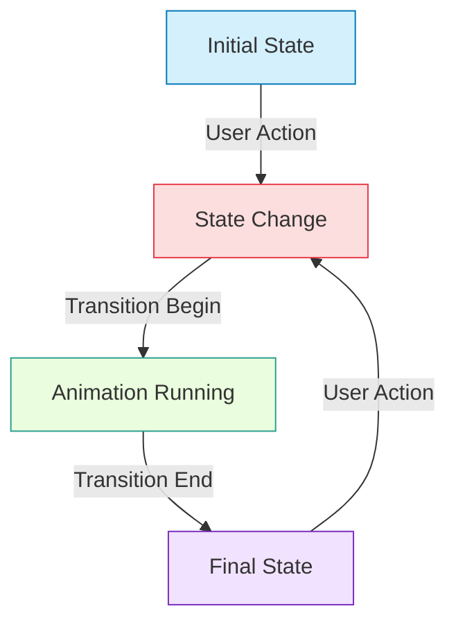

# Vue.js State Transitions

## Introduction

State transitions in Vue.js are a powerful way to provide visual feedback when data in your application changes. Unlike standard element transitions that focus on DOM elements entering and leaving, state transitions animate the changes between different values of a property or state. This creates more fluid, intuitive user interfaces that can better express the relationship between different application states.

In this tutorial, we'll explore how to implement smooth state transitions in Vue.js, from basic numeric value transitions to complex data visualization animations.

## Understanding State Transitions

State transitions involve animating between different values or states in your application. Unlike standard transitions that trigger when elements are inserted or removed from the DOM, state transitions occur when:

- A numeric value changes
- An object property updates
- A data collection is modified
- The application moves between different logical states

Vue provides several mechanisms to implement these transitions smoothly.

## Basic Numeric Transitions

The simplest form of state transition is animating a change in a numeric value.

### Using Vue's Transition Hooks

```html
<template>
  <div>
    <button @click="increment">Increment</button>
    <div class="counter">{{ displayNumber }}</div>
  </div>
</template>

<script>
import gsap from 'gsap'

export default {
  data() {
    return {
      number: 0,
      displayNumber: 0
    }
  },
  methods: {
    increment() {
      this.number += 10
    }
  },
  watch: {
    number(newValue) {
      gsap.to(this.$data, {
        duration: 0.5,
        displayNumber: newValue
      })
    }
  }
}
</script>

<style>
.counter {
  font-size: 2em;
  margin-top: 1em;
}
</style>
```

In this example, clicking the button increases the actual number by 10, but the displayed value animates smoothly to the new value using GSAP (GreenSock Animation Platform). The animation occurs over 0.5 seconds, creating a fluid transition between states.

## Transitioning CSS Properties Based on State

We can transition CSS properties based on state changes using Vue's class binding and CSS transitions.

```html
<template>
  <div>
    <button @click="toggleMood">Toggle Mood</button>
    <div class="mood-indicator" :class="{ happy: isHappy }">
      {{ isHappy ? 'Happy! 😄' : 'Sad 😢' }}
    </div>
  </div>
</template>

<script>
export default {
  data() {
    return {
      isHappy: true
    }
  },
  methods: {
    toggleMood() {
      this.isHappy = !this.isHappy
    }
  }
}
</script>

<style>
.mood-indicator {
  padding: 20px;
  background-color: #f1c0c0;
  color: #333;
  border-radius: 8px;
  margin-top: 1em;
  transition: all 0.5s ease;
}

.mood-indicator.happy {
  background-color: #c0f1c0;
  transform: scale(1.05);
}
</style>
```

In this example, we use CSS transitions to animate the background color and scale of the element when the `isHappy` state changes. The transition property in CSS handles the animation between states.

## Animating List State Changes with Vue's Transition Group

Vue's `<TransitionGroup>` component allows us to animate list changes such as reordering, addition, or removal. Here's an example that sorts a list of items:

```html
<template>
  <div>
    <button @click="shuffleItems">Shuffle</button>
    <button @click="sortItems">Sort</button>
    
    <TransitionGroup name="list" tag="ul" class="item-list">
      <li v-for="item in items" :key="item.id" class="list-item">
        {{ item.name }} ({{ item.value }})
      </li>
    </TransitionGroup>
  </div>
</template>

<script>
export default {
  data() {
    return {
      items: [
        { id: 1, name: 'Apple', value: 3 },
        { id: 2, name: 'Banana', value: 5 },
        { id: 3, name: 'Cherry', value: 2 },
        { id: 4, name: 'Date', value: 8 },
        { id: 5, name: 'Elderberry', value: 1 }
      ]
    }
  },
  methods: {
    shuffleItems() {
      this.items = [...this.items].sort(() => Math.random() - 0.5)
    },
    sortItems() {
      this.items = [...this.items].sort((a, b) => a.value - b.value)
    }
  }
}
</script>

<style>
.item-list {
  list-style: none;
  padding: 0;
}

.list-item {
  padding: 10px;
  margin: 5px 0;
  background-color: #f5f5f5;
  border-radius: 4px;
  transition: all 0.5s;
}

.list-move {
  transition: transform 0.5s;
}

.list-enter-active,
.list-leave-active {
  transition: all 0.5s;
}

.list-enter-from,
.list-leave-to {
  opacity: 0;
  transform: translateX(30px);
}
</style>
```

This example demonstrates how to animate list reordering. When you click "Shuffle" or "Sort", the list items move to their new positions with a smooth transition. The key CSS classes here are:
- `list-move`: handles the movement animation
- `list-enter-active` and `list-leave-active`: define transitions for adding/removing items
- `list-enter-from` and `list-leave-to`: define the starting/ending states

## Complex State Transitions with Vuex

For larger applications, we often manage state with Vuex. We can implement state transitions when Vuex state changes as well.

```html
<template>
  <div class="weather-widget">
    <h2>Weather: {{ currentWeather }}</h2>
    <div class="temperature" :class="temperatureClass">
      {{ formattedTemperature }}°C
    </div>
    
    <button @click="simulateWeatherChange">Simulate Weather Change</button>
  </div>
</template>

<script>
import { mapState } from 'vuex'
import gsap from 'gsap'

export default {
  data() {
    return {
      displayTemperature: 0
    }
  },
  computed: {
    ...mapState(['temperature', 'weather']),
    currentWeather() {
      return this.weather
    },
    formattedTemperature() {
      return this.displayTemperature.toFixed(1)
    },
    temperatureClass() {
      if (this.temperature > 25) return 'hot'
      if (this.temperature < 10) return 'cold'
      return 'moderate'
    }
  },
  watch: {
    temperature(newTemp) {
      gsap.to(this.$data, {
        duration: 1,
        displayTemperature: newTemp,
        ease: 'power2.out'
      })
    }
  },
  mounted() {
    this.displayTemperature = this.temperature
  },
  methods: {
    simulateWeatherChange() {
      // This would dispatch a Vuex action in a real app
      this.$store.dispatch('changeWeather')
    }
  }
}
</script>

<style>
.weather-widget {
  padding: 20px;
  background-color: #f0f8ff;
  border-radius: 10px;
  max-width: 300px;
}

.temperature {
  font-size: 2.5em;
  transition: color 1s ease, transform 0.5s ease;
}

.temperature.hot {
  color: #ff5722;
  transform: scale(1.05);
}

.temperature.cold {
  color: #2196f3;
  transform: scale(0.95);
}

.temperature.moderate {
  color: #4caf50;
  transform: scale(1);
}
</style>
```

For this example to work, you'd need a Vuex store:

```javascript
// store.js
import { createStore } from 'vuex'

export default createStore({
  state: {
    temperature: 22,
    weather: 'Sunny'
  },
  mutations: {
    SET_WEATHER(state, { temperature, weather }) {
      state.temperature = temperature
      state.weather = weather
    }
  },
  actions: {
    changeWeather({ commit }) {
      // Simulate a weather change
      const weathers = ['Sunny', 'Cloudy', 'Rainy', 'Snowy']
      const weather = weathers[Math.floor(Math.random() * weathers.length)]
      
      // Generate a random temperature
      let temperature
      switch (weather) {
        case 'Sunny':
          temperature = 20 + Math.random() * 15
          break
        case 'Cloudy':
          temperature = 15 + Math.random() * 10
          break
        case 'Rainy':
          temperature = 10 + Math.random() * 8
          break
        case 'Snowy':
          temperature = -5 + Math.random() * 10
          break
      }
      
      commit('SET_WEATHER', { temperature, weather })
    }
  }
})
```

This example combines multiple state transition techniques:
1. Using GSAP to animate the temperature number value
2. Using CSS transitions for color and scale based on temperature ranges
3. Reactively updating the display when the Vuex state changes

## Data Visualization State Transitions

One powerful application of state transitions is in data visualization. Here's an example of a simple bar chart that animates when data changes:

```html
<template>
  <div class="chart-container">
    <h2>Sales by Product</h2>
    
    <div class="chart">
      <div
        v-for="(item, index) in salesData"
        :key="item.id"
        class="bar-container"
      >
        <div class="bar-label">{{ item.product }}</div>
        <div class="bar" :style="{ width: `${item.percentage}%` }">
          {{ item.value }}
        </div>
      </div>
    </div>
    
    <button @click="updateSales">Update Sales Data</button>
  </div>
</template>

<script>
export default {
  data() {
    return {
      salesData: [
        { id: 1, product: 'Laptops', value: 120, percentage: 0 },
        { id: 2, product: 'Phones', value: 80, percentage: 0 },
        { id: 3, product: 'Tablets', value: 50, percentage: 0 },
        { id: 4, product: 'Accessories', value: 30, percentage: 0 }
      ]
    }
  },
  methods: {
    calculatePercentages() {
      const max = Math.max(...this.salesData.map(item => item.value))
      this.salesData.forEach(item => {
        // Animate each bar to its percentage width
        gsap.to(item, {
          percentage: (item.value / max) * 100,
          duration: 1,
          ease: 'power2.out'
        })
      })
    },
    updateSales() {
      // Generate new random sales values
      this.salesData = this.salesData.map(item => ({
        ...item,
        value: Math.round(Math.random() * 200 + 20)
      }))
      
      // Animate to the new percentages
      this.$nextTick(() => {
        this.calculatePercentages()
      })
    }
  },
  mounted() {
    this.calculatePercentages()
  }
}
</script>

<style>
.chart-container {
  max-width: 600px;
  margin: 0 auto;
}

.chart {
  margin: 30px 0;
}

.bar-container {
  display: flex;
  align-items: center;
  margin-bottom: 10px;
}

.bar-label {
  width: 100px;
  text-align: right;
  padding-right: 15px;
}

.bar {
  background-color: #42b883;
  height: 30px;
  display: flex;
  align-items: center;
  padding: 0 10px;
  color: white;
  border-radius: 3px;
  transition: width 1s ease;
}
</style>
```

This chart demonstrates state transitions by animating the bar widths when the data changes. GSAP is used to animate the percentage property of each bar, which is then mapped to the width via CSS.

## Best Practices for State Transitions

Here are some key best practices to keep in mind when implementing state transitions:

1. **Use appropriate timing**: Transitions should be quick enough not to impede user experience (typically 150-500ms), but slow enough to be noticeable.

2. **Choose the right easing**: Linear transitions rarely look natural. Consider easing functions like `ease-out` for more natural motion.

3. **Avoid transitioning too many properties**: Transitioning many properties simultaneously can be computationally expensive and visually distracting.

4. **Always consider accessibility**: Some users may prefer reduced motion. Honor the `prefers-reduced-motion` media query:

```css
@media (prefers-reduced-motion: reduce) {
  .bar {
    transition: none;
  }
}
```

5. **Use hardware acceleration for smoother animations**:

```css
.animated-element {
  transform: translateZ(0);
  will-change: transform;
}
```

## When to Use State Transitions

State transitions are particularly useful for:

1. **Data visualization**: Charts, graphs, and statistics that update
2. **Progress indicators**: Loading bars, completion rings, etc.
3. **User interactions**: Responding to user input with visual feedback
4. **Application state changes**: Moving between different modes or views
5. **Form interactions**: Validations, submissions, and error states

## Visualizing State Flow

Here's a diagram showing the flow of state changes and animations:



## Summary

State transitions in Vue.js provide a powerful way to enhance user experience by animating changes in your application's data. From basic numeric transitions to complex data visualizations, Vue offers various tools to implement smooth and intuitive animations:

1. **Basic numeric transitions**: Using watchers and animation libraries like GSAP
2. **CSS property transitions**: Leveraging Vue's class binding with CSS transitions
3. **List transitions**: Using Vue's `<TransitionGroup>` for animated lists
4. **State management transitions**: Integrating animations with Vuex state changes
5. **Data visualization**: Creating responsive, animated data representations

By thoughtfully implementing state transitions, you can create interfaces that not only look better but also communicate more effectively with users, making your application more intuitive and engaging.

## Additional Resources

- [Vue.js Official Transition Documentation](https://vuejs.org/guide/built-ins/transition.html)
- [GSAP Documentation](https://greensock.com/docs/)
- [CSS Animations and Transitions Guide](https://developer.mozilla.org/en-US/docs/Web/CSS/CSS_Animations/Using_CSS_animations)

## Exercises

1. Build a counter component that animates between values with different easing functions.
2. Create a todo list that animates items as they're added, removed, or completed.
3. Implement a weather widget that transitions between weather states (sunny, rainy, etc.) with appropriate animations.
4. Build a simple data dashboard with at least two types of charts that animate when data changes.
5. Create a form with animated validation feedback that shows when fields are valid or invalid.