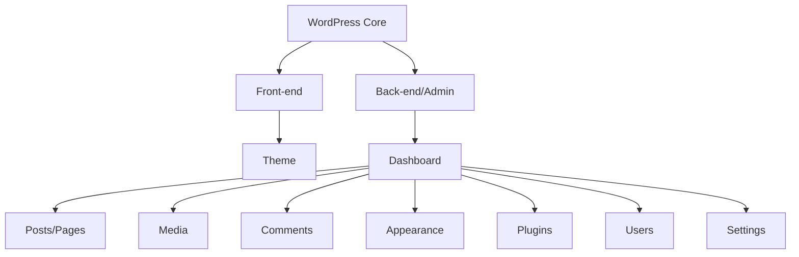

# WordPress Introduction

## What is WordPress?

<div style={{
    "width": "20%",
    "margin": "0 auto",
    "text-align": "center"
}}>
    
</div>

WordPress is a free and open-source content management system (CMS) that allows you to create and manage websites without needing advanced technical knowledge. Originally launched in 2003 as a blogging platform, WordPress has evolved into a versatile system that powers approximately 43% of all websites on the internet, from simple blogs to complex e-commerce sites and enterprise-level applications.

## Why Use WordPress?

WordPress offers numerous advantages that make it an excellent choice for beginners and professionals alike:

- **User-friendly:** Intuitive interface that requires minimal technical knowledge
- **Customizable:** Thousands of themes and plugins to extend functionality
- **SEO-friendly:** Built-in features that help with search engine optimization
- **Community support:** Large community of users and developers
- **Open-source:** Free to use with regular updates and improvements
- **Scalable:** Can grow with your needs, from a simple blog to a complex website

## WordPress.org vs WordPress.com

Before diving deeper, it's important to understand the difference between WordPress.org and WordPress.com:

| Feature      | WordPress.org                       | WordPress.com                    |
|--------------|-------------------------------------|----------------------------------|
| Cost         | Free software (hosting costs apply) | Freemium model with paid plans   |
| Hosting      | Self-hosted (you choose provider)   | Managed by Automattic            |
| Control      | Complete control over site          | Limited control on free plans    |
| Plugins      | Full access to plugins              | Limited access (paid plans only) |
| Monetization | No restrictions                     | Restrictions on free plans       |

For learning WordPress fundamentals, we'll focus on WordPress.org (self-hosted), as it provides full access to all features and functionality.

## WordPress Core Components

Understanding WordPress starts with knowing its basic structure:



### The Dashboard

The WordPress dashboard (or admin area) is where you manage your website. To access it, add `/wp-admin` to your domain (e.g., `yourwebsite.com/wp-admin`).

### Content Types

WordPress has two primary content types:

1. **Posts** - Chronological content typically used for blogs, news, or updates
2. **Pages** - Static content like "About Us" or "Contact" pages

### Themes

Themes control the appearance and layout of your WordPress site. You can change your site's look by activating different themes.

### Plugins

Plugins extend WordPress functionality. They can add features from contact forms to e-commerce capabilities.

## Setting Up WordPress (Local Environment)

For learning purposes, setting up a local WordPress environment is beneficial. Here's a simple way using Local by Flywheel:

1. Download Local from [localwp.com](https://localwp.com) (available for Windows, Mac, and Linux)
2. Install and open Local
3. Click "Create a new site"
4. Follow the setup wizard:
   - Enter a site name
   - Choose "Preferred" environment
   - Set username, password, and email for WordPress admin
5. Click "Start site" when setup is complete

Once installed, you can access your local WordPress site and its admin area directly from Local's interface.

## Creating Your First WordPress Page

Let's create a simple "Welcome" page:

1. Log in to your WordPress admin (yoursite.com/wp-admin)
2. Navigate to Pages → Add New
3. Enter a title for your page (e.g., "Welcome to My Website")
4. Add content using the block editor
5. Click "Publish" to make the page live

The block editor (Gutenberg) allows you to add various content blocks:

```php
// This is a conceptual representation, not actual code
// In WordPress, you would use the visual block editor

// Paragraph block
<p>Welcome to my website! This is my first WordPress page.</p>

// Heading block
<h2>About This Site</h2>

// Image block


// List block
<ul>
  <li>Learn about our services</li>
  <li>Read our latest blog posts</li>
  <li>Contact us for more information</li>
</ul>
```

## WordPress Files and Directory Structure

Understanding WordPress's file structure helps when you need to customize your site:

```
wordpress/
├── wp-admin/           # WordPress administration files
├── wp-content/         # Your content (themes, plugins, uploads)
│   ├── plugins/        # Plugin files
│   ├── themes/         # Theme files
│   └── uploads/        # Uploaded media files
├── wp-includes/        # Core WordPress functionality
├── index.php           # Main index file
├── wp-config.php       # Configuration file
└── [other WordPress files]
```

As a WordPress user, you'll mostly interact with the `wp-content` directory, which contains your themes, plugins, and media uploads.

## The WordPress Database

WordPress stores content and settings in a MySQL database with a structure of tables:

- `wp_posts`: Contains all posts, pages, and custom post types
- `wp_users`: User account information
- `wp_options`: Site settings and configuration
- `wp_comments`: Comments on posts and pages
- `wp_terms`: Categories, tags, and custom taxonomies
- And several other relational tables

The database structure allows WordPress to dynamically generate pages when visitors access your site.

## Customizing Your WordPress Site

After installation, you'll want to customize your site:

1. **Choose a theme** - Go to Appearance → Themes to select and activate a theme
2. **Install essential plugins** - Navigate to Plugins → Add New
3. **Configure settings** - Update site title, tagline, and other settings under Settings
4. **Create navigation menus** - Set up menus under Appearance → Menus
5. **Set up your homepage** - Define a static page or blog posts display under Settings → Reading

## A Simple Plugin Example

To understand how plugins extend WordPress, let's look at a simple plugin structure:

```php
<?php
/**
 * Plugin Name: My First Plugin
 * Description: A simple plugin that adds a greeting to the footer
 * Version: 1.0
 * Author: Your Name
 */

// Add greeting to footer
function my_first_plugin_footer_greeting() {
  echo '<p>Thank you for visiting my WordPress site!</p>';
}
add_action('wp_footer', 'my_first_plugin_footer_greeting');
```

This plugin would display a greeting in the footer of every page on your WordPress site.

## Summary

WordPress provides a powerful yet accessible platform for creating websites. In this introduction, we've covered:

- What WordPress is and why it's popular
- The difference between WordPress.org and WordPress.com
- Core components of WordPress
- Setting up a local WordPress environment
- Creating basic content
- Understanding the file and database structure
- Basic customization options

As you continue your WordPress journey, you'll discover its extensive capabilities for creating virtually any type of website.

## Additional Resources

To further develop your WordPress skills:

- Official WordPress Documentation: [wordpress.org/support](https://wordpress.org/support/)
- WordPress Codex: [codex.wordpress.org](https://codex.wordpress.org/)
- WordPress Developer Resources: [developer.wordpress.org](https://developer.wordpress.org/)

## Exercises

1. Set up a local WordPress installation and create a simple "About Me" page.
2. Install and activate a different theme, then note the changes to your site's appearance.
3. Create a blog post with different content blocks (headings, paragraphs, lists, and an image).
4. Explore the WordPress dashboard and identify five settings you can adjust to customize your site.
5. Create a custom menu and add it to your site's primary navigation area.

In the next lesson, we'll dive deeper into WordPress themes and how they control your site's appearance.