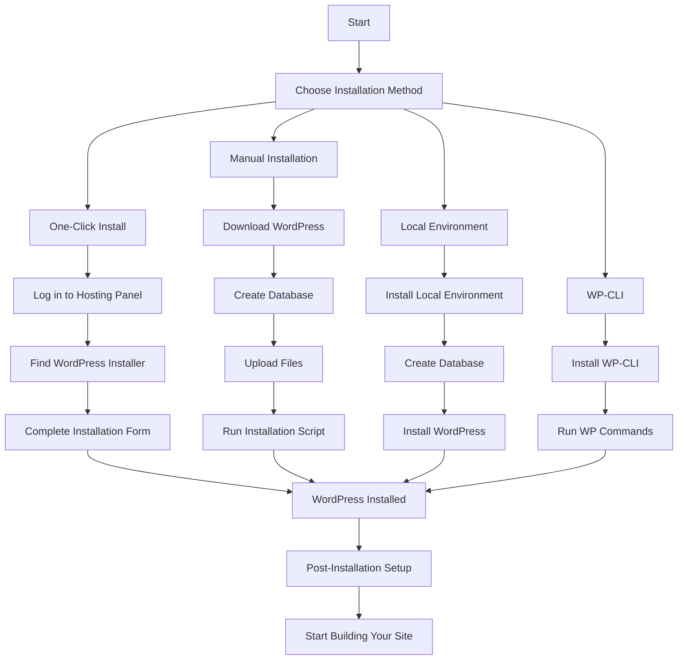

# WordPress Installation

## Introduction

WordPress is one of the most popular content management systems (CMS) in the world, powering approximately 42% of all websites on the internet. Before you can start building your website with WordPress, you need to install it. This guide will walk you through different methods of WordPress installation, from the famous "5-minute install" to using local development environments.

By the end of this tutorial, you'll be able to:
- Install WordPress on a web hosting server
- Set up WordPress locally on your computer
- Understand the requirements for running WordPress
- Configure the basic settings after installation

## WordPress Requirements

Before you begin the installation process, make sure your system meets the following requirements:

- PHP version 7.4 or greater
- MySQL version 5.7 or greater OR MariaDB version 10.3 or greater
- HTTPS support (recommended)
- A web server: Apache, Nginx, or Microsoft IIS

For the best experience, WordPress recommends:

```
PHP 8.0 or greater
MySQL 8.0 or MariaDB 10.5 or greater
HTTPS support
```

## Installation Methods

There are several ways to install WordPress. Let's explore the most common ones:

### Method 1: Using a Web Host's One-Click Installer

Many web hosting services offer "one-click" WordPress installations through their control panel.

**Step-by-step process:**

1. Log in to your hosting control panel (often cPanel, Plesk, or a custom dashboard)
2. Look for a section called "WordPress Installer," "CMS Installers," or "Website"
3. Select WordPress from the available applications
4. Fill in the required information:
   - Site name
   - Admin username (avoid using "admin" for security reasons)
   - Strong password
   - Admin email
5. Choose the domain or subdomain where you want to install WordPress
6. Click "Install" and wait for the process to complete

This method is the easiest but offers less control over the installation process.

### Method 2: The Famous 5-Minute Install

This is the manual installation process described by WordPress as taking only 5 minutes.

**Step-by-step process:**

1. **Download WordPress**: Visit [WordPress.org](https://wordpress.org/download/) and download the latest version.

2. **Create a Database**: In your hosting control panel, create a new MySQL database and database user.

3. **Extract WordPress Files**: Extract the WordPress zip file you downloaded.

4. **Upload WordPress Files**: Using FTP or your hosting file manager, upload the extracted files to your server (either in the root directory or a specific folder).

5. **Run the Installation Script**: Visit your website URL in a browser. You'll be guided through the setup process.

6. **Configure WordPress**:

```
Site Title: My Awesome Website
Username: your_username (not "admin")
Password: a_strong_password
Your Email: your_email@example.com
Search Engine Visibility: Check if you want search engines to index your site
```

7. Click "Install WordPress" and you're done!

### Method 3: Installing WordPress Locally

For development purposes, you might want to install WordPress on your local machine.

#### Using Local by Flywheel

[Local by Flywheel](https://localwp.com/) is a free local WordPress development tool.

**Step-by-step process:**

1. Download and install Local from their website
2. Open Local and click "Create a new site"
3. Enter your site name and choose a location to store files
4. Choose "Custom" for your environment to customize settings
5. Configure your environment settings (PHP version, web server, etc.)
6. Set up your WordPress admin account
7. Click "Add Site" and wait for installation to complete

#### Using XAMPP/MAMP/WAMP

These are local server environments for different operating systems.

**Step-by-step process:**

1. Download and install [XAMPP](https://www.apachefriends.org/), [MAMP](https://www.mamp.info/), or [WAMP](https://www.wampserver.com/) based on your operating system
2. Start the services (Apache and MySQL)
3. Create a database using phpMyAdmin (usually accessible at http://localhost/phpmyadmin)
4. Download WordPress and extract it to your server's document root folder (e.g., `htdocs` for XAMPP)
5. Navigate to http://localhost/your-wordpress-folder in your browser
6. Follow the installation wizard as described in Method 2

### Method 4: Using WP-CLI (Command Line Interface)

For developers comfortable with command line, WP-CLI offers the fastest method.

**Step-by-step process:**

1. Install WP-CLI by following the [official instructions](https://wp-cli.org/#installing)
2. Create a database for WordPress
3. Navigate to your web server directory
4. Run the following commands:

```bash
# Download WordPress core files
wp core download

# Create the wp-config.php file
wp config create --dbname=your_database --dbuser=your_dbuser --dbpass=your_dbpassword --dbhost=localhost

# Run the installation
wp core install --url=example.com --title="WordPress Site" --admin_user=administrator --admin_password=your_password --admin_email=your_email@example.com
```

## Post-Installation Setup

After installing WordPress, you should:

1. **Choose a Theme**: Go to Appearance > Themes to select and customize your site's appearance.
2. **Install Essential Plugins**: Navigate to Plugins > Add New to extend your site's functionality.
3. **Configure Permalinks**: Go to Settings > Permalinks and choose a URL structure that works for you.
4. **Set Up Security**: Install security plugins and set up proper authentication.
5. **Create Essential Pages**: Create an About page, Contact page, Privacy Policy, etc.

## WordPress Installation Flow



## Common Installation Issues and Solutions

### "Error establishing a database connection"
- **Cause**: Incorrect database credentials in wp-config.php
- **Solution**: Double-check your database name, username, password, and host

### White screen after installation
- **Cause**: Often a PHP memory limit issue
- **Solution**: Increase PHP memory limit in wp-config.php:

```php
define('WP_MEMORY_LIMIT', '256M');
```

### 500 Internal Server Error
- **Cause**: Server configuration issues or plugin conflicts
- **Solution**: Check server error logs and temporarily disable plugins

## Practical Example: Setting Up a Blog

Let's walk through a real-world example of setting up a blog using WordPress:

1. **Install WordPress** using your preferred method (we'll use the manual method for this example)
2. **Log in to WordPress** admin dashboard (usually at yoursite.com/wp-admin)
3. **Choose a blog theme**: Go to Appearance > Themes > Add New and search for a blog theme like "Astra" or "GeneratePress"
4. **Install essential plugins**:
   - Yoast SEO for search engine optimization
   - Akismet for spam protection
   - WPForms Lite for contact forms
5. **Create content structure**:
   - Set up categories for your blog posts
   - Create an "About" page and "Contact" page
6. **Configure settings**:
   - Settings > Reading: Set your homepage display
   - Settings > Discussion: Configure comment settings
   - Settings > Permalinks: Choose "Post name" structure

This gives you a fully functional blog ready for content creation.

## Summary

In this guide, we covered multiple ways to install WordPress:
- Using one-click installers provided by hosting companies
- Manual installation (the famous 5-minute install)
- Setting up WordPress locally for development
- Using WP-CLI for command-line installation

We also discussed post-installation steps and troubleshooting common issues. WordPress installation is the first step in your journey of building a website or blog with this powerful CMS.

## Additional Resources

Here are some resources to further enhance your WordPress knowledge:

1. [WordPress Codex](https://wordpress.org/support/) - Official WordPress documentation
2. [WordPress.tv](https://wordpress.tv/) - Video tutorials and WordPress event recordings
3. [WordPress Forums](https://wordpress.org/support/forums/) - Community support for troubleshooting

## Exercises

1. Try installing WordPress using two different methods and compare the experience.
2. After installation, practice customizing your site by changing themes and adding basic plugins.
3. Create a staging environment for your WordPress site using a local installation.
4. Configure essential security settings for your new WordPress installation.
5. Set up a development workflow between your local and live WordPress installations.

By mastering the WordPress installation process, you've taken the first step toward becoming proficient with this powerful content management system.