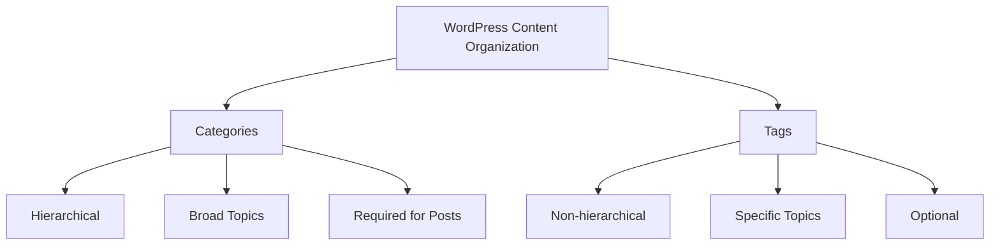

# WordPress Tags

## Introduction

WordPress tags are a fundamental taxonomical feature that provides a way to organize and connect related content on your WordPress website. Unlike categories, which create a broad structure for your content, tags are more specific, granular labels that can identify key topics within your posts. They help visitors navigate your site more effectively and can significantly improve your site's SEO performance when used correctly.

In this guide, we'll explore what WordPress tags are, how they differ from categories, and how to implement them effectively in your WordPress projects.

## What Are WordPress Tags?

WordPress tags are keywords or terms assigned to posts that help describe the content in more specific detail. They are one of the two default taxonomies in WordPress, the other being categories.

Tags serve several important purposes:

- **Content Organization**: They help organize related content across your website
- **Improved Navigation**: They make it easier for visitors to find related content
- **SEO Benefits**: They can improve search engine visibility when used strategically

## Tags vs. Categories: Understanding the Difference

Before diving deeper into tags, let's clarify how they differ from categories:



| Feature | Categories | Tags |
|---------|------------|------|
| **Hierarchy** | Can have parent/child relationships | No hierarchy |
| **Purpose** | Group content into broad topics | Label specific details within posts |
| **Usage** | A post typically belongs to 1-2 categories | A post can have many tags |
| **Requirement** | WordPress encourages using at least one category | Completely optional |

## How to Add and Manage Tags in WordPress

### Adding Tags to a Post

1. While editing a post in the WordPress block editor, locate the "Tags" section in the Document settings panel on the right
2. Enter your tag(s) separated by commas
3. Click "Add" or press Enter

```
// Example tags for a post about WordPress customization
wordpress-themes, custom-css, site-design, responsive-layout
```

### Managing Tags via the Tags Dashboard

To manage all your tags in one place:

1. Navigate to **Posts > Tags** in your WordPress dashboard
2. From here, you can:
   - Add new tags
   - Edit existing tags
   - Delete tags
   - View how many posts use each tag

### Creating a New Tag

To create a new tag from the Tags dashboard:

1. Go to **Posts > Tags**
2. Fill in these fields in the "Add New Tag" section:
   - **Name**: The tag as it appears on your site (e.g., "Custom CSS")
   - **Slug**: The URL-friendly version (e.g., "custom-css")
   - **Description**: Optional explanation of what the tag represents

```jsx
// Example tag creation form data
const newTag = {
  name: "Custom CSS",
  slug: "custom-css",
  description: "Posts related to customizing WordPress with CSS"
};
```

## Tag Best Practices

### Do's and Don'ts

✅ **Do:**
- Use lowercase tags when possible
- Be consistent with your tag naming conventions
- Keep tags concise (1-3 words is ideal)
- Use specific, descriptive terms
- Regularly audit and clean up unused tags

❌ **Don't:**
- Create too many tags with only 1-2 posts
- Use tags that are too similar to each other
- Stuff posts with excessive tags
- Create tags that duplicate category names
- Use special characters that might break URLs

### Optimal Number of Tags

While there's no strict limit, most SEO experts recommend:
- Using **5-10 tags** per post at most
- Ensuring each tag appears in at least **3-5 posts** to establish relevance

## Displaying Tags on Your WordPress Site

Tags can be displayed in various places on your WordPress site:

### In Posts

By default, WordPress displays tags at the end of your posts. The exact appearance depends on your theme, but typically looks something like:

```html
<div class="entry-tags">
  <span class="tags-links">
    Tagged: <a href="/tag/wordpress-themes/" rel="tag">wordpress themes</a>,
    <a href="/tag/custom-css/" rel="tag">custom CSS</a>
  </span>
</div>
```

### Tag Clouds

WordPress offers a Tag Cloud widget that displays your most-used tags with varying font sizes based on their frequency:

1. Go to **Appearance > Widgets**
2. Add the "Tag Cloud" widget to your desired widget area
3. Configure the widget settings (title, number of tags, etc.)
4. Save your changes

### Custom Tag Display with PHP

For more control over how tags are displayed, you can use WordPress template functions:

```php
<?php
if (has_tags()) {
    echo '<div class="custom-tags">';
    echo '<span>This post is tagged: </span>';
    the_tags('<span class="tag">', '</span><span class="tag">', '</span>');
    echo '</div>';
}
?>
```

## Using Tags for SEO

Tags can contribute to your site's SEO when used strategically:

### SEO Benefits of Tags

- Create additional indexable pages (tag archives)
- Establish topical relevance for your content
- Help search engines understand your content's context
- Improve internal linking structure

### Potential SEO Issues to Avoid

- **Duplicate content**: Tag and category pages can sometimes create duplicate content issues
- **Index bloat**: Having too many tag pages with minimal content can dilute your site's SEO value

### Handling Tag Pages in SEO

If you're concerned about SEO issues with tag pages, consider these approaches:

1. **Selective noindex**: Use an SEO plugin like Yoast SEO to add `noindex` tags to tag pages with few posts
2. **Improve tag pages**: Add custom descriptions to your important tag pages
3. **Consolidate**: Regularly audit and merge similar tags

## Practical Examples

### Example 1: Blog Post Tagging Strategy

Let's say you run a cooking blog. Here's how you might structure your categories and tags:

**Categories:**
- Breakfast
- Lunch
- Dinner
- Desserts

**Tags for a pancake recipe post:**
- `pancakes`
- `maple-syrup`
- `breakfast-recipes`
- `easy-recipes`
- `under-30-minutes`

This approach allows readers to find all breakfast recipes via the category, but also find all pancake recipes or all quick recipes via tags.

### Example 2: Creating a Related Posts Section

Tags are excellent for creating related posts sections. Here's a simple code snippet you might use in your theme's `single.php` file:

```php
<?php
$tags = wp_get_post_tags($post->ID);
if ($tags) {
    $tag_ids = array();
    foreach($tags as $tag) $tag_ids[] = $tag->term_id;
    
    $args = array(
        'tag__in' => $tag_ids,
        'post__not_in' => array($post->ID),
        'posts_per_page' => 3,
        'ignore_sticky_posts' => 1
    );
    
    $related_posts = new WP_Query($args);
    
    if ($related_posts->have_posts()) {
        echo '<div class="related-posts">';
        echo '<h3>Related Posts</h3><ul>';
        
        while ($related_posts->have_posts()) {
            $related_posts->the_post();
            echo '<li><a href="' . get_permalink() . '">' . get_the_title() . '</a></li>';
        }
        
        echo '</ul></div>';
    }
    wp_reset_postdata();
}
?>
```

This code finds posts that share tags with the current post and displays them as related content.

## Summary

WordPress tags are a powerful but often underutilized feature that can significantly improve your site's organization and user experience. When used correctly, they:

- Help visitors discover related content
- Improve site navigation
- Create meaningful connections between posts
- Enhance your site's SEO potential

Remember that effective tagging requires consistency and regular maintenance. Take time to develop a coherent tagging strategy, and periodically review your tag structure to ensure it remains valuable to your visitors and search engines alike.

## Further Resources and Exercises

### Resources

- [WordPress Codex: Post Tags](https://wordpress.org/documentation/article/posts-tags-screen/)
- [WordPress Developer Documentation: `wp_tag_cloud()`](https://developer.wordpress.org/reference/functions/wp_tag_cloud/)

### Exercises

1. **Tag Audit**: Export a list of all your WordPress tags and the number of posts using each. Identify any tags with fewer than 3 posts and consider consolidating them.

2. **Tag Strategy Document**: Create a simple document outlining your site's tagging guidelines to ensure consistency, especially if multiple authors contribute to your site.

3. **Custom Tag Display**: Experiment with customizing how tags appear on your posts using CSS to make them more visually appealing.

4. **Tag Navigation Improvement**: Create a custom tag landing page template that includes a brief description of what readers can expect from posts with that tag.

5. **Related Posts Implementation**: Implement the related posts example from this guide and customize it to match your site's design.