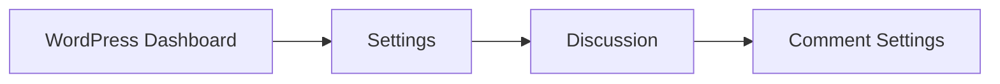

# WordPress Comments

Comments are a powerful engagement tool that enables visitors to interact with your WordPress content. They provide valuable feedback, create community discussions, and increase user engagement. In this guide, you'll learn everything you need to know about managing WordPress comments effectively.

## Understanding WordPress Comments

WordPress comes with a built-in commenting system that allows visitors to leave feedback on your posts and pages. Comments help create a community around your content and provide opportunities for interaction between you and your audience.

### Comment Anatomy

A typical WordPress comment includes:

- Author name
- Author email (typically hidden from public)
- Author website (optional)
- Comment content
- Date and time
- Avatar (via Gravatar service)
- Reply functionality

## Enabling and Disabling Comments

WordPress gives you control over where comments are allowed on your site.

### Global Comment Settings

To adjust your global comment settings:

1. Go to **Settings** > **Discussion** in your WordPress dashboard
2. Configure options like:
   - Allow people to submit comments
   - Require name and email
   - Comment moderation rules
   - Avatar display



### Per Post/Page Comment Settings

You can override global settings for individual posts or pages:

1. Edit the post/page
2. Look for the "Discussion" panel (may be in sidebar or below the content editor)
3. Check/uncheck "Allow comments"

#### Code Example: Disable Comments on a Post Type

```php
// Add this to your theme's functions.php or custom plugin
function disable_comments_on_pages() {
    // Disable comments on pages
    remove_post_type_support('page', 'comments');
}
add_action('init', 'disable_comments_on_pages');
```

## Moderating Comments

Comment moderation is essential to maintain quality discussions and prevent spam.

### Comment Moderation Dashboard

To moderate comments:

1. Go to **Comments** in your WordPress dashboard
2. You'll see pending comments awaiting approval
3. Hover over a comment to see actions:
   - Approve
   - Reply
   - Edit
   - Spam
   - Trash

### Automated Moderation

WordPress offers settings to automate parts of the moderation process:

```php
// Add this to wp-config.php to enable Akismet debugging
define('WP_DEBUG', true);
define('AKISMET_DEBUG', true);
```

## Customizing Comment Display

You can customize how comments appear on your website through various methods.

### Theme-Based Customization

Most WordPress themes include `comments.php` in their template files. You can create a child theme and customize this file:

```php
<?php
// Create a child theme and modify comments.php

// Before the comments list
function my_theme_comment_before() {
    echo '<div class="custom-comments-wrapper">';
}
add_action('comment_form_before', 'my_theme_comment_before');

// After the comments list
function my_theme_comment_after() {
    echo '</div>';
}
add_action('comment_form_after', 'my_theme_comment_after');
```

### Custom Comment Callback

You can create a custom function to control how each comment is displayed:

```php
function my_custom_comment($comment, $args, $depth) {
    $GLOBALS['comment'] = $comment; ?>
    
    <div <?php comment_class('custom-comment'); ?> id="comment-<?php comment_ID(); ?>">
        <div class="comment-author">
            <?php echo get_avatar($comment, 60); ?>
            <h4><?php comment_author_link(); ?></h4>
            <span class="comment-date">
                <?php comment_date('F j, Y'); ?> at <?php comment_time(); ?>
            </span>
        </div>
        
        <div class="comment-content">
            <?php comment_text(); ?>
        </div>
        
        <div class="reply">
            <?php comment_reply_link(array_merge($args, array(
                'depth' => $depth,
                'max_depth' => $args['max_depth']
            ))); ?>
        </div>
    </div>
<?php
}
```

Then use it in your theme:

```php
wp_list_comments(array(
    'callback' => 'my_custom_comment',
    'style' => 'div'
));
```

## Comment Forms and Features

### The Default Comment Form

WordPress provides a default comment form with the `comment_form()` function. Here's how to use it in your theme:

```php
<?php
// Basic usage
comment_form();

// Customized usage with arguments
$args = array(
    'title_reply' => 'Share Your Thoughts',
    'label_submit' => 'Post Comment',
    'comment_notes_before' => '<p>Your email will not be published.</p>',
    'comment_field' => '<p class="comment-form-comment"><label for="comment">Your Message</label><textarea id="comment" name="comment" cols="45" rows="8" required></textarea></p>',
);
comment_form($args);
?>
```

### Adding Features to Comments

You can enhance your comment system with additional features:

#### Comment Rating System

```php
// Add a rating field to comments
function add_comment_rating_field() {
    ?>
    <p class="comment-form-rating">
        <label for="rating">Rating</label>
        <select name="rating" id="rating" required>
            <option value="">Select a rating</option>
            <option value="5">5 Stars</option>
            <option value="4">4 Stars</option>
            <option value="3">3 Stars</option>
            <option value="2">2 Stars</option>
            <option value="1">1 Star</option>
        </select>
    </p>
    <?php
}
add_action('comment_form_after_fields', 'add_comment_rating_field');

// Save the rating along with the comment
function save_comment_rating($comment_id) {
    if (isset($_POST['rating'])) {
        $rating = intval($_POST['rating']);
        if ($rating >= 1 && $rating <= 5) {
            update_comment_meta($comment_id, 'rating', $rating);
        }
    }
}
add_action('comment_post', 'save_comment_rating');

// Display the rating in the comment
function display_comment_rating($comment_text) {
    $comment_id = get_comment_ID();
    $rating = get_comment_meta($comment_id, 'rating', true);
    
    if ($rating) {
        $stars = '';
        for ($i = 1; $i <= 5; $i++) {
            $stars .= $i <= $rating ? '★' : '☆';
        }
        $comment_text = '<div class="comment-rating">' . $stars . '</div>' . $comment_text;
    }
    
    return $comment_text;
}
add_filter('comment_text', 'display_comment_rating');
```

## Comment Notification and Management

### Email Notifications

WordPress sends notifications when comments are posted. You can customize these notifications:

```php
// Customize comment notification email
function custom_comment_notification($notify_message, $comment_id) {
    $comment = get_comment($comment_id);
    $post = get_post($comment->comment_post_ID);
    $site_name = get_bloginfo('name');
    
    $message = "New comment on your post \"{$post->post_title}\"\n\n";
    $message .= "Author: {$comment->comment_author} ({$comment->comment_author_email})\n";
    $message .= "Comment: {$comment->comment_content}\n\n";
    $message .= "Approve: " . admin_url("comment.php?action=approve&c={$comment_id}") . "\n";
    $message .= "Trash: " . admin_url("comment.php?action=trash&c={$comment_id}") . "\n";
    $message .= "Spam: " . admin_url("comment.php?action=spam&c={$comment_id}") . "\n";
    
    return $message;
}
add_filter('comment_moderation_text', 'custom_comment_notification', 10, 2);
```

### Comment Pagination

For posts with many comments, enabling pagination helps improve page load times:

```php
// Display paginated comments
wp_list_comments(array(
    'style' => 'ol',
    'short_ping' => true,
    'per_page' => 20, // Number of comments per page
));

// Display comment navigation
the_comments_pagination(array(
    'prev_text' => '&larr; Previous',
    'next_text' => 'Next &rarr;',
    'screen_reader_text' => 'Comment navigation'
));
```

## Fighting Comment Spam

Comment spam is a common issue for WordPress sites. Here are some strategies to combat it:

### Using Akismet

Akismet is an anti-spam service that comes bundled with WordPress:

1. Activate the Akismet plugin
2. Sign up for an API key at [Akismet.com](https://akismet.com/)
3. Enter your API key in Settings > Akismet

### Additional Anti-Spam Measures

```php
// Add a honeypot field to catch spam bots
function add_honeypot_field() {
    ?>
    <p class="comment-form-honeypot" style="display:none">
        <label for="honeypot">Leave this field empty</label>
        <input id="honeypot" name="honeypot" type="text" value="" />
    </p>
    <?php
}
add_action('comment_form_after_fields', 'add_honeypot_field');

// Check the honeypot field
function check_honeypot_field($commentdata) {
    if (!empty($_POST['honeypot'])) {
        wp_die('Spam comment detected', 'Comment Submission Failure');
    }
    return $commentdata;
}
add_filter('preprocess_comment', 'check_honeypot_field');
```

## Real-World Example: Enhanced Comment System

Let's build a comprehensive enhanced comment system that includes ratings, social sharing, and better formatting:

```php
// Enhanced comment system example
function enhanced_comment_system() {
    // Only load on single posts with comments enabled
    if (!is_singular() || !comments_open()) {
        return;
    }
    
    // Add custom CSS
    wp_enqueue_style('enhanced-comments', get_template_directory_uri() . '/css/enhanced-comments.css');
    
    // Add custom JS
    wp_enqueue_script(
        'enhanced-comments',
        get_template_directory_uri() . '/js/enhanced-comments.js',
        array('jquery'),
        '1.0',
        true
    );
    
    // Pass data to JavaScript
    wp_localize_script('enhanced-comments', 'enhancedComments', array(
        'ajaxUrl' => admin_url('admin-ajax.php'),
        'loggedIn' => is_user_logged_in(),
        'commentsPerPage' => get_option('comments_per_page'),
    ));
}
add_action('wp_enqueue_scripts', 'enhanced_comment_system');

// AJAX handler for comment voting
function handle_comment_vote() {
    // Security check
    check_ajax_referer('comment_vote_nonce', 'security');
    
    $comment_id = isset($_POST['comment_id']) ? intval($_POST['comment_id']) : 0;
    $vote_type = isset($_POST['vote_type']) ? sanitize_text_field($_POST['vote_type']) : '';
    
    if (!$comment_id || !in_array($vote_type, array('upvote', 'downvote'))) {
        wp_send_json_error('Invalid request');
    }
    
    // Get current votes
    $upvotes = get_comment_meta($comment_id, 'upvotes', true) ?: 0;
    $downvotes = get_comment_meta($comment_id, 'downvotes', true) ?: 0;
    
    // Update vote count
    if ($vote_type === 'upvote') {
        update_comment_meta($comment_id, 'upvotes', $upvotes + 1);
    } else {
        update_comment_meta($comment_id, 'downvotes', $downvotes + 1);
    }
    
    // Return updated counts
    wp_send_json_success(array(
        'upvotes' => $upvotes + ($vote_type === 'upvote' ? 1 : 0),
        'downvotes' => $downvotes + ($vote_type === 'downvote' ? 1 : 0),
    ));
}
add_action('wp_ajax_comment_vote', 'handle_comment_vote');
add_action('wp_ajax_nopriv_comment_vote', 'handle_comment_vote');
```

The corresponding JavaScript file (`enhanced-comments.js`):

```javascript
jQuery(document).ready(function($) {
    // Comment voting functionality
    $('.comment-vote-button').on('click', function(e) {
        e.preventDefault();
        
        var $button = $(this);
        var commentId = $button.data('comment-id');
        var voteType = $button.data('vote-type');
        
        $.ajax({
            url: enhancedComments.ajaxUrl,
            type: 'POST',
            data: {
                action: 'comment_vote',
                comment_id: commentId,
                vote_type: voteType,
                security: enhancedComments.nonce
            },
            success: function(response) {
                if (response.success) {
                    $('#comment-' + commentId + ' .upvote-count').text(response.data.upvotes);
                    $('#comment-' + commentId + ' .downvote-count').text(response.data.downvotes);
                }
            }
        });
    });
    
    // Comment form enhancements
    $('.comment-form').on('submit', function() {
        $(this).find('button[type="submit"]').prop('disabled', true).text('Submitting...');
    });
});
```

## Summary

WordPress comments are a powerful feature that enables interaction and engagement on your website. In this guide, you've learned:

- How to manage comment settings globally and per post/page
- Techniques for moderating and filtering comments
- Methods to customize comment display and forms
- Strategies to fight comment spam
- Advanced techniques for enhancing your comment system

By leveraging these tools and techniques, you can create a community-oriented site that encourages meaningful discussions while maintaining quality control.

## Additional Resources

- [WordPress Codex: Comments in WordPress](https://codex.wordpress.org/Comments_in_WordPress)
- [WordPress Developer Resources: comment_form()](https://developer.wordpress.org/reference/functions/comment_form/)
- [WordPress Developer Resources: wp_list_comments()](https://developer.wordpress.org/reference/functions/wp_list_comments/)

## Exercises

1. **Basic Exercise**: Enable comments on a page and configure the basic discussion settings.
2. **Intermediate Exercise**: Create a custom comment form with additional fields.
3. **Advanced Exercise**: Implement a comment rating system with AJAX functionality.
4. **Challenge**: Create a custom comment moderation dashboard widget that shows the most recent comments and their approval status.