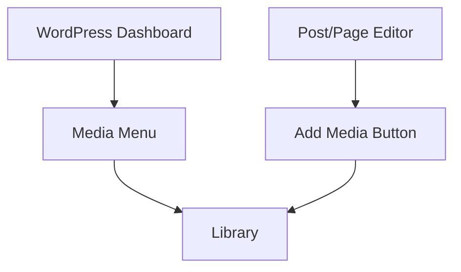

# WordPress Media Library

## Introduction

The WordPress Media Library is a centralized repository for managing all your website's media files. Whether you're working with images, videos, audio files, PDFs, or other document types, the Media Library provides a robust system for uploading, organizing, editing, and embedding media content throughout your WordPress site.

As a beginner, understanding how to effectively use the Media Library will help you:
- Keep your media assets organized
- Optimize images for better website performance
- Easily insert media into posts and pages
- Maintain a professional-looking website with properly sized and aligned media

## Accessing the Media Library

You can access the WordPress Media Library in two main ways:

1. **Dashboard method**: From your WordPress admin dashboard, navigate to the left sidebar and click on "Media" > "Library"

2. **In-context method**: While editing a post or page, click on the "Add Media" button to access the Media Library directly



## Understanding the Media Library Interface

When you first open the Media Library, you'll see:

- **View options**: Grid view (default) and List view
- **Search functionality**: Search for media by name
- **Filter options**: Filter by media type (images, audio, video, etc.)
- **Bulk selection tools**: Select multiple items for bulk actions
- **Upload button**: To add new media files

![WordPress Media Library interface]

## Uploading Media Files

### Method 1: Direct Upload

1. In the Media Library, click the "Add New" button at the top of the screen
2. Either drag and drop files from your computer or click "Select Files" to browse
3. WordPress will automatically upload your files and add them to the library

### Method 2: In-Context Upload

1. While editing a post or page, place your cursor where you want to insert media
2. Click the "Add Media" button
3. Upload new files or select from existing media
4. Click "Insert into post" after selecting/uploading

### Code Example: Adding Upload Support for Custom File Types

By default, WordPress restricts certain file types for security. Here's how to enable additional file types:

```php
// Add this code to your theme's functions.php file
function allow_custom_mime_types($mimes) {
  // Add SVG support
  $mimes['svg'] = 'image/svg+xml';
  
  // Add WEBP support
  $mimes['webp'] = 'image/webp';
  
  return $mimes;
}
add_filter('upload_mimes', 'allow_custom_mime_types');
```

## Organizing Your Media

### Using the Grid and List Views

- **Grid View**: Displays media as thumbnails in a grid layout, ideal for visual browsing
- **List View**: Shows media in a table with columns for file name, author, attached to, date, etc.

### Filtering and Searching

- Use the search box to find media by filename
- Filter by media type (images, audio, video)
- Filter by date uploaded

### Media Organization Best Practices

1. **Use descriptive filenames** before uploading (e.g., "blue-company-logo.jpg" instead of "IMG_12345.jpg")
2. **Add alternative text (alt text)** to images for accessibility and SEO
3. **Delete unused media** periodically to keep your library clean
4. **Consider using folders plugins** for advanced organization (third-party plugins like FileBird or Media Library Folders)

## Editing Media Files

WordPress includes basic editing capabilities for media, particularly images:

1. In the Media Library, click on the image you want to edit
2. Click the "Edit Image" button below the preview
3. Use the editing tools to:
   - Crop the image
   - Rotate or flip the image
   - Scale the image to a new size

### Example: Editing an Image's Alternative Text

Alt text is crucial for accessibility and SEO. Here's how to add or edit it:

1. Select an image in the Media Library
2. In the details panel on the right, look for the "Alternative Text" field
3. Enter a descriptive text that conveys the image's purpose or content
4. Click "Save" to update the information

## Using Media in Posts and Pages

### Basic Media Insertion

1. While editing a post or page, position your cursor where you want to add media
2. Click "Add Media" button
3. Select your media file
4. Adjust settings like alignment, size, and link options
5. Click "Insert into post"

### Using the Block Editor (Gutenberg)

In the modern WordPress block editor:

1. Click the "+" button to add a new block
2. Choose the appropriate media block (Image, Gallery, Audio, Video, etc.)
3. Either upload a new file or select from the Media Library
4. Use the block settings in the right sidebar to customize appearance

### Code Example: Displaying Latest Media Gallery via Shortcode

```php
// Add this to your theme's functions.php
function recent_media_gallery_shortcode($atts) {
    $atts = shortcode_atts(array(
        'limit' => 9,
        'type' => 'image'
    ), $atts);
    
    $args = array(
        'post_type' => 'attachment',
        'post_mime_type' => $atts['type'],
        'post_status' => 'inherit',
        'posts_per_page' => $atts['limit'],
    );
    
    $query_images = new WP_Query($args);
    
    $output = '<div class="recent-media-gallery">';
    
    foreach ($query_images->posts as $image) {
        $output .= '<div class="gallery-item">';
        $output .= wp_get_attachment_image($image->ID, 'thumbnail');
        $output .= '</div>';
    }
    
    $output .= '</div>';
    
    return $output;
}
add_shortcode('recent_media', 'recent_media_gallery_shortcode');
```

Usage in posts/pages:
```
[recent_media limit="6" type="image"]
```

## Media Settings and Optimization

### Configuring Media Settings

WordPress allows you to set default image sizes:

1. Go to Settings > Media in your dashboard
2. Configure the default sizes:
   - Thumbnail size
   - Medium size
   - Large size
3. Choose whether to organize uploads into month/year-based folders

### Image Optimization Best Practices

To maintain a fast-loading website:

1. **Resize images before upload**: Don't upload 5000px wide images if you only need 1200px
2. **Use appropriate file formats**:
   - JPEG for photographs
   - PNG for images needing transparency
   - SVG for logos and icons
   - WebP for better compression (with fallbacks)
3. **Compress images** using tools like TinyPNG before uploading
4. **Consider using image optimization plugins** like Smush, EWWW Image Optimizer, or Imagify

## Troubleshooting Common Media Library Issues

### Issue: Unable to Upload Files

**Possible solutions:**
- Check file size limits (set by your hosting provider)
- Verify file type is allowed by WordPress
- Temporarily deactivate plugins to identify conflicts
- Check folder permissions (should be 755 for directories)

### Issue: Media Files Not Displaying

**Possible solutions:**
- Check if the file path is correct
- Ensure proper permissions on media files (644 for files)
- Check if your theme properly enqueues media styles
- Verify the media file wasn't accidentally deleted

### Issue: Media Library Loading Slowly

**Possible solutions:**
- Reduce the number of files by deleting unused media
- Optimize database tables with a plugin like WP-Optimize
- Consider upgrading hosting if you have many media files
- Use a media offloading plugin to store files in cloud storage

## Advanced Media Library Enhancements

While the default WordPress Media Library is functional, you can enhance it with plugins:

### Popular Media Library Enhancement Plugins

1. **File Organization Plugins**
   - FileBird or Media Library Folders (add folder structures)
   - Enhanced Media Library (adds taxonomies and categories)

2. **Media Optimization Plugins**
   - Smush (image compression)
   - EWWW Image Optimizer (multiple optimization options)
   - Imagify (automated optimization)

3. **Media Functionality Plugins**
   - Media File Renamer (bulk rename files)
   - Media Cleaner (find unused media)
   - WP Media Manager (advanced media management features)

## Practical Example: Creating a Portfolio Gallery

Let's create a simple portfolio gallery using the Media Library and WordPress blocks:

1. Create a new page titled "Portfolio"
2. Add a Gallery block
3. Click "Create a gallery"
4. Select multiple portfolio images from your Media Library (or upload new ones)
5. Click "Create a new gallery"
6. Arrange images in the desired order by dragging and dropping
7. In the block settings sidebar, adjust:
   - Columns: Choose how many images appear per row
   - Crop images: Toggle to maintain consistent dimensions
   - Captions: Show or hide image captions
8. Publish your page

You now have a professional portfolio gallery using WordPress's built-in features!

## Summary

The WordPress Media Library is a powerful system for managing all your website's media files. In this guide, we've covered:

- How to access and navigate the Media Library
- Uploading and organizing media files
- Image editing capabilities
- Inserting media into posts and pages
- Configuring media settings for optimal performance
- Troubleshooting common issues
- Enhancing the Media Library with plugins
- Creating practical media-rich content

Understanding and effectively using the Media Library helps you maintain an organized, professional, and optimized WordPress website.

## Additional Resources

- [WordPress Media Library Documentation](https://wordpress.org/support/article/media-library-screen/)
- [Image Optimization Guide for WordPress](https://wordpress.org/support/article/image-size-and-quality/)
- [WordPress Accessibility Handbook: Media](https://make.wordpress.org/accessibility/handbook/content/media/)

## Practice Exercises

1. **Media Organization Challenge**: Upload five images and organize them with proper filenames and alt text.
2. **Gallery Creation**: Create a gallery with at least nine images and experiment with different layouts.
3. **Media Settings Exploration**: Experiment with different media settings and observe how they affect your uploaded images.
4. **Custom Image Size**: Research how to create a custom image size in WordPress and implement it in your theme.