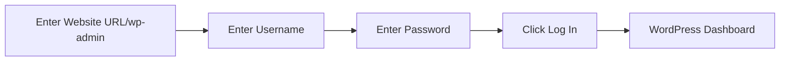

# WordPress Dashboard

## Introduction

The WordPress Dashboard is the command center of your WordPress website. It's the administrative area where you manage all aspects of your site, from creating content to customizing appearance and functionality. For beginners, understanding the Dashboard is the first crucial step in mastering WordPress.

Think of the Dashboard as your website's control room—it's where all the behind-the-scenes magic happens. While website visitors see your polished front end, you'll use the Dashboard to add content, install plugins, change themes, manage users, and monitor your site's performance.

## Accessing the WordPress Dashboard

To access your WordPress Dashboard, you need to log in to your WordPress site. This involves:

1. Go to your website's URL followed by `/wp-admin` or `/wp-login.php` (e.g., `www.yourwebsite.com/wp-admin`)
2. Enter your username or email address
3. Enter your password
4. Click "Log In"

Once logged in, you'll be taken directly to your WordPress Dashboard.

## Dashboard Overview

When you first log in, you'll see the main Dashboard screen. Let's explore the key components:

### 1. Admin Bar

The Admin Bar appears at the top of your screen when you're logged into WordPress. It provides quick access to common features and information:

- **WordPress logo**: Links to WordPress.org resources
- **Site name**: Displays your site name and links to the front end of your website
- **"New"** dropdown: Quick access for creating new content
- **Comments**: Shows pending comment notifications
- **Updates**: Indicates available WordPress, plugin, or theme updates
- **Your profile**: Access to your account settings and logout option

### 2. Left Sidebar Navigation Menu

The sidebar contains all your main WordPress administrative functions:

- **Dashboard**: Home screen with overview information
- **Posts**: Create and manage blog posts
- **Media**: Upload and manage images, documents, and other files
- **Pages**: Create and manage static pages
- **Comments**: Moderate and respond to comments
- **Appearance**: Customize themes, widgets, menus, and site design
- **Plugins**: Add, remove, and configure extensions
- **Users**: Manage user accounts and permissions
- **Tools**: Import/export content and site maintenance tools
- **Settings**: Configure site-wide options

### 3. Main Content Area

The center section of the Dashboard displays the content related to your selected menu item. On the main Dashboard screen, you'll typically see:

- **Welcome panel**: Introduction and quick links for new users
- **At a Glance**: Summary of your content (posts, pages, comments)
- **Activity**: Recent content and comment activity
- **Quick Draft**: Tool for quickly creating a draft post
- **WordPress Events and News**: Updates from WordPress.org

## Customizing Your Dashboard

You can personalize your Dashboard to better suit your workflow:

### Screen Options

At the top-right of most Dashboard screens, you'll find a "Screen Options" tab that allows you to:

1. Show or hide specific Dashboard widgets
2. Adjust the number of items shown in lists
3. Configure column visibility in various tables

### Dashboard Widgets

You can rearrange Dashboard widgets through drag-and-drop. Simply:

1. Click and hold the title bar of any widget
2. Drag it to your preferred location
3. Release to drop it in place

You can also collapse widgets by clicking the toggle arrow in the upper-right corner of each widget.

### User Profile Customization

To further personalize your experience, go to **Users → Your Profile** where you can:

- Change your display name
- Update contact information
- Set your preferred color scheme
- Configure toolbar options
- Set language preferences

## Key Dashboard Sections in Detail

Let's explore some of the most important Dashboard sections:

### Posts

The Posts section is where you manage your blog content:

1. **All Posts**: View, edit, and delete existing posts
2. **Add New**: Create a new blog post
3. **Categories**: Organize posts into categories
4. **Tags**: Add descriptive keywords to posts

Example of adding a new post:

1. Go to **Posts → Add New**
2. Enter a title in the top field
3. Add content in the main editor area
4. Set categories and tags in the sidebar
5. Click "Publish" when ready

### Pages

Unlike chronological blog posts, Pages are static content like "About Us" or "Contact":

1. **All Pages**: View and manage existing pages
2. **Add New**: Create a new page

Pages can be organized hierarchically (parent/child relationships) and used in navigation menus.

### Media Library

The Media Library stores all your uploaded files:

1. **Library**: View all uploaded media
2. **Add New**: Upload new files

When you upload an image, WordPress automatically creates multiple sizes (thumbnail, medium, large) for different uses.

### Appearance

Customize how your website looks:

1. **Themes**: Change your site's design template
2. **Customize**: Fine-tune your theme's appearance
3. **Widgets**: Add content blocks to widget areas (sidebars, footers)
4. **Menus**: Create and manage navigation menus
5. **Theme Editor**: Edit theme files directly (advanced)

### Plugins

Extend WordPress functionality:

1. **Installed Plugins**: Manage existing plugins
2. **Add New**: Find and install new plugins
3. **Plugin Editor**: Edit plugin files directly (advanced)

Example of installing a plugin:

1. Go to **Plugins → Add New**
2. Search for a plugin by name or functionality
3. Click "Install Now" on your chosen plugin
4. Click "Activate" once installed

### Settings

Configure how your WordPress site works:

1. **General**: Site title, tagline, URL, time settings
2. **Writing**: Default post categories and formats
3. **Reading**: Homepage display and visibility settings
4. **Discussion**: Comment settings and moderation
5. **Media**: Image sizes and upload directory
6. **Permalinks**: URL structure for your content

## Dashboard for Different User Roles

WordPress has different user roles with varying levels of Dashboard access:

1. **Administrator**: Complete access to all Dashboard features
2. **Editor**: Can publish and manage all content
3. **Author**: Can publish and manage their own posts
4. **Contributor**: Can write posts but not publish them
5. **Subscriber**: Can only manage their profile

As an administrator, you can control what others see by assigning appropriate roles.

## Practical Dashboard Tips for Beginners

### Efficient Navigation

- Use the admin bar for quick access to common tasks
- Learn keyboard shortcuts (press Shift + Alt + H to display available shortcuts)
- Use the search box in the upper right of the Plugins and Themes areas

### Content Management Best Practices

- Use categories and tags consistently
- Preview content before publishing
- Schedule posts for future publication
- Use the "Quick Edit" option for fast updates to existing content

### Security Tips

- Log out when you're finished, especially on shared computers
- Change your password regularly
- Only install plugins and themes from reputable sources
- Keep WordPress, themes, and plugins updated

## Troubleshooting Common Dashboard Issues

### Can't Access Dashboard

If you can't access your Dashboard, try:

1. Clearing your browser cache and cookies
2. Using a different browser
3. Checking your internet connection
4. Ensuring WordPress is properly installed
5. Verifying your login credentials

### Dashboard Loads Slowly

If your Dashboard is running slowly:

1. Deactivate plugins one by one to identify problematic ones
2. Switch to a default theme temporarily
3. Increase PHP memory limit (via your host or wp-config.php)
4. Optimize your database with a plugin like WP-Optimize

## Summary

The WordPress Dashboard is your website's control center, offering a comprehensive set of tools to manage your content, appearance, and functionality. As you become more familiar with its features, you'll be able to efficiently maintain and grow your WordPress site.

Key points to remember:
- The Dashboard is accessible via yoursite.com/wp-admin
- The left sidebar provides access to all major administrative functions
- You can customize your Dashboard display through Screen Options
- Different user roles have different levels of Dashboard access
- Regular updates and security practices keep your Dashboard secure

## Additional Resources

To deepen your understanding of the WordPress Dashboard:

1. Explore the WordPress Codex, the official WordPress documentation
2. Take advantage of the contextual help tabs in the upper-right corner of Dashboard screens
3. Practice creating, editing, and managing different content types
4. Experiment with customization options in a test environment

## Exercises for Practice

1. **Dashboard Exploration**: Log in to your WordPress Dashboard and identify each component discussed in this guide.
2. **Content Creation**: Create a new post and a new page, noting the differences between them.
3. **Dashboard Customization**: Use Screen Options to customize your main Dashboard view.
4. **User Management**: Create a new user account with Editor privileges (if you have a test site).
5. **Media Practice**: Upload several images to your Media Library and insert them into a post or page.

By regularly working with your WordPress Dashboard, you'll develop the confidence and skills to effectively manage your website and make the most of WordPress's powerful features.