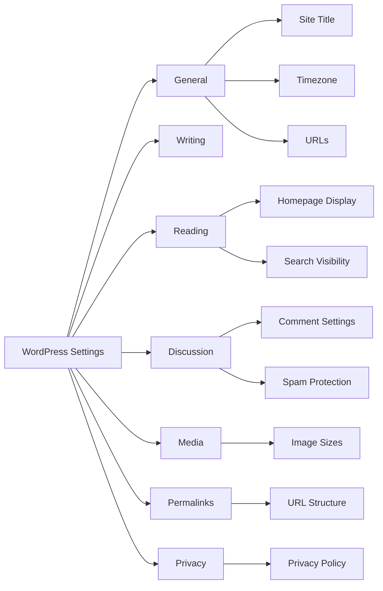

# WordPress Settings

## Introduction

WordPress settings allow you to configure various aspects of your website without editing code. Understanding and properly configuring these settings is essential for creating a functional, secure, and search engine-friendly WordPress site.

In this guide, we'll explore all the major WordPress settings sections, explain what each option controls, and provide recommended configurations for different types of websites.

## Accessing WordPress Settings

To access WordPress settings, you need to log in to your WordPress admin dashboard (also known as the WordPress admin area).

1. Go to your WordPress login page (usually `yourdomain.com/wp-login.php`)
2. Enter your username/email and password
3. Once logged in, look at the left sidebar menu for the various settings categories

## General Settings

The General Settings section contains the fundamental configuration options for your WordPress site.

### Navigating to General Settings

```
Dashboard → Settings → General
```

### Key General Settings Options

| Setting | Description | Recommended Value |
| --- | --- | --- |
| Site Title | The name of your website | Your brand or website name |
| Tagline | A short description of your site | Brief description of what your site offers |
| WordPress Address (URL) | The location of your WordPress core files | Your domain (with https) |
| Site Address (URL) | The address users will type to reach your site | Usually same as WordPress Address |
| Email Address | Admin email for notifications | Your business email |
| Membership | Allow anyone to register | Usually "Unchecked" unless you need user registration |
| New User Default Role | Default role for new registrations | "Subscriber" for security |
| Site Language | Default language for your site | Your preferred language |
| Timezone | Your local timezone | Your local timezone |
| Date Format | How dates appear | Based on regional preference |
| Time Format | How times appear | Based on regional preference |
| Week Starts On | First day of the week | Based on regional preference |

### Example: Setting Up a Business Website

For a professional business website:

1. Set a clear, brand-oriented Site Title: "Smith Consulting LLC"
2. Create a descriptive Tagline: "Professional IT Solutions for Small Businesses"
3. Ensure both URL fields use HTTPS: `https://smithconsulting.com`
4. Set Email Address to your business domain: `contact@smithconsulting.com`
5. Keep Membership disabled unless you offer client portals
6. Configure your local timezone and date formats

## Writing Settings

Writing Settings control how content is created and formatted on your site.

### Navigating to Writing Settings

```
Dashboard → Settings → Writing
```

### Key Writing Settings Options

| Setting | Description | Recommended Value |
| --- | --- | --- |
| Default Post Category | Category for new posts | Most common category |
| Default Post Format | Format for new posts | Standard (unless special format needed) |
| Post via email | Publish by sending email | Usually disabled |
| Update Services | Ping services when you publish | Can disable for most sites |

## Reading Settings

Reading Settings determine how your content is displayed to visitors.

### Navigating to Reading Settings

```
Dashboard → Settings → Reading
```

### Key Reading Settings Options

| Setting | Description | Recommended Value |
| --- | --- | --- |
| Your homepage displays | What appears on front page | "A static page" for business sites, "Latest posts" for blogs |
| Homepage / Posts page | If using static homepage | Select your homepage and blog page |
| Blog pages show at most | Number of posts per page | 10 (balance between loading speed and content) |
| Syndication feeds show the most recent | Number of items in RSS feed | 10 |
| For each article in a feed, show | Full text or summary | "Summary" for better SEO and traffic |
| Search Engine Visibility | Discourage search engines | Unchecked (unless in development) |

### Example: Setting Up a Business Site with Blog

```jsx
// Setting up a homepage and blog page structure in WordPress
// Step 1: Create two pages
const homePage = createPage({
  title: 'Welcome to Our Business',
  content: '<!-- Your homepage content -->',
  template: 'full-width-template'
});

const blogPage = createPage({
  title: 'Our Blog',
  content: '', // Blog page doesn't need content
});

// Step 2: Configure reading settings
updateReadingSettings({
  homepage_displays: 'static_page',
  homepage: homePage.id,
  posts_page: blogPage.id,
  posts_per_page: 6
});
```

This configuration creates a professional business site with:
- A welcoming homepage showcasing your products/services
- A dedicated blog section for updates and content marketing
- Optimal number of posts displayed per page

## Discussion Settings

Discussion Settings control comments and notifications on your website.

### Navigating to Discussion Settings

```
Dashboard → Settings → Discussion
```

### Key Discussion Settings Options

| Setting | Description | Recommended Value |
| --- | --- | --- |
| Allow people to submit comments | Enable/disable comments | Based on site needs |
| Comment author must fill out name and email | Require comment info | Checked |
| Users must be registered and logged in to comment | Limit who can comment | Optional |
| Automatically close comments | Disable comments on older posts | Consider enabling for less spam |
| Enable threaded comments | Allow comment replies | Checked |
| Break comments into pages | Paginate long comment sections | Optional |
| Email me whenever | Notification options | Based on preference |
| Before a comment appears | Comment moderation | "Comment must be manually approved" for security |
| Comment Moderation | Conditions for moderation | Configure based on spam concerns |
| Disallowed Comment Keys | Words that trigger spam filter | Add common spam terms |
| Avatars | Display profile pictures | Usually enabled |

### Recommended Discussion Settings for Different Sites

#### For a Corporate/Business Site:
- Disable comments on pages
- Enable comments only on blog posts
- Require manual approval of all comments
- Set up email notifications for new comments

#### For a Blog:
- Enable comments site-wide
- Allow threaded (nested) comments up to 3-4 levels
- Set up spam filters
- Enable Gravatar images

### Managing Comment Spam

WordPress comment spam can be a significant problem. Here are recommended settings to reduce spam:

```jsx
// Recommended anti-spam settings
updateDiscussionSettings({
  comment_moderation: true,
  comment_whitelist: true,
  require_name_email: true,
  comment_max_links: 2,
  moderation_keys: 'casino, loan, viagra, pharmacy, free offer, limited time, weight loss'
});

// Install and configure anti-spam plugin
installPlugin('akismet');
configureAkismet({
  api_key: 'your-api-key',
  strictness: 'aggressive',
  discard_worst_spam: true
});
```

## Media Settings

Media Settings control how WordPress handles images and other media files.

### Navigating to Media Settings

```
Dashboard → Settings → Media
```

### Key Media Settings Options

| Setting | Description | Recommended Value |
| --- | --- | --- |
| Image sizes | Default dimensions for thumbnails, medium and large images | Thumbnail: 150×150<br />Medium: 300×300<br />Large: 1024×1024 |
| Uploading Files | Organize uploads into month/year folders | Checked (helps organize media library) |

### Setting Optimal Image Sizes

```jsx
// Configure optimal image sizes for a responsive theme
updateMediaSettings({
  thumbnail_size_w: 150,
  thumbnail_size_h: 150,
  thumbnail_crop: 1,
  medium_size_w: 400,
  medium_size_h: 400,
  large_size_w: 1200,
  large_size_h: 1200,
  organize_uploads: 'yes'
});

// Adding custom image sizes (using functions.php)
// This would go in your theme's functions.php file
add_image_size('featured-header', 1600, 500, true);
add_image_size('square-medium', 600, 600, true);
add_image_size('blog-thumbnail', 400, 300, true);
```

## Permalink Settings

Permalink Settings determine the URL structure of your posts and pages.

### Navigating to Permalink Settings

```
Dashboard → Settings → Permalinks
```

### Permalink Structure Options

| Structure | Example | Best Use Case |
| --- | --- | --- |
| Plain | `?p=123` | Rarely recommended |
| Day and name | `/2023/05/20/sample-post/` | News sites |
| Month and name | `/2023/05/sample-post/` | Blogs with frequent posts |
| Numeric | `/archives/123` | Rarely recommended |
| Post name | `/sample-post/` | Most websites (SEO-friendly) |
| Custom Structure | Custom format | Advanced needs |

### SEO-Friendly Permalink Setup

For most websites, the "Post name" option provides the most SEO benefits:

```jsx
// Configure SEO-friendly permalinks
updatePermalinkSettings({
  structure: '/%postname%/',
  category_base: 'topics', // Optional: customize category URLs
  tag_base: 'tags'        // Optional: customize tag URLs
});
```

This creates URLs like:
- `https://yoursite.com/your-post-title/`
- `https://yoursite.com/topics/your-category/`
- `https://yoursite.com/tags/your-tag/`

### Understanding Permalink Tags

WordPress provides several tags you can use in custom permalink structures:

| Tag | Description |
| --- | --- |
| `%year%` | The year of the post (4 digits) |
| `%monthnum%` | Month of the year (2 digits) |
| `%day%` | Day of the month (2 digits) |
| `%hour%` | Hour of the day (2 digits) |
| `%minute%` | Minute of the hour (2 digits) |
| `%second%` | Second of the minute (2 digits) |
| `%postname%` | URL-friendly version of the post title |
| `%post_id%` | The unique ID of the post |
| `%category%` | URL-friendly version of the category name |
| `%author%` | URL-friendly version of the author name |

## Privacy Settings

WordPress includes privacy tools to help your site comply with regulations like GDPR.

### Navigating to Privacy Settings

```
Dashboard → Settings → Privacy
```

### Key Privacy Features

1. **Privacy Policy Page**: Select or create a privacy policy page
2. **Data Export**: Tools to export user data upon request
3. **Data Erasure**: Tools to erase user data upon request

### Creating a GDPR-Compliant Privacy Policy

WordPress provides a privacy policy template you can customize:

1. Go to Settings → Privacy
2. Click "Create New Page" or select an existing page
3. Edit the template text to reflect your actual data practices
4. Include information about:
   - What data you collect
   - How you use cookies
   - Third-party services you use
   - How users can request their data
   - How users can request data deletion

## Using Site Health Check

WordPress includes a Site Health feature to help you monitor your site's performance and security.

### Accessing Site Health

```
Dashboard → Tools → Site Health
```

### What Site Health Checks

1. **Performance**: Server configuration, PHP version, database optimization
2. **Security**: HTTPS implementation, secure connections
3. **Server Settings**: File permissions, recommended modules
4. **Plugin Management**: Plugin updates and compatibility



## Best Practices for WordPress Settings

### Security-Focused Settings

1. Disable open registration unless necessary
2. Set new user default role to Subscriber
3. Moderate all comments or disable if not needed
4. Ensure proper file permissions (managed through hosting)
5. Use HTTPS for all URLs

### Performance-Focused Settings

1. Set optimal image sizes
2. Limit posts per page to 10 or fewer
3. Consider showing excerpts in feeds
4. Use efficient permalink structures
5. Organize media by date

### SEO-Friendly Settings

1. Create a clear site title and tagline
2. Use post name permalink structure
3. Ensure search engines aren't blocked
4. Set featured images at appropriate sizes
5. Use categories and tags effectively

## Summary

WordPress settings provide a powerful way to customize your website's functionality without coding. By understanding and properly configuring these settings, you can:

- Improve your site's security
- Enhance search engine visibility
- Create better user experiences
- Manage content more effectively
- Ensure legal compliance

Remember that some settings, particularly permalinks, should be configured early in your site development as changing them later may break existing links.

## Additional Resources

- **WordPress Codex**: The official WordPress documentation
- **WordPress Forums**: Community support for specific settings questions
- **WordPress Security Best Practices**: Advanced security configuration
- **GDPR Compliance Guide**: More detailed information on privacy requirements

## Exercises

1. **Basic Settings Audit**: Go through each settings page in your WordPress installation and document your current configuration.

2. **Create a Settings Checklist**: Develop a pre-launch settings checklist for future WordPress sites you build.

3. **Permalink Experiment**: Create a test post and see how its URL changes with different permalink structures (be careful not to do this on a live production site).

4. **Privacy Policy Setup**: Create a custom privacy policy page that accurately reflects your website's data handling practices.

5. **Media Organization**: Implement a media organization strategy using both WordPress settings and file naming conventions.