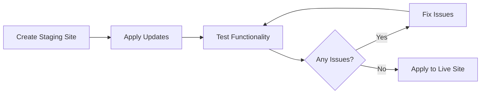

# WordPress Updates

## Introduction

WordPress updates are essential maintenance tasks that keep your website secure, stable, and performing optimally. In the WordPress ecosystem, updates come in three main types: core updates, plugin updates, and theme updates. Each plays a crucial role in the overall health of your WordPress site.

Regular updates address security vulnerabilities, fix bugs, improve performance, and often add new features to enhance your website's functionality. Understanding how to manage these updates properly is a fundamental skill for anyone working with WordPress.

## Why Updates Matter

Updates are not just about getting new features; they're critical for several important reasons:

1. **Security**: Updates often patch security vulnerabilities that could be exploited by hackers.
2. **Compatibility**: As technology evolves, updates ensure your WordPress components work together smoothly.
3. **Performance**: Many updates include optimizations that help your site run faster.
4. **Features**: Updates can add new functionality without requiring a complete site redesign.
5. **Bug fixes**: Updates address known issues that might affect your website's operation.

## Types of WordPress Updates

### Core Updates

WordPress core updates are the foundation of the update system. These updates modify the base WordPress files that power your website.

#### Types of Core Updates

WordPress releases three kinds of core updates:

1. **Major Updates**: These include significant feature additions and changes (e.g., WordPress 5.0, 6.0)
2. **Minor Updates**: These provide maintenance releases, bug fixes, and security patches (e.g., WordPress 5.9.1)
3. **Security Updates**: These address specific security vulnerabilities and are often automatically applied

#### Checking Your WordPress Version

You can check your current WordPress version by looking at the bottom of any admin page or by visiting the Updates page:

```
Dashboard → Updates
```

Alternatively, you can see it at the bottom of your admin panel:

```
"Thank you for creating with WordPress. Version X.X.X"
```

### Plugin Updates

Plugins extend WordPress functionality, and they need updates just like the core system. Plugin updates can include security patches, bug fixes, compatibility improvements, and new features.

### Theme Updates

Your WordPress theme controls the appearance and some functionality of your site. Theme updates may include security fixes, improved compatibility with the latest WordPress version, bug fixes, and new features.

## Update Methods

WordPress provides several ways to update your site:

### Automatic Background Updates

By default, WordPress enables automatic background updates for minor core releases and security updates. You won't need to take any action for these updates.

### One-Click Updates

For major core updates, plugins, and themes, WordPress offers a one-click update system through the admin dashboard:

1. Navigate to `Dashboard → Updates`
2. Select items to update or use the "Update All" option
3. Click the update button

### Manual Updates

For situations where automatic or one-click updates fail, you can update WordPress manually:

#### Manual Core Update

1. Back up your website
2. Download the latest WordPress version from WordPress.org
3. Deactivate all plugins
4. Via FTP/SFTP:
   - Upload all new files except the `wp-content` folder and `wp-config.php` file
   - Replace all core files

#### Manual Plugin/Theme Update

1. Download the latest version of the plugin/theme
2. Deactivate the plugin (for plugins only)
3. Via FTP/SFTP, delete the old plugin/theme folder
4. Upload the new version
5. Reactivate the plugin (for plugins only)

## Best Practices for WordPress Updates

### 1. Always Backup Before Updating

Create a complete backup of your website before performing any updates. This includes:

```php
// Backup components needed
- Database
- WordPress files
- Theme files
- Plugin files
- Media files
```

Many hosting providers offer backup services, or you can use plugins like UpdraftPlus or BackWPup.

### 2. Use a Staging Environment

For important websites, test updates on a staging environment first:



### 3. Update in the Correct Order

Follow this sequence for the safest update process:

1. Back up your site
2. Update plugins
3. Update themes
4. Update WordPress core

### 4. Check Compatibility

Before updating plugins or themes, check:
- Compatibility with your WordPress version
- Compatibility with other plugins
- Recent reviews for any reported issues

### 5. Monitor After Updates

After updating, check your website for:
- Visual layout issues
- Functionality problems
- Performance changes
- Error messages

## Real-world Example: Managing a WordPress Update

Let's walk through a complete WordPress update process for a small business website:

### Step 1: Prepare for Updates

```php
// Initial checklist
- Schedule update during low-traffic period
- Create complete backup
- Notify site administrators of maintenance
```

### Step 2: Plugin Updates

```php
// Navigate to Plugins page
Dashboard → Plugins → Update Available
```

Check each plugin for:
- When it was last updated
- Compatibility with your WordPress version
- Recent reviews

Update plugins one by one, testing critical site functions after each one.

### Step 3: Theme Update

```php
// Navigate to Appearance page
Dashboard → Appearance → Themes
```

If an update is available for your active theme:
1. Review the changelog
2. Back up your theme customizations (if applicable)
3. Apply the update
4. Check your site's appearance

### Step 4: WordPress Core Update

```php
// Navigate to Updates page
Dashboard → Updates
```

If a core update is available:
1. Click "Update Now"
2. Let the process complete (your site may go into maintenance mode briefly)
3. Verify the update was successful

### Step 5: Post-Update Checks

After all updates are complete:

```php
// Post-update checklist
- Check homepage and important pages
- Test contact forms and e-commerce functions
- Verify mobile responsiveness
- Check site speed
- Look for any error messages in the admin area
```

## Troubleshooting Update Issues

### Common Update Problems and Solutions

#### White Screen of Death

If you see a blank white screen after updates:

```php
// Enable debugging in wp-config.php
define( 'WP_DEBUG', true );
define( 'WP_DEBUG_LOG', true );
define( 'WP_DEBUG_DISPLAY', false );
```

Check the debug.log file for specific errors.

#### Locked Out of Admin

If you can't access your admin panel after an update:

1. Try clearing your browser cache
2. Check for plugin conflicts by deactivating all plugins via FTP
3. Verify correct file permissions

#### Plugin/Theme Compatibility Issues

If a plugin or theme isn't working after an update:

1. Restore from backup
2. Contact the plugin/theme developer
3. Look for alternative solutions

## Automated Update Management

For larger sites or multiple WordPress installations, consider these approaches:

### WordPress Management Tools

Services like MainWP, ManageWP, or InfiniteWP allow you to manage updates across multiple WordPress sites from a single dashboard.

### Update Configuration with wp-config.php

You can control automatic updates through your wp-config.php file:

```php
// Disable all automatic updates
define( 'AUTOMATIC_UPDATER_DISABLED', true );

// Enable all automatic updates (core, plugins, themes)
define( 'WP_AUTO_UPDATE_CORE', true );

// Only allow minor updates
define( 'WP_AUTO_UPDATE_CORE', 'minor' );
```

## Security Considerations for Updates

### Update Notifications

Always verify update notifications are legitimate:
- Log in directly to your WordPress admin panel
- Don't click update links in emails
- Be suspicious of unexpected update notices

### Plugin and Theme Sources

Only install and update plugins and themes from reputable sources:
- WordPress.org repository
- Established premium theme/plugin marketplaces
- Direct from trusted developers

## Summary

WordPress updates are a critical part of website maintenance that ensure security, compatibility, and optimal performance. Following a systematic approach to updates—including proper backups, testing, and post-update verification—helps prevent issues and keeps your site running smoothly.

Remember these key points:
- Always back up before updating
- Update in the correct order: plugins, themes, then core
- Test thoroughly after updates
- Consider using staging environments for critical sites
- Keep an eye on compatibility between components

By developing good update habits and understanding the update process, you'll maintain a healthier, more secure WordPress website.

## Additional Resources

Here are some exercises to practice your WordPress update skills:

1. Set up a local WordPress installation specifically for testing updates
2. Create a manual backup system for your WordPress site
3. Document an update procedure tailored to your specific website
4. Research and implement an automated backup solution
5. Learn how to create a staging environment for your specific hosting provider

With regular practice and attention to detail, managing WordPress updates will become a routine part of your website maintenance workflow.