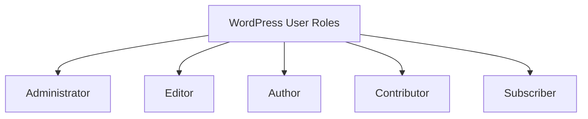

# WordPress Users

## Introduction

In WordPress, users are individuals who can log in to your site with different levels of access and permissions. Understanding how to manage users is essential for maintaining a secure and well-organized WordPress website, especially when multiple people need to contribute or manage content.

User management is a core feature of WordPress that allows you to control who can access your site's dashboard and what actions they can perform. Whether you're running a personal blog, a business website, or a multi-author publication, knowing how to handle users effectively will help you delegate responsibilities while maintaining appropriate security boundaries.

## User Roles in WordPress

WordPress has a built-in role-based permission system that assigns specific capabilities to different types of users.

### Default User Roles

WordPress comes with five default user roles:



1. **Administrator** - Has complete control over the entire website.
2. **Editor** - Can publish and manage posts, including those written by others.
3. **Author** - Can publish and manage their own posts.
4. **Contributor** - Can write and manage their own posts but cannot publish them.
5. **Subscriber** - Can only manage their profile and read content.

### Capabilities Comparison

| Capability | Administrator | Editor | Author | Contributor | Subscriber |
|------------|--------------|--------|--------|-------------|------------|
| Manage plugins | ✓ | ✗ | ✗ | ✗ | ✗ |
| Manage themes | ✓ | ✗ | ✗ | ✗ | ✗ |
| Edit site settings | ✓ | ✗ | ✗ | ✗ | ✗ |
| Manage users | ✓ | ✗ | ✗ | ✗ | ✗ |
| Moderate comments | ✓ | ✓ | ✓ | ✗ | ✗ |
| Edit others' posts | ✓ | ✓ | ✗ | ✗ | ✗ |
| Publish posts | ✓ | ✓ | ✓ | ✗ | ✗ |
| Upload files | ✓ | ✓ | ✓ | ✗ | ✗ |
| Write posts | ✓ | ✓ | ✓ | ✓ | ✗ |
| Read content | ✓ | ✓ | ✓ | ✓ | ✓ |

## Managing Users in WordPress

### Accessing the Users Section

To manage users in WordPress:

1. Log in to your WordPress admin dashboard.
2. In the left sidebar, click on "Users".
3. This will display a list of all users registered on your site.

### Creating a New User

To add a new user to your WordPress site:

1. Go to the Users section in the dashboard.
2. Click "Add New" at the top of the page.
3. Fill out the required information:
   - Username (cannot be changed later)
   - Email
   - First Name (optional)
   - Last Name (optional)
   - Website (optional)
   - Password
   - Role selection
4. Click "Add New User" to create the account.

### User Creation Code Example

If you're developing a theme or plugin and need to programmatically create users, you can use the `wp_create_user()` or `wp_insert_user()` functions:

```php
// Basic user creation
$user_id = wp_create_user( 'johndoe', 'password', 'john@example.com' );

// More advanced user creation
$userdata = array(
    'user_login'    => 'janedoe',
    'user_pass'     => 'secure_password',
    'user_email'    => 'jane@example.com',
    'first_name'    => 'Jane',
    'last_name'     => 'Doe',
    'display_name'  => 'Jane Doe',
    'role'          => 'author'
);

$user_id = wp_insert_user( $userdata );

if ( is_wp_error( $user_id ) ) {
    echo 'Error creating user: ' . $user_id->get_error_message();
} else {
    echo 'User created with ID: ' . $user_id;
}
```

### Editing User Profiles

To edit an existing user:

1. Go to the Users section in the dashboard.
2. Hover over the user's name and click "Edit".
3. Make the desired changes to the user's profile.
4. Click "Update User" to save changes.

### User Security Best Practices

1. **Use Strong Passwords**: Enforce strong password policies, especially for administrator accounts.
2. **Limit Administrator Accounts**: Only give administrator access to those who absolutely need it.
3. **Regularly Audit Users**: Periodically review all users and their roles to ensure appropriate access.
4. **Remove Unused Accounts**: Delete or deactivate accounts that are no longer needed.
5. **Use Two-Factor Authentication**: Install a plugin that provides 2FA for enhanced security.

## User Profile Fields

WordPress user profiles include several default fields:

1. **Required Fields**:
   - Username
   - Email
   - Password

2. **Optional Personal Fields**:
   - First Name
   - Last Name
   - Nickname
   - Display Name
   - Biographical Info
   - Website

3. **Account Management Fields**:
   - Role
   - New Password
   - Password Strength

### Adding Custom User Profile Fields

You can add custom fields to user profiles by hooking into WordPress actions:

```php
// Add the custom fields
function add_custom_user_fields( $user ) {
    ?>
    <h3>Additional Information</h3>
    <table class="form-table">
        <tr>
            <th><label for="phone">Phone Number</label></th>
            <td>
                <input type="text" name="phone" id="phone" 
                       value="<?php echo esc_attr( get_user_meta( $user->ID, 'phone', true ) ); ?>" 
                       class="regular-text" />
            </td>
        </tr>
    </table>
    <?php
}
add_action( 'show_user_profile', 'add_custom_user_fields' );
add_action( 'edit_user_profile', 'add_custom_user_fields' );

// Save the custom fields
function save_custom_user_fields( $user_id ) {
    if ( current_user_can( 'edit_user', $user_id ) ) {
        update_user_meta( $user_id, 'phone', sanitize_text_field( $_POST['phone'] ) );
    }
}
add_action( 'personal_options_update', 'save_custom_user_fields' );
add_action( 'edit_user_profile_update', 'save_custom_user_fields' );
```

## Creating Custom User Roles

Sometimes the default WordPress roles don't meet your specific requirements. In these cases, you can create custom user roles:

```php
// Create a custom role with specific capabilities
function create_custom_editor_role() {
    add_role(
        'custom_editor',
        'Custom Editor',
        array(
            'read'                 => true,
            'edit_posts'           => true,
            'delete_posts'         => true,
            'publish_posts'        => true,
            'upload_files'         => true,
            'edit_published_posts' => true,
            'moderate_comments'    => true,
            // Additional capabilities as needed
        )
    );
}
add_action( 'init', 'create_custom_editor_role' );
```

To remove a custom role:

```php
function remove_custom_role() {
    remove_role( 'custom_editor' );
}
```

## User Registration and Login

### Default Registration Process

By default, WordPress allows administrators to create new users. If you want to enable public registration:

1. Go to Settings → General.
2. Check the box next to "Anyone can register".
3. Choose the default role for new users (typically Subscriber).
4. Save your changes.

### Customizing the Login Page

You can customize the WordPress login page with custom CSS:

```php
function custom_login_style() {
    ?>
    <style type="text/css">
        .login h1 a {
            background-image: url(<?php echo get_stylesheet_directory_uri(); ?>/images/custom-logo.png);
            background-size: 300px 100px;
            width: 300px;
            height: 100px;
        }
        body.login {
            background-color: #f5f5f5;
        }
        .login #login_error, .login .message, .login .success {
            border-left: 4px solid #00a0d2;
        }
    </style>
    <?php
}
add_action( 'login_enqueue_scripts', 'custom_login_style' );
```

### Adding User Registration Form to Front-end

You might want to add a registration form to your website's front-end:

```php
function custom_registration_form() {
    // Only show the registration form to non-logged-in members
    if (!is_user_logged_in()) {
        $output = '
        <form action="' . $_SERVER['REQUEST_URI'] . '" method="post">
            <div>
                <label for="username">Username <strong>*</strong></label>
                <input type="text" name="username" required>
            </div>
            <div>
                <label for="email">Email <strong>*</strong></label>
                <input type="email" name="email" required>
            </div>
            <div>
                <label for="password">Password <strong>*</strong></label>
                <input type="password" name="password" required>
            </div>
            <div>
                <input type="submit" name="submit_reg" value="Register">
            </div>
        </form>
        ';
        
        return $output;
    }
}

// Create a shortcode for the registration form
add_shortcode('custom_registration', 'custom_registration_shortcode');

function custom_registration_shortcode() {
    ob_start();
    custom_registration_form();
    return ob_get_clean();
}

// Handle form submission
function custom_registration_form_handling() {
    if (isset($_POST['submit_reg'])) {
        // Sanitize user inputs
        $username = sanitize_user($_POST['username']);
        $email = sanitize_email($_POST['email']);
        $password = esc_attr($_POST['password']);
        
        // Form validation
        if (empty($username) || empty($email) || empty($password)) {
            return 'Please fill in all required fields.';
        }
        
        // Create user
        $user_id = wp_create_user($username, $password, $email);
        
        if (is_wp_error($user_id)) {
            return $user_id->get_error_message();
        } else {
            // Set the default role
            $user = new WP_User($user_id);
            $user->set_role('subscriber');
            
            // Send notification
            wp_new_user_notification($user_id, null, 'both');
            
            // Success message
            return 'Registration complete. Please check your email.';
        }
    }
}
```

To use this form, add the shortcode `[custom_registration]` to any page or post.

## Real-world Use Cases

### Multi-author Blog

For a multi-author blog, you might use:
- **Administrators**: Site owners or technical managers
- **Editors**: Content managers who review and publish content
- **Authors**: Regular content creators who can publish their work
- **Contributors**: Guest writers or new team members

### Membership Site

For a membership site, consider:
- **Administrators**: Site owners
- **Editors**: Content managers
- **Subscribers**: Paid members with access to protected content
- Custom roles with specific access levels (using a membership plugin)

### E-commerce Store

For a WooCommerce store:
- **Administrators**: Store owners
- **Shop Managers**: (WooCommerce role) Staff who manage products and orders
- **Customers**: (WooCommerce role) Users who have purchased products

## Troubleshooting Common User Issues

### Lost Admin Access

If you've lost admin access to your WordPress site:

1. Access your database via phpMyAdmin (through your hosting control panel)
2. Find the `wp_users` and `wp_usermeta` tables
3. Identify your user ID
4. Run an SQL query to reset your role:

```sql
INSERT INTO `wp_usermeta` (`umeta_id`, `user_id`, `meta_key`, `meta_value`) 
VALUES (NULL, 'YOUR_USER_ID', 'wp_capabilities', 'a:1:{s:13:"administrator";b:1;}');

INSERT INTO `wp_usermeta` (`umeta_id`, `user_id`, `meta_key`, `meta_value`) 
VALUES (NULL, 'YOUR_USER_ID', 'wp_user_level', '10');
```

Replace existing records if they already exist.

### Password Reset

If a user forgets their password:

1. User clicks the "Lost your password?" link on the login page
2. They enter their username or email
3. WordPress sends a password reset link to their email
4. User follows the link to set a new password

For administrative password resets:

1. As an administrator, go to Users
2. Click "Edit" under the relevant user
3. Scroll down to "Account Management"
4. Either enter a new password directly or click "Generate Password"
5. Click "Update User"

## Summary

WordPress users and roles form a comprehensive system for managing access and permissions on your website. Understanding how to create, manage, and assign appropriate roles to users is crucial for maintaining a secure and well-functioning WordPress site.

Key points covered:
- Default WordPress user roles and their capabilities
- Creating and managing users through the dashboard
- Programmatic user management through code
- Adding custom user fields and roles
- User registration and login customization
- Real-world applications for different user types
- Troubleshooting common user-related issues

## Additional Resources

- [WordPress Codex: Roles and Capabilities](https://codex.wordpress.org/Roles_and_Capabilities)
- [WordPress Developer Resources: User Functions](https://developer.wordpress.org/reference/classes/wp_user/)
- [WordPress Support: Managing Users](https://wordpress.org/support/article/managing-users/)

## Exercises

1. Create a new WordPress installation and practice creating users with different roles.
2. Write a simple plugin that adds a custom field to user profiles.
3. Create a custom user role with a specific set of permissions.
4. Implement a front-end registration form using the code example provided.
5. Explore user management plugins like "User Role Editor" or "Members" to extend WordPress's user capabilities.