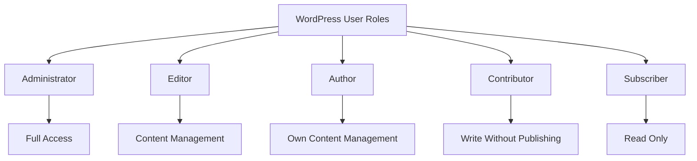

# WordPress Roles

## Introduction

WordPress roles are a powerful user management system that controls what different users can do within your WordPress site. Understanding roles is essential for maintaining site security and creating an effective workflow for multi-user WordPress environments.

In this tutorial, we'll explore the default WordPress roles, their capabilities, how to manage them, and even how to create custom roles for specific project needs. Whether you're building a personal blog or a complex website with multiple contributors, mastering WordPress roles is fundamental to your site's security and operation.

## Default WordPress Roles

WordPress comes with five predefined roles, each with its own set of capabilities (permissions to perform specific actions):



Let's examine each role in detail:

### Administrator

Administrators have complete control over the entire WordPress site. They can:

- Manage all site content
- Install/remove plugins and themes
- Add/remove users and modify their roles
- Change site settings
- Import/export content
- Update WordPress core and run database updates

:::caution
Be extremely careful about who you assign Administrator rights to. This role should be limited to trusted individuals only, as they have complete control over your site.
:::

### Editor

Editors focus on content management across the entire site. They can:

- Create, edit, publish, and delete any posts/pages
- Moderate comments
- Manage categories and tags
- Upload media files
- Cannot access site settings, plugins, themes, or user management

### Author

Authors can manage their own content. They can:

- Create, edit, publish, and delete their own posts
- Upload media files
- Cannot create/edit pages or other users' content
- Cannot access site settings, plugins, or themes

### Contributor

Contributors have limited content creation abilities:

- Create and edit their own posts (but cannot publish them)
- Cannot upload media files
- Cannot edit or delete their posts once published
- Cannot access site settings, plugins, or themes

### Subscriber

Subscribers have the most limited access:

- Can read site content
- Can manage their own profile
- Typically used for sites with membership features or comment management

## Viewing User Capabilities

To see which capabilities are assigned to each role, you can use this simple code snippet:

```php
<?php
// Get the role object
$role_object = get_role('administrator');

// Print the capabilities array
echo '<pre>';
print_r($role_object->capabilities);
echo '</pre>';
?>
```

If you place this code in a custom plugin or theme function (for testing purposes only), you'll see output similar to:

```
Array
(
    [switch_themes] => 1
    [edit_themes] => 1
    [activate_plugins] => 1
    [edit_plugins] => 1
    [edit_users] => 1
    [edit_files] => 1
    [manage_options] => 1
    [moderate_comments] => 1
    [manage_categories] => 1
    [manage_links] => 1
    [upload_files] => 1
    [import] => 1
    [unfiltered_html] => 1
    [edit_posts] => 1
    [edit_others_posts] => 1
    ...
)
```

## Managing User Roles in WordPress

### Adding a New User with a Specific Role

1. Log in to your WordPress admin dashboard
2. Navigate to Users → Add New
3. Fill in the user details (username, email, etc.)
4. Select the desired role from the dropdown menu
5. Click "Add New User"

### Changing an Existing User's Role

1. Go to Users → All Users
2. Hover over the user you want to modify and click "Edit"
3. In the user edit screen, find the "Role" dropdown menu
4. Select the new role
5. Click "Update User"

You can also change roles in bulk:

1. Go to Users → All Users
2. Check the boxes next to multiple users
3. From the "Change role to…" dropdown, select the new role
4. Click "Change"

## Working with Roles Programmatically

### Checking User Capabilities

You can use the `current_user_can()` function to check if a user has a specific capability:

```php
if ( current_user_can( 'edit_posts' ) ) {
    echo 'You can edit posts!';
} else {
    echo 'Sorry, you cannot edit posts.';
}
```

### Restricting Content Based on User Role

You might want to show different content to different user roles:

```php
if ( current_user_can( 'administrator' ) ) {
    echo '<div class="admin-message">Welcome, Administrator!</div>';
} elseif ( current_user_can( 'editor' ) ) {
    echo '<div class="editor-message">Welcome, Editor!</div>';
} else {
    echo '<div class="user-message">Welcome to our site!</div>';
}
```

### Creating Custom Roles

For more specialized sites, you might need custom roles. Here's how to create one:

```php
// Add a custom "SEO Manager" role
add_role(
    'seo_manager',
    'SEO Manager',
    array(
        'read' => true,
        'edit_posts' => true,
        'edit_published_posts' => true,
        'edit_others_posts' => true,
        'edit_pages' => true,
        'edit_published_pages' => true,
        'publish_posts' => true,
        'publish_pages' => true,
        'manage_categories' => true,
        'upload_files' => true,
    )
);
```

This code should be placed in your theme's `functions.php` file or in a custom plugin. It's best to run this code during theme/plugin activation and remove it during deactivation:

```php
// Register the custom role when plugin activates
register_activation_hook( __FILE__, 'my_plugin_add_roles' );
function my_plugin_add_roles() {
    add_role( 'seo_manager', 'SEO Manager', array( /* capabilities */ ) );
}

// Remove the custom role when plugin deactivates
register_deactivation_hook( __FILE__, 'my_plugin_remove_roles' );
function my_plugin_remove_roles() {
    remove_role( 'seo_manager' );
}
```

### Adding Capabilities to Existing Roles

You can also modify existing roles by adding capabilities:

```php
// Add a capability to the Editor role
function add_theme_caps() {
    $role = get_role( 'editor' );
    $role->add_cap( 'manage_woocommerce' ); // Give editors WooCommerce management capability
}
add_action( 'admin_init', 'add_theme_caps' );
```

## Real-World Applications

### Example 1: Multi-Author Blog

For a multi-author blog, you might use:
- **Administrator**: The site owner/webmaster
- **Editors**: Senior content managers who review and publish content
- **Authors**: Regular content creators
- **Contributors**: Guest post writers or junior staff
- **Subscribers**: Registered readers who can comment

### Example 2: E-commerce Site

For an e-commerce site using WooCommerce, you might need:
- **Administrator**: Site owner
- **Shop Manager**: (WooCommerce custom role) Manages products and orders
- **Editor**: Manages blog content and product descriptions
- **Author**: Creates blog posts and product announcements
- **Customer**: (WooCommerce custom role) Can view order history and manage account

### Example 3: Membership Site

For a membership site, you could create custom roles like:
- **Premium Member**: Access to all content
- **Basic Member**: Access to limited content
- **Free Trial**: Access to sample content for a limited time

## Role Management Best Practices

1. **Follow the Principle of Least Privilege**: Only give users the permissions they absolutely need
2. **Regularly Audit Users and Roles**: Review who has access to what on a regular basis
3. **Use Role Management Plugins for Complex Needs**: Consider plugins like User Role Editor for more granular control
4. **Document Your Role Structure**: Keep a record of what each role can do, especially custom roles
5. **Test Role Capabilities**: Before deploying to production, test that each role works as expected

## Popular Role Management Plugins

Several plugins can extend WordPress's role management capabilities:

1. **User Role Editor**: Provides a UI for editing role capabilities
2. **Members**: Offers content permissions and role creation
3. **WP User Manager**: Advanced user management and front-end profiles
4. **PublishPress Capabilities**: Fine-grained control over permissions

To install a role management plugin:

1. Go to Plugins → Add New
2. Search for the plugin name
3. Click "Install Now" and then "Activate"

## Common Issues and Solutions

### Issue: User Can't Access Features They Should Have

**Solution**: Check if the user has the correct role assigned. If the role is correct, there might be a plugin conflict restricting capabilities.

### Issue: Plugin Features Not Available to Administrators

**Solution**: Some plugins add their own capabilities. You might need to manually add these capabilities to the administrator role.

```php
function add_missing_caps() {
    $role = get_role( 'administrator' );
    $role->add_cap( 'missing_plugin_capability' );
}
add_action( 'admin_init', 'add_missing_caps' );
```

### Issue: Need to Reset User Roles

**Solution**: If your roles become corrupted, you can reset them to defaults:

```php
remove_role( 'administrator' );
remove_role( 'editor' );
remove_role( 'author' );
remove_role( 'contributor' );
remove_role( 'subscriber' );

// Then recreate them
require_once(ABSPATH . 'wp-admin/includes/schema.php');
populate_roles();
```

:::warning
The above code will reset ALL roles to WordPress defaults. Use with extreme caution and only when necessary.
:::

## Summary

WordPress roles provide a structured system for managing user permissions on your site. By understanding the default roles and knowing how to customize them, you can create secure, efficient workflows for your WordPress projects. Remember:

- The five default roles (Administrator, Editor, Author, Contributor, and Subscriber) cover most basic needs
- Custom roles can be created for specialized requirements
- Role management is essential for site security and workflow efficiency
- Several plugins can extend WordPress's built-in role management capabilities

Taking the time to properly configure your site's user roles will lead to better security, improved workflow, and a more organized content management process.

## Further Learning Exercises

1. **Role Exploration**: Create a test user for each WordPress role and log in as each one to observe the differences in the admin dashboard.

2. **Custom Role Creation**: Create a custom "Social Media Manager" role that can edit posts but not publish them, and can upload media files.

3. **Capability Testing**: Write a simple plugin that displays all capabilities for the current logged-in user.

4. **Role Documentation**: Create a spreadsheet or document that outlines all roles on your site and their respective permissions.

5. **Role-Based Content**: Create a page that shows different content based on a user's role using the `current_user_can()` function.

## Additional Resources

- [WordPress Codex: Roles and Capabilities](https://wordpress.org/support/article/roles-and-capabilities/)
- [WordPress Developer Documentation: current_user_can()](https://developer.wordpress.org/reference/functions/current_user_can/)
- [WordPress Developer Documentation: add_role()](https://developer.wordpress.org/reference/functions/add_role/)
- [WordPress Developer Documentation: get_role()](https://developer.wordpress.org/reference/functions/get_role/)