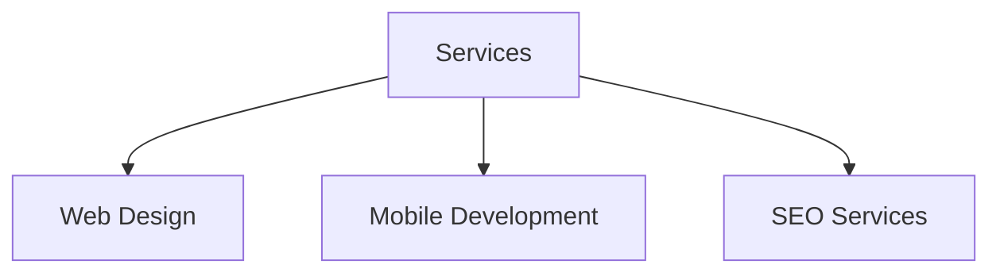
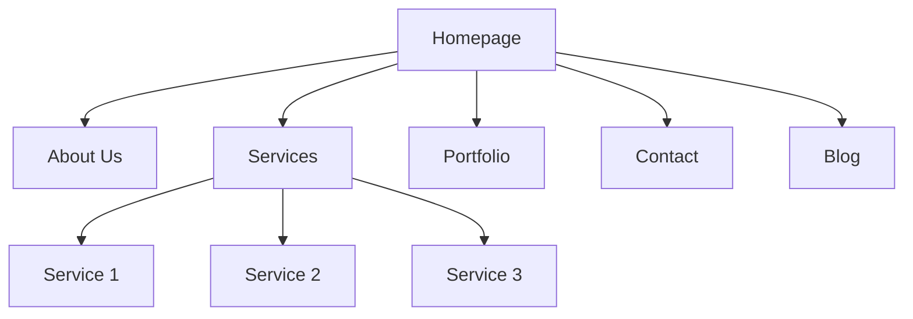

# WordPress Pages

## Introduction

Pages are one of the fundamental content types in WordPress that help you structure your website. Unlike posts, which are chronological entries typically used for blogs, pages are static and timeless content pieces that form the backbone of your site's architecture. In this guide, we'll explore everything you need to know about WordPress pages, from creation to advanced customization.

## What Are WordPress Pages?

Pages in WordPress are static, standalone sections of your website that contain information which doesn't change frequently. They're perfect for content like:

- About Us
- Contact Information
- Services
- Privacy Policy
- Terms and Conditions

Let's understand how pages differ from posts:

| Feature | Pages | Posts |
|---------|-------|-------|
| Chronology | Timeless, not date-dependent | Chronologically ordered |
| Categories & Tags | Cannot be categorized | Can be organized with categories and tags |
| Hierarchy | Can have parent/child relationships | Cannot have hierarchical structure |
| Display | Not displayed in blog feeds | Appear in blog feeds/archives |
| Purpose | For static content | For regularly updated content |

## Creating Your First Page

### Step 1: Access the Pages Section

To create a new page, navigate to your WordPress dashboard and find the "Pages" option in the left sidebar menu:

1. Log in to your WordPress admin area
2. Click on "Pages" in the left navigation menu
3. Select "Add New"

### Step 2: Add Content to Your Page

Once in the page editor, you'll see the WordPress block editor (Gutenberg). Here's how to add basic content:

```
Title: "About Our Company"

[Block: Paragraph]
Welcome to our company website! We've been in business since 2010...

[Block: Heading]
Our Mission

[Block: Paragraph]
To provide exceptional service to our clients through...
```

### Step 3: Configure Page Settings

On the right sidebar of the editor, you'll find important settings for your page:

- **Status & Visibility**: Set publishing options
- **Permalink**: Customize the URL
- **Featured Image**: Add a representative image
- **Page Attributes**: Set parent pages and templates

### Step 4: Publish Your Page

Once you're satisfied with your content, click the "Publish" button in the top-right corner. You can also schedule the page to be published later or save it as a draft.

## Understanding Page Hierarchy

One of the powerful features of WordPress pages is the ability to create hierarchical relationships between them. This helps organize content logically.

### Creating Parent-Child Page Relationships

To create a child page:

1. Create a new page or edit an existing one
2. In the Page Attributes panel (right sidebar), select a parent page from the dropdown
3. The child page will now be organized under the parent page

For example, if you have a "Services" parent page, you might create child pages like:
- Services
  - Web Design
  - Mobile Development
  - SEO Services

This hierarchy affects both your site's navigation and URL structure.



## Page Templates

Page templates allow you to display content differently based on the template assigned to a page.

### Default Templates

WordPress themes typically come with several built-in page templates:

- **Default Template**: The standard layout for pages
- **Full Width Template**: A template without sidebars
- **Landing Page**: Often designed for marketing purposes without headers/footers

### Using Page Templates

To select a template:

1. Edit the page you want to modify
2. In the Page Attributes panel, open the Template dropdown
3. Select the desired template
4. Update the page

### Code Example: Creating a Custom Page Template

For developers, you can create custom page templates by adding a file to your theme:

```php
<?php
/**
 * Template Name: My Custom Template
 *
 * This is a custom page template for specific content layout
 */

get_header(); ?>

<div class="custom-container">
    <?php
    while (have_posts()) :
        the_post();
        the_content();
    endwhile;
    ?>
</div>

<?php get_footer(); ?>
```

Save this file in your theme directory as `page-template-custom.php`.

## Working with the Block Editor for Pages

WordPress's block editor (Gutenberg) offers powerful tools for creating engaging page layouts.

### Common Blocks for Pages

Some useful blocks for building effective pages include:

- **Columns**: Create multi-column layouts
- **Cover**: Add a full-width image with text overlay
- **Media & Text**: Combine images with text side-by-side
- **Buttons**: Add call-to-action buttons
- **Spacer**: Control the vertical spacing
- **Embeds**: Include content from YouTube, Twitter, etc.

### Creating a Simple "Contact Us" Page with Blocks

Here's how you could structure a contact page:

1. Add a heading block: "Contact Us"
2. Add a paragraph block with introductory text
3. Insert a columns block (50/50 split)
4. In the first column, add:
   - Contact information (phone, email)
   - Business hours
5. In the second column, add:
   - Contact form block (using a form plugin)

## Setting a Static Page as Homepage

Many WordPress websites use a static page as their homepage instead of showing latest posts.

### How to Set a Static Homepage

1. Create two pages: one for your homepage and one for your blog posts (if needed)
2. Go to **Settings** → **Reading**
3. Select "A static page" for "Your homepage displays"
4. Choose your homepage from the dropdown
5. (Optional) Select your posts page
6. Save changes

## Best Practices for WordPress Pages

### Optimizing Your Pages

1. **Use clear, descriptive titles**: Make page titles descriptive and include keywords
2. **Create logical URLs**: Edit permalinks to be concise and relevant
3. **Add headings appropriately**: Structure content with H2, H3, etc.
4. **Optimize images**: Compress images before uploading
5. **Consider mobile users**: Test your pages on mobile devices

### Pages vs. Posts: When to Use Each

- **Use Pages for**:
  - Static information (About, Contact)
  - Legal content (Privacy Policy, Terms)
  - Cornerstone content that rarely changes
  
- **Use Posts for**:
  - Blog entries
  - News updates
  - Time-sensitive content
  - Content you want to appear in RSS feeds

## Practical Example: Building a Company Website Structure

Let's apply our knowledge by planning a simple business website structure:



Steps to implement this structure:

1. Create each page in WordPress
2. Set appropriate parent-child relationships
3. Configure the homepage as a static page
4. Set the "Blog" page as your posts page
5. Build your menu structure to reflect this hierarchy

## Summary

WordPress pages provide the structural foundation for your website. They differ from posts in that they're timeless, hierarchical, and intended for static content. By understanding how to create, organize, and optimize pages, you can build a well-structured website that delivers information efficiently to your visitors.

Some key takeaways:

- Pages are for static, evergreen content
- Hierarchical relationships help organize content
- Page templates allow for customized layouts
- The block editor provides powerful design capabilities
- Pages can be used as your site's homepage

## Additional Resources and Exercises

### Resources
- [WordPress.org Documentation on Pages](https://wordpress.org/support/article/pages/)
- [Block Editor Handbook](https://developer.wordpress.org/block-editor/)

### Exercises

1. **Create a basic business website structure** with Home, About, Services, and Contact pages.
2. **Experiment with page templates** by trying different templates for the same content.
3. **Build a Services section** with a parent page and at least three child pages.
4. **Create a custom page** using different block combinations to achieve an attractive layout.
5. **Set up a static homepage** and a separate blog page to understand how this configuration works.

By mastering WordPress pages, you'll have the foundation to build well-structured, professional websites that effectively communicate with visitors.