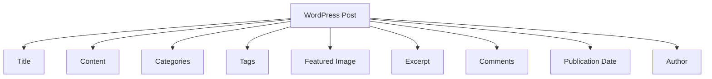

# WordPress Posts

## Introduction

WordPress started primarily as a blogging platform, and at its core are **posts** - the primary content type designed for regular updates. Posts are what make WordPress a dynamic publishing platform, perfect for blogs, news sites, and any website where fresh content is regularly added.

In this tutorial, we'll explore everything you need to know about WordPress posts - from creating and formatting to categorizing and optimizing them for your readers.

## What Are WordPress Posts?

Posts are time-stamped content entries displayed in reverse chronological order (newest first) on your blog page. They represent the dynamic, regularly updated content of your WordPress site.

Key characteristics of WordPress posts:

- Displayed in reverse chronological order by default
- Organized using categories and tags
- Included in your site's RSS feed
- Allow comments (can be disabled)
- Have permalinks that typically include the publication date

## The Anatomy of a WordPress Post

Let's break down the essential components of a WordPress post:

1. **Title** - The headline of your post
2. **Content** - The main body of your post
3. **Categories** - Broad groupings for your content
4. **Tags** - More specific keywords that describe post content
5. **Featured Image** - The visual representation of your post
6. **Excerpt** - A short summary of your post
7. **Comments** - Reader discussion area
8. **Publication Date** - When the post was published
9. **Author** - Who wrote the post



## Creating Your First Post

Let's walk through the process of creating a WordPress post:

1. Log in to your WordPress admin area
2. Navigate to **Posts > Add New**
3. You'll see the WordPress block editor (Gutenberg) or classic editor depending on your WordPress version

### Using the Block Editor (Gutenberg)

The block editor presents a blank canvas where you can add various content blocks:

```
Title: My First WordPress Post

[Paragraph Block]
This is the content of my first WordPress post. I'm learning how to use the WordPress block editor.

[Image Block]
[A featured image would be placed here]

[List Block]
- Point one about WordPress
- Point two about WordPress
- Point three about WordPress
```

### Adding a New Post

Here's a step-by-step guide to create a post:

1. Click on **Posts > Add New** from the WordPress dashboard
2. Add a title in the top field that says "Add title"
3. Click on the main content area to start adding content blocks
4. To add a new block, click the "+" icon and select the desired block type
5. Format your content using the block toolbar that appears when a block is selected
6. Add categories and tags in the right sidebar
7. Set a featured image by clicking "Featured Image" in the right sidebar

## Post Settings and Options

On the right sidebar of the post editor, you'll find several important settings:

### Document Panel

- **Status & Visibility**: Control who can see your post and when
- **Permalink**: Customize your post's URL
- **Categories**: Assign your post to categories
- **Tags**: Add keywords related to your post
- **Featured Image**: Select a representative image
- **Excerpt**: Create a custom summary
- **Discussion**: Enable/disable comments and pingbacks

### Block Panel

When you select a block, the right sidebar changes to show settings for that specific block.

## Working with Categories and Tags

Categories and tags help organize your content and make it easier for visitors to find related posts.

### Categories

Categories are like the table of contents for your blog. They're hierarchical, meaning you can have parent and child categories.

To add categories:

1. Go to **Posts > Categories** to create new categories
2. Or add them directly from the post editor sidebar

Example of category structure:

```
- Technology (Parent Category)
  - Software (Child Category)
    - WordPress (Grandchild Category)
  - Hardware (Child Category)
- Travel (Parent Category)
  - Destinations (Child Category)
  - Tips (Child Category)
```

### Tags

Tags are more specific keywords that describe the details of your post. They're non-hierarchical.

For example, a post categorized under "WordPress" might have tags like "plugins", "themes", "SEO", etc.

## Formatting Your Post Content

The block editor offers many formatting options:

### Common Blocks

- **Paragraph**: Regular text content
- **Heading**: Section titles (H2, H3, etc.)
- **List**: Bulleted or numbered lists
- **Image**: Add pictures to your post
- **Quote**: Highlight quotations
- **Code**: Display formatted code snippets

### Example: Creating a Well-Structured Post

```
Title: 5 Essential WordPress Plugins for Beginners

[Heading Block - H2]
Why You Need Plugins

[Paragraph Block]
WordPress plugins extend the functionality of your site. As a beginner, certain plugins can help you create a professional website quickly without technical knowledge.

[Image Block]
[Image showing WordPress plugins page]

[Heading Block - H2]
Top 5 Plugins for Beginners

[Heading Block - H3]
1. Yoast SEO

[Paragraph Block]
Yoast SEO helps optimize your content for search engines by providing...

[List Block]
- Easy readability analysis
- XML sitemap creation
- Social media optimization
```

## Publishing Your Post

When your post is ready, you have several publishing options:

1. **Publish immediately**: Click the "Publish" button
2. **Schedule for later**: Set a future date and time
3. **Save as draft**: Save without publishing
4. **Preview**: See how your post will look before publishing

### Post Visibility Options

- **Public**: Visible to everyone
- **Password Protected**: Requires a password to view
- **Private**: Only visible to administrators and editors

## Managing Existing Posts

To manage your posts:

1. Go to **Posts > All Posts** in your WordPress dashboard
2. Here you can:
   - Edit posts
   - Quick edit metadata
   - Move to trash
   - View post details
   - Filter by date, categories, etc.

## Working with the Post Revision System

WordPress automatically saves revisions of your posts, which is helpful if you need to revert to a previous version:

1. While editing a post, look for "Revisions" in the right sidebar
2. Click to see a list of all saved versions
3. Compare revisions side by side
4. Restore a previous version if needed

## Displaying Posts on Your Website

WordPress offers various ways to display posts:

### Default Blog Page

By default, your posts appear on your site's main blog page in reverse chronological order.

### Archive Pages

WordPress automatically creates archive pages for:

- Categories
- Tags
- Authors
- Dates (daily, monthly, yearly)

### Custom Post Queries

For more advanced displays, you can use the Query Loop block or custom templates:

```php
<?php
// Example of a custom post query in a theme file
$recent_posts = wp_get_recent_posts(array(
    'numberposts' => 5,
    'post_status' => 'publish'
));

foreach($recent_posts as $post) {
    echo '<h3><a href="' . get_permalink($post['ID']) . '">' . $post['post_title'] . '</a></h3>';
    echo '<p>' . get_the_date('', $post['ID']) . '</p>';
}
?>
```

## Differentiating Posts vs. Pages

Many beginners confuse posts and pages. Here's how they differ:

| Feature | Posts | Pages |
|---------|-------|-------|
| Time-based | Yes | No |
| Appear in RSS | Yes | No |
| Categories & Tags | Yes | No |
| Hierarchical | No | Yes |
| Purpose | Dynamic content | Static content |
| Examples | Blog entries, news articles | About us, Contact, Services |

## Best Practices for WordPress Posts

1. **Use descriptive titles**: Clear, engaging titles improve readability and SEO
2. **Break up content**: Use headings, lists, and images to make content scannable
3. **Optimize images**: Compress images before uploading
4. **Use categories and tags wisely**: Don't overload with too many
5. **Include a featured image**: Makes your post visually appealing
6. **Write compelling meta descriptions**: Improves click-through rates from search engines
7. **Use internal linking**: Connect related posts within your site
8. **Format for readability**: Use short paragraphs and ample white space

## Practical Example: Creating a Complete Blog Post

Let's put everything together with a practical example:

1. **Choose a topic**: "10 Tips for WordPress Beginners"
2. **Research and outline**: Create a structure with main points
3. **Write the post**: Create engaging, helpful content
4. **Add formatting**:
   - Clear headings (H2 for main sections, H3 for subsections)
   - Bulleted lists for tips
   - Bold important points
   - Add relevant images
5. **Add metadata**:
   - Categories: WordPress, Tutorials
   - Tags: beginners, tips, getting-started
   - Featured image: A welcoming WordPress dashboard image
   - SEO title and description (if using an SEO plugin)
6. **Review and edit**: Check spelling, grammar, and flow
7. **Publish or schedule**: Decide when the post goes live
8. **Share**: Promote on social media or email

## Troubleshooting Common Post Issues

### Missing Featured Images

If featured images don't appear:
- Check your theme supports featured images
- Verify image size meets minimum requirements
- Ensure the theme's templates include code to display featured images

### Formatting Problems

If your formatting looks different on the frontend:
- Check for conflicts between the editor and your theme
- Try switching to a different block for that content
- Consider using the "Classic" block if you're having persistent issues

### Post Not Appearing on Blog Page

If your published post doesn't show up:
- Check if it's set to "Public" visibility
- Verify it's not set to a future date
- Ensure it's not set as "Sticky" if you're looking at older posts
- Check if category filters might be hiding it

## Summary

WordPress posts are the fundamental building blocks of dynamic content on your WordPress site. In this tutorial, we've covered:

- The basic structure and components of WordPress posts
- How to create and format posts effectively
- Working with categories and tags
- Publishing options and visibility settings
- Managing existing posts
- Best practices for creating engaging post content

Master these concepts, and you'll be well on your way to creating a compelling and organized WordPress site that keeps visitors coming back for more.

## Additional Resources

To deepen your WordPress posts knowledge:

- Practice creating different types of posts with various block combinations
- Experiment with different post formats if your theme supports them
- Learn about custom post types for more specialized content needs

## Exercises

1. Create a new post with at least five different block types
2. Set up a category structure with parent and child categories
3. Create a post with a custom excerpt and scheduled publication date
4. Edit an existing post and compare the revisions
5. Create a post that includes a table, an image gallery, and formatted code

Happy posting!