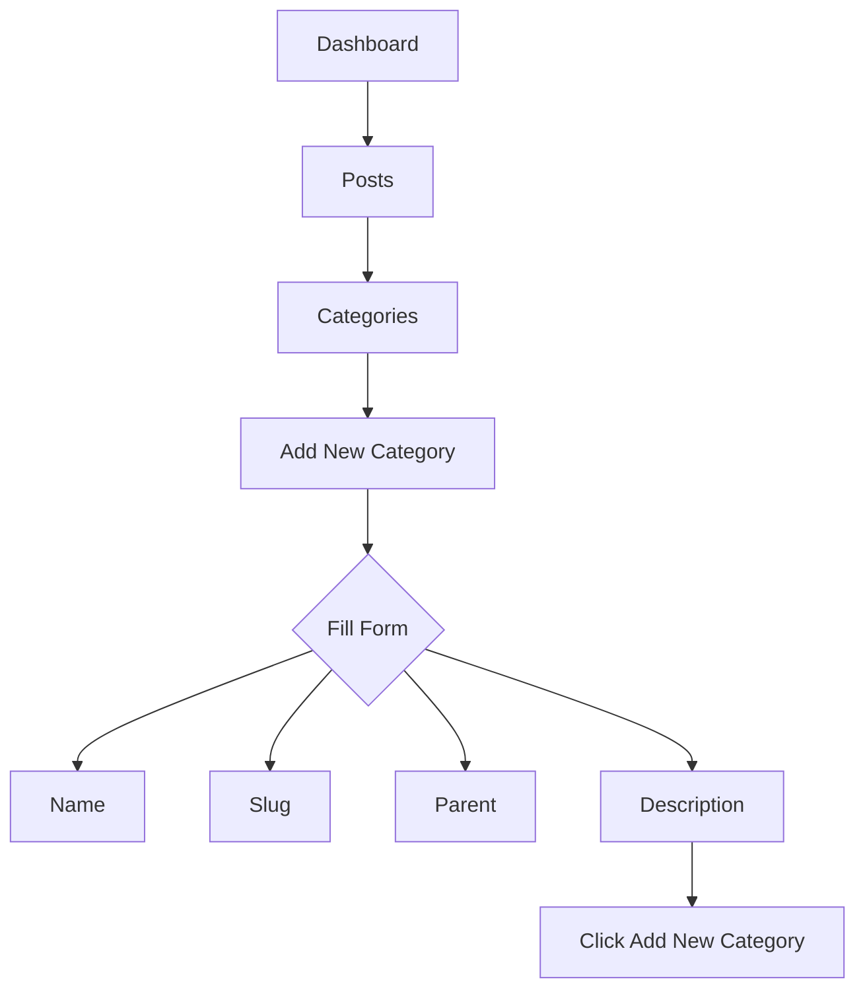

# WordPress Categories

## Introduction

Categories are one of the fundamental ways to organize content in WordPress. Think of categories as the table of contents for your website, helping visitors navigate and find related content easily. Unlike tags (which are more specific and numerous), categories are broad classifications that form the backbone of your content structure.

In this guide, you'll learn how to create, manage, and effectively use WordPress categories to organize your content, improve site navigation, and enhance the overall user experience of your website.

## What Are WordPress Categories?

Categories are a hierarchical taxonomy system in WordPress that allows you to group your posts into sections. Every WordPress post must be assigned to at least one category. If you don't assign a category, WordPress automatically places your post in the default "Uncategorized" category.

Key characteristics of WordPress categories:

- **Hierarchical**: Categories can have parent-child relationships
- **Required**: Every post must belong to at least one category
- **Broad**: Categories represent general topics rather than specific details
- **Limited in number**: Best practice is to have a manageable number of categories

## Creating and Managing Categories

### Accessing the Categories Section

To manage your categories, navigate to your WordPress dashboard and follow these steps:

1. Go to **Posts > Categories** in your WordPress admin menu
2. You'll see the Categories management screen where you can add new categories and edit existing ones

### Adding a New Category

Here's how to add a new category:

1. In the "Add New Category" section on the left side of the screen, fill in:
   - **Name**: The display name of your category (e.g., "Recipes")
   - **Slug**: The URL-friendly version (e.g., "recipes")
   - **Parent**: Select a parent category if you want to create a hierarchy (or leave as "None" for a top-level category)
   - **Description**: A brief explanation of what the category contains (optional but recommended)

2. Click the "Add New Category" button



### Editing and Deleting Categories

To edit an existing category:

1. Hover over the category name in the list on the right
2. Click "Edit" to modify the category details
3. Make your changes and click "Update"

To delete a category:

1. Hover over the category name in the list
2. Click "Delete"
3. When you delete a category, posts assigned to that category aren't deleted but are moved to the default category

## Creating Category Hierarchies

One of the powerful features of WordPress categories is the ability to create parent-child relationships, forming a hierarchy.

### Parent and Child Categories Example

Let's say you run a cooking blog with these categories:

- Recipes (Parent)
  - Appetizers (Child)
  - Main Courses (Child)
    - Pasta (Grandchild)
    - Meat Dishes (Grandchild)
  - Desserts (Child)
- Cooking Tips (Parent)
- Kitchen Equipment (Parent)

To create this structure:

1. First create all the parent categories (Recipes, Cooking Tips, Kitchen Equipment) without selecting a parent
2. Then create the child categories (Appetizers, Main Courses, Desserts) and select "Recipes" as the parent
3. Finally, create the grandchild categories (Pasta, Meat Dishes) and select "Main Courses" as the parent

## Assigning Categories to Posts

You can assign categories to posts either when creating a new post or when editing an existing one.

### When Creating a New Post

1. In the WordPress post editor, look for the "Categories" panel in the right sidebar
2. Check the boxes next to the categories you want to assign to your post
3. If you don't see the category you need, click "Add New Category" to create it on the fly

### Bulk Assigning Categories

To change categories for multiple posts at once:

1. Go to **Posts > All Posts**
2. Select the checkboxes next to the posts you want to modify
3. From the "Bulk Actions" dropdown, select "Edit"
4. Click "Apply"
5. In the bulk edit interface, you can add or change categories for all selected posts

## Displaying Categories on Your Website

WordPress automatically creates archives for your categories. Users can click on category links to see all posts within that category.

### Category Archives

The URL for a category archive typically follows this pattern:
```
https://yoursite.com/category/category-slug/
```

### Customizing Category Archives

You can customize how your category archives appear by creating a special template file in your theme:

1. Create a file named `category.php` in your theme directory for all category archives
2. Or, for a specific category, create `category-{slug}.php` (e.g., `category-recipes.php`)

Here's a basic example of a `category.php` template:

```php
<?php get_header(); ?>

<div class="category-archive">
    <h1><?php single_cat_title('Category: '); ?></h1>
    
    <?php if (category_description()) : ?>
        <div class="category-description">
            <?php echo category_description(); ?>
        </div>
    <?php endif; ?>
    
    <?php if (have_posts()) : ?>
        <div class="posts-grid">
            <?php while (have_posts()) : the_post(); ?>
                <article id="post-<?php the_ID(); ?>" <?php post_class(); ?>>
                    <h2><a href="<?php the_permalink(); ?>"><?php the_title(); ?></a></h2>
                    <?php the_excerpt(); ?>
                </article>
            <?php endwhile; ?>
        </div>
        
        <?php the_posts_pagination(); ?>
    <?php else : ?>
        <p>No posts found in this category.</p>
    <?php endif; ?>
</div>

<?php get_footer(); ?>
```

## Displaying Category Navigation Menus

To help visitors explore your site by category, you can create category navigation menus.

### Adding a Category Widget

1. Go to **Appearance > Widgets** in your WordPress dashboard
2. Drag the "Categories" widget to a widget area (like your sidebar or footer)
3. Configure the widget settings:
   - Title (e.g., "Browse by Topic")
   - Display as dropdown (yes/no)
   - Show post counts (yes/no)
   - Show hierarchy (yes/no)

### Creating a Custom Category Menu

For more control, you can create a custom menu with categories:

1. Go to **Appearance > Menus**
2. Create a new menu or edit an existing one
3. From the "Categories" panel, select the categories you want to include
4. Click "Add to Menu"
5. Organize your menu items by dragging them (child categories can be indented under parents)
6. Assign the menu to a menu location in your theme

## Category Best Practices

### Do's:

- ✅ Plan your category structure before adding lots of content
- ✅ Keep your category names clear and concise
- ✅ Use a logical hierarchy that makes sense to visitors
- ✅ Limit the number of top-level categories (aim for 5-10)
- ✅ Add descriptions to your categories to help with SEO
- ✅ Use categories for broad topics, tags for specific details

### Don'ts:

- ❌ Don't create too many categories
- ❌ Don't create a category for just one post (unless you plan to add more)
- ❌ Don't use overly similar category names
- ❌ Don't create deep hierarchies (limit to 2-3 levels for usability)
- ❌ Don't leave the default "Uncategorized" category name (rename it to something relevant)

## Practical Example: Building a Blog Category Structure

Let's walk through creating a category structure for a tech blog:

1. First, identify your main content areas:
   - Tutorials
   - News
   - Reviews
   - Opinion

2. Create these as your top-level categories in WordPress:

```
- Tutorials
- Tech News
- Product Reviews
- Opinion & Analysis
```

3. Then, create meaningful subcategories:

```
- Tutorials
  - Web Development
  - Mobile Apps
  - Data Science
  - DevOps

- Tech News
  - Industry Updates
  - Product Launches
  - Company Profiles

- Product Reviews
  - Smartphones
  - Laptops
  - Software
  - Gadgets

- Opinion & Analysis
  - Tech Trends
  - Digital Culture
  - Ethics in Tech
```

4. Assign posts to the most specific applicable category. For example, a Python data visualization tutorial would go in "Data Science" under "Tutorials."

## Working with Categories Programmatically

For developers, WordPress provides functions to work with categories in your themes and plugins.

### Displaying Categories in a Custom Theme

To display a post's categories:

```php
<?php
// Display list of categories for current post
$categories = get_the_category();
if ($categories) {
    echo '<ul class="post-categories">';
    foreach ($categories as $category) {
        echo '<li><a href="' . esc_url(get_category_link($category->term_id)) . '">' 
            . esc_html($category->name) . '</a></li>';
    }
    echo '</ul>';
}
?>
```

### Getting Posts from a Specific Category

To query posts from a specific category:

```php
<?php
$args = array(
    'category_name' => 'recipes',
    'posts_per_page' => 5
);
$category_posts = new WP_Query($args);

if ($category_posts->have_posts()) :
    while ($category_posts->have_posts()) : $category_posts->the_post();
        // Display post content
        the_title('<h2>', '</h2>');
        the_excerpt();
    endwhile;
    wp_reset_postdata();
else :
    echo '<p>No posts found in this category.</p>';
endif;
?>
```

## Categories vs. Tags: Understanding the Difference

While both help organize content, they serve different purposes:

| Feature | Categories | Tags |
|---------|------------|------|
| Structure | Hierarchical | Non-hierarchical |
| Required | At least one per post | Optional |
| Quantity | Few, broad topics | Many, specific details |
| Purpose | Main sections of content | Specific keywords |
| Example | "Recipes" | "gluten-free", "quick", "vegan" |

Think of categories as the chapters of a book, while tags are more like the index terms.

## Summary

WordPress categories provide a powerful way to organize your content into a logical structure. By creating a well-thought-out category system, you can improve your site's navigation, enhance the user experience, and boost your SEO.

Key takeaways:

- Categories form the foundation of your content structure
- They can be arranged in hierarchies with parent-child relationships
- Every post must belong to at least one category
- Well-organized categories improve site navigation and user experience
- Categories work best when they're broad topics, while tags handle specifics

By implementing the strategies we've covered in this guide, you'll create a more organized, user-friendly site that keeps visitors engaged and helps them find exactly what they're looking for.

## Additional Resources and Exercises

### Resources

- [WordPress Codex: Categories](https://codex.wordpress.org/Posts_Categories_Screen)
- [WordPress Codex: Function Reference for Categories](https://codex.wordpress.org/Function_Reference/wp_list_categories)

### Exercises

1. **Audit your existing categories**: Review your current category structure and consider if any categories should be merged, split, or reorganized.

2. **Rename "Uncategorized"**: Change the default "Uncategorized" category to something more relevant to your site.

3. **Create a category template**: Build a custom `category.php` template for your theme to display category archives in a unique way.

4. **Build a category-based navigation menu**: Create a custom menu that displays your main categories and subcategories.

5. **Add category descriptions**: Write meaningful descriptions for all your categories to improve SEO and user understanding.