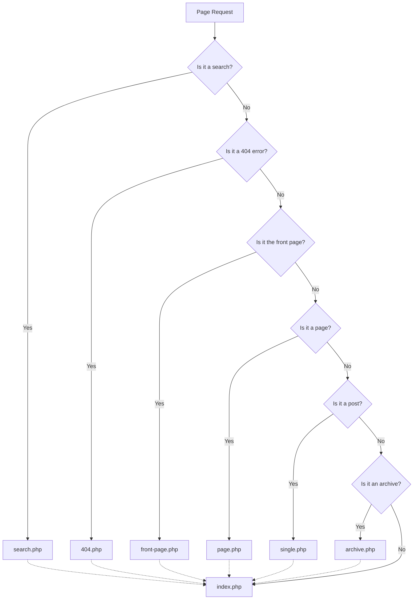

# WordPress Themes

## Introduction

WordPress themes are pre-designed templates that determine the overall appearance and display of your WordPress website. They control the layout, colors, fonts, and overall design elements without changing the core content or functionality of your site. Think of themes as the "skin" that defines how your website looks to visitors while the WordPress core handles the behind-the-scenes functionality.

In this guide, we'll explore everything you need to know about WordPress themes - from understanding what they are to selecting, installing, customizing, and even creating your own themes.

## What Are WordPress Themes?

WordPress themes are collections of files (PHP, CSS, JavaScript, and images) that work together to create the visual design and layout of your website. Every WordPress installation requires at least one theme to be active at any time.

A theme typically includes:

- Template files (PHP files that define how different parts of your site are displayed)
- Stylesheets (CSS files that control the visual styling)
- JavaScript files (for interactive elements)
- Images and other media files
- Functions file (functions.php, which adds features and functionality)

## The WordPress Theme Directory Structure

A typical WordPress theme has a structure similar to this:

```
theme-name/
│
├── style.css            # Main stylesheet and theme information
├── functions.php        # Theme functions and features
├── index.php            # Main template file
├── header.php           # Header template
├── footer.php           # Footer template
├── sidebar.php          # Sidebar template
├── single.php           # Single post template
├── page.php             # Page template
├── archive.php          # Archive template
├── 404.php              # 404 error page template
├── comments.php         # Comments template
├── screenshot.png       # Theme thumbnail image
│
├── assets/              # Additional assets
│   ├── css/             # Additional stylesheets
│   ├── js/              # JavaScript files
│   └── images/          # Theme images
│
└── template-parts/      # Template parts for reuse
    ├── content.php      # Content template part
    └── content-page.php # Page content template part
```

## Finding and Installing Themes

WordPress offers thousands of themes, both free and premium (paid). Here's how you can find and install them:

### Method 1: Using the WordPress Admin Dashboard

1. Log in to your WordPress admin dashboard
2. Go to **Appearance > Themes**
3. Click the **Add New** button at the top
4. Browse the available themes or use the search box
5. Hover over a theme and click **Install**
6. After installation, click **Activate** to apply the theme

### Method 2: Uploading a Theme

If you purchased a premium theme or downloaded one from elsewhere:

1. Download the theme ZIP file from the provider
2. Go to **Appearance > Themes** in your WordPress dashboard
3. Click the **Add New** button
4. Click the **Upload Theme** button
5. Click **Choose File**, select your theme ZIP file, and click **Install Now**
6. After installation, click **Activate**

### Method 3: Manual FTP Installation

For advanced users:

1. Download and extract the theme ZIP file
2. Connect to your server using an FTP client
3. Navigate to the `/wp-content/themes/` directory
4. Upload the theme folder
5. Go to **Appearance > Themes** in your WordPress dashboard
6. Find the uploaded theme and click **Activate**

## Understanding Theme Settings

After activating a theme, you'll typically have access to various customization options:

### Customizer

Most modern WordPress themes integrate with the WordPress Customizer:

1. Go to **Appearance > Customize**
2. Use the left sidebar panel to adjust various settings:
   - Site Identity (site title, tagline, logo)
   - Colors
   - Typography
   - Layout options
   - Widget areas
   - And more (depending on the theme)

### Theme Options Page

Some themes create their own settings page:

1. Look for the theme name in your dashboard menu
2. Explore the available options provided by the theme developer

## Working with Theme Features

### Theme Supports

WordPress themes can declare support for various core features. Common supported features include:

- Custom logos
- Featured images
- Post formats
- Custom backgrounds
- Custom headers
- Navigation menus
- Widgets

For example, if your theme supports featured images, you'll see an option to set a featured image when editing posts.

### Navigation Menus

To set up navigation menus:

1. Go to **Appearance > Menus**
2. Create a new menu by clicking **Create a new menu**
3. Add pages, posts, or custom links to your menu
4. Select a display location (like Primary Menu or Footer Menu)
5. Click **Save Menu**

### Widgets

Widgets allow you to add content and features to widget-ready areas (typically sidebars and footers):

1. Go to **Appearance > Widgets**
2. Drag and drop widgets from the available widgets panel to widget areas
3. Configure each widget's settings
4. Click **Save**

## Theme Customization

There are several approaches to customizing your WordPress theme:

### Using the Customizer

The safest and easiest option for beginners:

1. Go to **Appearance > Customize**
2. Make changes using the provided options
3. Preview changes in real-time
4. Click **Publish** when satisfied

### Adding Custom CSS

For more specific styling changes:

1. Go to **Appearance > Customize**
2. Look for the "Additional CSS" section
3. Add your custom CSS code, for example:

```css
/* Make the site title larger and red */
.site-title {
    font-size: 36px;
    color: #ff0000;
}

/* Change the background color of the header */
.site-header {
    background-color: #f5f5f5;
}
```

4. See your changes in real-time
5. Click **Publish** when done

### Child Themes

For more extensive customizations, create a child theme to safely modify a parent theme:

1. Create a new folder in `/wp-content/themes/` named `parenttheme-child`
2. Create a `style.css` file with:

```css
/*
Theme Name: Parent Theme Child
Theme URI: https://example.com
Description: Child theme for the Parent Theme
Author: Your Name
Author URI: https://example.com
Template: parenttheme
Version: 1.0.0
*/

/* Import parent theme styles */
@import url("../parenttheme/style.css");

/* Add your custom styles below */
```

3. Create a `functions.php` file with:

```php
<?php
// Enqueue parent and child theme stylesheets
function child_theme_enqueue_styles() {
    wp_enqueue_style('parent-style', get_template_directory_uri() . '/style.css');
    wp_enqueue_style('child-style', get_stylesheet_uri(), array('parent-style'));
}
add_action('wp_enqueue_scripts', 'child_theme_enqueue_styles');

// Add other customizations below
```

4. Activate the child theme from **Appearance > Themes**

## Theme Templates and the Template Hierarchy

WordPress uses a template hierarchy to determine which PHP template file to use for a given page request. Understanding this hierarchy helps when customizing themes.



If a specific template file doesn't exist, WordPress falls back to the next most general template, eventually falling back to `index.php`.

## Popular WordPress Theme Frameworks

Theme frameworks provide a foundation for creating custom themes more efficiently:

1. **Genesis Framework** - Known for clean code and SEO optimization
2. **Underscores** (`_s`) - A starter theme by Automattic for theme developers
3. **Divi** - A popular theme and page builder combination
4. **Astra** - Fast and lightweight with many customization options
5. **GeneratePress** - Performance-focused multipurpose theme

## Theme Development Basics

If you're interested in developing your own themes, here's a basic starter example:

1. Create a new folder in `/wp-content/themes/` called `my-custom-theme`
2. Create the essential files:

**style.css**:
```css
/*
Theme Name: My Custom Theme
Theme URI: https://example.com/my-custom-theme
Author: Your Name
Author URI: https://example.com
Description: My first custom WordPress theme
Version: 1.0.0
License: GNU General Public License v2 or later
License URI: http://www.gnu.org/licenses/gpl-2.0.html
Text Domain: my-custom-theme
*/

body {
    font-family: Arial, sans-serif;
    line-height: 1.6;
    color: #333;
}

.site-header {
    background-color: #f8f8f8;
    padding: 20px;
    text-align: center;
}

.site-content {
    max-width: 1200px;
    margin: 0 auto;
    padding: 20px;
}

.site-footer {
    background-color: #333;
    color: #fff;
    text-align: center;
    padding: 20px;
    margin-top: 30px;
}
```

**functions.php**:
```php
<?php
// Theme setup
function my_custom_theme_setup() {
    // Add theme support
    add_theme_support('title-tag');
    add_theme_support('post-thumbnails');
    add_theme_support('automatic-feed-links');
    add_theme_support('html5', array('search-form', 'comment-form', 'comment-list', 'gallery', 'caption'));
    
    // Register navigation menus
    register_nav_menus(array(
        'primary' => esc_html__('Primary Menu', 'my-custom-theme'),
        'footer' => esc_html__('Footer Menu', 'my-custom-theme'),
    ));
}
add_action('after_setup_theme', 'my_custom_theme_setup');

// Enqueue styles and scripts
function my_custom_theme_scripts() {
    wp_enqueue_style('my-custom-theme-style', get_stylesheet_uri());
    wp_enqueue_script('my-custom-theme-navigation', get_template_directory_uri() . '/js/navigation.js', array(), '1.0', true);
}
add_action('wp_enqueue_scripts', 'my_custom_theme_scripts');

// Register widget area
function my_custom_theme_widgets_init() {
    register_sidebar(array(
        'name'          => esc_html__('Sidebar', 'my-custom-theme'),
        'id'            => 'sidebar-1',
        'description'   => esc_html__('Add widgets here.', 'my-custom-theme'),
        'before_widget' => '<section id="%1$s" class="widget %2$s">',
        'after_widget'  => '</section>',
        'before_title'  => '<h2 class="widget-title">',
        'after_title'   => '</h2>',
    ));
}
add_action('widgets_init', 'my_custom_theme_widgets_init');
```

**index.php**:
```php
<?php get_header(); ?>

<div class="site-content">
    <?php if (have_posts()) : ?>
        <?php while (have_posts()) : the_post(); ?>
            <article id="post-<?php the_ID(); ?>" <?php post_class(); ?>>
                <header class="entry-header">
                    <?php the_title('<h2 class="entry-title"><a href="' . esc_url(get_permalink()) . '">', '</a></h2>'); ?>
                </header>
                
                <div class="entry-content">
                    <?php the_excerpt(); ?>
                </div>
                
                <footer class="entry-footer">
                    <?php echo get_the_date(); ?> by <?php the_author(); ?>
                </footer>
            </article>
        <?php endwhile; ?>
        
        <nav class="pagination">
            <?php echo paginate_links(); ?>
        </nav>
    <?php else : ?>
        <p>No posts found.</p>
    <?php endif; ?>
</div>

<?php get_sidebar(); ?>
<?php get_footer(); ?>
```

**header.php**:
```php
<!DOCTYPE html>
<html <?php language_attributes(); ?>>
<head>
    <meta charset="<?php bloginfo('charset'); ?>">
    <meta name="viewport" content="width=device-width, initial-scale=1">
    <?php wp_head(); ?>
</head>
<body <?php body_class(); ?>>
    <?php wp_body_open(); ?>
    <header class="site-header">
        <div class="site-branding">
            <?php if (is_front_page() && is_home()) : ?>
                <h1 class="site-title"><a href="<?php echo esc_url(home_url('/')); ?>"><?php bloginfo('name'); ?></a></h1>
            <?php else : ?>
                <p class="site-title"><a href="<?php echo esc_url(home_url('/')); ?>"><?php bloginfo('name'); ?></a></p>
            <?php endif; ?>
            
            <p class="site-description"><?php bloginfo('description'); ?></p>
        </div>
        
        <nav class="main-navigation">
            <?php
            wp_nav_menu(array(
                'theme_location' => 'primary',
                'menu_id'        => 'primary-menu',
                'fallback_cb'    => false,
            ));
            ?>
        </nav>
    </header>
```

**footer.php**:
```php
    <footer class="site-footer">
        <p>&copy; <?php echo date('Y'); ?> <?php bloginfo('name'); ?></p>
        
        <nav class="footer-navigation">
            <?php
            wp_nav_menu(array(
                'theme_location' => 'footer',
                'menu_id'        => 'footer-menu',
                'fallback_cb'    => false,
            ));
            ?>
        </nav>
    </footer>
    
    <?php wp_footer(); ?>
</body>
</html>
```

**sidebar.php**:
```php
<aside class="widget-area">
    <?php dynamic_sidebar('sidebar-1'); ?>
</aside>
```

3. Create a `screenshot.png` image (880×660 pixels) for your theme thumbnail
4. Activate your theme from the WordPress admin

This is a very basic theme example. Real-world themes typically include many more template files and features.

## Best Practices for WordPress Themes

1. **Choose wisely**: Select themes from reputable sources like the WordPress.org theme directory or established theme shops
2. **Consider performance**: Opt for lightweight themes that load quickly
3. **Evaluate support**: Check how actively the theme is maintained and supported
4. **Use child themes**: Never modify a parent theme directly; always create a child theme for customizations
5. **Keep it updated**: Regularly update your themes for security and compatibility
6. **Check for responsiveness**: Ensure your theme looks good on all devices
7. **Validate accessibility**: Choose themes that follow accessibility standards
8. **Avoid bloat**: Be wary of themes packed with features you'll never use
9. **Ensure plugin compatibility**: Test your theme with essential plugins before fully committing
10. **Check for translation readiness**: If multilingual support is important, verify the theme is translation-ready

## Summary

WordPress themes are fundamental to your website's design and user experience. They determine how your content is presented to visitors while maintaining separation between content and presentation. By understanding how to select, install, and customize themes, you can create a website that reflects your brand and serves your audience effectively.

Whether you choose to use a pre-built theme, customize an existing one, or develop your own, the principles covered in this guide will help you make informed decisions about your WordPress site's appearance.

## Additional Resources

- [WordPress Theme Developer Handbook](https://developer.wordpress.org/themes/)
- [WordPress Theme Directory](https://wordpress.org/themes/)
- [Theme Unit Test Data](https://github.com/WPTT/theme-test-data)
- [Underscores Starter Theme](https://underscores.me/)
- [Theme Check Plugin](https://wordpress.org/plugins/theme-check/)

## Exercises

1. Install and activate three different themes on your WordPress site. Compare their features, settings, and customization options.
2. Create a child theme for an existing theme and make at least five CSS customizations.
3. Learn how to use the WordPress Customizer API by adding a new section with controls to a child theme.
4. Create a custom page template for a specific page on your site.
5. Identify which template files are being used on different pages of your site using a plugin like "What The File" or by adding a comment to the footer in your theme's functions.php file.