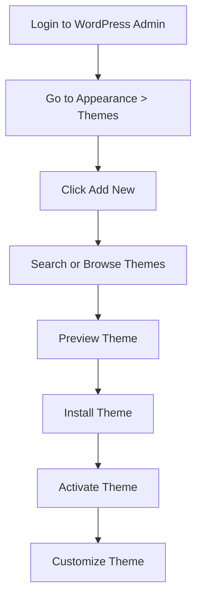

# WordPress Theme Installation

WordPress themes control the visual appearance and layout of your website. Installing a new theme can completely transform how your site looks without changing your content. This guide will walk you through the process of installing and activating WordPress themes using different methods.

## What are WordPress Themes?

WordPress themes are collections of templates and stylesheets that define how your website looks and behaves. They control:

- Layout and design
- Typography and colors
- Widget positions
- Navigation styles
- Overall visual presentation

## Methods for Installing WordPress Themes

There are three primary ways to install a WordPress theme:

1. Using the WordPress Admin Interface (easiest)
2. Manual upload via FTP
3. Using the WordPress CLI (for advanced users)

Let's explore each method in detail.

## Method 1: Installing Themes via WordPress Admin

This is the simplest and most common way to install WordPress themes.

### Step-by-Step Instructions:

1. **Log in to WordPress**: Access your WordPress admin dashboard using your credentials

2. **Navigate to Themes**: Go to `Appearance` → `Themes` in the left sidebar

3. **Add a New Theme**: Click the `Add New` button at the top of the page

4. **Browse or Search**: You can:
   - Browse featured, popular, or latest themes
   - Use the search box to find specific themes
   - Filter themes by features using the "Feature Filter" button

5. **Preview and Install**: 
   - Hover over a theme and click `Preview` to see how it would look on your site
   - Click `Install` to download and install the theme

6. **Activate the Theme**:
   - After installation, click `Activate` to make the theme live on your website

Here's what the process looks like in your WordPress dashboard:



## Method 2: Manual Theme Installation via FTP

If you've purchased a premium theme or downloaded one from an external source, you may need to install it manually.

### Prerequisites:

- A WordPress theme ZIP file
- FTP credentials for your website
- FTP client software (like FileZilla, Cyberduck, or WinSCP)

### Step-by-Step Instructions:

#### Option A: Upload via WordPress Admin

1. **Download the theme**: Keep the ZIP file as is (don't extract it)

2. **Navigate to Themes**: Go to `Appearance` → `Themes` in your WordPress admin

3. **Click Add New**: Then click the `Upload Theme` button at the top

4. **Choose File**: Select your theme ZIP file and click `Install Now`

5. **Activate**: Once installed, click `Activate` to use the theme

#### Option B: Upload via FTP

1. **Extract the theme**: Unzip the theme file on your computer

2. **Connect to your server**: Use your FTP client and credentials to connect

3. **Navigate to themes directory**: Go to `/wp-content/themes/` on your server

4. **Upload theme folder**: Upload the entire extracted theme folder

5. **Activate in WordPress**: Go to `Appearance` → `Themes` in your WordPress admin and find your uploaded theme, then click `Activate`

## Method 3: Installing via WordPress CLI

For developers or advanced users comfortable with command line interfaces, WP-CLI offers a faster way to install themes.

```bash
# Install a theme from WordPress.org repository
wp theme install twentytwentytwo --activate

# Install a theme from a ZIP file
wp theme install /path/to/theme.zip --activate

# Install a theme from a remote URL
wp theme install https://example.com/theme.zip --activate
```

## Activating and Switching Themes

After installing multiple themes, you can easily switch between them:

1. Go to `Appearance` → `Themes` in your WordPress admin
2. Hover over the theme you want to use
3. Click `Activate`
4. Your site's appearance will immediately change to the new theme

You can also click `Live Preview` to see how a theme would look with your content before activating it.

## Customizing Your Theme

After activating a theme, you'll typically want to customize it:

1. Go to `Appearance` → `Customize` to open the WordPress Customizer
2. The available customization options will vary depending on your theme, but may include:
   - Site identity (logo, title, tagline)
   - Colors and typography
   - Header and footer options
   - Layout settings
   - Widget areas
   - Menu positions

Here's an example of changing your site title and tagline in the customizer:

```php
// This code is executed behind the scenes when you save your site title and tagline
update_option('blogname', 'My Awesome Website');
update_option('blogdescription', 'The best website ever created');
```

## Theme Updates

Themes occasionally receive updates to fix bugs, add features, or maintain compatibility. To update your themes:

1. Go to `Dashboard` → `Updates`
2. If theme updates are available, they'll be listed
3. Select the themes you want to update and click `Update Themes`

For manually installed themes, you'll need to repeat the installation process with the new version.

## Child Themes

When making extensive customizations to a theme, it's best practice to create a child theme:

```php
/*
Theme Name: Twenty Twenty-Two Child
Theme URI: https://example.com
Description: Child theme for Twenty Twenty-Two
Author: Your Name
Author URI: https://example.com
Template: twentytwentytwo
Version: 1.0
*/

/* Import parent theme styles */
@import url("../twentytwentytwo/style.css");

/* Add custom styles below */
body {
    background-color: #f5f5f5;
}
```

Save this code in a `style.css` file in a new folder named `twentytwentytwo-child` in your themes directory.

## Common Issues and Solutions

### Theme Won't Install

- **File size limit**: Your hosting might have PHP upload limits. Try FTP installation instead.
- **Server permissions**: Ensure your `wp-content/themes` directory is writable.
- **Incompatible PHP version**: Some themes require specific PHP versions.

### Theme Doesn't Look Like the Demo

Most premium themes include:
- Demo content import functionality
- Theme options panel
- Required plugins

Follow the theme documentation to properly set up the theme as shown in the demo.

## Summary

Installing WordPress themes is a straightforward process that can dramatically change your website's appearance. You can install themes through the WordPress admin interface, manual FTP upload, or via the command line. After activation, use the WordPress Customizer to tailor the theme to your needs.

Remember that a theme controls the visual presentation of your site but doesn't typically add functionality—that's what plugins are for. Choose a theme that aligns with your website's purpose and audience expectations.

## Additional Resources

- Explore free themes in the [WordPress Theme Directory](https://wordpress.org/themes/)
- Learn about [child themes](https://developer.wordpress.org/themes/advanced-topics/child-themes/) for customization
- Understand [theme development](https://developer.wordpress.org/themes/) to create your own themes

## Exercises

1. Install and activate the latest default WordPress theme
2. Try uploading a theme using the manual upload method
3. Customize your active theme's colors and header options
4. Create a simple child theme for a default WordPress theme
5. Test different themes to see which works best for your content

Remember, the best theme is one that meets your specific needs and provides a great experience for your visitors!