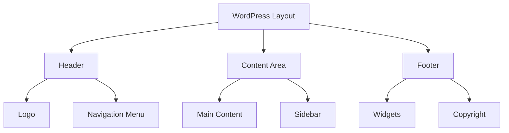
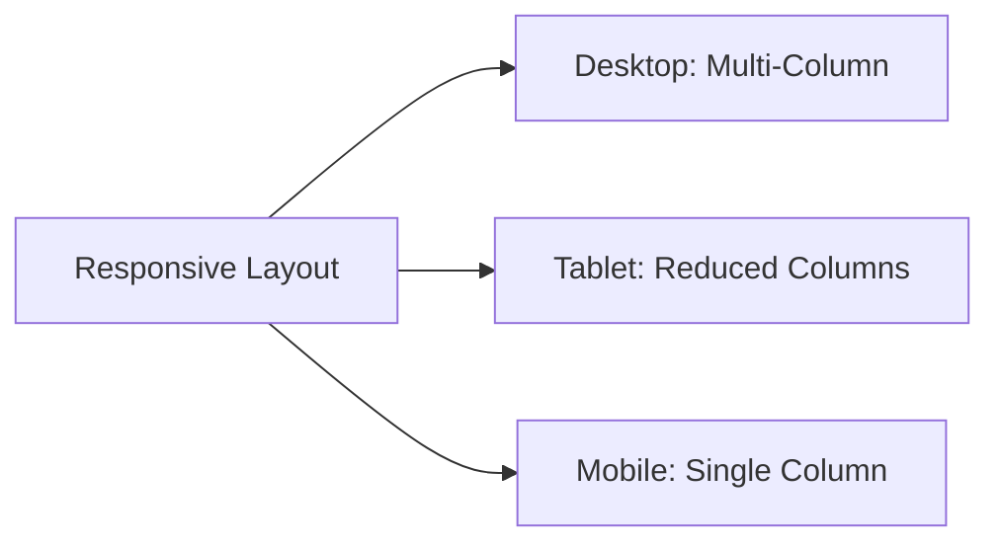

# WordPress Layouts

## Introduction

WordPress layouts determine how your website content is presented to visitors. They define the visual structure of your pages, including headers, footers, sidebars, and content areas. Understanding WordPress layouts is essential for creating well-designed, functional websites without needing extensive coding knowledge.

In this guide, we'll explore how WordPress layouts work, the different types available, and how to customize them to match your specific needs. Whether you're building a blog, business website, or portfolio, mastering WordPress layouts will give you the power to create professional websites with ease.

## WordPress Layout Fundamentals

### What Are WordPress Layouts?

WordPress layouts are visual frameworks that determine how content is arranged and displayed on your website. They are primarily controlled by:

1. **WordPress Themes** - Pre-designed templates that include layout structures
2. **Template Files** - PHP files that control specific page types
3. **CSS Styling** - Code that defines visual appearance
4. **Block Editor Layouts** - Content arrangements within posts/pages

Let's visualize the basic structure of a WordPress layout:



## WordPress Theme Templates

WordPress themes use a template hierarchy to determine which PHP file is used to display specific content. Understanding this hierarchy helps you control your site's layout.

### Key Template Files

- `index.php` - The fallback template if no specific template exists
- `header.php` - Contains the site header
- `footer.php` - Contains the site footer
- `sidebar.php` - Contains the sidebar(s)
- `single.php` - Displays single posts
- `page.php` - Displays individual pages
- `archive.php` - Displays archive pages (categories, tags, etc.)
- `front-page.php` - Used for the home page

### Template Example

Here's a simplified example of how a typical `page.php` template might be structured:

```php
<?php get_header(); ?>

<div id="primary" class="content-area">
    <main id="main" class="site-main">
        <?php
        while ( have_posts() ) :
            the_post();
            get_template_part( 'template-parts/content', 'page' );

            // If comments are open or we have at least one comment, load up the comment template.
            if ( comments_open() || get_comments_number() ) :
                comments_template();
            endif;
        endwhile;
        ?>
    </main><!-- #main -->
</div><!-- #primary -->

<?php 
get_sidebar();
get_footer(); 
?>
```

This template includes the header, displays the page content, loads comments if applicable, includes the sidebar, and then adds the footer.

## Common WordPress Layout Types

WordPress themes typically offer several layout options:

### 1. Full-Width Layout

A full-width layout spans the entire width of the browser window, with no sidebars:

```
+-----------------------------------+
|             HEADER                |
+-----------------------------------+
|                                   |
|                                   |
|          CONTENT AREA             |
|                                   |
|                                   |
+-----------------------------------+
|             FOOTER                |
+-----------------------------------+
```

### 2. Content with Sidebar Layout

This common layout features content with one sidebar:

```
+-----------------------------------+
|             HEADER                |
+-----------------------------------+
|                      |            |
|                      |            |
|    CONTENT AREA      |  SIDEBAR   |
|                      |            |
|                      |            |
+-----------------------------------+
|             FOOTER                |
+-----------------------------------+
```

### 3. Content with Two Sidebars

Some layouts feature content flanked by sidebars on both sides:

```
+-----------------------------------+
|             HEADER                |
+-----------------------------------+
|            |           |          |
|            |           |          |
| SIDEBAR-L  |  CONTENT  | SIDEBAR-R|
|            |           |          |
|            |           |          |
+-----------------------------------+
|             FOOTER                |
+-----------------------------------+
```

## Customizing WordPress Layouts

There are several ways to customize WordPress layouts:

### 1. Using the Theme Customizer

The WordPress Theme Customizer provides a visual interface to modify your theme's layout settings:

1. Go to **Appearance > Customize** in your WordPress dashboard
2. Look for layout options (these vary by theme) such as:
   - Layout style (full width, with sidebar, etc.)
   - Header layout
   - Footer layout
   - Content width
   - Sidebar position

### 2. Page Templates

Many themes include multiple page templates you can select when editing a page:

1. In the page editor, locate the "Page Attributes" panel
2. From the "Template" dropdown, select options like:
   - Default Template
   - Full Width
   - Landing Page
   - Left Sidebar
   - Right Sidebar

### 3. Block Editor Layout Options

The WordPress Block Editor (Gutenberg) offers layout controls:

1. **Columns Block**: Split content into multiple columns
   ```
   +----------+-----------+
   | Column 1 | Column 2  |
   +----------+-----------+
   ```

2. **Group Block**: Group related blocks with shared styling
3. **Cover Block**: Create full-width sections with background images/colors
4. **Spacer Block**: Add precise vertical spacing

### Example: Creating a Two-Column Layout with Gutenberg

1. Add a new post or page
2. Click the "+" button to add a new block
3. Select "Columns"
4. Choose a 50/50 column layout
5. Add content blocks inside each column

Here's how it would look in the editor:

```
// Columns Block (50/50)
+----------------------+----------------------+
|                      |                      |
|    Heading Block     |    Image Block       |
|                      |                      |
|    Paragraph Block   |    Button Block      |
|                      |                      |
+----------------------+----------------------+
```

## Creating Custom Page Templates

For more advanced customization, you can create custom page templates:

1. Create a new file in your child theme directory
2. Add the template information header

```php
<?php
/**
 * Template Name: My Custom Layout
 * Template Post Type: page
 */

get_header(); ?>

<div class="my-custom-layout">
    <div class="content-area">
        <?php
        while ( have_posts() ) :
            the_post();
            the_content();
        endwhile;
        ?>
    </div>
</div>

<?php get_footer(); ?>
```

3. Save the file (e.g., `template-custom-layout.php`)
4. The template will now appear in the page template dropdown

## Using CSS Grid for Modern Layouts

Modern WordPress themes often use CSS Grid to create flexible layouts:

```css
.site-content {
  display: grid;
  grid-template-columns: 2fr 1fr;
  grid-gap: 30px;
}

.content-area {
  grid-column: 1;
}

.sidebar {
  grid-column: 2;
}

@media (max-width: 768px) {
  .site-content {
    grid-template-columns: 1fr;
  }
  
  .content-area,
  .sidebar {
    grid-column: 1;
  }
}
```

This creates a responsive two-column layout that stacks on mobile devices.

## Responsive Layouts

All WordPress layouts should be responsive to provide optimal viewing across devices:



Modern themes include media queries to adjust layouts based on screen size:

```css
/* Desktop layout */
.site-content {
  display: grid;
  grid-template-columns: 70% 30%;
  grid-gap: 30px;
}

/* Tablet layout */
@media (max-width: 992px) {
  .site-content {
    grid-template-columns: 60% 40%;
  }
}

/* Mobile layout */
@media (max-width: 768px) {
  .site-content {
    grid-template-columns: 100%;
  }
}
```

## Popular WordPress Layout Plugins

Several plugins can help extend your layout capabilities:

1. **Elementor** - Drag-and-drop page builder with advanced layout options
2. **Beaver Builder** - User-friendly page builder with multiple column layouts
3. **SiteOrigin Page Builder** - Free page builder with grid-based layouts
4. **Divi Builder** - Feature-rich visual builder with layout presets

## Practical Examples

### Example 1: Creating a Portfolio Layout

Let's create a basic portfolio layout using the Block Editor:

1. Create a new page titled "Portfolio"
2. Add a Heading block for the title
3. Add a Columns block with 3 columns
4. In each column, add:
   - An Image block (for portfolio item)
   - A Heading block (for project title)
   - A Paragraph block (for description)
   - A Button block (for "View Project")
5. Duplicate the Columns block to add more portfolio items

### Example 2: Creating a Landing Page Layout

1. Create a new page and select a "Full Width" template
2. Add a Cover block with a background image and overlay
3. Inside the Cover block, add:
   - A Heading block for your main headline
   - A Paragraph block for the subheading
   - A Buttons block with "Learn More" and "Contact Us"
4. Below the Cover block, add:
   - A Group block with background color
   - Inside the Group, add a Columns block with 3 columns for features
   - In each column, add an icon, heading, and description
5. Continue adding sections using Group blocks with alternating backgrounds

## Summary

WordPress layouts provide the foundation for your website's design. By understanding how templates work, using built-in layout tools, and leveraging customization options, you can create professional-looking websites without advanced coding skills.

Key takeaways:
- WordPress themes control the overall layout structure
- Template files define specific page layouts
- The Block Editor provides layout tools for content areas
- Custom CSS can further enhance layout capabilities
- Responsive design ensures layouts work across all devices

## Additional Resources

### Exercises to Practice

1. **Template Analysis**: Examine your current theme's template files to understand how they create your site's layout.
2. **Layout Exploration**: Create a test page using different layout options (full-width, with sidebar, etc.) to see how content displays.
3. **Block Pattern Creation**: Design a reusable block pattern with a multi-column layout you can use across your site.

### Where to Learn More

- WordPress.org Documentation on Template Hierarchy
- WordPress Block Editor Handbook
- CSS Grid and Flexbox tutorials for more advanced layout control
- Theme developer documentation for your specific theme

By mastering WordPress layouts, you'll be able to create websites that are both visually appealing and functionally effective, meeting your specific needs and providing a great user experience.