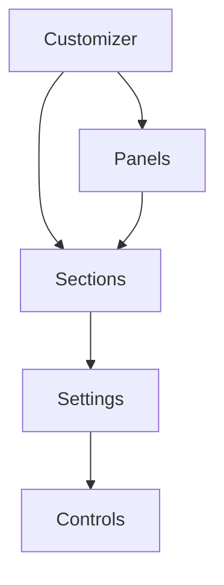

# WordPress Theme Customizer

## Introduction

The WordPress Theme Customizer is a powerful tool that allows users to customize their website's appearance through a user-friendly interface with real-time previews. Introduced in WordPress 3.4, the Customizer offers point-and-click customization options that eliminate the need to edit theme files directly, making website personalization accessible to users of all technical skill levels.

In this tutorial, you'll learn how to use the WordPress Theme Customizer as a website owner and how to implement customization options as a theme developer.

## Accessing the Theme Customizer

To access the Theme Customizer:

1. Log in to your WordPress admin dashboard.
2. Navigate to **Appearance > Customize**.
3. The Customizer will open with a preview of your site on the right and customization options on the left.

## Understanding the Customizer Interface

The Customizer interface consists of two main parts:

1. **Preview Panel**: The right side shows a live preview of your website that updates in real-time as you make changes.

2. **Controls Panel**: The left side displays customization options organized into sections like:
   - Site Identity
   - Colors
   - Typography
   - Layout
   - Menus
   - Widgets
   - Homepage Settings
   - Additional CSS

The options available depend on your active theme and plugins.

## Basic Customization Tasks

### Changing the Site Title and Tagline

1. In the Customizer, click on **Site Identity**.
2. Modify the "Site Title" and "Tagline" fields.
3. Toggle the "Display Site Title and Tagline" option as needed.
4. Watch the preview update in real-time.
5. Click "Publish" to save changes.

### Uploading a Logo

1. Navigate to **Site Identity** in the Customizer.
2. Click "Select logo" and upload your image.
3. Crop if necessary and click "Select."
4. Adjust the logo size if your theme supports this option.
5. Click "Publish" to save changes.

### Changing Colors

Many themes allow you to customize colors for various elements:

1. Click on **Colors** or **Colors & Background** in the Customizer.
2. Use the color pickers to select new colors for elements like:
   - Background
   - Text
   - Links
   - Header
   - Footer
3. See the changes update instantly in the preview.
4. Click "Publish" to save changes.

### Adding a Header Image

1. Navigate to **Header** or **Header Media** in the Customizer.
2. Click "Add new image" or "Select image."
3. Upload a new image or select from the media library.
4. Crop if necessary and adjust options like overlay text.
5. Click "Publish" to save changes.

### Customizing Menus and Widgets

1. Click on **Menus** or **Widgets** in the Customizer.
2. Make changes to your menus or widget areas.
3. The preview updates to show your modifications.
4. Click "Publish" to save changes.

## Using Additional CSS

The Customizer includes an "Additional CSS" section where you can add custom CSS rules without editing theme files:

1. Navigate to **Additional CSS** in the Customizer.
2. Add your CSS code in the editor.
3. See the changes applied instantly in the preview.

Example CSS to change link colors:

```css
a {
  color: #f05694;
}

a:hover {
  color: #333333;
}
```

## For Theme Developers: The Customizer API

If you're developing a WordPress theme, you can add custom options to the Customizer using the WordPress Customizer API.

### Customizer API Basic Structure

The Customizer API follows this hierarchy:



- **Panels**: Top-level containers that group related sections
- **Sections**: Groups of related controls
- **Settings**: Data stored in the database
- **Controls**: UI elements that users interact with

### Adding Custom Customizer Options

Here's how to add custom options to the Customizer in your theme's `functions.php` file:

```php
function mytheme_customize_register( $wp_customize ) {
    
    // Add a section
    $wp_customize->add_section( 'mytheme_colors_section', array(
        'title'      => __( 'Theme Colors', 'mytheme' ),
        'priority'   => 30,
    ) );
    
    // Add a setting
    $wp_customize->add_setting( 'mytheme_header_color', array(
        'default'   => '#000000',
        'transport' => 'refresh',
        'sanitize_callback' => 'sanitize_hex_color',
    ) );
    
    // Add a control
    $wp_customize->add_control( new WP_Customize_Color_Control( $wp_customize, 'mytheme_header_color', array(
        'label'    => __( 'Header Color', 'mytheme' ),
        'section'  => 'mytheme_colors_section',
        'settings' => 'mytheme_header_color',
    ) ) );
}
add_action( 'customize_register', 'mytheme_customize_register' );
```

### Applying Customizer Settings to Your Theme

To use the settings in your theme, add this code to your `functions.php`:

```php
function mytheme_customize_css() {
    ?>
    <style type="text/css">
        header {
            background-color: <?php echo get_theme_mod( 'mytheme_header_color', '#000000' ); ?>;
        }
    </style>
    <?php
}
add_action( 'wp_head', 'mytheme_customize_css' );
```

### Using Transport for Live Preview

The `transport` parameter in your setting determines how changes are previewed:

- `refresh`: Reloads the preview when the setting changes (default)
- `postMessage`: Updates the preview without reloading (requires JavaScript)

For real-time updates with `postMessage`, add this JavaScript to your theme's customizer script:

```php
function mytheme_customize_preview_js() {
    wp_enqueue_script( 'mytheme-customizer', get_template_directory_uri() . '/js/customizer.js', array( 'customize-preview' ), '20210101', true );
}
add_action( 'customize_preview_init', 'mytheme_customize_preview_js' );
```

Then create a `js/customizer.js` file with:

```javascript
( function( $ ) {
    // Update header color in real time
    wp.customize( 'mytheme_header_color', function( value ) {
        value.bind( function( newval ) {
            $( 'header' ).css( 'background-color', newval );
        } );
    } );
} )( jQuery );
```

## Creating Complex Controls

For more advanced options, you can create custom controls by extending the `WP_Customize_Control` class:

```php
class Text_Size_Custom_Control extends WP_Customize_Control {
    public $type = 'text_size';
    
    public function render_content() {
        ?>
        <label>
            <?php if ( ! empty( $this->label ) ) : ?>
                <span class="customize-control-title"><?php echo esc_html( $this->label ); ?></span>
            <?php endif; ?>
            
            <div class="text-size-buttons">
                <button type="button" class="small" data-size="12">S</button>
                <button type="button" class="medium" data-size="16">M</button>
                <button type="button" class="large" data-size="20">L</button>
                <button type="button" class="xlarge" data-size="24">XL</button>
            </div>
            
            <input type="hidden" <?php $this->link(); ?> value="<?php echo esc_attr( $this->value() ); ?>">
        </label>
        <?php
    }
}

// Add the control to the customizer
function mytheme_customize_register( $wp_customize ) {
    // Include the custom control class
    
    $wp_customize->add_setting( 'body_text_size', array(
        'default'   => '16',
        'transport' => 'postMessage',
        'sanitize_callback' => 'absint',
    ) );
    
    $wp_customize->add_control( new Text_Size_Custom_Control( $wp_customize, 'body_text_size', array(
        'label'   => __( 'Body Text Size', 'mytheme' ),
        'section' => 'typography_section',
        'settings' => 'body_text_size',
    ) ) );
}
```

## Practical Real-World Example: Building a Complete Theme Customizer Section

Let's create a "Typography" section that allows users to customize fonts and text sizes:

```php
function mytheme_typography_customizer( $wp_customize ) {
    // Add Typography Section
    $wp_customize->add_section( 'mytheme_typography', array(
        'title'       => __( 'Typography Settings', 'mytheme' ),
        'description' => __( 'Customize your site\'s fonts and typography', 'mytheme' ),
        'priority'    => 40,
    ) );
    
    // Heading Font Family
    $wp_customize->add_setting( 'heading_font', array(
        'default'   => 'Arial, sans-serif',
        'transport' => 'postMessage',
        'sanitize_callback' => 'sanitize_text_field',
    ) );
    
    $wp_customize->add_control( 'heading_font', array(
        'label'    => __( 'Heading Font', 'mytheme' ),
        'section'  => 'mytheme_typography',
        'type'     => 'select',
        'choices'  => array(
            'Arial, sans-serif'       => 'Arial',
            'Helvetica, sans-serif'   => 'Helvetica',
            'Georgia, serif'          => 'Georgia',
            'Tahoma, sans-serif'      => 'Tahoma',
            'Verdana, sans-serif'     => 'Verdana',
            'Times New Roman, serif'  => 'Times New Roman',
        ),
    ) );
    
    // Body Font Family
    $wp_customize->add_setting( 'body_font', array(
        'default'   => 'Helvetica, sans-serif',
        'transport' => 'postMessage',
        'sanitize_callback' => 'sanitize_text_field',
    ) );
    
    $wp_customize->add_control( 'body_font', array(
        'label'    => __( 'Body Font', 'mytheme' ),
        'section'  => 'mytheme_typography',
        'type'     => 'select',
        'choices'  => array(
            'Arial, sans-serif'       => 'Arial',
            'Helvetica, sans-serif'   => 'Helvetica',
            'Georgia, serif'          => 'Georgia',
            'Tahoma, sans-serif'      => 'Tahoma',
            'Verdana, sans-serif'     => 'Verdana',
            'Times New Roman, serif'  => 'Times New Roman',
        ),
    ) );
    
    // Heading Font Size
    $wp_customize->add_setting( 'heading_size', array(
        'default'   => '32',
        'transport' => 'postMessage',
        'sanitize_callback' => 'absint',
    ) );
    
    $wp_customize->add_control( 'heading_size', array(
        'label'    => __( 'Heading Font Size (px)', 'mytheme' ),
        'section'  => 'mytheme_typography',
        'type'     => 'number',
        'input_attrs' => array(
            'min'  => 16,
            'max'  => 60,
            'step' => 1,
        ),
    ) );
    
    // Body Font Size
    $wp_customize->add_setting( 'body_size', array(
        'default'   => '16',
        'transport' => 'postMessage',
        'sanitize_callback' => 'absint',
    ) );
    
    $wp_customize->add_control( 'body_size', array(
        'label'    => __( 'Body Font Size (px)', 'mytheme' ),
        'section'  => 'mytheme_typography',
        'type'     => 'number',
        'input_attrs' => array(
            'min'  => 12,
            'max'  => 24,
            'step' => 1,
        ),
    ) );
}
add_action( 'customize_register', 'mytheme_typography_customizer' );

// Apply the custom styles
function mytheme_typography_css() {
    ?>
    <style type="text/css">
        h1, h2, h3, h4, h5, h6 {
            font-family: <?php echo get_theme_mod( 'heading_font', 'Arial, sans-serif' ); ?>;
            font-size: <?php echo get_theme_mod( 'heading_size', '32' ); ?>px;
        }
        
        body {
            font-family: <?php echo get_theme_mod( 'body_font', 'Helvetica, sans-serif' ); ?>;
            font-size: <?php echo get_theme_mod( 'body_size', '16' ); ?>px;
        }
    </style>
    <?php
}
add_action( 'wp_head', 'mytheme_typography_css' );

// Add JavaScript for live preview
function mytheme_typography_customize_preview_js() {
    wp_enqueue_script( 'mytheme-typo-customizer', get_template_directory_uri() . '/js/typography-customizer.js', array( 'customize-preview' ), '20210101', true );
}
add_action( 'customize_preview_init', 'mytheme_typography_customize_preview_js' );
```

And the JavaScript file (`js/typography-customizer.js`):

```javascript
( function( $ ) {
    // Heading font family
    wp.customize( 'heading_font', function( value ) {
        value.bind( function( newval ) {
            $( 'h1, h2, h3, h4, h5, h6' ).css( 'font-family', newval );
        } );
    } );
    
    // Body font family
    wp.customize( 'body_font', function( value ) {
        value.bind( function( newval ) {
            $( 'body' ).css( 'font-family', newval );
        } );
    } );
    
    // Heading font size
    wp.customize( 'heading_size', function( value ) {
        value.bind( function( newval ) {
            $( 'h1, h2, h3, h4, h5, h6' ).css( 'font-size', newval + 'px' );
        } );
    } );
    
    // Body font size
    wp.customize( 'body_size', function( value ) {
        value.bind( function( newval ) {
            $( 'body' ).css( 'font-size', newval + 'px' );
        } );
    } );
} )( jQuery );
```

## Best Practices for Customizer Development

1. **Organize your code**: Group related controls into sections and panels.

2. **Use sanitization callbacks**: Always sanitize user input before saving to the database:

```php
$wp_customize->add_setting( 'my_setting', array(
    'sanitize_callback' => 'sanitize_text_field', // Built-in WordPress function
) );
```

3. **Use appropriate control types** for different data:
   - `text` for short text
   - `textarea` for paragraphs
   - `checkbox` for boolean values
   - `radio` for a set of options
   - `select` for dropdown selections
   - `color` for color options
   - `image` for image uploads
   - `upload` for file uploads

4. **Use transport: postMessage** when possible for a better user experience.

5. **Use selective refresh** for widgets and complex components to avoid full page reloads.

6. **Add contextual help** to guide users:

```php
$wp_customize->get_section( 'my_section' )->description = __( 'These settings control the appearance of your site header.', 'mytheme' );
```

## Common Pitfalls and Solutions

### Problem: Changes Not Appearing in Live Preview

**Solution**: Ensure you've properly implemented the JavaScript for live preview with `transport: postMessage`.

### Problem: Settings Not Saving to Database

**Solution**: Check your sanitization callbacks and ensure they're not filtering out valid data.

### Problem: Controls Not Showing in Customizer

**Solution**: Verify that your section exists and that controls are properly assigned to it.

### Problem: Customizer Performance Issues

**Solution**: 
- Limit the number of options to keep the Customizer fast
- Use `postMessage` transport instead of `refresh`
- Implement selective refresh for complex components

## Summary

The WordPress Theme Customizer provides a powerful interface for users to personalize their sites and for developers to create flexible themes. In this guide, we covered:

- How to access and use the Customizer as a site owner
- The structure of the Customizer API with panels, sections, settings and controls
- How to add custom options to the Customizer
- Implementing live preview with JavaScript
- Creating custom controls for specialized options
- Best practices for Customizer development

With these skills, you can create highly customizable WordPress themes that provide an excellent user experience while maintaining solid code quality and performance.

## Further Resources and Exercises

### Resources

- [WordPress Theme Customizer API Documentation](https://developer.wordpress.org/themes/customize-api/)
- [WordPress Theme Customization API Handbook](https://developer.wordpress.org/themes/customize-api/)
- [Theme Developer Handbook](https://developer.wordpress.org/themes/)

### Practical Exercises

1. **Basic Exercise**: Add a color picker to customize the footer background color.
2. **Intermediate Exercise**: Create a layout section allowing users to choose between a one-column or two-column layout.
3. **Advanced Exercise**: Build a complete "Site Styles" panel with sections for colors, typography, layout, and buttons, with all options updating in real-time.
4. **Challenge**: Create a custom control that lets users visually arrange elements in the header (logo, menu, search) by dragging and dropping.

By mastering the WordPress Theme Customizer, you'll be able to create themes that are both powerful and user-friendly, giving your users the flexibility to create truly personalized websites without writing a single line of code.