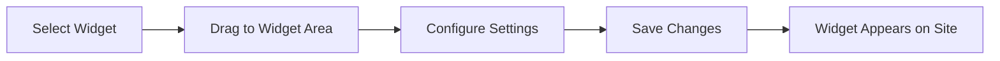

# WordPress Widgets

## Introduction

WordPress widgets are small blocks of functionality that allow you to add content and features to the predefined areas of your WordPress theme, commonly known as "widget areas" or "widget-ready areas." These are typically found in sidebars, footers, headers, and other locations depending on your theme.

Widgets make it easy for non-technical users to customize their website's layout and functionality without writing any code. They operate on a simple drag-and-drop interface, making them one of the most user-friendly features of WordPress.

## Understanding WordPress Widgets

### What Are Widgets?

Widgets are modular components that serve specific functions like displaying:

- Recent posts
- Categories
- Search boxes
- Custom menus
- Text or HTML content
- Images and galleries
- Social media feeds
- And much more

The beauty of widgets lies in their simplicity and flexibility - they can be easily added, removed, and rearranged through the WordPress admin interface.

### Where to Find Widgets

To access your widgets:

1. Log in to your WordPress dashboard
2. Navigate to **Appearance** → **Widgets**

You'll see two main sections:
- Available widgets (left side)
- Widget areas specific to your theme (right side)

## Working with Widgets

### Adding a Widget

Adding a widget to your site is a simple drag-and-drop operation:

1. Find the widget you want to use from the available widgets section
2. Drag it to your desired widget area
3. Configure the widget settings
4. Click "Save"

Here's a visual representation of the widget workflow:



### Common WordPress Widgets

Let's explore some of the standard widgets that come with WordPress:

#### Text Widget

The Text widget allows you to add arbitrary text or HTML to your widget areas.

**Example use case:** Adding a brief "About Us" blurb in your sidebar.

```html
<!-- What you might add to a Text Widget -->
<h4>About Our Blog</h4>
<p>Welcome to our tech blog where we share insights about WordPress development and web design tips.</p>
<a href="/about">Learn more →</a>
```

#### Recent Posts Widget

This widget displays your most recent blog posts.

**Configuration options include:**
- Title
- Number of posts to display
- Whether to show post dates

#### Search Widget

Adds a search box to help visitors find content on your site.

#### Categories Widget

Lists all your blog categories.

**Configuration options include:**
- Title
- Display as dropdown
- Show post counts

### Creating a Custom Widget Area

Some themes allow you to create custom widget areas through the Customizer. If your theme doesn't have this feature or you want more control, you can add custom widget areas with code.

Here's how to register a custom widget area in your theme's `functions.php` file:

```php
function my_custom_widgets_init() {
    register_sidebar( array(
        'name'          => 'Custom Sidebar',
        'id'            => 'custom-sidebar',
        'description'   => 'This is my custom widget area',
        'before_widget' => '<div id="%1$s" class="widget %2$s">',
        'after_widget'  => '</div>',
        'before_title'  => '<h3 class="widget-title">',
        'after_title'   => '</h3>',
    ) );
}
add_action( 'widgets_init', 'my_custom_widgets_init' );
```

This code registers a new widget area called "Custom Sidebar" that you can use in your theme.

To display this widget area in your theme template, add this code where you want the widgets to appear:

```php
<?php if ( is_active_sidebar( 'custom-sidebar' ) ) : ?>
    <div id="secondary-sidebar" class="widget-area">
        <?php dynamic_sidebar( 'custom-sidebar' ); ?>
    </div>
<?php endif; ?>
```

## Widget Best Practices

### Performance Considerations

While widgets are convenient, adding too many can impact your site's performance:

1. Use only the widgets you need
2. Consider using caching plugins if you have many widgets
3. Be careful with widgets that load external resources (like social media feeds)

### Mobile Responsiveness

Make sure your widgets look good on all devices:

1. Test your widget display on mobile devices
2. Consider using responsive-aware widgets
3. Some themes offer options to hide specific widgets on mobile devices

### Widget Accessibility

Ensure your widgets are accessible to all users:

1. Use clear, descriptive widget titles
2. Maintain sufficient color contrast
3. Ensure links within widgets are descriptive and understandable

## Advanced Widget Techniques

### Using Widget Logic

For more sophisticated control over your widgets, you might want to use the Widget Logic plugin. This plugin allows you to specify conditions for when each widget should appear using WordPress conditional tags.

For example, to show a widget only on the homepage:

```
is_home()
```

Or to show it only on single posts:

```
is_single()
```

### Creating a Custom Widget

If you need functionality that isn't available in existing widgets, you can create your own. Here's a simple example of creating a custom widget that displays a random quote:

```php
// Register and load the widget
function wpb_load_widget() {
    register_widget( 'random_quote_widget' );
}
add_action( 'widgets_init', 'wpb_load_widget' );

// Creating the widget 
class random_quote_widget extends WP_Widget {
 
    function __construct() {
        parent::__construct(
            'random_quote_widget', // Base ID
            'Random Quote Widget', // Widget name in UI
            array( 'description' => 'A widget that displays a random quote' ) // Widget description
        );
    }
    
    // Creating widget front-end
    public function widget( $args, $instance ) {
        $title = apply_filters( 'widget_title', $instance['title'] );
        
        // before and after widget arguments are defined by themes
        echo $args['before_widget'];
        if ( ! empty( $title ) )
        echo $args['before_title'] . $title . $args['after_title'];
        
        // This is where you run the code and display the output
        $quotes = array(
            "The future belongs to those who believe in the beauty of their dreams.",
            "Success is not final, failure is not fatal: It is the courage to continue that counts.",
            "The only way to do great work is to love what you do."
        );
        
        $random_quote = $quotes[array_rand($quotes)];
        echo '<p>' . $random_quote . '</p>';
        
        echo $args['after_widget'];
    }
            
    // Widget Backend 
    public function form( $instance ) {
        $title = isset( $instance[ 'title' ] ) ? $instance[ 'title' ] : 'Random Quote';
        ?>
        <p>
        <label for="<?php echo $this->get_field_id( 'title' ); ?>">Title:</label> 
        <input class="widefat" id="<?php echo $this->get_field_id( 'title' ); ?>" name="<?php echo $this->get_field_name( 'title' ); ?>" type="text" value="<?php echo esc_attr( $title ); ?>" />
        </p>
        <?php 
    }
        
    // Updating widget replacing old instances with new
    public function update( $new_instance, $old_instance ) {
        $instance = array();
        $instance['title'] = ( ! empty( $new_instance['title'] ) ) ? strip_tags( $new_instance['title'] ) : '';
        return $instance;
    }
}
```

## Common Widget Issues and Solutions

### Widget Disappearing After Theme Change

**Problem:** Widgets often disappear when switching themes.

**Solution:** This happens because widget areas are theme-specific. You can use a plugin like "Widget Importer & Exporter" to save and restore your widgets when changing themes.

### Widget Styling Issues

**Problem:** Widgets don't match your theme's style.

**Solution:** You may need to add custom CSS. Navigate to **Appearance** → **Customize** → **Additional CSS** and add styles targeting your widget classes:

```css
/* Example: Styling the search widget */
.widget_search input[type="text"] {
    width: 100%;
    padding: 10px;
    border-radius: 5px;
}

.widget_search input[type="submit"] {
    background-color: #007bff;
    color: white;
    border: none;
    padding: 10px 15px;
    border-radius: 5px;
    cursor: pointer;
}
```

## Summary

WordPress widgets are powerful tools that allow you to add dynamic content and functionality to your website without coding knowledge. They can be easily added, configured, and arranged through the WordPress admin interface, making them perfect for beginners.

In this guide, we've covered:

- What widgets are and where to find them
- How to add and configure widgets
- Common WordPress widgets and their uses
- Creating custom widget areas
- Best practices for widget usage
- Advanced widget techniques
- Troubleshooting common widget issues

By mastering widgets, you'll be able to customize your WordPress site's appearance and functionality in meaningful ways without diving into code.

## Additional Resources

For further learning about WordPress widgets:

- [WordPress Codex: Widgets](https://codex.wordpress.org/WordPress_Widgets)
- [WordPress Developer Documentation: Widgets API](https://developer.wordpress.org/themes/functionality/widgets/)

## Exercises

1. Try adding three different widgets to your sidebar and configure them with custom settings.
2. Create a custom text widget that includes HTML to display a special message with formatting and a link.
3. If you're feeling adventurous, try adding the code to create a custom widget area in your theme's functions.php file.
4. Experiment with different widget arrangements to find the most user-friendly layout for your site.

Remember that practice is key to becoming comfortable with WordPress widgets. The more you experiment with them, the better you'll understand their capabilities and limitations.