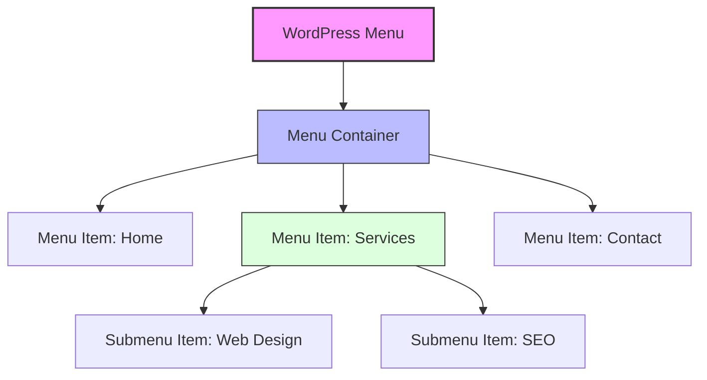

# WordPress Menus

## Introduction

Navigation menus are essential components of any website. They help visitors find their way around your content and significantly impact the overall user experience. WordPress offers a powerful menu management system that allows you to create custom navigation structures without writing any code.

In this tutorial, we'll explore how to create, customize, and implement menus in WordPress. We'll cover everything from basic menu creation to advanced customization techniques, helping you build an intuitive navigation system for your WordPress website.

## Understanding WordPress Menus

WordPress menus are collections of links that appear in designated areas of your website's theme. They typically include links to important pages, categories, custom links, and other content types. The WordPress menu system allows you to:

- Create multiple menus for different purposes
- Drag and drop menu items to arrange them
- Create multi-level dropdown menus
- Assign menus to specific theme locations
- Customize menu items with additional attributes

## Accessing the Menu Editor

To begin working with WordPress menus, follow these steps:

1. Log in to your WordPress admin dashboard
2. Navigate to **Appearance → Menus**
3. You'll see the Menu Editor interface

## Creating Your First Menu

Let's create a simple main navigation menu for your website:

1. In the Menu Editor, click on **Create a new menu**
2. Enter a name for your menu (e.g., "Main Navigation")
3. Click **Create Menu**

Now your menu is created, but it doesn't contain any items yet. Let's add some:

### Adding Pages to Your Menu

1. In the left panel, check the boxes next to the pages you want to include
2. Click **Add to Menu**
3. Your selected pages will appear in the menu structure on the right

### Adding Categories to Your Menu

1. Select the **Categories** tab in the left panel
2. Check the categories you want to include
3. Click **Add to Menu**

### Adding Custom Links

Custom links allow you to add links to external websites or specific sections of your site:

1. Select the **Custom Links** tab in the left panel
2. Enter the URL in the **URL** field
3. Enter the link text in the **Link Text** field
4. Click **Add to Menu**

## Example: Creating a Basic Navigation Menu

Here's a step-by-step example of creating a simple main navigation menu:

1. Create a new menu named "Main Navigation"
2. Add the Home, About, Services, Blog, and Contact pages
3. Add a custom link to your Facebook page with the link text "Follow us on Facebook"
4. Arrange the items in your preferred order by dragging and dropping them
5. Under **Menu Settings**, check the box for "Primary Menu" (or whatever your theme calls its main menu location)
6. Click **Save Menu**

## Organizing Menu Items

### Changing the Order

To change the order of menu items, simply drag and drop them into your desired position. Items at the top will appear first in your menu, followed by items below them.

### Creating Dropdown Menus

Creating dropdown (nested) menus is easy:

1. Drag a menu item slightly to the right beneath the parent item
2. Release to create a child menu item
3. The child item will be indented, indicating it's a submenu item

For example, to create a "Services" dropdown menu:

1. Add a "Services" page to your menu
2. Add separate pages for different services (e.g., "Web Design," "SEO," "Content Writing")
3. Drag each service page slightly to the right beneath "Services"
4. Save your menu

This creates a menu structure like:

```
Home
About
Services
  ├─ Web Design
  ├─ SEO
  └─ Content Writing
Blog
Contact
```

## Menu Locations

WordPress themes typically define specific areas where menus can be displayed, such as:

- Primary/Main Navigation (usually at the top)
- Footer Menu
- Sidebar Menu
- Mobile Menu

To assign your menu to a location:

1. In the Menu Editor, scroll down to **Menu Settings**
2. Check the boxes next to the locations where you want to display your menu
3. Click **Save Menu**

## Customizing Menu Items

WordPress allows you to customize individual menu items:

1. Click the arrow on the right side of any menu item to expand its options
2. You can modify:
   - Navigation Label: The text displayed for the menu item
   - Title Attribute: Text that appears when hovering over the item
   - Open link in a new tab/window: Toggle this option for external links
   - CSS Classes: Add custom CSS classes for styling (advanced)
   - Link Relationship (XFN): Define relationships between the linked document and current page (advanced)
   - Description: Add a description (note: not all themes display this)

## Code Example: Displaying a Custom Menu in a Theme

If you're developing a custom theme, you can use the `wp_nav_menu()` function to display menus in your template files:

```php
<?php
wp_nav_menu(
    array(
        'theme_location'  => 'primary-menu',
        'menu_class'      => 'main-navigation',
        'container'       => 'nav',
        'container_class' => 'site-navigation',
        'depth'           => 2,
    )
);
?>
```

This code displays the menu assigned to the 'primary-menu' location with specific HTML structure and CSS classes.

## Working with Multiple Menus

Many websites require multiple navigation menus. For example:

- Main Navigation (top of the page)
- Footer Navigation (simpler menu in the footer)
- Social Media Menu (links to social profiles)

To create multiple menus:

1. Follow the same process to create additional menus
2. Assign each menu to its appropriate location
3. Customize each menu for its specific purpose

## Advanced Menu Techniques

### Using Menu Icons

Many themes and plugins allow you to add icons to your menu items. If your theme supports this feature, you'll typically see an option to select icons in the menu item settings.

With a plugin like "Menu Icons by ThemeIsle," you can add icons like this:

1. Install and activate the plugin
2. Edit your menu
3. Each menu item will have an additional "Icon" field
4. Select your desired icon
5. Save your menu

### Custom CSS for Menu Styling

You can add custom CSS classes to individual menu items:

1. Go to **Appearance → Customize**
2. Navigate to **Additional CSS**
3. Add your custom CSS

For example, to style a specific menu item with a custom class:

```css
.special-menu-item {
    background-color: #ff6b6b;
    padding: 5px 15px;
    border-radius: 4px;
}
```

## Troubleshooting Common Menu Issues

### Menu Items Not Appearing

If your menu items aren't appearing:

1. Make sure you've assigned your menu to a location
2. Check if your theme supports the location you're trying to use
3. Verify that the menu contains items
4. Ensure your theme is properly displaying menus in its template files

### Dropdown Menus Not Working

If dropdown menus aren't functioning properly:

1. Check if your theme supports multi-level menus
2. Ensure you've created the nested structure correctly
3. Verify that your theme's CSS properly styles dropdown menus
4. Some mobile menus require additional configuration for dropdowns

## Visualizing Menu Structure

Here's a diagram showing how a typical WordPress menu structure relates to the rendered HTML:



## Summary

WordPress menus are powerful tools for creating intuitive navigation on your website. In this tutorial, we've covered:

- Creating and managing menus
- Adding different types of content to menus
- Organizing menu items and creating dropdown menus
- Assigning menus to theme locations
- Customizing menu items and appearance
- Working with multiple menus
- Advanced menu techniques and troubleshooting

By mastering WordPress menus, you can create a user-friendly navigation experience that helps visitors find what they're looking for on your website.

## Additional Resources and Exercises

### Exercises to Practice

1. Create a main navigation menu with at least 5 items and 2 dropdown submenus
2. Create a separate social media menu with links to different social platforms
3. Create a footer menu with your site's important policy pages
4. Try creating a menu with custom links to specific sections of your homepage

### Further Learning

- Explore menu-related plugins like "Max Mega Menu" for creating advanced mega menus
- Learn about accessibility best practices for navigation menus
- Study how to create mobile-friendly responsive menus

Happy menu building!