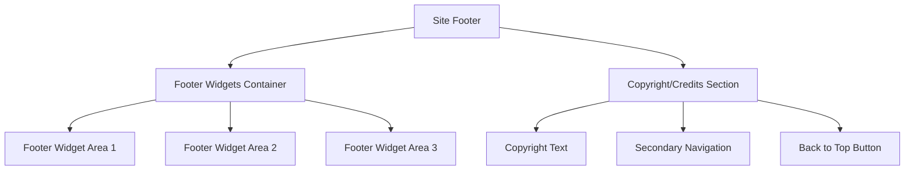

# WordPress Footers

The footer section of a WordPress website is often overlooked but plays a crucial role in your site's design, functionality, and user experience. Located at the bottom of every page, footers provide valuable space for additional navigation, copyright information, contact details, and other important elements.

## What is a WordPress Footer?

A footer is the bottom section of your WordPress website that appears consistently across all pages. It serves as a secondary area for important information and navigation options that you want to be easily accessible throughout your site.


## Why Footers Matter

Footers serve several important purposes:

- **Navigation Aid**: They provide additional navigation links
- **Legal Information**: Space for copyright notices, terms of service, and privacy policy links
- **Contact Details**: Quick access to contact information
- **Credibility**: Professional-looking footers build trust
- **SEO Benefits**: Additional internal linking and structured content

## Default WordPress Footer

By default, WordPress includes a simple footer with text like "Powered by WordPress" or a basic copyright statement. While functional, this doesn't leverage the full potential of what a well-designed footer can offer.

## Customizing Your WordPress Footer

There are several ways to customize your footer in WordPress:

### 1. Using the WordPress Customizer

The Customizer is the easiest way to modify your footer without coding:

1. Navigate to **Appearance** > **Customize** in your WordPress admin
2. Look for a section called "Footer" or something similar (varies by theme)
3. Make your desired changes
4. Click "Publish" to save your changes

### 2. Adding Widgets to Footer Areas

Most WordPress themes include widget areas in the footer where you can add content:

1. Go to **Appearance** > **Widgets**
2. Find the "Footer" widget areas (may be called Footer 1, Footer 2, etc.)
3. Drag and drop widgets into these areas
4. Configure each widget as desired

Common footer widgets include:

- Text widget (for copyright information)
- Menu widget (for additional navigation)
- Recent Posts widget
- Contact information
- Social media icons

### 3. Editing Footer.php (Advanced)

For more advanced customization, you can edit your theme's `footer.php` file. However, this requires coding knowledge and should be done with caution.

:::caution
Always create a child theme before editing any theme files directly. Otherwise, your changes will be lost when the theme updates.
:::

Here's how to create a simple custom footer in a child theme:

1. Create a `footer.php` file in your child theme
2. Add your custom code

```php
<?php
/**
 * The template for displaying the footer
 */
?>

<footer id="site-footer" class="site-footer">
    <div class="container">
        <div class="footer-widgets">
            <?php if (is_active_sidebar('footer-1')) : ?>
                <div class="footer-widget-area">
                    <?php dynamic_sidebar('footer-1'); ?>
                </div>
            <?php endif; ?>
            
            <?php if (is_active_sidebar('footer-2')) : ?>
                <div class="footer-widget-area">
                    <?php dynamic_sidebar('footer-2'); ?>
                </div>
            <?php endif; ?>
            
            <?php if (is_active_sidebar('footer-3')) : ?>
                <div class="footer-widget-area">
                    <?php dynamic_sidebar('footer-3'); ?>
                </div>
            <?php endif; ?>
        </div>
        
        <div class="site-info">
            &copy; <?php echo date('Y'); ?> <?php echo get_bloginfo('name'); ?> - All Rights Reserved
            <span class="sep"> | </span>
            <a href="<?php echo esc_url(home_url('/')); ?>">Privacy Policy</a>
        </div>
    </div>
</footer><!-- #site-footer -->

<?php wp_footer(); ?>
</body>
</html>
```

### 4. Using Footer Plugins

Several plugins can help you customize your WordPress footer without coding:

- **Elementor**: Offers a visual drag-and-drop editor that includes footer customization
- **Header Footer Elementor**: Specifically designed for header and footer customization
- **Footer Putter**: Simple plugin for customizing the footer text

## Registering Footer Widget Areas

If your theme doesn't include footer widget areas, you can add them by adding this code to your `functions.php` file in your child theme:

```php
function register_footer_widget_areas() {
    register_sidebar(array(
        'name'          => 'Footer Area 1',
        'id'            => 'footer-1',
        'description'   => 'First footer widget area',
        'before_widget' => '<div id="%1$s" class="widget %2$s">',
        'after_widget'  => '</div>',
        'before_title'  => '<h3 class="widget-title">',
        'after_title'   => '</h3>',
    ));
    
    register_sidebar(array(
        'name'          => 'Footer Area 2',
        'id'            => 'footer-2',
        'description'   => 'Second footer widget area',
        'before_widget' => '<div id="%1$s" class="widget %2$s">',
        'after_widget'  => '</div>',
        'before_title'  => '<h3 class="widget-title">',
        'after_title'   => '</h3>',
    ));
    
    register_sidebar(array(
        'name'          => 'Footer Area 3',
        'id'            => 'footer-3',
        'description'   => 'Third footer widget area',
        'before_widget' => '<div id="%1$s" class="widget %2$s">',
        'after_widget'  => '</div>',
        'before_title'  => '<h3 class="widget-title">',
        'after_title'   => '</h3>',
    ));
}
add_action('widgets_init', 'register_footer_widget_areas');
```

## Styling Your Footer with CSS

To style your footer, add CSS to your theme's style sheet or use the Additional CSS option in the Customizer. Here's a simple example:

```css
.site-footer {
    background-color: #222;
    color: #fff;
    padding: 40px 0;
}

.footer-widgets {
    display: flex;
    flex-wrap: wrap;
    justify-content: space-between;
    margin-bottom: 20px;
}

.footer-widget-area {
    flex: 1;
    min-width: 250px;
    padding: 0 15px;
    margin-bottom: 20px;
}

.site-info {
    text-align: center;
    padding-top: 20px;
    border-top: 1px solid #444;
}

.site-footer a {
    color: #bbb;
    text-decoration: none;
}

.site-footer a:hover {
    color: #fff;
    text-decoration: underline;
}
```

## Creating a Sticky Footer

A sticky footer remains at the bottom of the screen even when there's not enough content to fill the page. Here's how to implement one:

```css
html, body {
    height: 100%;
    margin: 0;
}

body {
    display: flex;
    flex-direction: column;
}

.site-content {
    flex: 1 0 auto;
}

.site-footer {
    flex-shrink: 0;
}
```

## Responsive Footer Design

To ensure your footer looks good on all devices, use responsive CSS:

```css
@media (max-width: 768px) {
    .footer-widgets {
        flex-direction: column;
    }
    
    .footer-widget-area {
        min-width: 100%;
    }
}
```

## Best Practices for WordPress Footers

When designing your footer, keep these best practices in mind:

1. **Keep it clean**: Don't overcrowd your footer
2. **Include essential links**: Privacy policy, terms of service, contact page
3. **Add contact information**: Make it easy for visitors to reach you
4. **Include social media links**: Encourage social engagement
5. **Consider a call to action**: Newsletter signup, free download, etc.
6. **Don't forget copyright**: Always include copyright information
7. **Make it responsive**: Ensure your footer looks good on all devices
8. **Don't duplicate main navigation**: Use footer for secondary navigation
9. **Include the WordPress credit**: It's not required, but it's a nice gesture

## Footer Component Structure

Here's a visual representation of a typical WordPress footer structure:



## Common Footer Elements

- **Copyright notice**: `&copy; <?php echo date('Y'); ?> <?php echo get_bloginfo('name'); ?>`
- **WordPress credit**: `Powered by <a href="https://wordpress.org">WordPress</a>`
- **Privacy policy link**: `<a href="<?php echo get_privacy_policy_url(); ?>">Privacy Policy</a>`
- **Secondary navigation**: `<?php wp_nav_menu(array('theme_location' => 'footer-menu')); ?>`

## Real-World Examples

### E-Commerce Footer

For an online store, your footer might include:

```php
<footer class="site-footer">
    <div class="container">
        <div class="footer-widgets">
            <div class="footer-widget">
                <h3>Shop Categories</h3>
                <?php wp_nav_menu(array('theme_location' => 'shop-categories')); ?>
            </div>
            
            <div class="footer-widget">
                <h3>Customer Service</h3>
                <?php wp_nav_menu(array('theme_location' => 'customer-service')); ?>
            </div>
            
            <div class="footer-widget">
                <h3>Connect With Us</h3>
                <div class="social-icons">
                    <a href="https://facebook.com/yourstore"><i class="fab fa-facebook"></i></a>
                    <a href="https://instagram.com/yourstore"><i class="fab fa-instagram"></i></a>
                    <a href="https://twitter.com/yourstore"><i class="fab fa-twitter"></i></a>
                </div>
            </div>
            
            <div class="footer-widget">
                <h3>Newsletter</h3>
                <?php echo do_shortcode('[newsletter_form]'); ?>
            </div>
        </div>
        
        <div class="payment-methods">
            /assets/images/payment-methods.png" alt="Payment Methods">
        </div>
        
        <div class="site-info">
            <p>&copy; <?php echo date('Y'); ?> <?php echo get_bloginfo('name'); ?> - All Rights Reserved</p>
            <p>
                <a href="<?php echo esc_url(home_url('/privacy-policy/')); ?>">Privacy Policy</a> | 
                <a href="<?php echo esc_url(home_url('/terms-of-service/')); ?>">Terms of Service</a> | 
                <a href="<?php echo esc_url(home_url('/shipping-returns/')); ?>">Shipping & Returns</a>
            </p>
        </div>
    </div>
</footer>
```

### Blog Footer

For a blog, consider this layout:

```php
<footer class="site-footer">
    <div class="container">
        <div class="footer-widgets">
            <div class="footer-widget about-widget">
                <h3>About <?php echo get_bloginfo('name'); ?></h3>
                <p><?php echo get_the_author_meta('description', 1); ?></p>
            </div>
            
            <div class="footer-widget">
                <h3>Categories</h3>
                <ul>
                    <?php wp_list_categories(array(
                        'title_li' => '',
                        'number' => 5
                    )); ?>
                </ul>
            </div>
            
            <div class="footer-widget">
                <h3>Recent Posts</h3>
                <?php 
                $recent_posts = wp_get_recent_posts(array(
                    'numberposts' => 5,
                    'post_status' => 'publish'
                ));
                
                echo '<ul>';
                foreach($recent_posts as $post) {
                    echo '<li><a href="' . get_permalink($post['ID']) . '">' . $post['post_title'] . '</a></li>';
                }
                echo '</ul>';
                wp_reset_query();
                ?>
            </div>
            
            <div class="footer-widget">
                <h3>Follow Me</h3>
                <div class="social-icons">
                    <a href="https://twitter.com/yourblog"><i class="fab fa-twitter"></i></a>
                    <a href="https://instagram.com/yourblog"><i class="fab fa-instagram"></i></a>
                    <a href="https://pinterest.com/yourblog"><i class="fab fa-pinterest"></i></a>
                </div>
            </div>
        </div>
        
        <div class="site-info">
            <p>&copy; <?php echo date('Y'); ?> <?php echo get_bloginfo('name'); ?></p>
            <p>
                <a href="<?php echo esc_url(home_url('/privacy-policy/')); ?>">Privacy Policy</a> | 
                <a href="<?php echo esc_url(home_url('/about/')); ?>">About</a> | 
                <a href="<?php echo esc_url(home_url('/contact/')); ?>">Contact</a>
            </p>
        </div>
    </div>
</footer>
```

## Summary

WordPress footers are versatile components that provide valuable space for important information, navigation, and design elements. By understanding how to customize your footer, you can enhance your site's user experience, provide important information, and reinforce your brand identity.

Remember these key points:

1. Footers provide space for secondary information and navigation options
2. Multiple methods exist for customizing footers, from the simple Customizer to advanced coding
3. Well-designed footers contribute to your site's professionalism and user experience
4. Footer widgets allow you to add various content types without coding
5. Responsive design ensures your footer looks good on all devices

## Exercises

1. Use the WordPress Customizer to modify your theme's footer text
2. Add three widgets to your footer widget areas (a text widget with copyright information, a recent posts widget, and a menu widget)
3. Create a child theme and modify the footer.php file to add a custom layout
4. Add CSS to style your footer with your brand colors
5. Implement a sticky footer that stays at the bottom of the screen

## Additional Resources

- [WordPress Theme Developer Handbook](https://developer.wordpress.org/themes/)
- [WordPress Widget API Documentation](https://developer.wordpress.org/themes/functionality/widgets/)
- [Child Theme Documentation](https://developer.wordpress.org/themes/advanced-topics/child-themes/)