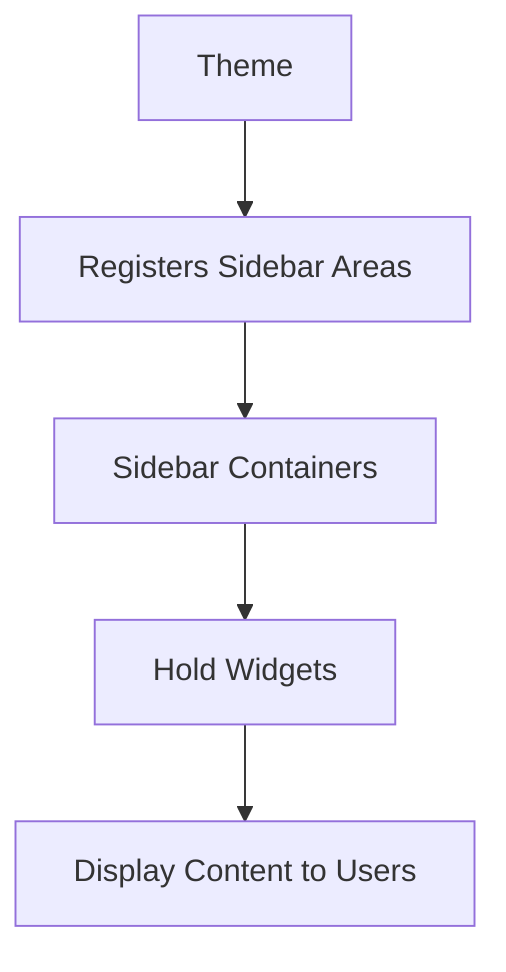

# WordPress Sidebars

Sidebars are an essential component of WordPress themes that provide designated areas for displaying widgets. Despite their name, sidebars aren't just limited to the sides of a page—they can appear in headers, footers, or anywhere a theme developer decides to place them.

## Introduction to WordPress Sidebars

In WordPress, a sidebar is a widget-ready area where you can add various content elements without editing theme files or writing code. Think of sidebars as containers that hold widgets, which are small blocks of functionality that perform specific tasks like displaying recent posts, search bars, or subscription forms.

### Why Sidebars Matter

- They help organize supplementary content
- They improve site navigation
- They enhance user experience
- They add functionality without requiring coding
- They allow for dynamic content placement

## Understanding WordPress Sidebars and Widgets

### The Relationship Between Sidebars and Widgets



Sidebars are registered by your WordPress theme, creating containers where you can place widgets. Widgets are the actual content blocks that go into these containers.

## Accessing WordPress Sidebars

To manage your WordPress sidebars and the widgets they contain:

1. Log in to your WordPress dashboard
2. Navigate to **Appearance** > **Widgets**
3. You'll see all available sidebar areas on the left and available widgets on the right

## Types of WordPress Sidebars

Most WordPress themes include these common sidebar locations:

- **Primary Sidebar**: Usually appears beside the main content
- **Footer Widgets**: Appears in the footer area, often divided into columns
- **Header Widget Area**: Located in the header section
- **Shop Sidebar**: For eCommerce sites using WooCommerce
- **Custom Sidebars**: Theme-specific sidebar locations

## Working with WordPress Sidebars

### Adding Widgets to Sidebars

1. Go to **Appearance** > **Widgets**
2. Find the widget you want to add
3. Drag and drop it into your desired sidebar
4. Configure the widget settings
5. Click **Save**

### Example: Adding a Search Widget

1. Find the "Search" widget in the available widgets
2. Drag it to your "Primary Sidebar"
3. Give it a title like "Search Our Site"
4. Save the widget

The result will be a search box in your sidebar allowing visitors to search your website.

## Registering Custom Sidebars in WordPress

If you're developing a theme or working with a child theme, you can register custom sidebars:

```php
// Add this code to your functions.php file
function my_custom_sidebars() {
    register_sidebar(
        array(
            'name'          => 'Custom Sidebar',
            'id'            => 'custom-sidebar',
            'description'   => 'This is my custom sidebar',
            'before_widget' => '<div class="widget-content">',
            'after_widget'  => '</div>',
            'before_title'  => '<h3 class="widget-title">',
            'after_title'   => '</h3>',
        )
    );
}
add_action( 'widgets_init', 'my_custom_sidebars' );
```

This code creates a new sidebar called "Custom Sidebar" that you can use in your theme.

## Displaying Sidebars in Your Theme

To display a sidebar in your theme, use the `dynamic_sidebar()` function:

```php
<?php if ( is_active_sidebar( 'custom-sidebar' ) ) : ?>
    <div class="sidebar-container">
        <?php dynamic_sidebar( 'custom-sidebar' ); ?>
    </div>
<?php endif; ?>
```

This code checks if the custom sidebar has any widgets and displays them if it does.

## Practical Uses for WordPress Sidebars

### 1. Enhanced Navigation

```php
// Add a custom menu widget to your sidebar
// From Widgets panel: Add "Navigation Menu" widget
```

This creates an additional navigation menu in your sidebar, improving site exploration.

### 2. Email Subscription

Adding an email subscription form to your sidebar can help grow your mailing list:

```html
<!-- Example of how a subscription form widget might look -->
<div class="widget-content">
    <h3 class="widget-title">Subscribe to Our Newsletter</h3>
    <form class="subscription-form">
        <input type="email" placeholder="Your email address" />
        <button type="submit">Subscribe</button>
    </form>
</div>
```

### 3. Popular Posts Display

```php
// Add a "Popular Posts" widget to your sidebar
// Many SEO plugins like Yoast or dedicated plugins like
// "WordPress Popular Posts" provide this functionality
```

This helps keep users engaged by showcasing your best content.

## Conditional Sidebars

You can display different sidebars on different pages using conditional tags:

```php
<?php 
// Display one sidebar on blog posts
if ( is_single() ) {
    dynamic_sidebar( 'blog-sidebar' );
// Display another sidebar on pages
} elseif ( is_page() ) {
    dynamic_sidebar( 'page-sidebar' );
// Display a default sidebar elsewhere
} else {
    dynamic_sidebar( 'default-sidebar' );
}
?>
```

## Common Sidebar Widgets

Here are some popular widgets you can add to your sidebars:

1. **Text Widget**: Add custom text, HTML, and shortcodes
2. **Recent Posts**: Display your latest blog posts
3. **Categories**: Show a list of your content categories
4. **Search**: Allow users to search your site
5. **Tag Cloud**: Show popular tags with visual emphasis
6. **Custom Menu**: Add navigation menus
7. **Calendar**: Display a calendar of posts
8. **Media**: Add images, videos, or audio files
9. **RSS**: Display content from external RSS feeds
10. **Social Media Icons**: Link to your social profiles

## Optimizing Sidebars for Better UX

### Best Practices

1. **Don't overcrowd**: Limit widgets to what's truly important
2. **Prioritize content**: Place the most important widgets at the top
3. **Stay consistent**: Maintain similar sidebars across similar pages
4. **Consider mobile users**: Check how sidebars appear on small screens
5. **Use white space**: Give widgets room to breathe

### Mobile Responsiveness

Many themes automatically adjust sidebars on mobile devices, but you should test how yours behave:

- Some themes move sidebars below the main content on mobile
- Others hide certain widgets or collapse them
- You might need custom CSS to optimize the mobile experience

```css
/* Example of custom CSS to improve sidebar appearance on mobile */
@media (max-width: 768px) {
    .sidebar-container {
        margin-top: 20px;
    }
    
    .widget-content {
        padding: 10px;
    }
}
```

## Advanced Sidebar Techniques

### Sticky Sidebars

Make a sidebar "stick" as users scroll down the page:

```js
// Basic sticky sidebar functionality using JavaScript
document.addEventListener('DOMContentLoaded', function() {
    const sidebar = document.querySelector('.sidebar');
    const sidebarTop = sidebar.offsetTop;
    
    window.addEventListener('scroll', function() {
        if (window.pageYOffset >= sidebarTop) {
            sidebar.classList.add('sticky');
        } else {
            sidebar.classList.remove('sticky');
        }
    });
});
```

### Custom Widget Areas with Plugins

Several plugins allow you to create custom widget areas:

1. **Custom Sidebars**: Create widget areas for specific pages
2. **Content Aware Sidebars**: Display different sidebars based on content
3. **Widget Logic**: Add conditional logic to individual widgets

## Troubleshooting Sidebar Issues

### Common Problems and Solutions

1. **Widgets don't appear**: Check if the sidebar is properly registered in your theme
2. **Sidebar styling issues**: Inspect with browser tools and adjust CSS
3. **Broken layouts**: Ensure your theme's CSS properly handles sidebar content
4. **Widgets disappearing after theme switch**: Different themes support different sidebars

### Example Fix for Missing Sidebar

```php
// Check if your theme is properly displaying the sidebar
<?php 
if ( function_exists('dynamic_sidebar') && is_active_sidebar('primary-sidebar') ) {
    dynamic_sidebar('primary-sidebar');
} else {
    echo '<p>Please add widgets to the Primary Sidebar to have them display here.</p>';
}
?>
```

## Summary

WordPress sidebars are flexible containers that help you organize and display widgets throughout your website. They enhance user experience by providing navigation, additional content, and functionality without requiring custom coding.

Key takeaways:
- Sidebars are widget-ready areas defined by your theme
- They can appear anywhere on your site, not just on the sides
- Widgets are the content blocks you place in sidebars
- Custom sidebars can be created with code or plugins
- Optimize sidebars for mobile devices and user experience

## Exercises

1. Create a custom sidebar in your child theme that appears only on blog posts
2. Build a "Featured Content" sidebar that showcases your best work
3. Optimize your current sidebars for mobile devices
4. Create a sticky sidebar that follows the user as they scroll
5. Experiment with conditional logic to show different widgets to different user groups

## Additional Resources

- WordPress Codex on Widget API
- WordPress Developer documentation on `register_sidebar()`
- Theme development tutorials for custom sidebar creation
- User experience guidelines for effective sidebar design
- Accessibility best practices for sidebar content

By mastering WordPress sidebars, you'll be able to create more dynamic, user-friendly websites that effectively guide visitors to your most important content.